# Lecture 03 - Pruning and Sparsity (Part 1)

> [Lecture 03 - Pruning and Sparsity (Part I) | MIT 6.S965](https://youtu.be/sZzc6tAtTrM)

> [EfficientML.ai Lecture 3 - Pruning and Sparsity (Part I) (MIT 6.5940, Fall 2023, Zoom recording)](https://youtu.be/95JFZPoHbgQ?si=rHYkeGoQoZZTnyVa)

> [A Survey on Deep Neural Network Pruning: Taxonomy, Comparison, Analysis, and Recommendations 논문(2023)](https://arxiv.org/abs/2308.06767)

지금의 AI model size는 너무나 크다.

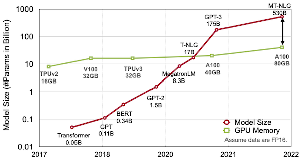

메모리 비용은 (연산 비용과 비교해서, 보다) **expensive**하다.

- register file access cost를 1로 뒀을 때, SRAM cache가 5배 cost, DRAM access가 약 640배 cost를 소비한다.

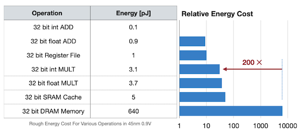

데이터 이동이 많을수록 memory reference가 필요하고, 이는 더 많은 power를 필요로 하게 된다. 그렇다면 이러한 비용을 어떻게 줄일 수 있을까? 대표적으로는 다음과 같은 방법들을 고려할 수 있다.

- model/activation size 줄이기

- workload 줄이기(data를 빠르게 compute resources에 공급)

- compiler/scheduler 개선하기

- locality를 활용하기

- cache에 더 많은 data를 보관하기

이중에서도 모델의 over-parameterization에 의한 비용을 해결하기 위한 효과적인 방법인 **pruning**(가지치기)을 살펴볼 것이다.

> pruning은 1990년부터 제시된 역사가 깊은 기법이다. 1993년에는 pruning 이후 weight를 fine-tuning하는 방법을 제시했다.

---

## 3.1 Pruning

prining은 크게 세 가지 단계로 구성된다. 

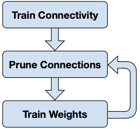

- Train Connectivity

  over-parameterized target network를 학습한다.

- Prune Connections

  weight(unit) **importance**를 파악 후, 중요하지 않은 weight를 pruning한다.

- Train Weights

  pruning 이후의 정확도 손실을 **fine-tuning**으로 보완한다.

---

### 3.1.1 Pruning and Fine-tuning

> [Learning both Weights and Connections for Efficient Neural Networks 논문(2015)](https://arxiv.org/abs/1506.02626)

다음은 AlexNet에 세 가지 다른 방법으로 pruning했을 때, 정확도 손실을 나타낸 그래프이다.

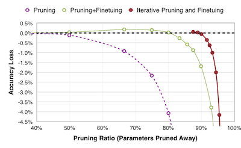

1. Pruning

    - 50%: 비교적 정확도 손실이 적다.

    - 80%: 4%가 넘는 정확도 손실이 발생한다.
    
    정규 분포를 이루던 가중치 분포는, pruning을 거치면 다음과 같이 변화한다.

    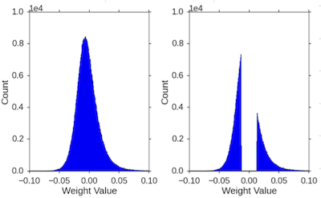

2. Pruning + Fine-tuning

    80%를 pruning 후, 남은 20%의 가중치를 fine-tuning한다. fine-tuning 후 가중치 분포는 다음과 같이 smooth하게 변화한다.

    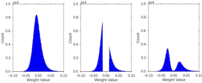

3. **Iterative Pruning + Fine-tuning**

    2번 과정을 반복하면, 매우 적은 정확도 손실로 약 90% 수준까지 가중치 pruning이 가능하다.

---

### 3.1.2 CNN + Pruning Results

다음은 여러 network에 pruning을 적용하고 난 뒤 결과를 정리한 표다.

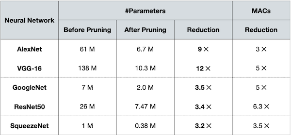

- AlexNet, VGG-16는 pruning을 통해 9배, 12배가 넘게 크기를 줄였다.

- 반면, GoogleNet, ResNet, SqueezeNet과 같은 compressed model에서는 큰 효과를 보지 못했다. 

  > 이런 경우 **quantization**(양자화) 같은 수단이 더 효과적이다.

---

### 3.1.3 MLPerf Inference

> [Leading MLPerf Inference v3.1 Results with NVIDIA GH200 Grace Hopper Superchip Debut](https://developer.nvidia.com/blog/leading-mlperf-inference-v3-1-results-gh200-grace-hopper-superchip-debut/)

**MLPerf**는 다양한 기업이 참가하는 Al computing 대회다. **closed division**과 **open division** 두 트랙에서 경쟁한다.

- closed division

  신경망을 변경할 수 없다.(precision, weight 등) 따라서 오로지 hardware innovation으로 경쟁해야 한다.

- open division

  신경망을 변경할 수 있다. 모델을 수정 혹은 압축하는 등 다양한 기법으로 경쟁한다.

핵심은 두 트랙 모두 정확도를 잃지 않으면서, 빠르게 추론해야 한다. 아래는 BERT를 대상으로 한 NVIDIA의 closed, open division 결과물이다.

| | closed division | open division | speedup |
| :---: | :---: | :---: | :---: |
| offline samples/sec | 1029 | 4609 | 4.5x |

> open division에서 4.5x 더 빠르게 sample 처리

이때 다음 기법으로 4.5x의 speedup을 획득했다.

- **Pruning**

- Quantization-Aware Training(QAT)

- Knowledge Distillation

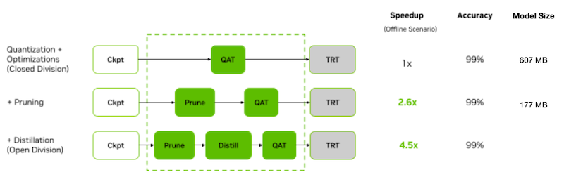

---

### 3.1.4 Pruning in the Industry

대표적으로 NVIDIA는 hardware 수준의 sparsity matrix을 이용한 가속을 지원하고 있다. 특정 조건을 만족하면 dense matrix를 sparse matrix로 바꿔서 연산을 가속할 수 있다.

- **2:4 sparsity**: 4개의 parameter로 이루어진 그룹에서 paramter 2개가 0이면 가능하다.

    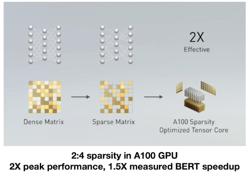

---

## 3.2 Formulate Pruning

일반적으로 Pruning은 손실 함수에서, \#non-zero 수의 threshold $N$ 을 두어 제한하는 것으로 구현할 수 있다.

$$ \underset{W_p}{\mathrm{argmin} }{L(\mathbf{x}; W_p)} $$

$$ s.t. {||W_{p}||}_{0} \le N $$


- $W_{p}$ : pruned weights

- $N$ : threshold

> s.t.: subject to

> L0-norm: = \#nonzeros

---

## 3.3 What, How, When, How often to prune

> [The Lottery Tickey Hypothesis: A survey](https://roberttlange.com/posts/2020/06/lottery-ticket-hypothesis/)

pruning은 어떤 단위로, 어떤 기준으로, 언제, 얼마나 자주 적용해야 하는가에 따라 세부적으로 나눌 수 있다.

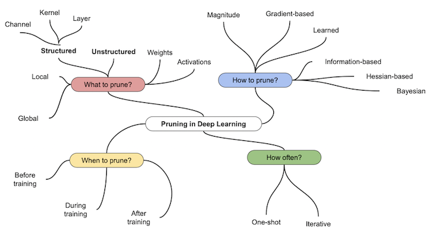

---

## 3.4 Pruning Granularity

pruning을 적용하는 granularity는, 크게 unstructured, structured pruning으로 나눌 수 있다.

|| Unstructured<br/>(weight-wise) | Structured<br/>(Channel, Kernel, Layer, ...) |
| :---: | :---: | :---: |
| | 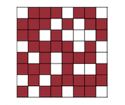 | 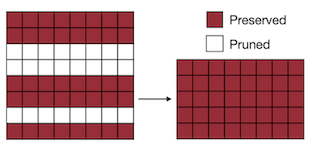 |
| compression ratio | 크다 | 작다 | 
| acceleration | 어렵다 | 비교적 쉽다 |

---

### 3.4.1 Pruning at Different Granularities

보다 세부적으로 pruning granularity를 살펴보자. 

| Fine-grained | Pattern-based | Vector-level | Kernel-level | Channel-level |
| :---: | :---: | :---: | :---: | :---: |
| 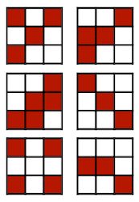 | 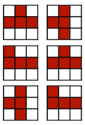 | 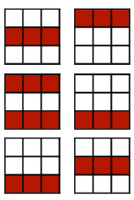 | 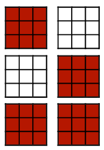 | 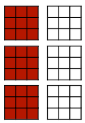 |

> 좌측에 위치할수록 fine-grained, 우측에 위치할수록 coarse-grained


---

### 3.4.2 Pattern-based Pruning: N:M sparsity

> [Accelerating Sparse Deep Neural Networks 논문(2021)](https://arxiv.org/abs/2104.08378)

(생략)

---

### 3.4.3 Channel Pruning

이때 채널별로 최적의 pruning ratio를 탐색하면, 더 좋은 성능을 얻을 수 있다.

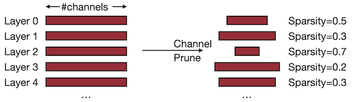

- (+) direct하게 speedup을 구현할 수 있다.
  
- (-) compression ratio이 낮다.

- (-) 출력에 영향을 미치는 것을 주의해야 한다.(특히 residual connection 사용 시)

---

## 3.5 Pruning Criterion

pruning은 기본적으로 덜 중요한 파라미터를 제거하는 과정이다.

---

### 3.5.1 Magnitude-based Pruning: L1-norm

> [Learning both Weights and Connections for Efficient Neural Networks 논문(2015)](https://arxiv.org/abs/1506.02626)

heuristic에 기반하여, 파라미터의 절댓값 크기를 importance로 사용할 수 있다.(**L1-norm**)

$$ Importance = \sum_{i \in S}|w_i| $$

다음은 예시 행렬에서 중요도 50%를 충족하는 파라미터만 남긴 결과다.

```math
\begin{bmatrix} 3 & -2 \\ 1 & -5 \end{bmatrix}
```

- Element-wise 

```math
\begin{bmatrix} \|3\| & \|-2\| \\ \|1\| & \|-5\| \end{bmatrix} \rightarrow \begin{bmatrix} 3 & 0 \\ 0 & -5 \end{bmatrix}
```

- Row-wise

```math
\begin{bmatrix} \|3\| + \|-2\| \\ \|1\| + \|-5\| \end{bmatrix} \rightarrow \begin{bmatrix} 0 & 0 \\ 1 & -5 \end{bmatrix}
```

---

### 3.5.2 Magnitude-based Pruning: L2-norm

혹은 L2-norm이나, $L_p$ norm을 사용할 수도 있다.

$$ Importance = \sqrt{\sum_{i \in S}{ {|w_{i}|}^{2} } } $$

다음은 예시 행렬을 대상으로 적용한 결과다.

```math
\begin{bmatrix} 3 & -2 \\ 1 & -5 \end{bmatrix}
```

- Element-wise

```math
\begin{bmatrix} \sqrt{\|3\|^2} & \sqrt{\|-2\|^2} \\ \sqrt{\|1\|^2} & \sqrt{\|-5\|^2} \end{bmatrix} \rightarrow \begin{bmatrix} 3 & 0 \\ 0 & -5 \end{bmatrix}
```

- Row-wise

```math
\begin{bmatrix} \sqrt{\|3\|^2 + \|-2\|^2} \\ \sqrt{\|1\|^2 + \|-5\|^2} \end{bmatrix} \rightarrow \begin{bmatrix} 0 & 0 \\ 1 & -5 \end{bmatrix}
```

---

### 3.5.3 Sensitivity and Saliency

> [SNIP: Single-shot Network Pruning based on Connection Sensitivity 논문(2018)](https://arxiv.org/abs/1810.02340)

SNIP 논문에서는 **connection sensitivity**라는 salience 기반의 pruning criterion을 제시했다. 제거했을 때 sensitivity가 클수록 중요한 가중치로 고려한다.

$$ s_j(w; \mathcal{D}) = { {|g_{j}(w;\mathcal{D})|} \over { { {\sum}^m_{k=1} } |g_k(w;\mathcal{D})|} } $$

- $s_j$ : weight $w_j$ 의 sensitivity

- $m$ : \#weights

- $c_j$ : connection(active = 1, pruned = 0)

- $g_j$ : $c_j$ 에 대한 loss $L(c \odot w)$ 의 미분 

---

### 3.5.4 Loss Change: First-Order Taylor Expansion

> [Gate Decorator: Global filter pruning method for accelerating deep convolutional neural networks 논문(2019)](https://arxiv.org/abs/1909.08174)

weight saliency를 pruning 이후 손실 변화로 정의한다. 대표적으로 1차 테일러 근사를 활용하면, weight에 작은 변화(**perturbation**)가 생겼을 때의 변화를 측정할 수 있다.

$$ \triangle \mathcal{L} = \mathcal{L} (w + \triangle w) - \mathcal{L}(w) = {\nabla}_w \mathcal{L} \triangle w $$

- $\triangle w$ : weight perturbation

예를 들어 Gate Decorator 논문에서는, Batch Normalization에서 학습 가능한 scaling factor $\phi$ 를 추가하는 **GBN**(Gate Batch Normalization) pruning을 제안하였다.

$$ \hat{z} = \phi z $$

> $z$ : 필터 $k$ 의 feature map. ( $\phi$ 를 0으로 만들면 해당 채널(필터)는 제거된다.)

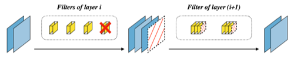

$$ \triangle \mathcal{L_{\Omega}} (\phi) = | \mathcal{L_{\Omega}} (\phi) - \mathcal{L_{\Omega}} (0) | $$

- 테일러 전개를 통해, $\phi$ 를 0으로 만들었을 때의 손실 $\mathcal{L}$ 변화를 측정한다.

- 중요도가 낮은 필터 일부를 제거 후 미세조정한다. (이때 $\phi$ 에 sparse constraint를 두어 0에 가까운 필터가 발생하게 된다.)

> **Notes**: shortcut connection 합산 시 채널 크기가 불일치할 문제를 고려해, 그룹 단위로 필터를 제거한다.

---

### 3.5.5 Loss Change: Second-Order Taylor Expansion

> [Optimal Brain Damage 논문(1989)](https://proceedings.neurips.cc/paper/1989/hash/6c9882bbac1c7093bd25041881277658-Abstract.html)

> [Group fisher pruning for practical network compression 논문(2021)](https://arxiv.org/abs/2108.00708)

굉장히 오래 전부터 사용된 방법으로, 손실 함수의 2차 테일러 근사를 바탕으로 중요도를 계산한다.

$$ \mathcal{L} (w + \triangle w) - \mathcal{L}(w) = {\nabla}_w \mathcal{L} \triangle w + { {1} \over {2} } {\triangle}w^{T}H \triangle w $$

- $H  = {\triangle}_w^2 \mathcal{L}(w)$

- 신경망이 수렴한다고 가정하면, first-order 항은 0에 가까운 값으로 무시할 수 있다.

- 단점: **Hessian matrix** 계산 비용

---

## 3.6 Data-Aware Pruning Criterion

가중치만으로 최적의 가지치기 성능을 탐색하는 것은 어렵다. 따라서, 입출력을 활용한 **data-aware pruning** 방법이 등장했다.

---

### 3.6.1 Average-Percentage-Of-Zero-based Pruning(APoZ)

> [Network Trimming: A Data-Driven Neuron Pruning Approach towards Efficient Deep Architectures 논문(2016)](https://arxiv.org/abs/1607.03250)

Network Trimming 논문에서는 출력 값에서 0을 갖는 비율을 바탕으로 한 pruning 방법을 제안하였다. 예를 들어 다음과 같은 output activations이 있다고 하자.

| Batch 1 | Batch 2 |
| :---: | :---: |
| 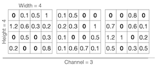 | 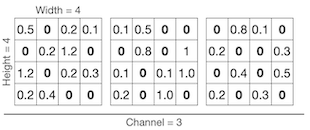  |

이때 각 배치마다 같은 위치에 있는 채널마다 0의 비율을 계산한다. (**Average Percentage of Zeros**(APoZ))

- channel 0

  - batch 1 \#zeros: 5

  - batch 2 channel 0 \#zeros: 6

$$ { {5+6} \over {2 \cdot 4 \cdot 4} } = {11 \over 32} $$

- channel 1

  - batch 1 \#zeros: 5

  - batch 2 \#zeros: 7

$$ { {5+7} \over {2 \cdot 4 \cdot 4} } = {12 \over 32} $$

- channel 2

  - batch 1 \#zeros: 6

  - batch 2 \#zeros: 8

$$ { {6+8} \over {2 \cdot 4 \cdot 4} } = {14 \over 32} $$

> 예시에서는 0의 비율이 가장 많은 channel 2를 제거한다.

---

### 3.6.2 Regression-based Pruning: Reconstruction Error

> [Channel Pruning for Accelerating Very Deep Neural Networks 논문(2017)](https://arxiv.org/abs/1707.06168)

위 논문에서는 feature map이 갖는 redundancy에 주목하여, 채널 제거 후 다음 레이어로 전달되는 출력 값이 이전과 동일하게 유지하는 데 집중한다.

- $\beta$ : 채널 선택을 위한 마스크 계수 (LASSO 회귀, 즉 L1 정규화를 통해 도출)

- $\beta_i$ 가 0이 되면 채널을 제거한다.

| Before Pruning ( 출력 $Z$ ) | After Pruning ( 출력 $\hat{Z}$ ) |
| :---: | :---: |
| 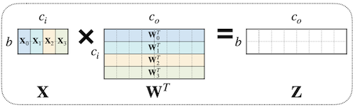 | 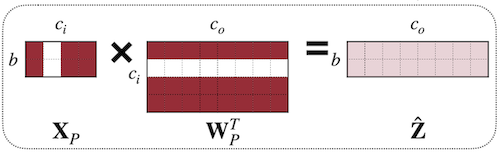 |

output activation $\hat{Z}$ 와 $Z$ 의 차이를 최소화하는 손실 함수는 다음과 같다.

```math
{\mathrm{arg} }\underset{W, {\beta} }{\mathrm{min} }{||Z-\hat{Z}||}^{2}_{F} = || Z - \sum_{c=0}^{c_{i}-1}{||{ {\beta}_{c}X_{c}{W_{c} }^{T} }||}^{2}_{F}
```

```math
s.t. \quad {||\beta||}_{0} \le N_{c}
```

> $N_{c}$ : \#nonzero channels

---

### 3.6.3 Entropy-based Pruning

> [An entropy-based pruning method for cnn compression 논문(2017)](https://arxiv.org/abs/1706.05791)

정보 이론(information theory) 관점에서 **entropy**가 크면 정보량이 많다는 것을 의미한다. 위 논문에서는 entropy가 높은 top $k$ 필터만 보존하는 pruning을 제안하였다.
 
> 필터가 만약 0 혹은 이와 유사한 값만 출력할 경우, 해당 채널은 entropy가 낮다고 판단한다.

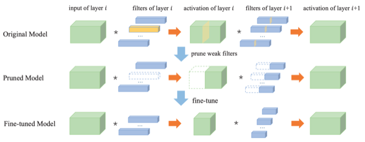

각 필터에 대한 entropy 계산은 다음 절차로 이루어진다.

**(1)** output activation에 GAP(Global Average Pooling) 적용하여 1차원 벡터 획득

**(2)** 여러 학습 데이터에서 (1)을 수집하여 행렬 구성

**(3)** 각 채널별 값의 분포를 $m$ 개의 구간(bin)으로 나누고, 값이 각 구간에 속할 확률 $p_i$ 계산

**(4)** 각 채널의 entropy를 계산한다.

$$ H_j = -\sum_{i=1}^{m} p_i \log p_i $$

> APoZ와 대비해, '0에 매우 가깝지만 0이 아닌 값을 주로 갖는 필터'를 제거하는 데 효율적이다.

---