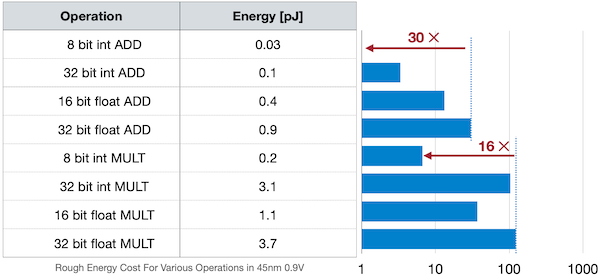
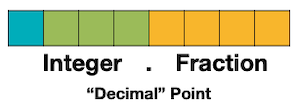
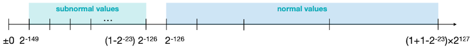
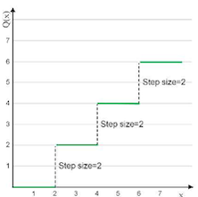
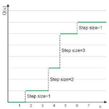
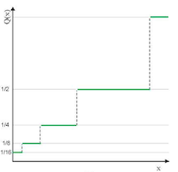
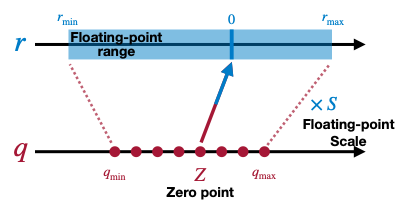
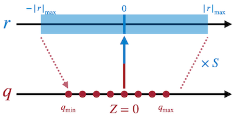
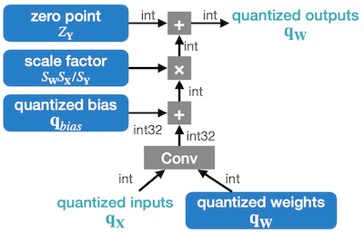
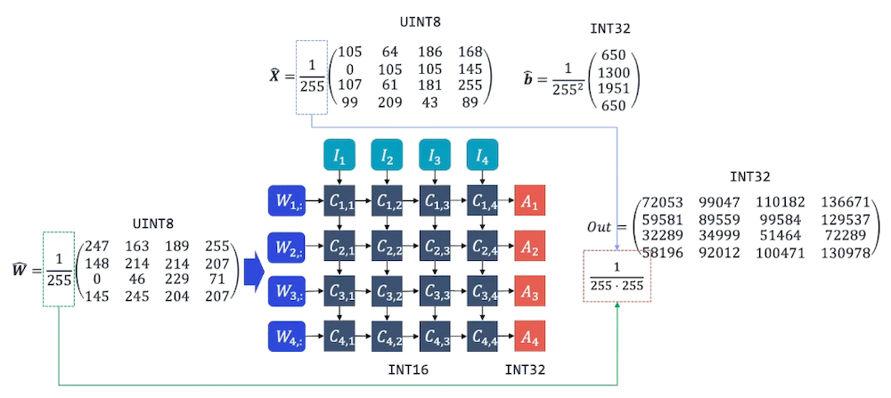

# Lecture 05 - Quantization (Part I)

> [Lecture 05 - Quantization (Part I) | MIT 6.S965](https://youtu.be/91stHPsxwig)

> [EfficientML.ai Lecture 5 - Quantization (Part I) (MIT 6.5940, Fall 2023, Zoom recording)](https://youtu.be/MK4k64vY3xo?si=ouUP5R86zYN7XPsS)

> [A White Paper on Neural Network Quantization](https://arxiv.org/abs/2106.08295)

**quantization**(양자화)는 연속된 신호(입력)을 discrete set으로 변환하는 기술이다.

| Before Quantization | After Quantization |
| :---: | :---: |
|  |  |

메모리 사용량, 전력 소모, 지연시간, 하드웨어 설계(silicon area) 등 다양한 차원의 이득을 얻을 수 있다.

---

## 5.1 Numeric Data Types

대체로 bit-width를 사용하는 연산일수록, 에너지 소모량이 적어 효율적이다.



---

### 5.1.1 Integer

다음은 십진수 49를 8 bit 정수(**INT8**)로 표현한 것이다.

<table>
<tr>
<td>

**Unsigned Integer**

n-bit range: $[0, 2^{n} - 1]$

</td>
<td>


</td>
</tr>
<tr>
<td>

**Signed Integer** (**Sign-Magnitude**)

n-bit range: $[-2^{n-1} - 1, 2^{n-1} - 1]$

> $00000000_{(2)} = 10000000_{(2)} = 0$

</td>
<td>


</td>
</tr>
<tr>
<td>

**Signed Integer** (**Two's Complement Representation**)

range: $[-2^{n-1}, 2^{n-1} - 1]$

> $00000000_{(2)} = 0$ , $10000000_{(2)} = -2^{n-1}$ 

</td>
<td>


</td>
</tr>
</table>

---

### 5.1.2 Fixed-Point Number

fixed-point 표현은 **정수 연산용으로 최적화된 하드웨어**를 사용할 수 있다는 장점을 갖는다. 다음은 8bit fixed-point로 소수를 표현한 예시다. 

> 핵심은 **shift 연산**이다. (shift right = 나누기 2, left shift = 곱하기 2)

<table>
<tr>
<td>

`fixed<8,4>`(의미: Width 8bit, Fraction 4bit)

- Sign(1bit)

- Integer(3bit)

- Fraction(4bit)

</td>
<td>



</td>
</tr>
</table>

다음은 `unsigned fixed<8,3>` 예시다.

$$ {00010.110} \underset{2}{} = 2 + 1 \times 2^{-1} + 1 \times 2^{-2} = 2 + 0.5 + 0.25 = 2.75 \underset{10}{} $$

---

### 5.1.3 Floating-Point Number (IEEE FP32)

다음은 **IEEE 754** 스타일의 32bit floating-point를 표현한 예시다.

<table>
<tr>
<td>

Sign(1bit)

Exponent(8bit)

Fraction(mantissa, 23bit)

</td>
<td>


</td>
</tr>
</table>

$$(-1)^{\mathsf{sign} } \times (1 + \mathsf{Fraction}) \times 2^{\mathsf{Exponent} - 127}$$

> Exponent Bias $= 127 = 2^{8-1}-1$

> e.g., IEEE FP32 0.265625 표현
>
> $0.265625 = (1 + 0.0625) \times 2^{125-127} = 1.0625 \times 2^{-2}$
>
> 

---

#### 5.1.3.1 Floating-Point Number: Subnormal Numbers

exponent 값이 0에 해당하는 범위를 **subnormal number**(비정규 값)라고 부른다.



해당 영역은 normal number과 다르게 **linear**하다.


$$(-1)^{\mathsf{sign} } \times \mathsf{Fraction} \times 2^{1 - 127}$$

<table>
<tr>
<td>

Smallest

$2^{-149} = 2^{-23} \times 2^{1 - 127}$

</td>
<td>


</td>
</tr>
<tr>
<td>

Largest

$2^{-126} - 2^{-149} = (1 - 2^{-23}) \times 2^{1 - 127}$

</td>
<td>


</td>
</tr>
</table>

---

#### 5.1.3.2 Floating-Point Number: Special Values

다음과 같은 두 가지 경우를 특수한 값으로 분류한다.

<table>
<tr>
<td>

Infinity 

> Normal Numbers, Exponent $\neq$ 0

</td>
<td>


</td>
</tr>
<tr>
<td>

NaN (Not a Number)

> Subnormal Numbers, Fraction $=$ 0

</td>
<td>


</td>
</tr>
</table>

---

### 5.1.4 Floating-Point Number Formats for Deep Learning

> [FP8 Formats for Deep Learning 논문(2022)](https://arxiv.org/abs/2209.05433)

fraction와 exponent를 비교하면, 딥러닝에서는 exponent width가 더 중요하다.

다음 예시를 보면, **half presicion**(16bit) 기준에서 exponent width를 최대한 사용하려는 의도를 엿볼 수 있다.

| | Exponent<br/>(bits) | Fraction<br/>(bits) | Total<br/>(bits) |
| --- | :---: | :---: | :---: |
|  | 8 | 23 | 32 |
|  | 5 | 10 | 16 |
|  | **8** | 7 | 16 |

이후 NVIDIA에서는 FP8 format도 제안하였다.

| | Exponent<br/>(bits) | Fraction<br/>(bits) | Total<br/>(bits) |
| --- | :---: | :---: | :---: |
|  | 4 | 3 | 8 |
|  | 5 | 2 | 8 |

---

### 5.1.5 INT4 and FP4

더 나아가 INT4, FP4 포맷도 등장하였다.

| | Range<br/>(Positive Numbers) | 
| --- | :---: | 
|  |  | 
|  |  | 
|  |  | 
|  |  | 

---

## 5.2 Uniform vs Non-uniform Quantization

> $r$ : real value(원래 표현), $q$ : quantized value

step size를 어떻게 정하는가에 따라 양자화를 분류할 수 있다.

|| Uniform | Non-Uniform | Non-Uniform<br/>(Logarithmic) |
| :---: | :---: | :---: | :---: |
||  |  |  | 
| 장점 | 동일한 step size로 구현이 쉽다 | 표현력이 우수하다. | 효율적으로 넓은 범위를 표현한다. |

- **Uniform Quantization**

  - $Z$ : Zero points, $S$ : Scaling factor

$$ Q(r) = \mathrm{Int}(r/S) - Z $$


- **Non-Uniform Quantization**

```math
Q(r) = X_i, \quad r \in [{\triangle}_i , {\triangle}_{i+1})
```

- Non-Uniform Quantization: **Logarithmic Quantization** 
    
$$Q(r) = Sign(r)2^{round(\log_{2}|r|)}$$

---

## 5.3 Linear Quantization

대표적인 uniform quantization에 해당하는 **Linear Quantization**을 살펴보자. 



$$ r = S(q-Z) $$

이때, <span style="background-color:#3DB7CC">floating-point range</span>  $r_{min}$ , $r_{max}$ , <span style="background-color:#980000">integer range</span>  $q_{min}$ , $q_{max}$ 는 이미 알고 있는 정보이다. 

| Bit Width | $q_{min}$ | $q_{max}$ |
| :---: | :---: | :---: |
| 2 | -2 | 1 |
| 3 | -4 | 3 |
| 4 | -8 | 7 |
| N | $-2^{N-1}$ | $2^{N-1} - 1$ |

이를 바탕으로 양자화 scaling factor $S$ 및 zero point $Z$ 를 구할 수 있다.

$$ S = { {r_{max} - r_{min} } \over {q_{max} - q_{mi n} } } $$

> 위 식은, $r_{max} = S(q_{max} - Z)$ , $r_{min} = S(q_{min} - Z)$ 두 식을 연립하여 얻을 수 있다.

---

### 5.3.1 Example: 2-bit Linear Quantization

다음의 floating point 텐서를 2-bit 양자화해보자.

```math
\begin{bmatrix} 2.09 & -0.98 & 1.48 & 0.09 \\ 0.05 & -0.14 & -1.08 & 2.12 \\ -0.91 & 1.92 & 0 & -1.03 \\ 1.87 & 0 & 1.53 & 1.49 \end{bmatrix}
```

**(1)** **scaling factor** $S$ 

```math
S = { {r_{max} - r_{min} } \over {q_{max} - q_{mi n} } } = { {2.12 - (-1.08) } \over {1 - (-2) } } = 1.07
```

**(2)** **zero point** $Z$ 

```math
Z = q_{min} + { {r_{min} } \over S } = \mathrm{round}(-2 - { {-1.08} \over 1.07 }) = -1
```

> **Notes**: 2-bit quantization
>
> | Binary | Decimal |
> | :---: | :---: |
> | 01 | 1 |
> | 00 | 0 |
> | 11 | -1 |
> | 10 | -2 |

---

### 5.3.2 Example: Matrix Multiplication

다음은 간단한 행렬 곱셈 수식이다.

$$ Y = WX $$

양자화를 반영하면 다음과 같다.

$$ S_{Y} (q_Y - Z_Y) = S_W (q_W - Z_W) \cdot S_X (q_X - Z_X) $$

$q_Y$ 에 대한 식으로 정리하면 다음과 같다.

$$ q_Y = { {S_W S_X} \over {S_Y} } (q_W - Z_W) (q_X - Z_X) + Z_Y $$

$$ q_Y = { {S_W S_X} \over {S_Y} } (q_W q_X - Z_W q_X - Z_X q_W + Z_W Z_X) + Z_Y $$ 

효율적으로 추론하기 위해, 가중치와 연관된 일부 항은 오프라인에서 미리 계산해 둔다.

- $S_W S_X / S_Y$ : $N$ bit rescale

- $+Z_Y$ : $N$ bit addition

$$ q_{Y} = \underset{rescale}{ { {S_{W}S_{X} } \over {S_{Y} } } } \left( q_{W}q_{X} - Z_{W}q_{X} \underset{Precompute}{- Z_{X}q_{W} - Z_{W}Z_{X} } \right) + Z_{Y} $$

---

### 5.3.3 Normalization of Multiplier

위 식에서 multiplier $M = S_W S_X / S_Y$ 는 **(0,1)** 값을 갖는다. 따라서, fixed-point 형태로 표현하는 것도 가능하다.

$$M = 2^{-n}M_0$$

- $M_0 \in [0.5, 1)$ : fixed-point multiplication

- $2^{-n}$ : bit shift

> fixed-point를 사용하면, $M_0$ 를 정수용 하드웨어로 연산할 수 있다.

---

## 5.4 Linear Quantized Neural Network Layers

가장 간단한 예제인 symmetric linear quantization을 살펴보자. ( zero point $Z=0$ )



이때의 scaling factor $S$ 는 다음과 같다.

$$ S = {{r_{min}} \over {q_{min} - 0}} = {{-{|r|}_{max}} \over {q_{min}}} = {{{|r|}_{max}} \over {2^{N-1}}} $$

> 위 식은 $r_{min} = S(q_{min} - Z)$ 에서 유도할 수 있다.

---

### 5.4.1 Fully-Connected Layer

이제 bias를 포함하는 fully-connected layer의 수식을 살펴보자.

$$ Y = WX + b $$

$$ S_Y (q_Y - Z_Y) = S_W (q_W - Z_W) \cdot S_X (q_X - Z_X) + S_b (q_b - Z_b) $$

차례로 수식을 정리하면 다음과 같다.

**(1)** $Z_W = 0$ , $Z_b = 0$ 

$$ S_Y (q_Y - Z_Y) = S_W S_X (q_W q_X - Z_X q_W) + S_b q_b $$

**(2)** $S_b = S_W S_X$

$$ S_Y (q_Y - Z_Y) = S_W S_X (q_W q_X - Z_X q_W + q_b) $$

**(3)** $q_{bias} = q_b - Z_X q_W$ 

$$ S_Y (q_Y - Z_Y) = S_W S_X (q_W q_X + q_{bias}) $$

**(4)** $q_Y$ 식으로 정리

$$ q_{Y} = { {S_{W}S_{X} } \over {S_{Y} } }(q_{W}q_{X} + q_{bias}) + Z_{Y} $$

> 괄호 안의 항: $N$ bit 정수 곱셈, 32 bit 정수 덧셈(overflow 방지), $Z_Y$ : $N$ bit 정수 덧셈

---

### 5.4.2 Convolution Layer

마찬가지로 convolution 연산 수식도 정리할 수 있다.

$$ Y = \mathrm{Conv} (W, X) + b $$

- $Z_W = 0$

- $Z_b = 0$ , $S_b = S_W S_X$

- $q_{bias} = q_b - \mathrm{Conv}(q_w , Z_X)$

$$ \downarrow $$

$$ q_{Y} = { {S_{W}S_{X} } \over {S_{Y} } }(\mathrm{Conv}(q_{W}, q_{X}) + q_{bias}) + Z_{Y} $$

해당 수식의 연산 그래프는 다음과 같다.



---

## 5.5 Hardware Implementation of Integer-Arithmetic-Only Inference

> [Quantization and Training of Neural Networks for Efficient Integer-Arithmetic-Only Inference 논문(2017)](https://arxiv.org/abs/1712.05877)

> [tinyML Talks: A Practical Guide to Neural Network Quantization](https://youtu.be/KASuxB3XoYQ)

다음은 uint8 양자화 모델을 추론하는 MAC array이다.



$$ A_{i} = \sum_{j}{C_{i,j} } + b_i $$

---

## 5.6 Symmetric vs Asymmetric Quantization

unsigned int 타입의 양자화는 ReLU와 유사한 output activation을 대상으로 할 때 특히 유용하다.

| | Symmetric<br/>(signed) | Symmetric<br/>(unsigned) | Asymmetric<br/>(unsigned) |
| :---: | :---: | :---: | :---: |
| |  |  |  |
| Zero Point | $Z = 0$ | $Z = 0$ | $Z \neq 0$ |
| INT8 Range | \[-128, 127\] (restricted) <br/> \[-127,127\] (full) | [0, 255] | [0, 255] |
| Matrix Transform | Scale | Scale | Affine |

> restricted range: full range 대비 정확도 떨어지지만, 연산 비용이 저렴하며 구현도 쉽다. 

---

## 5.7 Sources of Quantization Error

linear quantization에서 양자화 오차를 발생시키는 원인을 알아보자.

| $x \rightarrow x_{int}$ |
| :---: |
|  |

1. **round error**: $x$ 에서 근접한 값 $\rightarrow$ 동일한 $x_{int}$ grid

2. **clip error**: 범위( e.g., $q_{max}$ )를 벗어난 outlier  $\rightarrow 2^{b} - 1$ 

> quantization error = round error + clip error

다음은 양자화된 값 $x_{int}$ 을 $\hat{x}$ 로 복원한 뒤 발생한 오차를 나타낸 그림이다. scaling factor를 어떻게 정하는가에 따라, 양측 오차에서 **trade-off**가 발생한다.

| $x_{int} \rightarrow \hat{x}$ <br/>(case 1: round error가 큰 경우) |
| :---: |
|  |
| $x_{int} \rightarrow \hat{x}$ <br/>**(case 2: clip error가 큰 경우)** |
|  |

따라서, 양자화 시 최적의 절충점을 고려하여 scaling factor를 정해야 한다.

---
