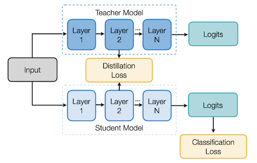
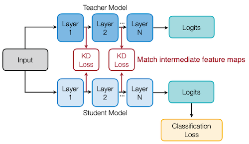
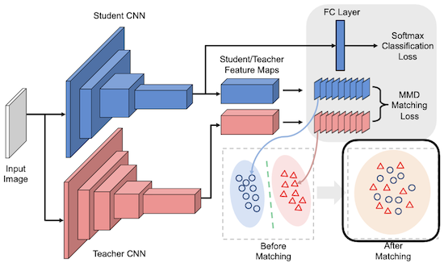
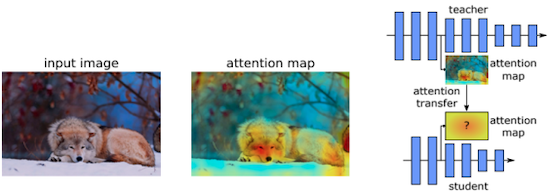
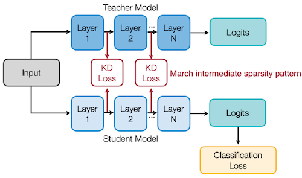
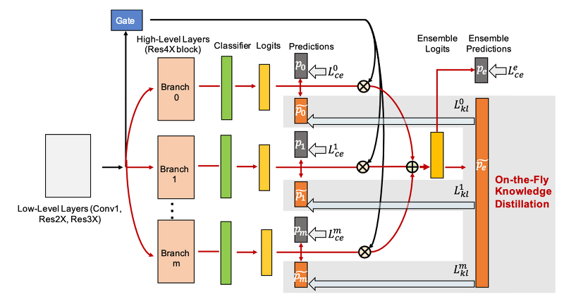

# 10 Knowledge Distillation

> [Lecture 10 - Knowledge Distillation | MIT 6.S965](https://youtu.be/IIqf-oUTHe0)

> [EfficientML.ai Lecture 9 - Knowledge Distillation (MIT 6.5940, Fall 2023, Zoom)](https://youtu.be/dSDW_c789zI)

**Knowledge Transfer**란, 복잡한 모델을 사용하여 단순한 모델을 훈련시킴으로써, 복잡한 모델 성능에 근접한 단순한 모델을 획득하는 방법이다. 

---

## 10.1 Cloud Model vs Edge Model

cloud model(ResNet50)과 edge model(MobileNetV2-Tiny)의 training curve를 비교해 보자.


> 가로: epoch, 세로: accuracy

위 그래프에서 볼 수 있듯이, edge model(MobileNetV2-Tiny)은 다음과 같은 특징을 갖는다.

- (-) 작은 capacity를 갖는 만큼, 높은 정확도를 얻기 힘들다.

- (-) overfitting을 방지하기 위한 학습 기법이, 오히려 정확도 하락을 유발할 수 있다.

  > **data augmentation**(데이터 증강), **dropout**(드롭아웃) 등

  > data augmentation: mirroring, random cropping, rotation, shearing, local wrapping 등

---

## 10.2 Knowledge Distillation

> [Distilling the Knowledge in a Neural Network 논문(2015)](https://arxiv.org/abs/1503.02531)

> [Neural Network Intelligence: Knowledge Distillation on NNI](https://nni.readthedocs.io/en/v2.3/TrialExample/KDExample.html#knowledgedistill)

**Knowledge Distillation**(KD, 지식 증류)란, teacher가 갖고 있는 knowledge를 student network로 전달하는 방법이다.


> ground-truth: 실험자가 정한 '정답'(model이 답으로 내놓기를 원하는 class)

- Input: Teacher, Student 모두에게 전달된다.

- **Distillation Loss**

  다음 두 정보의 차이를 바탕으로 산출한다.

  - soft labels = Teacher Logits + Softmax with Temperature

  - soft predictions = Student Logits + Softmax with Temperature

- **Classification Loss** = student's standard loss

- **Total loss** = classification loss $\times \alpha$ + distillation loss $\times \beta$

---

### 10.2.1 Intuition of Knowledge Distillation

개와 고양이의 이진 분류 문제 예시를 바탕으로 KD를 이해해 보자.


위 결과에서, teacher와 student가 입력을 고양이로 예측한 확률은, softmax를 통해 계산할 수 있다.

- Teacher

$${ {e^5} \over {e^5 + e^1} } = 0.982$$

- Student

$${ {e^3} \over {e^3 + e^2} } = 0.731$$

student는, teacher에 비해 입력이 고양이라는 confidence가 부족하다. 이를 teacher model의 information으로 보완한다.

---

### 10.2.2 Softmax Temperatrue

하지만 teacher의 confidence가 높을수록, 정답이 아닌 다른 class의 information이 0에 가깝게 된다. teacher의 information을 보존하여 전달하기 위해, **temperature**라는 개념이 등장한다.

$$ p(z_i, T) = { {\exp({z_{i} \over T})} \over {\sum_{j}{\exp({z_{j} \over T})} }} $$

- $T$ : temperature

  - $T$ 가 클수록, soft한 distribution이 된다.

  - $T=1$ : standard softmax

- teacher와 student 크기 차이가 클 때는, 대체로 작은 temperature가 더 효율적이다. 

  > student가 teacher의 information을, 제대로 capture하지 못하기 때문.


### <span style='background-color: #393E46; color: #F7F7F7'>&nbsp;&nbsp;&nbsp;📝 예제 1: Softmax Temperature &nbsp;&nbsp;&nbsp;</span>

다음 예시에서, $T=1 , T=10$ 일 때 입력을 고양이로 예측한 확률을 구하라.

|  | Logits |
| :---: | :---: |
| Cat | 5 |
| Dog | 1 | 

### <span style='background-color: #C2B2B2; color: #F7F7F7'>&nbsp;&nbsp;&nbsp;🔍 풀이&nbsp;&nbsp;&nbsp;</span>

- $T = 1$ (**standard softmax**)

$${ {e^{5 \over 1} } \over {e^{5 \over 1} + e^{1 \over 1} }} = 0.982$$

- $T = 10$

$${ {e^{5 \over 10} } \over {e^{5 \over 10} + e^{1 \over 10} }} = 0.599$$

---

## 10.3 What to match?

이후 다양한 연구에서 logits(response)만 아니라, 교사의 다른 정보를 학생과 match하는 방법들이 제안되었다.

---

### 10.3.1 Matching intermediate weights

> [FitNets: Hints for Thin Deep Nets 논문(2015)](https://arxiv.org/abs/1412.6550)

FitNets 논문에서는, 교사와 학생의 각 레이어의 intermediate weights를 비교하여 Distillation Loss를 산출한다.



- 교사 가중치와 학생 가중치의 L2 distance를 측정한다.

- 이때 채널 수가 적은 학생에 1x1 convolution을 적용하여, 교사와 동일한 채널을 갖도록 projection한다. (linear transformation)

    

---

### 10.3.2 Matching intermediate features

교사와 학생 사이의 feature map을 매칭하는 기법도 제안되었다.



---

#### 10.3.2.1 Minimizing MMD

> [Like What You Like: Knowledge Distill via Neuron Selectivity Transfer 논문(2017)](https://arxiv.org/abs/1707.01219)

Like What You Like 논문에서는 **MMD**(Maximum Mean Discrepancy. 최대 평균 불일치)를 기반으로, 교사와 학생의 feature map discrepancy를 계산한다.



---

#### 10.3.2.2 Matching intermediate attention maps

> [Paying More Attention to Attention 논문(2017)](https://arxiv.org/abs/1612.03928)

위 논문에서는 교사와 학생의 attention map을 매칭한다.



이때 attention의 다음과 같은 특징에 주목한다.

- CNN feature map $x$ 의 attention

$$\mathrm{attention} = { {\partial L} \over {\partial x} }$$

- intuition: position $i, j$ 의 attention이 크다면, 해당 지점에 작은 변화(perturbation)를 주어도 최종 출력에 큰 영향을 미칠 것이다.

- 높은 정확도를 갖는 모델은, 비슷한 attention map을 갖는다.

  

---

#### 10.3.2.3 Minimizing the L2 distance

> [Paraphrasing Complex Network: Network Compression via Factor Transfer 논문(2018)](https://arxiv.org/abs/1802.04977)

> [NAVER Engineering: paraphrasing complex network seminar](https://tv.naver.com/v/5440966)

위 논문에서는 Paraphraser, Translator를 두어, 교사의 output feature maps에서 한 차례 더 feature extraction을 거친 정보를 전달한다.(factor transfer)


| | Paraphraser | Translator |
| :---: | :---: | :---: |
| Implementation | convolution | 1 layer MLP |

---

### 10.3.3 Matching sparsity pattern

> [Knowledge Transfer via Distillation of Activation Boundaries Formed by Hidden Neurons 논문(2019)](https://arxiv.org/abs/1811.03233)

> [Martin Trimmel: Linear Regions of Deep Neural Networks](https://www.youtube.com/watch?v=RM0wOvYkXDA)

ReLU를 거치며 생기는 activated, deactivated 영역은, 입력을 바르게 구분하기 위한 linear decision boundary를 형성한다. 


- **decision boundary**는 activation boundary와 큰 연관성을 갖는다.

- 따라서 sparsity pattern으로도, 교사가 가지는 정보를 전달할 수 있다.

위와 같은 아이디어를 기반으로, 다음과 같이 교사의 sparsity pattern 정보를 학생에게 전달한다.



- Sparsity Pattern

  **indicator function**을 사용해서 나타낼 수 있다.

$$ \rho(x) = 1[x > 0] $$

- Loss Function

$$ \mathcal{L}(I) = {|| \rho({ {T}(I)}) - \rho({ {S}(I)}) ||}_{1} $$

---

### 10.3.4 Matching relational information

서로 다른 레이어나 데이터 사이의 관계, 즉 **relational information**에 주목한 Knowledge Distillation 기법도 제안되었다.

---

#### 10.3.4.1 Relations between different layers

> [A Gift from Knowledge Distillation: Fast Optimization, Network Minimization and Transfer Learning 논문(2017)](https://openaccess.thecvf.com/content_cvpr_2017/papers/Yim_A_Gift_From_CVPR_2017_paper.pdf)

다음 그림은 32개 레이어를 갖는 교사와, 14개 레이어를 갖는 학생 모델 사이에서 relational information을 전달하는 과정이다.

> 이때 교사와 학생의 레이어 수는 다르나, 채널 수는 모두 동일하므로 주의.


- **module** 묶음 내 feature map을 내적하여, FSP matrix를 산출한다.

  > Flow of Solution Procedure(FSP) matrix

$$ G_{i,j}(x; W) = \sum_{s=1}^h \sum_{t=1}^w { {F^1_{s,t,i}(x;W) \times F^2_{s,t,j}(x; W)} \over {h \times w} } $$

- 교사와 학생 FSP matrix의, L2 loss를 계산한다.

---

#### 10.3.4.2 Relations between different samples

> [Relational Knowledge Distillation 논문(2019)](https://arxiv.org/abs/1904.05068)

Relational Knowledge Distillation(RKD) 논문에서는, 여러 입력 샘플을 주었을 때, 각 샘플의 intermediate features가 갖는 관계를 전달한다.


- 이때 $n$ 개 sample의 relation은, 다음과 같은 수식으로 계산할 수 있다.

```math
\Psi (s_1, s_2, \cdots , s_n) = (||s_1 - s_2||_{2}^{2}, ||s_1 - s_3||_{2}^{2}, \cdots , ||s_1 - s_n||_{2}^{2}, \cdots , ||s_{n-1} - s_n||_{2}^{2} )
```

---

## 10.4 Distillation Schemes

> [Knowledge Distillation: A Survey 논문(2020)](https://arxiv.org/abs/2006.05525)

교사와 학생이 동시에 학습되는지 여부에 따라서, KD를 세 가지 범주로 분류할 수 있다.

| Offline Distillation | Online Distillation | Self-Distillation |
| :---: | :---: | :---: |
|  |  |  |

> 빨간색: Pre-trained, 노란색: To be trained

---

### 10.4.1 Self Distillation

> [Born Again Neural Networks 논문(2018)](https://arxiv.org/abs/1805.04770)

위 논문에서는 $k$ stages로 학습 과정을 나누고, 매 stage에서 동일한 구조의 모델을 학습한다.


- 이전 stage에서 획득한 모델을 교사로 하여, iterative하게 학습을 진행한다.

- Network Architecture

$$ T = S_1 = S_2 = ... = S_k $$

- Accuracy
  
$$ T < S_1 < S_2 < ... < S_k $$

- 각 stage model의 예측을 **ensemble**하여, 예측 정확도를 추가로 높일 수 있다.

---

### 10.4.2 Online Distillation

> [Deep Mutual Learning 논문(2018)](https://arxiv.org/abs/1706.00384)

Online Distillation에서는, 교사와 학생을 동시에 **from scratch**로 학습한다.


- 교사와 학생의 output distribution 차이를 최소화하는 방식으로 학습이 진행된다.

$$ L(S) = \mathrm{CrossEntropy}(S(I), y) + KL(S(I), T(I)) $$

$$ L(T) = \mathrm{CrossEntropy}(T(I), y) + KL(T(I), S(I)) $$

- (+) pretrained teacher $T$ 가 필요하지 않다.

- (+) 두 모델이 같은 구조를 가져도 적용할 수 있다. ( $S = T$ )

- (-) 동시에 학습하는 학생이 많을수록, 학습 자원도 많이 소모된다.

---

### 10.4.3 Combining Online and Self-Distillation

---

#### 10.4.3.1 ONE: Multiple Branches + Ensemble

> [Knowledge Distillation by On-the-Fly Native Ensemble 논문(2018)](https://arxiv.org/abs/1806.04606)

Online Distillation은 여러 학생을 학습하면서 학습 자원을 많이 소모하고, 동시다발적이고 복잡한 backpropagation 알고리즘을 갖는다. ONE 논문에서는 해당 문제를 개선하기 위해, 다양한 branch를 갖는 단일 모델에서 Distillation을 구현했다.



- **Gate**: 각 branch의 출력 logits을 ensemble한다.

---

#### 10.4.3.2 Be Your Own Teacher: Deep Supervision + Distillation

> [Be Your Own Teacher: Improve the Performance of Convolutional Neural Networks via Self Distillation 논문(2019)](https://arxiv.org/abs/1905.08094)

위 논문에서는, 출력부에 가까운 레이어(deeper layer)의 지식을, 입력부와 가까운 레이어(shallower layer)로 전달하는 방식으로 Distillation을 구현했다.


- 예를 들어, 깊은 레이어(예: ResBlock4)에서, 더 얕은 레이어(ResBlock 3)에게 지식이 전달된다.

  > 서로 다른 채널 수: 1x1 conv를 이용해 맞춘다.

---