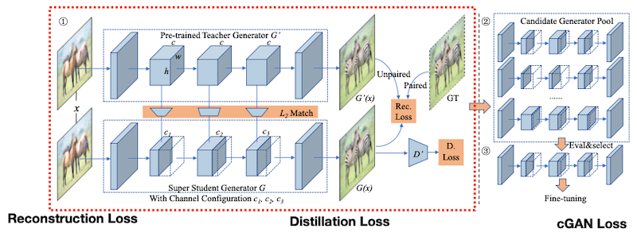
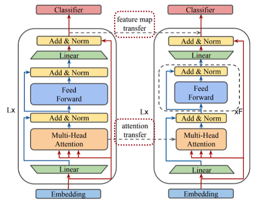

# 10 Knowledge Distillation

> [Lecture 10 - Knowledge Distillation | MIT 6.S965](https://www.youtube.com/watch?v=tT9Lnt6stwA)

> [EfficientML.ai Lecture 9 - Knowledge Distillation (MIT 6.5940, Fall 2023, Zoom)](https://youtu.be/dSDW_c789zI)

---

## 10.5 KD for Object Detection

Object Detection 도메인에서는, 크게 두 가지 문제를 추가로 해결해야 한다.

- foreground, background를 잘 분리할 수 있어야 한다.

- Bounding box를 잘 찾아야 한다.

  이때, bounding box는 classification이 아니라, **regression** 문제에 해당된다.

---

### 10.5.1 Distillation Pipeline for Object Detection

> [Learning Efficient Object Detection Models with Knowledge Distillation 논문(2017)](https://proceedings.neurips.cc/paper_files/paper/2017/file/e1e32e235eee1f970470a3a6658dfdd5-Paper.pdf)

Object Detection의 특징에 맞춰, 위 논문에서는 다음과 같은 절차를 통해 KD를 수행한다.


- **Adaptation**

  교사와 학생의 intermediate feature map을 비교한다.

  > 1x1 conv로 channel 수를 맞춘다.

```math
L_{Hint}(V, Z) = ||V-Z||_{2}^{2}
```
- **Detection head**

  classification, regression 결과를 모두 도출한 뒤 loss를 계산한다.

  - Weighted Cross Entropy Loss

    foreground, background classification을, 서로 다른 가중치를 사용하는 것으로 class imbalance 문제를 해결한다.

    $L_{soft}(P_{s}, P_{t}) = - \sum {w_c P_t \log P_s}$

  - Bounded Regression Loss

```math
L_{b}(R_{s}, R_{t}, y) = - \begin{cases} ||R_{s}-y||_{2}^{2}, & if \, ||R_{s}-y||_{2}^{2} + m > || R_t - y ||_{2}^{2} \\ 0, & \mathrm{otherwise} \end{cases}
```

> 이때 margin을 두어, 학생 성능이 교사 성능 + margin $m$ 을 넘어서는 순간, loss가 0이 되며 학습이 중단되도록 구현했다.

---

### 10.5.2 Convert Regression to Classification Problem

> [Localization Distillation for Dense Object Detection 논문(2022)](https://arxiv.org/abs/2102.12252)

혹은 regression 문제인 bounding box을, classification 문제로 바꿔서 KD를 수행할 수 있다.


- x축을 6개 구간으로 나누고, y축을 6개 구간으로 나눈다.

- 각 구간을 class로 지정한다.

---

## 10.6 KD for Semantic Segmentation

> [Structured Knowledge Distillation for Semantic Segmentation 논문(2019)](https://openaccess.thecvf.com/content_CVPR_2019/papers/Liu_Structured_Knowledge_Distillation_for_Semantic_Segmentation_CVPR_2019_paper.pdf)

**Semantic Segmentation** 도메인에서는 Discriminator을 사용한 KD 방법이 제안되었다. (**Adversarial Distillation**)


- feature imitation: classification, detection 도메인과 유사하게 진행

- **Discriminator**

  adversarial loss: 학생이 discriminator를 속일 수 있도록 학습된다.

---

## 10.7 KD for GAN

> [GAN Compression: Efficient Architectures for Interactive Conditional GANs 논문(2020)](https://arxiv.org/abs/2003.08936)



training objective는 다음과 같다.

```math
\mathcal{L} = \mathcal{L}_{cGAN}(x) + \lambda_{recon} \mathcal{L}_{recon} + \lambda_{distill} \mathcal{L}_{distill}(x)
```

- Reconstruction Loss

$$ \mathcal{L}_{recon} = \begin{cases} {||G(x) - y||} & \mathrm{paired} \ \mathrm{cGANs} \\ {||G(x) - G'(x)||} & \mathrm{unpaired} \ \mathrm{cGANs} \end{cases} $$

- Distillation Loss

```math
\mathcal{L}_{distill} = \sum_{k=1}^n ||G_k(x) - f_k(G_k'(x))|| $$
```

- cGAN Loss

```math
\mathcal{L}_{cGAN} = \mathbb{E}_{x,y}[\log D(x,y)] + \mathbb{E}_x[\log (1- D(x, G(x)))]
```

---

## 10.8 KD for NLP

> [MobileBERT: a Compact Task-Agnostic BERT for Resource-Limited Devices 논문(2020)](https://arxiv.org/abs/2004.02984)

MobileBERT 논문에서는 NLP 도메인에서, 교사의 feature map과 attention 정보를 쩐달하는 방식으로 KD를 구현했다.



- Feature Map Transfer(FMT)

- Attention Transfer(AT)

---

## 10.9 Network Augmentation

> [NETWORK AUGMENTATION FOR TINY DEEP LEARNING 논문(2022)](https://arxiv.org/pdf/2110.08890.pdf)

large model에서 overfitting을 피하기 위해 사용하는 **data augmentation**, **dropout**과 같은 방법은, tiny model에서 오히려 악영향을 미친다.

- data augmentation

  cutout, mixup, rotation, flip 등

  

- dropout

  

다음은 tiny model에서 해당 기법을 적용했을 때, 성능 차이를 나타내는 그림이다.


---

### 10.9.1 Training Process

**NetAug**는 모델 자체를 증강하는 방식을 택한다.(reverse dropout)

> 반대로 large model에서는 overfitting을 유발하므로 주의해야 한다.

- augment model

  각 레이어의 \#channels을 늘려, dynamic neural network를 학습한다. (**weight sharing**)

- Step 1

  original, augmented model의 forward, backward를 함께 수행한다.

  

  > 좌: original tiny model, 우: augmented model

이때 loss function은 base supervision, auxiliary supervision 두 항의 결합으로 표현된다. 

```math
{\mathcal{L} }_{aug} = {\mathcal{L} }(W_{base}) + {\alpha}{\mathcal{L} }([W_{base}, W_{aug}])
```

- scaling factor $\alpha$ : auxiliary supervision가 loss에 미치는 영향을 조절

---

### 10.9.2 NetAug Learning Curve

다음은 ImageNet 데이터셋을 이용한 학습에서 NetAug를 적용했을 때의 성능을 나타낸 그림이다.


- tiny model(MbV2-Tiny): under-fitting을 막고 성능을 향상시킨다.

- large model(ResNet50): over-fitting을 유발한다.

---