# Lecture 15 - On-Device Training and Transfer Learning

> [Lecture 15 - On-Device Training and Transfer Learning (Part I) | MIT 6.S965](https://youtu.be/VW_6V0k_i30)

> [EfficientML.ai Lecture 21 - On-device Training (Zoom Recording) (MIT 6.5940, Fall 2024)](https://youtu.be/34XrZeRk_FU)

on-device training을 실현하기 위해서는, 주된 병목인 메모리 사용량의 최적화가 필요하다.

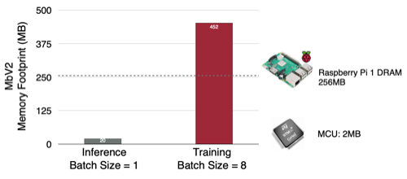

> MobileNetV2 Inference(BS=1): 20MB, Training(BS=8): 452MB

---

## 15.1 Key Bottleneck: Training Memory 

학습에서는 intermediate activation을 저장해야 하므로, 메모리 사용량에서 병목이 발생하게 된다.

다음은 linear 레이어의 forward, backward 수식 예시다.

- **Forward**

$$a_{t+1} = a_i W_i + b_i$$

- **Backward** ( $a_i^T$ 를 저장해야 한다. )

$$\frac{\partial L}{\partial W_i} = a_i^T \frac{\partial L}{\partial a_{t+1}}$$

> **Notes**: Parameter-Efficient vs. Memory-Efficient
>
> - 파라미터 및 연산량을 경량화한 모델(MobileNetV2)도, 여전히 학습에서는 높은 메모리 비용을 요구한다.
>
> 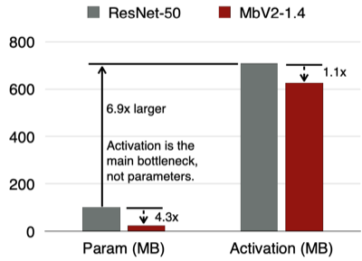

**Transfer Learning**(전이 학습)에서는, 주로 일부 레이어만 업데이트하는 방법으로 메모리 비용(Parameter+Activation)을 최소화한다.

- 한계: 학습 레이어가 한정적일수록, 정확도 손실도 발생하게 된다.

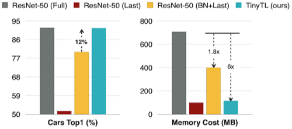

> BN: Batch Normalization 레이어만 업데이트, Last: 마지막 레이어만 업데이트

---

## 15.2 TinyTL: Memory-Efficient Transfer Learning

> [TinyTL: Reduce Activations, Not Trainable Parameters for Efficient On-Device Learning 논문(2020)](https://arxiv.org/abs/2007.11622)

다음은 MobileNetV2(inverted bottleneck 구조)의 일반적인 미세조정 절차를 나타낸 그림이다.

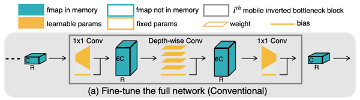

- Forward

$$ a_{i+1} = a_i W_i + b_i $$

- Backward (weight, bias)

$$ \frac{\partial L}{\partial W_i} = a_i^T \frac{\partial L}{\partial a_{i+1}} $$

$$ \frac{\partial L}{\partial b_i} = \frac{\partial L}{\partial a_{i+1}} = \frac{\partial L}{\partial a_{i+2}} W_{i+1}^T $$

주목할 점으로, (weight와 달리) bias 업데이트는 중간 activation $a_i^T$ 를 저장하지 않아도 된다. (즉, 비교적으로 메모리 효율적이다.)

> **Notes**: ReLU function의 메모리 비용 이점
>
> | Layer Type | Forward | Backward | Memory Cost |
> | --- | :---: | :---: | :---: |
> | **ReLU** | $a_{i+1} = \max (0, a_i)$ | $\frac{\partial L}{\partial a_i} = \frac{\partial L}{\partial a_{i+1}} \circ \mathbb{1_{a_{i+1}} \ge 0}$ | $\|a_i\|$ bits |
> | **sigmoid** | $a_{i+1} = \sigma (a_i) = \frac{1}{1 + e^{-a_i}}$ | $\frac{\partial L}{\partial a_i} = \frac{\partial L}{\partial a_{i+1}} \circ \sigma(a_i) \circ (1 - \sigma(a_i))$ | $32\|a_i\|$ bits |
> | **h-swish** | $a_{i+1} = a_i \circ \frac{\mathrm{ReLU6}(a_i+3)}{6}$ | $\frac{\partial L}{\partial a_{i+1}}$ = $\frac{\partial L}{\partial a_{i+1}} \circ \left( \frac{\mathrm{ReLU6}(a_i+3)}{6} + a_i \circ \frac{1_{-3 \le a_i \le 3}}{6} \right)$ | $32\|a_i\|$ bits |

---

### 15.2.1 Bias-Only Fine-Tuning

따라서, weight는 freeze하고, bias만 업데이트하는 방법을 사용할 수 있다.

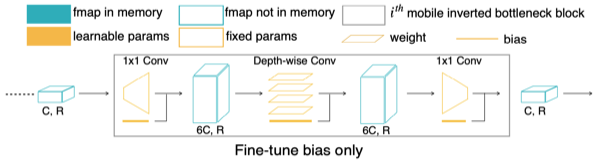

이를 통해 12배 메모리 사용량을 줄일 수 있지만, 모델의 정확도 손실(16.3%)을 유발하게 된다.

| 메모리 사용량 | Cars 데이터 정확도 |
| :---: | :---: |
| 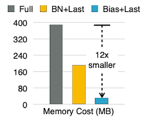 | 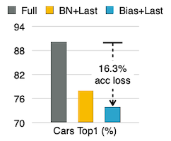 |

---

### 15.2.2 Lite Residual Learning

논문에서는 정확도 손실을 최소화하기 위한 설계인 **lite residual module**을 제안하였다. 다음은 모듈 설계에 있어서 두 가지 특이사항이다.

- **resolution**: 절반(0.5R)으로 downsampling하여 전달 

- **avoid inverted bottleneck**: 기존 구조와 달리 중간에 채널 수를 늘리지 않음

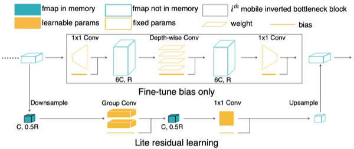

해당 구조로 오직 5MB 메모리 비용만 추가로 사용하며, 정확도 손실을 최소화할 수 있었다.

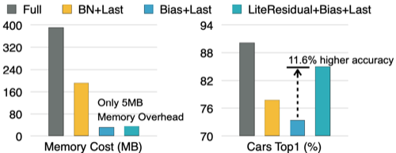

> **Notes**: In-memory Training 가능
>
> - group normalization을 통해 bs=1 training이 가능하며, 이 경우 L3 Cache(16MB) 이내 비용으로 수행할 수 있다.
>
> 

---

### 15.2.3 TinyTL: Different Tasks

(생략)

---

## 15.3 Sparse Learning

> [On-Device Training Under 256KB Memory 논문(2022)](https://arxiv.org/abs/2206.15472)

온디바이스 환경에서 메모리 사용량을 줄이기 위해, 일부 레이어만을 희소하게 업데이트하는 기법이 제안되었다.

> **Notes**: 네 가지 업데이트 패러다임 비교 (모델: ProxylessNAS-Mobile)
>
> | | |
> | :---: | :---: |
> | Full Update | 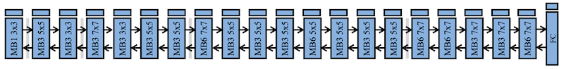 |
> | Last-only | 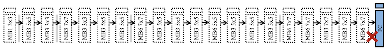 |
> | Bias-only | 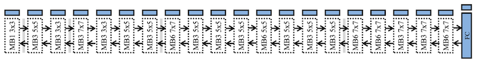 |
> | Sparse Layer/Tensor | 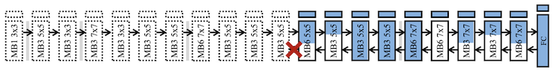 |

이중에서도 레이어의 일부(subset)만 업데이트하는 **sparse tensor update** 기법이, 메모리 사용량과 정확도 유지 trade-off 면에서 효율적이다.

| Cost | Full Update | Sparse Tensor Update |
| :---: | :---: | :---: |
| Computation | 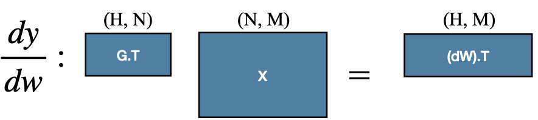 | 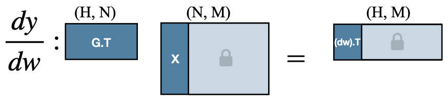 |
| Activation to store | $(N, M)$ | $(N, 0.25 \times M)$ |
| FLOPs | $(M \times H \times N)$ | $(0.25 \times M \times H \times N)$ |

---

### 15.3.1 Contribution Analysis

trade-off를 최적화하기 위해선, 각 레이어를 어떤 방식으로 업데이트했을 때 효율적인지 파악해야 한다. 이때 레이어의 순서에 따른 메모리 사용량 특성을 중심적으로 고려한다.

- 입력 근처 레이어(activation 비용 큼): 업데이트 생략

- 출력 근처 레이어(weight 비용 큼): bias-only update

| | |
| :---: | :---: |
| Per-Layer Memory Usage | 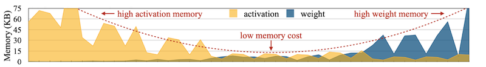 |
| Update Scheme |  |

정확도 면에서도 어떤 레이어가 기여도가 높은지 알기 위해서는, 하나의 레이어만을 대상으로 한 미세조정을 반복하면 된다.

| CNN Model (MobileNetV2) | Transformers (BERT) |
| --- | --- |
| 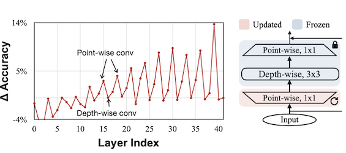 | 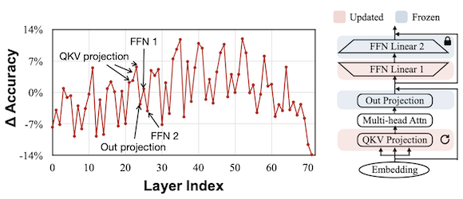 |
| **(1)** 입력 근처의 레이어에서는 정확도 손상까지 발생하였다. **(2)** pw-dw-pw에서, 첫 번째 pw가 정확도에 가장 기여하였다. (1st pw만 업데이트) |  **(1)** 입력 근처, 출력 근처 모두 정확도 손상이 발생하였다. **(2)** FFN 1은 기여도가 컸지만, 2는 그렇지 않았다. (FFN Linear 2만 업데이트) **(3)** QKV Proj.은 기여도가 컸지만, Out Proj.은 그렇지 않았다. (QKV proj.만 업데이트) |

> **Notes**: Bias 정확도 기여도 분석(CNN)
>
> 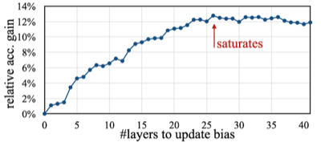

획득한 데이터를 토대로 **evolutionary search**를 통해, 최적의 sparse learning 정책을 결정한다.

$$ k^{\ast} , \boldsymbol{i^{\ast}} , \boldsymbol{r^{\ast}} = \max_{k, \boldsymbol{i}, \boldsymbol{r}} (\Delta acc_{\boldsymbol{b}[:k]} + \sum_{i \in \boldsymbol{i}, r \in \boldsymbol{r}} acc_{\boldsymbol{W_{i,r}}}) $$

$$ \mathrm{s.t.} \ \mathrm{Memory}(k,\boldsymbol{i},\boldsymbol{r}) \le \mathrm{constraint} $$

| Contribution Analysis | Evolution Search |
| :---: | :---: |
| 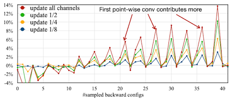 | 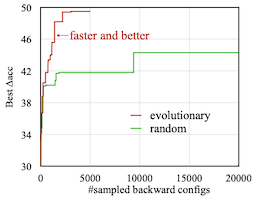 |

---

## 15.4 Sparse BP: Fine-tune LLM On-device

(생략)

---

## 15.5 Real Quantized Training

edge device에서는 실제로 양자화한 모델을 배포한다.

> **Notes**: Quantization-Aware Training vs. On-Device Training
>
> - BatchNorm: conv 연산과 fuse되어 사라진다.
>
> | Fake Quantization (Quantization-Aware Training) | Real Quantization (Inference/On-Device Training) |
> | :---: | :---: |
> | 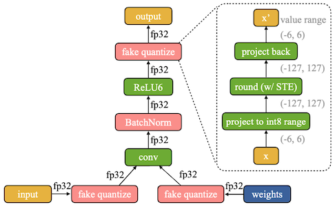 | 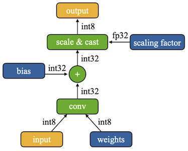 |

이는 추가로 미세조정이 필요한 시나리오에서 학습을 어렵게 만드는 문제로 이어진다. (대신, 메모리 면에서는 유리)

- INT8 SGD 학습 시, 10.6% 정확도 저하 (10개 데이터 평균)

- **weight scale**, **gradient scale** 간의 불균형 발생

| SGD Training Accuracy | Scale Comparison |
| :---: | :---: |
| 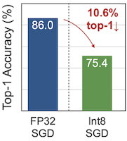 | 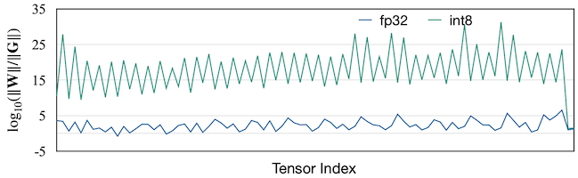 |

> 초록색: INT8, 파란색: FP32

특히 오른쪽 그래프의 비율을 해석하면, INT8에서 **grad scale이 weight scale에 비해 훨씬 작은 상황**임을 알 수 있다.

---

### 15.5.1 Quantization-Aware Scaling

이러한 scale 차이가 발생하는 원인을, 양자화 수식을 통해 분석해 보자.

$$ W = s_W \cdot (W/s_W) \overset{quantize}{\approx} s_W \cdot \hat{W}$$

$$\quad G_{\hat{W}} \approx s_W \cdot G_W $$

> 가중치는 FP에서 0에 가까운 작은 값이지만, 양자화(INT8) 이후 -128~128 값을 갖는다.

양자화 후 비율을 다시 계산하면, $S_W^{-2}$ 가 곱해진 형태가 된다. (참고: $S_W^{-2}$ 는 1보다 크다.) 이것이 scale 불균형의 원인이다.

$$ || \hat{W} || / || G_{\hat{W}} || \approx ||W / s_W || / || s_W \cdot G_W || = s_W^{-2} \cdot ||W||/||G|| $$

따라서, 기울기에 $S_W^{-2}$ 만큼을 다시 곱해 rescale한다.

$$ \tilde{G}_{\hat{W}} = G_{\hat{W}} \cdot s_W^{-2} , \quad \tilde{G}_{\hat{b}} = s_W^{-2} \cdot s_W^{-2} \cdot s_x^{-2} = G_{\hat{b}} \cdot s^{-2} $$

| SGD Training Accuracy | Scale Comparison |
| :---: | :---: |
| 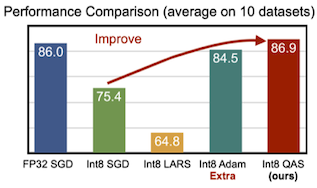 |  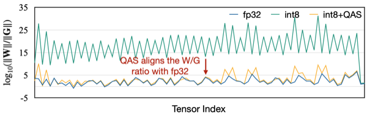 |

---