# Lecture 16 - On-Device Training and Transfer Learning

> [Lecture 16 - On-Device Training and Transfer Learning (Part II) | MIT 6.S965](https://youtu.be/h_55fEBf6Fs)

> [EfficientML.ai Lecture 21 - On-device Training (Zoom Recording) (MIT 6.5940, Fall 2024)](https://youtu.be/34XrZeRk_FU)

On-Device Training Under 256KB Memory 연구에서는 다양한 최적화 기법으로, MCU 학습의 역전파 메모리 사용량을 256KB 미만으로 최적화하였다.

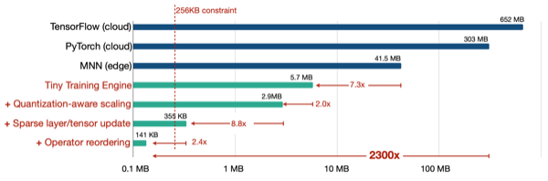

---

## 16.1 Tiny Training Engine (TTE)

> [On-Device Training Under 256KB Memory 논문(2022)](https://arxiv.org/abs/2206.15472)

> [PockEngine: Sparse and Efficient Fine-tuning in a Pocket 논문(2023)](https://arxiv.org/abs/2310.17752)

다음은 edge device에서 신경망 모델을 추론하기까지의 절차를 보여주는 흐름도다.

- 프레임워크 레벨

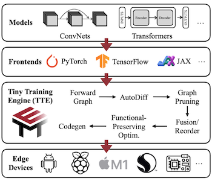

- TTE 프로세스

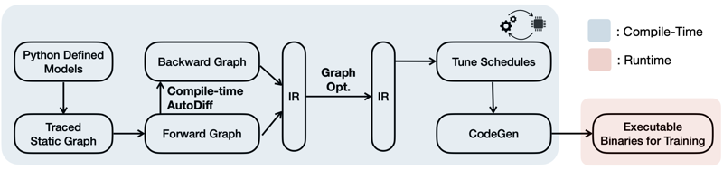

---

### 16.1.1 Compile-Time Autodiff

> 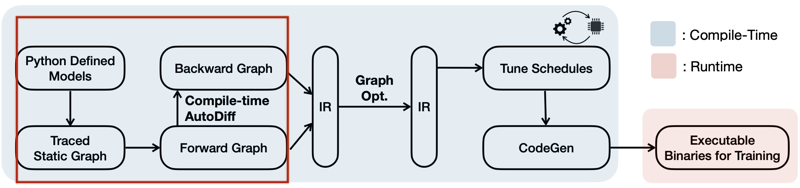

신경망 계산 과정의 추상화(**Intermediate Representation**, 중간 표현)는, 주로 **computational graph**(DAG)로 나타낸다.

> PyTorch, TensorFlow 등 어떤 frontend 프레임워크를 사용하든, 계산 그래프는 동일하다.

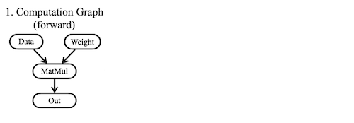

다음은 역전파 그래프 생성에서 TTE의 접근 방식을 보여준다.

- 여러 학습 프레임워크: **runtime** 생성(flexibility)

- TTE: **compile-time** 생성(runtime overhead 최소화)

| Conventional Framework | TTE |
| :---: | :---: |
| 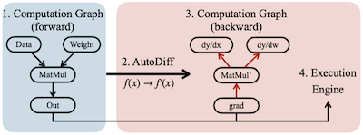 | 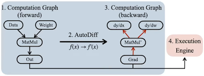 |

다음은 PyTorch Conv2d-ReLU 신경망을, 계산 그래프 방식의 IR로 나타낸 코드 예시다.

<table>
<tr>
<td>

**PyTorch**

</td>
<td>

```python
net = nn.Sequential(
    nn.Conv2d(3, 3, kernel=3, padding=1),
    nn.ReLU()
)

data = torch.randn(1, 3, 28, 28)
out = net(data)
```

</td>
</tr>
<tr>
<td>

**Forward IR**

</td>
<td>

```python
fn (%input0: Tensor[(1, 3, 28, 28), float32],
%v0.weight: Tensor[(3, 3, 3, 3), float32]) {
    %0 = nn.conv2d(%input0, %v0.weight, padding=[1, 1,
     1, 1], channels=3, kernel_size=[3, 3]);
    nn.relu(%0)
}
```

</td>
</tr>
<tr>
<td>

**Backward IR**

</td>
<td>

```python
fn (%input0: Tensor[(1, 3, 28, 28), float32], %v0.weight: Tensor[(3, 
3, 3, 3), float32], %grad_output: Tensor[(1, 3, 28, 28), float32]) {
    # forward
    %0 = nn.conv2d(%input0, %v0.weight, padding=[1, 1, 1, 1],
    channels=3, kernel_size=[3, 3]);
    %1 = nn.relu(%0);
    # grad_input
    %2 = padding(%grad_output);
    %3 = nn.conv2d_transpose(%grad_output, %v0.weight, %2, padding=[1, 
    1, 1, 1], channels=3, kernel_size=[3, 3]);
    # grad_weight
    %4 = reshape_padding(%grad_output);
    %5 = nn.conv2d(%input0, %grad_output, padding=[1, 1, 1, 1], 
    channels=3, kernel_size=[3, 3]);
    % grad_bias
    %6 = sum(%grad_output, axis=[-1, -2]); (%3, %5, %6)
}
```

</td>
</tr>
</table>

---

### 16.1.2 Graph-level Optimization

앞서 생성한 정적 그래프 IR을 대상으로, 이어서 다양한 그래프 최적화 기법을 적용한다.

- sparse layer / sparse tensor update

- operator reordering, in-place update

- constant folding

- dead-code elimination

> 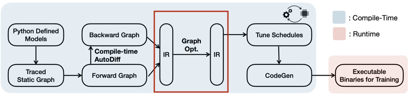

---

#### 16.1.2.1 Sparse Update

다음은 4가지 신경망 업데이트 방식을 나타낸 그림 및 예시 코드이다.


- bias-only: 가중치 업데이트(dy/dw) 계산 제거(%4, %5)

- sparse layer: 특정 레이어만 업데이트

- sparse tensor: 가중치의 일부만 업데이트 (예시: 20 차원 중 절반 10만 업데이트)

<table>
<tr>
<td>

**Full Update**

</td>
<td>

```python
fn (%x: Tensor[(10, 10), float32], 
    %weight: Tensor[(10, 10), float32], 
    %bias: Tensor[(10), float32], 
    %grad: Tensor[(10), float32]),
{
    # forward
    %0 = multiply(%x, %weight);
    %1 = add(%0, %bias);
    # backward
    %3 = multiply(%grad, %weight);    # dy / dx
    %4 = transpose(%grad);
    %5 = multiply(%4, %x);            # dy / dw
    %6 = sum(%grad, axis=-1);         # dy / db
    (%3, %5, %6)
}
```

</td>
</tr>
<tr>
<td>

**Bias-only Update**

</td>
<td>

```python
fn (%x: Tensor[(10, 10), float32, needs_grad=True], 
    %weight: Tensor[(10, 10), float32, needs_grad=False], 
    %bias: Tensor[(10), float32, needs_grad=True], 
    %grad: Tensor[(10), float32]),
{
    # forward
    %0 = multiply(%x, %weight);
    %1 = add(%0, %bias);
    # backward
    %3 = multiply(%grad, %weight);    # dy / dx
    # %4 = transpose(%grad);
    # %5 = multiply(%4, %x);          # dy / dw
    %6 = sum(%grad, axis=-1);         # dy / db
    (%3, %5, %6)
}
```

</td>
</tr>
<tr>
<td>

**Sparse Layer Update**

</td>
<td>

```python
fn (%x: Tensor[(10, 10), float32, needs_grad=False], 
    %weight1: needs_grad=False], 
    %bias1: needs_grad=False],
    %weight2: needs_grad=True], 
    %bias2: needs_grad=True],
    # ...
    %grad: .., float32]),
{
    # ...
}
```

</td>
</tr>
<tr>
<td>

**Sparse Tensor Update**

</td>
<td>

```python
fn (%x: Tensor[(10, 10), float32, needs_grad=True], 
    %weight: Tensor[(20, 10), float32, needs_grad=0.5], 
    %bias: Tensor[(20), float32, needs_grad=True], 
    %grad: Tensor[(10, 20), float32]),
{
    # forward
    %0 = multiply(%x, %weight);
    %0.1 = slice(%x, begin=[0, 0], ends=[10, 10]);
    %1 = add(%0, %bias);
    # backward
    %3 = multiply(%grad, %weight);    # dy / dx
    %4 = transpose(%grad);
    %5 = multiply(%4, %0.1);            # dy / dw
    %6 = sum(%grad, axis=-1);         # dy / db
    (%3, %5, %6)
}
```

</td>
</tr>
</table>

이러한 sparse update 방식은 peak memory 사용량을 줄이는 데 효과적이다.

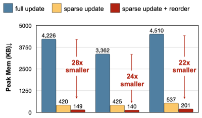

---

#### 16.1.2.2 Operation Reordering, In-place Update

일반적인 업데이트에서는 forward(F0, F1, F2, F3), backward(B3, B2, B1, B0), update(U0, U1, U2, U3)를 순차적으로 수행한다.

- update의 순서를 변경하면, 메모리 버퍼를 즉시 release할 수 있다. (우측 그림)

| Conventional | Reordered |
| :---: | :---: |
| 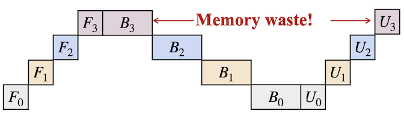 | 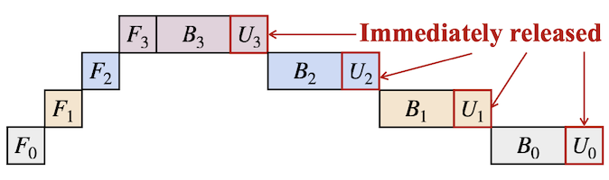 |

> 기존 방식: 업데이트 진행 전에, 모든 기울기를 계산하여 메모리 버퍼에 보관해야 한다.

실제 코드에서도, optimizer가 layer 단위로 기울기를 업데이트하도록 수정해야 한다. (오른쪽: 수정 코드)

<table>
<tr>
<td>

```python
out = model(data)
loss = criterion(out, label)
gradients = loss.backward()
optim.update(model, gradients)


```

</td>
<td>

```python
out = model(data)
loss = criterion(out, label)
for layers in model:
    dydx, grad = layers.backward(loss)
    optim.update(layers, grad)
    loss = dydx
```

</td>
</tr>
<tr>
<td>

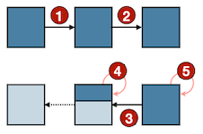

</td>
<td>

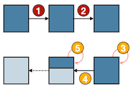

</td>
</tr>
</table>

reordering/in-place update만으로, peak memory 사용량을 약 3배 가까이 줄일 수 있다.

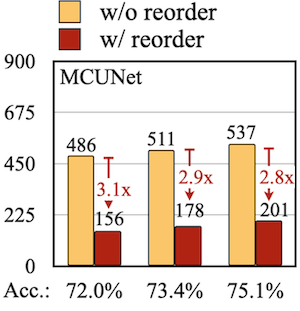

> **Notes**: life-cycle 분석 (왼쪽: Vanilla, 오른쪽: Optimized. 메모리 버퍼 수명을 알 수 있다.)
>
> - 최적화 후: 약 200 cycle에서 종료된다.
>
> 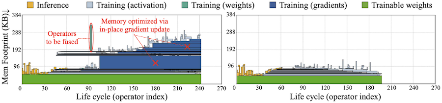

---

### 16.1.3 Tuning Schedules

> 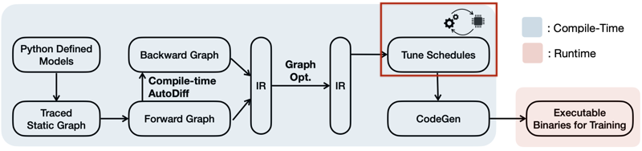

boxing size, loop order 등을 하드웨어 플랫폼에 맞게 조정한다.

- TFLite 기준, 21~23배 지연시간 가속 달성

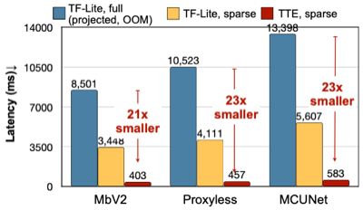

---

### 16.1.4 Code Generation

> 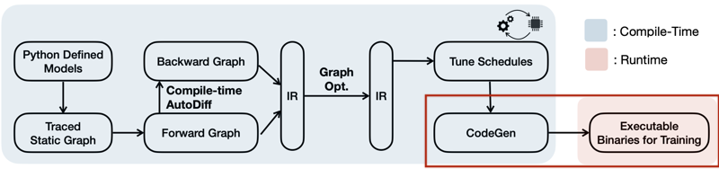

코드 바이너리가 차지하는 메모리 사용량을 최소화하기 위해, 그래프에서 사용하는 연산자만으로 코드를 생성한다.

---

### 16.1.5 Summary

다음은 IR 생성 과정에서, 기존 학습 프레임워크와 TTE의 프로세스를 비교한 그림이다.

| | |
| :---: | :---: |
| Conventional | 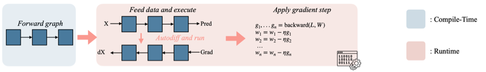 |
| TTE | 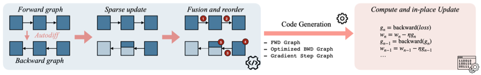 |

---