# Lecture 16 - On-Device Training and Transfer Learning (Part II)

> [Lecture 16 - On-Device Training and Transfer Learning (Part II) | MIT 6.S965](https://youtu.be/h_55fEBf6Fs)

> [EfficientML.ai Lecture 21 - On-device Training (Zoom Recording) (MIT 6.5940, Fall 2024)](https://youtu.be/34XrZeRk_FU)

---

## 16.2 Compilers, Languages and Optimizations for DL

---

### 16.2.1 Example: Tensor Programming

다음은 가우시안 블러 C++ 코드를 최적화한 예시다.


<table>
<tr>
<td>

**Clean C++** (**9.94 ms** per megapixel)

</td>
<td>

**Fast C++** (**0.90 ms** per megapixel)

</td>
</tr>
<tr>
<td>

```cpp
void blur(const Image &in , Image &blurred) {
    Image tmp(in.width(), in.height());

    for (int y = 0; y < in.height(); y++) 
        for (int x = 0; x < in.width(); x++) 
            tmp(x, y) = (in(x-1, y) + in(x, y) + in(x+1, y))/3;

    for (int y = 0; y < in.height(); y++) 
        for (int x = 0; x < in.width(); x++) 
            blurred(x, y) = (tmp(x, y-1) + tmp(x, y) + tmp(x, y+1))/3;
}


```

</td>
<td>

```cpp
void fast_blur(const Image &in , Image &blurred) {
    __m128i one_third = _mm_set1_epi16(21846);
    #pragma omp parallel for
    for (int yTile = 0; yTile < in.height(); yTile += 32){
        __m128i a, b, c, sum, avg;
        __m128i tmp[(256/8) * (32+2)];
        for (int xTile = 0; xTile < in.width(); xTile += 256) {
            __m128i *tmpPtr = tmp;
            for (int y = -1; y < 32+1; y++) {
                const uint16_t *inPtr = (const uint16_t*)&in(xTile, yTile + y);
                for (int x = 0; x < 32; x += 8) {
                    a = _mm_loadu_si128((__m128i*) (inPtr-1));
                    b = _mm_loadu_si128((__m128i*) (inPtr+1));
                    c = _mm_load_si128((__m128i*) (inPtr));
                    sum = _mm_add_epi16(_mm_add_epi32(a, b), c);
                    avg = _mm_mulhi_epi16(sum, one_third);
                    _mm_store_si128(tmpPtr++, avg);
                    inPtr += 8;
                }}
                tmpPtr = tmp;
                for (int y = 0; y < 32; y++) {
                    __m128i *outPtr = (__m128i *) (& (blurred(xTile, yTile+y)));
                    for (int x = 0; x < 256; x += 8) {
                        a = _mm_load_si128(tmpPtr+(2*256)/8);
                        b = _mm_load_si128(tmpPtr+256/8);
                        c = _mm_load_si128(tmpPtr++);
                        sum = _mm_add_epi16(_mm_add_epi16(a, b), c);
                        avg = _mm_mulhi_epi16(sum, one_third);
                        _mm_store_si128(outPtr++, avg);
}}}}}
```

</td>
</tr>
</table>

100배의 속도 향상(9.94ms $\rightarrow$ 0.90ms)을 얻었지만, 텐서 프로그래밍의 난이도가 높고 가독성이 떨어진다.

---

### 16.2.2 Halide: Decoupling Computation and Scheduling

> [Decoupling algorithms from schedules for easy optimization of image processing pipelines 논문(2012)](https://dl.acm.org/doi/10.1145/2185520.2185528)

**Halide**는 알고리즘과 스케줄링을 분리한 도메인 특화 언어(**Domain-Specific Language, DSL**)로, 이미지 처리(특히 block convolution) 최적화를 위해 제안되었다.

다음은 Halide로 local Laplacian 필터를 정의한 코드 예시다. 

- **Algorithm**: 수평, 수직 3x3 blur 필터 정의

- **Schedule**: 병렬 처리 정의

<table>
<tr>
<td>

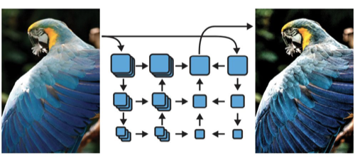

</td>
<td>

```cpp
Func halide_blur(Func in) {
    Func tmp, blurred;
    Var x, y, xi, yi;
    // Algorithm
    tmp(x, y) = (in(x-1, y) + in(x, y) + in(x+1, y))/3;
    blurred(x, y) = (tmp(x, y-1) + tmp(x, y) + tmp(x, y+1))/3;
    // Schedule
    blurred.tile(x, y, xi, yi 256, 32).vectorize(xi, 8).parallel(y);
    tmp.chunk(x).vectorize(x, 8);
    return blurred;
}
```

</td>
</tr>
</table>

> 코드 크기 비교: Adobe 필터 1500줄 vs. Halide 필터 60줄 (c.f., Halide가 기존 Adobe 필터 대비 2배 빠르다.)

---

### 16.2.3 TVM: Learning-based DL Compiler

> [TVM: An Automated End-to-End Optimizing Compiler for Deep Learning 논문(2018)](https://arxiv.org/abs/1802.04799)

> [CMSC 5743 Lecture Slide: TVM](https://www.cse.cuhk.edu.hk/~byu/CMSC5743/2021Fall/slides/Lec09-TVM.pdf)

**TVM**은 다양한 하드웨어 대상으로 딥러닝 application을 최적화하는 데 특화된 컴파일러다. (하드웨어별 최적화에 있어서, 엔지니어링 비용의 최소화)


다음은 MatMul 연산을 TVM의 **Tensor Expression** 언어로 나타낸 예시다.

> Halide의 연산/스케줄 분리 정책을 따른다.

```cpp
C = tvm.compute(
    (m, n),
    lambda y, x: tvm.sum(A[k, y] * B[k, x], axis=k)
)
```

Tensor IR은 최종적으로 하드웨어 명령어로 매핑된다.

<table>
<tr>
<td>

**Vanilla Code Generation**

</td>
<td>

```python
for y in range(1024):
    for x in range(1024):
        C[y][x] = 0
        for k in range(1024):
            C[y][x] += A[k][y] * B[k][x]
```

</td>
</tr>
<tr>
<td>

**Loop Tiling for Locality**

</td>
<td>

```python
for yo in range(128):
    for xo in range(128):
        C[yo*8:yo*8+8][xo*8:xo*8+8] = 0
        for ko in range(128):
            for yi in range(8):
                for xi in range(8):
                    for ki in range(8):
                        C[yo*8+yi][xo*8+xi] +=
                            A[ko*8+ki][yo*8+yi] * B[ko*8+ki][xo*8+xi]
```

</td>
</tr>
<tr>
<td>

**Map to Hardware Instructions**

</td>
<td>

```python
inp_buffer AL[8][8], BL[8][8]
acc_buffer CL[8][8]
for yo in range(128):
    for xo in range(128):
        vdla.fill_zero(CL)
        for ko in range(128):
            vdla.dma_copy2d(AL, A[ko*8:ko*8+8][yo*8:yo*8+8])
            vdla.dma_copy2d(BL, B[ko*8:ko*8+8][xo*8:xo*8+8])
            vdla.fused_gemm8x8_add(CL, AL, BL)
        vdla.dma_copy2d(C[yo*8:yo*8+8,xo*8:xo*8+8], CL)
```

</td>
</tr>
</table>

---

#### 16.2.3.1 Example: Tensor Index Expression

- **Compute C = dot(A, B.T)**

```cpp
import tvm

m, n, h = tvm.var('m'), tvm.var('n'), tvm.var('h')
A = tvm.placeholder((m, h), name='A')     // Input
B = tvm.placeholder((n, h), name='B')

k = tvm.reduce_axis((0, h), name='k')
C = tvm.compute((m, n),                   // C shape
      lambda i, j: tvm.sum(A[i, k] * B[j, k], axis=k)) // Computation Rule
```

- **Convolution**

```cpp
out = tvm.compute((c, h, w),
 lambda i, x, y: tvm.sum(data[kc,x+kx,y+ky] * w[i,kx,ky], [kx,ky,kc])) 
```

- **ReLU**

```cpp
out = tvm.compute(shape, lambda *i: tvm.max(0, out(*i)))
```

---

#### 16.2.3.2 Example: Schedule Transformation

예를 들어, 다음과 같이 연산을 정의했다고 하자.

<table>
<tr>
<td>

```cpp
C = tvm.compute((n,), lambda i: A[i] + B[i])
s = tvm.create_schedule(C.op)

```

</td>
<td>

```python
for (int i = 0; i < n; ++i) {
 C[i] = A[i] + B[i];
}
```

</td>
</tr>
</table>

- **split**

<table>
<tr>
<td>

```cpp
C = tvm.compute((n,), lambda i: A[i] + B[i])
s = tvm.create_schedule(C.op)
xo, xi = s[C].split(s[C].axis[0], factor=32) 


```

</td>
<td>

```python
for (int xo = 0; xo < ceil(n / 32); ++xo) {
    for (int xi = 0; xi < 32; ++xi) {
        int i = xo * 32 + xi;
        if (i < n) {
            C[i] = A[i] + B[i];
        }
    }
}
```

</td>
</tr>
</table>

- **reorder**

<table>
<tr>
<td>

```cpp
C = tvm.compute((n,), lambda i: A[i] + B[i])
s = tvm.create_schedule(C.op)
xo, xi = s[C].split(s[C].axis[0], factor=32) 
s[C].reorder(xi, xo) 


```

</td>
<td>

```python
for (int xi = 0; xi < 32; ++xi) {
    for (int xo = 0; xo < ceil(n / 32); ++xo) {
        int i = xo * 32 + xi;
        if (i < n) {
            C[i] = A[i] + B[i];
        }
    }
}
```

</td>
</tr>
</table>

- **CUDA binding**

<table>
<tr>
<td>

```cpp
C = tvm.compute((n,), lambda i: A[i] + B[i])
s = tvm.create_schedule(C.op)
xo, xi = s[C].split(s[C].axis[0], factor=32) 
s[C].reorder(xi, xo) 
s[C].bind(xo, tvm.thread_axis(“blockIdx.x”))
s[C].bind(xi, tvm.thread_axis(“threadIdx.x”))
```

</td>
<td>

```python
int i = threadIdx.x * 32 + blockIdx.x;
if (i < n) {
    C[i] = A[i] + B[i];
}


```

</td>
</tr>
</table>

---

#### 16.2.3.3 Example: Tensor Instruction

```python
w, x = t.placeholder((8, 8)), t.placeholder((8, 8))
k = t.reduce_axis((0, 8))
y = t.compute((8, 8), lambda i, j:
               t.sum(w[i, k] * x[j, k], axis=k))    # 연산 정의

# hw intrinsic를 생성하기 위한 lowering rule
def gemm_intrin_lower(inputs, outputs):
    ww_ptr = inputs[0].access_ptr("r")   
    xx_ptr = inputs[1].access_ptr("r")
    zz_ptr = outputs[0].access_ptr("w")
    compute = t.hardware_intrin("gemm8x8", ww_ptr, xx_ptr, zz_ptr)
    reset = t.hardware_intrin("fill_zero", zz_ptr)
    update = t.hardware_intrin("fuse_gemm8x8_add", ww_ptr, xx_ptr, zz_ptr)
    return compute, reset, update

gemm8x8 = t.decl_tensor_intrin(y.op, gemm_intrin_lower)
```

> **Notes**: **Compute Primitives**
>
> | Scalar | Vector | Tensor |
> | :---: | :---: | :---: |
> | 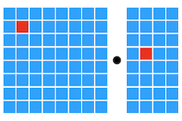 | 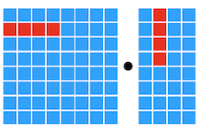 | 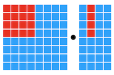 |

---

### 16.2.4 AutoTVM: Learning to Optimize Tensor Programs

> [Learning to Optimize Tensor Programs 논문(2018)](https://arxiv.org/abs/1805.08166)

그러나, 스케줄링 정책을 결정하려면 굉장히 큰 설계 공간을 탐색해야 한다. **AutoTVM**에서는 이러한 단점을 해결하기 위해, 설계 공간의 파라미터를 학습하여 최적화한다.

- e.g., 루프 타일링 크기 `(ty, tx)`

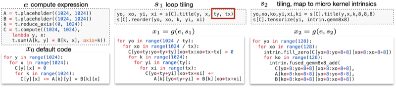

다음은 프레임워크의 세부 흐름도다. (**cost model**을 학습)

| | |
| :---: | :---: |
| 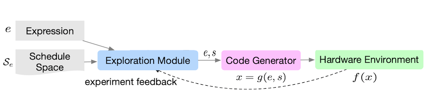 | 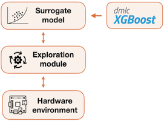 |


| No. | Description |
| :---: | --- |
| **(1)** | surrogate model(e.g., Gaussian Process)을 활용해 $x^{\ast}$ 스케줄 선택 |
| **(2)** | $f(x^{\ast})$  평가 |
| **(3)** | $(x^{\ast}, f(x^{\ast}))$ 를 데이터셋에 추가 |
| **(4)** | 모델을 데이터에 fit |
| **(5)** | 새로운 샘플 대상으로 (1)부터 반복 |

> **Notes**: ML 기반 예측 성능 비교
>
> 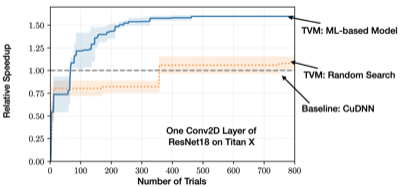

---

## 16.3 Graph-level Optimization

단일 연산자 내부의 병렬성에서 더 나아가, 그래프 레벨에서 device utilization을 향상시키는 프레임워크가 제안되었다.

---

### 16.3.1 MetaFlow: Optimizing DNN Computation

> [MetaFlow: Optimizing DNN Computation with Relaxed Graph Substitutions 논문(2019)](https://proceedings.mlsys.org/paper_files/paper/2019/hash/4dd1a7279a8cfeea2660fbc34f02a2bc-Abstract.html)

**MetaFlow**는 정확도를 유지하면서 연산량, 메모리 사용량 및 커널 호출 오버헤드를 줄일 수 있는 그래프를 탐색한다.

- Enlarge Kernel: 연산량 늘지만, 커널 호출 감소 (수학적으로는 동일)

- Fusion: 커널 호출 감소

| | |
| :---: | :---: |
| 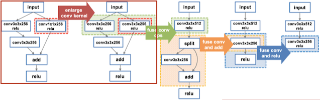 | 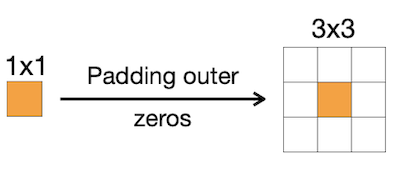 |
| 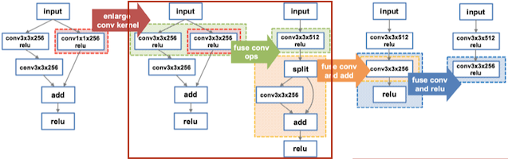 | 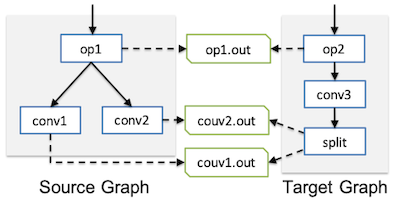 |
| 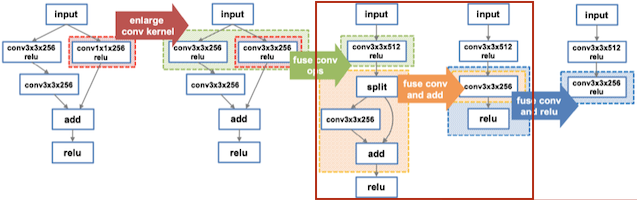 | 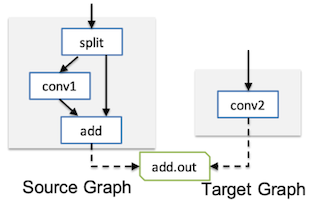 |

> 하드웨어별로 subgraph 지연시간 룩업 테이블을 기록하고, 탐색에서 활용한다.

다음은 다양한 하드웨어에 맞춰 최적화한 그래프 예시다.

| Original | V100 | K80 |
| :---: | :---: | :---: |
| 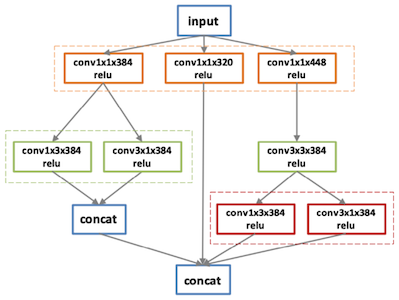 | 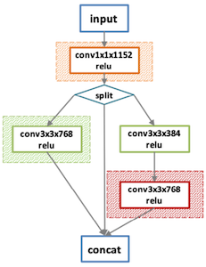 | 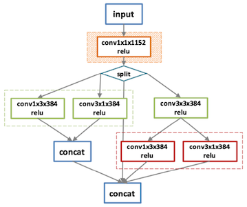 |

> 최종 그래프: V100 기준 30% 속도 향상

---

### 16.3.2 IOS: Inter-Operator Scheduler for CNN Acceleration

> [IOS: Inter-Operator Scheduler for CNN Acceleration 논문(2020)](https://arxiv.org/abs/2011.01302)

위 논문에서는 여러 연산자 간 병렬 스케줄을 탐색하는 **IOS** 프레임워크를 제안하였다. 다음은 연산 그래프를 최적화하는 예시다.

- **Merge**: conv `a`, `b` 병합

- **Parallel**: 연산을 두 그룹(`{c,d}`, `{e}`)으로 분할하여 병렬 실행

| Sequential | Parallel, Merged |
| :---: | :---: |
| 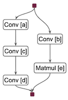 | 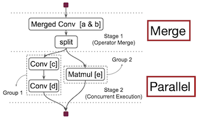 |
| `a`->`b`->`c`->`d`->`e` | `a & b`=>{`c`->`d`} & {`e`} |

> 서로 다른 그룹은 동시에 병렬로, 그룹 내부 연산은 순차적으로 실행된다.

하드웨어에 따른 최적 스케줄은, **Dynamic Programming**(DP) 기반으로 recursive하게 탐색한다.

- 알고리즘 시간 복잡도: $O((n/d+1)^{2d})$

- 연산자 집합 $S$ 의 지연시간 산출

  = 이전 단계 최적 지연시간 $Latency[S-S']$ + 현재 단계 지연시간 $StageLatency[S']$

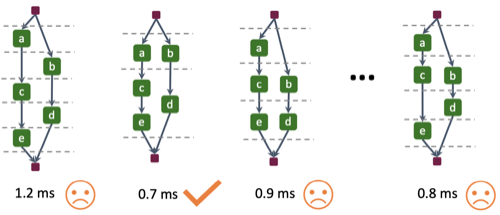

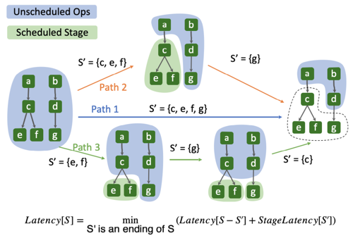

> 이때 지연시간은 실제 하드웨어에서 프로파일링한 값을 사용한다.

> **Notes**: Specialized Scheduling 지원
> 
> 다음은 Inception V3 모델의 마지막 블록을, 여러 배치 크기(1, 32, 128) 설정에서 최적화한 그래프이다.
>
> - bs = 32: 메모리 병목으로 인해 4 stage 구성
> 
> | Schedule<br>(1 vs. 32) | Latency(ms)<br>(1 vs. 32 vs. 128)  |
> | :---: | :---: |
> | 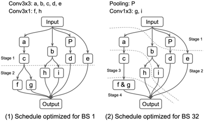 | 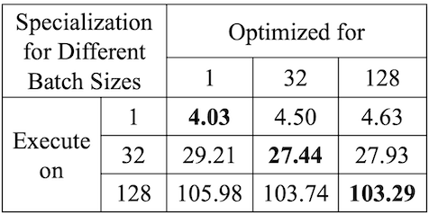 |

---