# 18 Efficient Point Cloud Recognition

> [Lecture 18 - Efficient Point Cloud Recognition | MIT 6.S965](https://www.youtube.com/watch?v=xtxRKbd_2W0)

> [EfficientML.ai Lecture 17 - GAN, Video, Point Cloud (Zoom Recording) (MIT 6.5940, Fall 2024)](https://www.youtube.com/watch?v=g24LzAIZbTA)

VR 헤드셋, 자율주행 자동차, 스마트폰, 드론 등 3D 센서는 다양한 도메인에서 널리 활용되고 있다. 

| Applications | LiDAR |
| :---: | :---: |
| 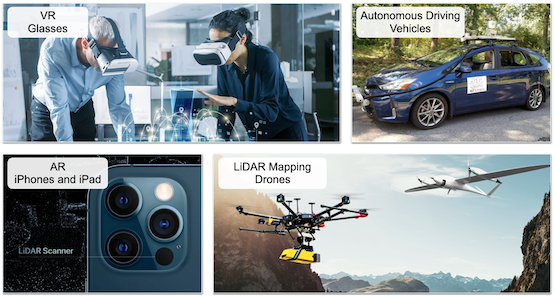 | 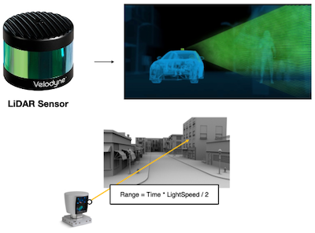 |

---

## 18.1 Data: 3D Point Clouds

**point cloud**는 3차원 좌표 정보를 갖는 벡터 $p=[x,y,z]$ 와, 해당 point의 feature인 $C$ 차원 특징 벡터 $f$ ( $f \in \mathbb{R^C}$ ) 가 결합된 집합이다.

$$P=\lbrace(p,f)\rbrace$$

> feature 예시: 신경망 모델(e.g., PointNet)에서 얻은 embedding

---

### 18.1.1 Applications

> [3D Semantic Parsing of Large-Scale Indoor Spaces 논문(2016)](https://ieeexplore.ieee.org/document/7780539)

> [RandLA-Net: Efficient Semantic Segmentation of Large-Scale Point Clouds 논문(2019)](https://arxiv.org/abs/1911.11236)

> [Vision meets robotics: The KITTI dataset 논문(2013)](https://www.cvlibs.net/datasets/kitti/)

- **Augmented Reality**(AR)

  

- **Autonomous Driving**

  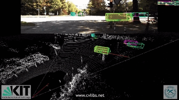

- **High-Energy Particle Physics**

  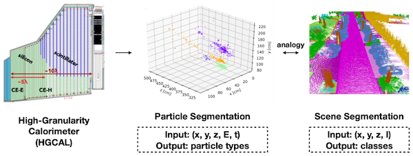

---

### 18.1.2 Challenges

> [SemanticKITTI: A Dataset for Semantic Scene Understanding of LiDAR Sequences 논문(2019)](https://arxiv.org/abs/1904.01416)

**point cloud** 데이터가 갖는 특성에 따라, image 데이터에 보편적으로 쓰이는 방법을 바로 적용하기 어렵다.

| Images | Point clouds |
| :---: | :---: |
|  | 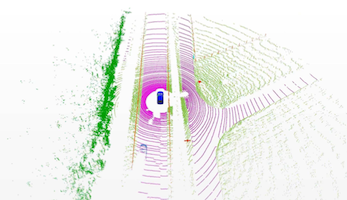 |
| Dense 규칙적인 메모리 접근 | Extremely Sparse(경우에 따라 \<0.1% 밀도) 불규칙한 메모리 저장 |
| 보편적인 CNN 모델 활용 가능 | 전용 연산 및 시스템 필요 |

또한, task 특성상 가용한 연산 자원이 한정될 수 있다.

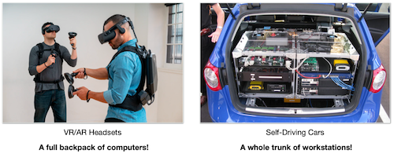

---

### 18.1.3 Representing 3D Data

3D 데이터를 표현하는 방법은 다양하게 존재한다.

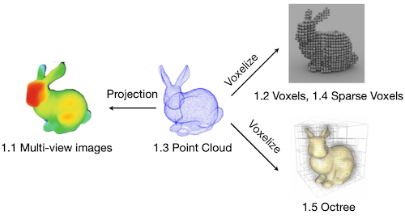

---

## 18.2 Multi-View Images

> [Volumetric and Multi-View CNNs for Object Classification on 3D Data 논문(2016)](https://arxiv.org/abs/1604.03265)

다양한 시점에서 point cloud를 rendering하여 multi-view 이미지를 생성할 수 있다.

- rendering한 각 이미지에 2D CNN을 적용한 뒤, 평균 혹은 최대 풀링으로 결과를 통합한다.

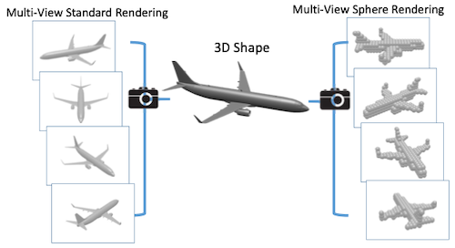

---

### 18.2.1 Range Images

> [SalsaNext: Fast, Uncertainty-aware Semantic Segmentation of LiDAR Point Clouds for Autonomous Driving 논문(2020)](https://arxiv.org/abs/2003.03653)

> [RangeNet++: Fast and Accurate LiDAR Semantic Segmentation 논문(2019)](https://ieeexplore.ieee.org/document/8967762)

**RangeNet**++에서는 LiDAR 센서에서 획득한 360도( $2\pi$ ) 포인트 클라우드에, spherical projection를 수행하여 2D 이미지로 변환하여 처리하는 방법을 제안하였다.

| Point Cloud | Spherical Projection |
| :---: | :---: |
| 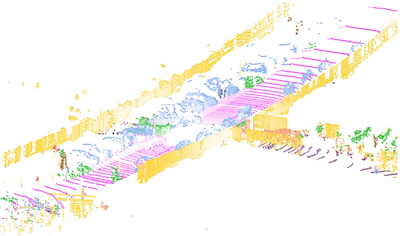 | 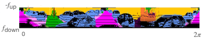 |

> $f_{down}, f_{up}$ : LiDAR 센서 수직 시야각(field of view)의 upper/lower bound

이후 투영 이미지를 대상으로 U-net 기반 image segmentation을 적용한다.

- 장점: 기존 2D CNN 활용 가능

- 한계: 투영 과정에서 기하학적 왜곡 발생

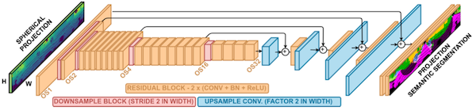

---

### 18.2.2 Bird's Eye View(BEV) Projection

> [PointPillars: Fast Encoders for Object Detection from Point Clouds 논문(2019)](https://arxiv.org/abs/1812.05784)

> [PolarNet: An Improved Grid Representation for Online LiDAR Point Clouds Semantic Segmentation 논문(2020)](https://arxiv.org/abs/2003.14032)

또 다른 대표적인 투영 방식인 **BEV**(Bird's Eye View, 조감도) **Projection**을 활용하는 연구도 존재한다.

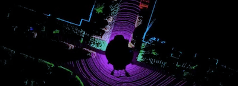

> LiDAR flatten: (z축) 차 위에 다른 차가 겹치지 않는다는 가정 하에 가능하다.

- **PointPillars**

  - point cloud를 BEV space로 flatten한 뒤, grid마다 PointNet 수행

  - 이후 2D CNN으로 object detection 수행

  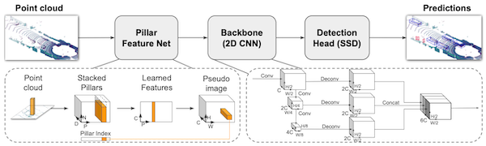

> $P$ : pillar 수(\~10000), $N$ : 각 pillar에 속한 point의 최대 수, $D/C$ : 입/출력 채널 수(10\~64)

- **PolarNet**

  - 보다 고해상도 표현을 위한 극좌표계 투영을 적용한다.

  - $\rho = \sqrt{x^2 + y^2}$ , $\theta = \arctan{\frac{y}{x}}$

  - ring-connected convolution을 적용한다.

  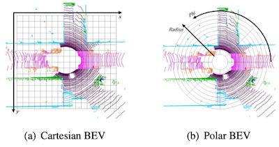

  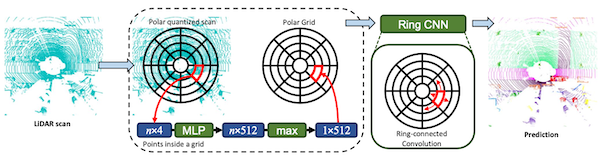

> 데카르트 좌표계(Cartesian coordinates)를 극좌표계(Polar coordinates)로 변환하면, 먼 거리에 더 많은 공간을 할당할 수 있다.

> 주의: ring convolution에서 $(r, 0), (r, 1.99\pi)$ 를 함께 convolve해야 한다.

---

## 18.3 Dense Voxels

> [Ivan Nikolov, How to Voxelize Meshes and Point Clouds in Python](https://towardsdatascience.com/how-to-voxelize-meshes-and-point-clouds-in-python-ca94d403f81d/)

다음은 **voxelization** 예시다.

| | |
| :---: | :---: |
| 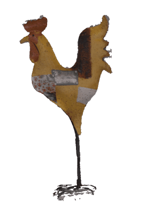 | 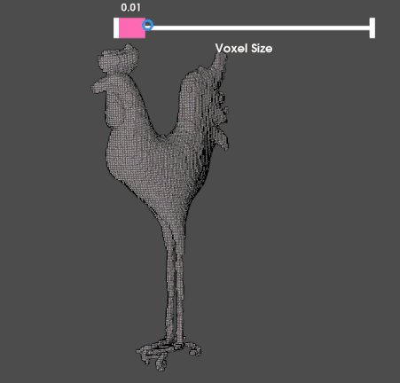 |

voxelization은 point $p=[x,y,z]$ 를 voxel size $r$ 에 따라 양자화화하는 과정이다.

$$ \hat{p} = \left[\lfloor \frac{x}{r} \rfloor, \lfloor \frac{y}{r} \rfloor, \lfloor \frac{z}{r} \rfloor\right] $$

> $\hat{p}$ 의 lower bound: $[0, 0, 0]$ 으로 가정한다.

텐서 기준으로는 크기 $H \times W \times D \times C$ 를 갖는 4D 텐서 $V$ 를 만든 뒤, 위치 $\hat{p_i}$ 에 feature $f_i$ 를 삽입한다. ( $[H, W, D]$ : $\hat{p}$ 의 upper bound )

---

### 18.3.1 3D CNN on Voxelized Point Cloud

> [VoxNet: A 3D Convolutional Neural Network for Real-Time Object Recognition 논문(2015)](https://ieeexplore.ieee.org/document/7353481)

> [Volumetric and Multi-View CNNs for Object Classification on 3D Data 논문(2016)](https://arxiv.org/abs/1604.03265)

딥러닝 기반으로 voxel grid를 처리한 대표적인 초기 연구를 살펴보자.

- **VoxNet**: 2D CNN을 3D로 확장

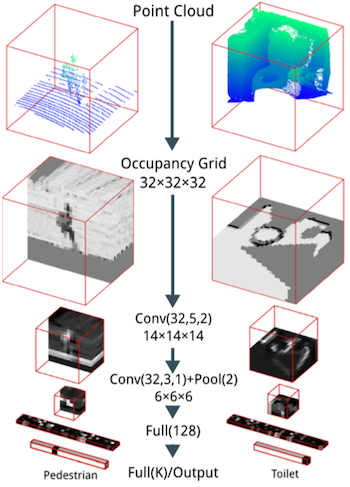

- **Volumetric CNN**

  - **Subvolume supervision**: 과적합 문제를 해결하기 위해, 일부의 voxel feature map만으로 예측

  - **Orientation pooling**: CNN은 rotationally-invariant하지 않으므로, 다양한 각도의 voxel을 계산 후 pooling으로 통합

| Subvolume Supervision | Orientation Pooling |
| :---: | :---: |
| 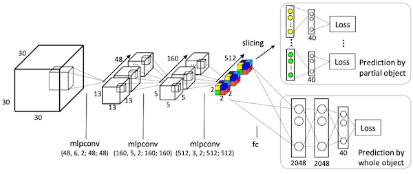 | 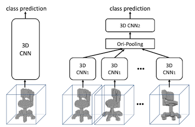 |

---

## 18.4 Point Set

---

### 18.4.1 PointNet

> [PointNet: Deep Learning on Point Sets for 3D Classification and Segmentation 논문(2016)](https://arxiv.org/abs/1612.00593)

**PointNet**은 딥러닝 기반으로 point cloud를 직접 처리한 대표적인 연구이다.

- MLP 레이어 및 symmetric 연산(e.g., max pooling)으로 구성 

  > **Permutation-invariant** (입력 벡터의 element 순서와 무관하게 동일 출력 생성)

- T-Net: 입력을 canonical space로 선형 변환하기 위한 소형 모델

  > **Rigid motion invariant** (translation, rotation, reflection 등 변환에 불변)

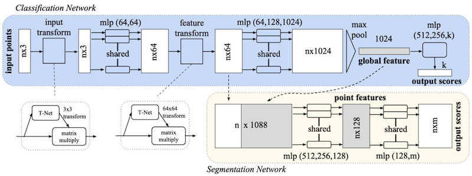

---

### 18.4.2 PointNet++

> [PointNet++: Deep Hierarchical Feature Learning on Point Sets in a Metric Space 논문(2017)](https://arxiv.org/abs/1706.02413)

후속 연구에서는 neighbor 정보를 보다 잘 모델링한 **PointNet**++를 제안하였다.

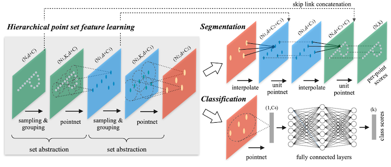

> kNN: k-Nearest Neighbors

(생략)

---

### 18.4.3 DGCNN

> [Dynamic Graph CNN for Learning on Point Clouds 논문(2018)](https://arxiv.org/abs/1801.07829)

**DGCNN**은 (PointNet++와 달리) Euclidean space에서 neighborhood를 정의하였다.

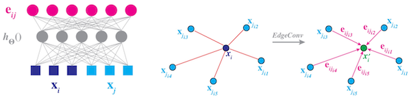

(생략)

---

### 18.4.4 PointCNN

> [PointCNN: Convolution On $\mathcal{X}$ -Transformed Points 논문(2018)](https://arxiv.org/abs/1801.07791)

**PointCNN**에서는 permutation matrix $\mathcal{X}$ 를 학습하였다.

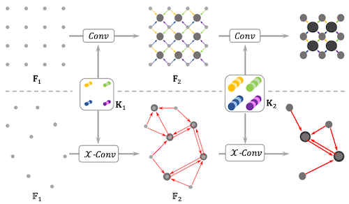

(생략)

---

### 18.4.5 PointConv

> [PointConv: Deep Convolutional Networks on 3D Point Clouds 논문(2018)](https://arxiv.org/abs/1811.07246)

**PointConv**는 feature 사이의 차이 및 point cloud 밀도를 고려하는 dynamic weights를 학습하였다.

| | |
| :---: | :---: |
| 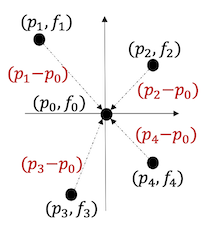 | 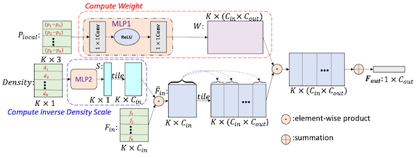 |

(생략)

---

### 18.4.6 KPConv

> [KPConv: Flexible and Deformable Convolution for Point Clouds 논문(2019)](https://arxiv.org/abs/1904.08889)

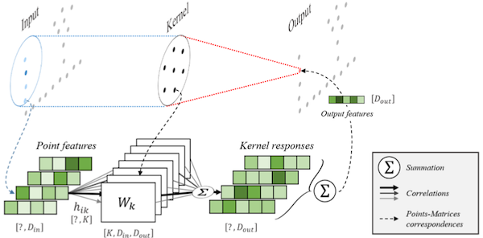

(생략)

---

### 18.4.7 Rand-LA Net

> [RandLA-Net: Efficient Semantic Segmentation of Large-Scale Point Clouds 논문(2019)](https://arxiv.org/abs/1911.11236)

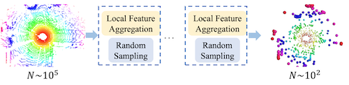

(생략)

---

## 18.5 Sparse Voxels

> [Submanifold Sparse Convolutional Neural Networks 논문(2017)](https://arxiv.org/abs/1706.01307)

> [4D Spatio-Temporal ConvNets: Minkowski Convolutional Neural Networks 논문(2019)](https://arxiv.org/abs/1904.08755)

---

## 18.6 Octree

> [Wikipedia: Octree](https://en.wikipedia.org/wiki/Octree)

> [OctNet: Learning Deep 3D Representations at High Resolutions 논문(2016)](https://arxiv.org/abs/1611.05009)

Octree는 3D 정육면체 공간을 8개 노드로 재귀적으로 분할하는 data structure이다.

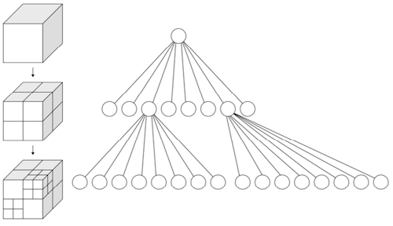

- **OctNet**

  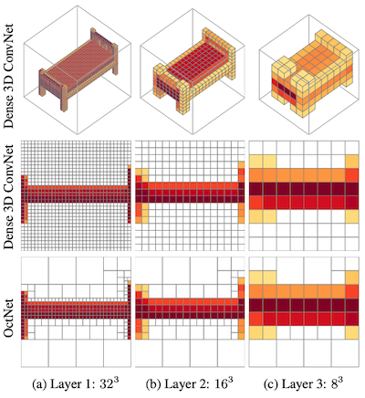

(생략)

---

## 18.7 Hybrid

> [Point-Voxel CNN for Efficient 3D Deep Learning 논문(2019)](https://arxiv.org/abs/1907.03739)

다음 도표는 point, voxel 연산에서 생기는 bottleneck을 보여준다.

- voxel: 복셀 해상도에 따른 계산 비용 및 메모리 사용량 증가폭이 크다. (왼쪽 도표)

  > 8GB GPU 메모리 예산 기준, 40% 이상의 정보 손실이 발생한다.

- point cloud: 불규칙한 메모리 접근으로 인한 지연시간 낭비가 발생한다. (오른쪽 도표)

| 해상도(x) 구분 가능한 점&GPU 메모리(y) | Computational Overheads, Effective Comp. |
| :---: | :---: |
| 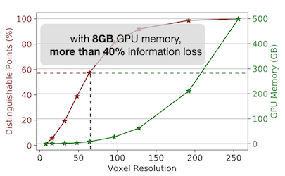 | 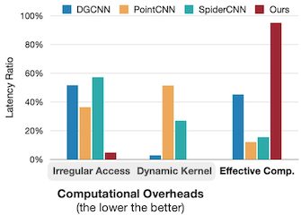 |

> **Notes**: 메모리 연산 비용
>
> - Off-chip DRAM 접근은 훨씬 비용이 드는 연산이다.
>
> - random 메모리 접근은 bank conflict가 발생할 수 있어 비효율적이다.
>
> | SRAM/DRAM Access | Memory Access Patterns |
> | :---: | :---: |
> | 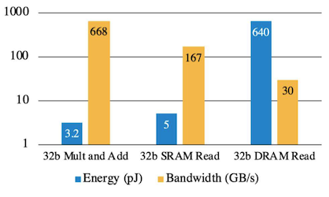 | 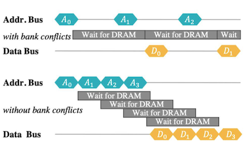 |

---

### 18.7.1 Point-Voxel CNN (PVCNN)

> [Point-Voxel CNN for Efficient 3D Deep Learning 논문(2019)](https://arxiv.org/abs/1907.03739)

위 논문에서는 point, voxel branch를 나누는 설계로 효율성을 개선하였다.

- **voxel-based branch**: 복셀 단위 convolution으로, 메모리 locality 향상

- **point-based branch**: 고해상도 3D 데이터를 메모리 효율적인 point 형태로 표현

  (voxelization에 의한 정보 손실을 point-based branch로 보완)

> 아래: point branch, 위: voxel branch (e.g., 파란색 점: 파란색 복셀에 포함 - dense한 특성을 가진다)

> **Notes**: Voxelization에 따른 정보 손실 예시
>
> | Input Scene | Voxelized Scene |
> | :---: | :---: |
> | 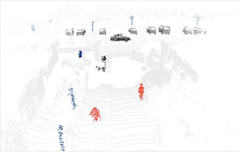 | 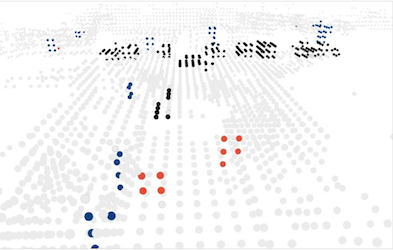 |

---

### 18.7.2 Sparse Point-Voxel Convolution (SPVConv)

> [Searching Efficient 3D Architectures with Sparse Point-Voxel Convolution 논문(2020)](https://arxiv.org/abs/2007.16100)

후속 연구에서는 sparse convolution을 도입하여 voxel branch의 해상도를 향상시켰다.

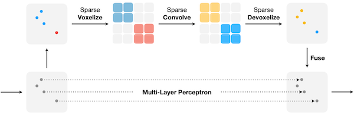

3D-NAS 알고리즘을 통해 최적 구조를 탐색한다.

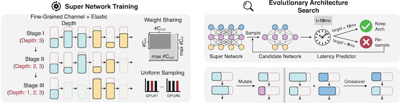

---

### 18.7.3 Range-Point-Voxel Convolution (RPVConv)

> [RPVNet: A Deep and Efficient Range-Point-Voxel Fusion Network for LiDAR Point Cloud Segmentation 논문(2021)](https://arxiv.org/abs/2103.12978)

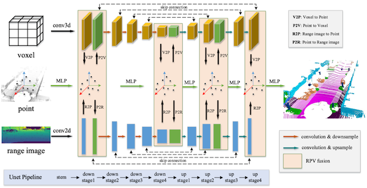

(생략)

---

### 18.7.4 BEVFusion: Multi-task, Multi-sensor Fusion

> [BEVFusion: Multi-Task Multi-Sensor Fusion with Unified Bird's-Eye View Representation 논문(2022)](https://arxiv.org/abs/2205.13542)

다음은 자율주행 자동차에서 얻은 센서 데이터(multi-view camera, LiDAR 등) 예시다.

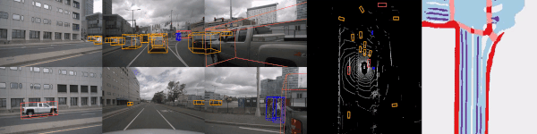

**BEVFusion**은 카메라 데이터(dense image)를 BEV로 변환한 뒤, LiDAR 데이터(sparse point cloud)를 통합하여 3D 정보를 생성한다.

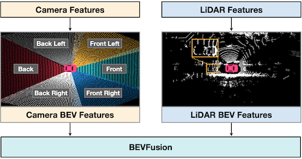

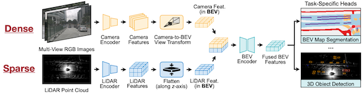

---