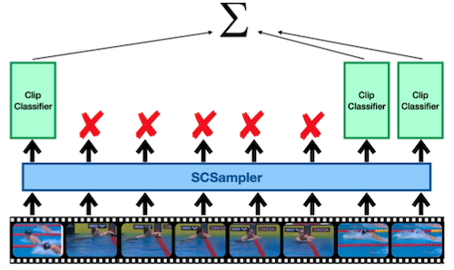

# 19 Efficient Video Understanding and Generative Models

> [Lecture 19 - Efficient Video Understanding and Generative Models | MIT 6.S965](https://youtu.be/0WZSzStMgLk?si=Kez32e0mNPgiZhjn)

> [EfficientML.ai Lecture 15 - GAN, Video, and Point Cloud (MIT 6.5940, Fall 2023, Zoom)](https://youtu.be/WU7tpyesm68?si=iRrWKkupS0KMkgUp)

> [EfficientML.ai Lecture 17 - GAN, Video, Point Cloud (Zoom Recording) (MIT 6.5940, Fall 2024)](https://www.youtube.com/watch?v=g24LzAIZbTA)

Video understanding은 다양한 도메인에서 활용될 수 있다. 

- action/gesture recognition, scene understanding, video search for ads, video prediction for autonomous driving, ...

이때, 동영상은 이미지와 달리 **temporal dimension**(시간 차원)을 고려해야 한다.


---

## 19.1 2D CNNs for Video Understanding

> [Temporal Segment Networks: Towards Good Practices for Deep Action Recognition 논문(2016)](https://arxiv.org/abs/1608.00859)

> [Two-Stream Convolutional Networks for Action Recognition in Videos 논문(2014)](https://arxiv.org/abs/1406.2199)

> [Long-term Recurrent Convolutional Networks for Visual Recognition and Description 논문(2014)](https://arxiv.org/abs/1411.4389)

연구 초기 2D CNN을 활용하여, 각 동영상 프레임을 샘플링한 뒤 이미지처럼 처리하는 방법이 제안되었다.

- **TSN**(Temporal Segment Networks)
  
  - $\mathrm{TSN}(T_1, T_2, \cdots, T_K)$ : 비디오에서 $K$ 개 프레임 샘플링 후, 각자 class score 계산 (Aggregation: average, max 등)

  - 단점: 낮은 정확도

  

- **Two-stream ConvNet**

  - Spatial stream(물체 인식) + Temporal stream(**optical flow** 인식)

  - 단점: optical flow 연산 속도 (모델 추론보다도 긴 지연시간 소요)

  

- **LRCNs** (Long-term Recurrent Convolutional Networks)
  
  - 2D CNN + Post-fusion(e.g., LSTM)

  - 단점: low-level temporal relationship을 제대로 모델링하지 못한다.

  > low-level 특징은 CNN에서 추출되며, LSTM은 high-level 특징을 모델링한다.

  | Action Recognition | Image Captioning | Video Description |
  | :---: | :---: | :---: |
  |  |  |  |

---

## 19.2 3D CNNs for Video Understanding

> [Learning Spatiotemporal Features with 3D Convolutional Networks 논문(2014)](https://arxiv.org/abs/1412.0767)

> [Quo Vadis, Action Recognition? A New Model and the Kinetics Dataset 논문(2017)](https://arxiv.org/abs/1705.07750)

다음은 (spatial dimension뿐만 아니라) temporal dimension를 함께 연산하는 **C3D**(Convolutional 3D)이다. (spatiotemporal information)

| 2D conv on multiple frames | 3D conv |
| :---: | :---: |
|  |  |

> $L$ : 프레임 수, $d$ : kernel temporal depth

그러나, 3D CNN은 보다 많은 파라미터를 갖는다.(연산 비용도 증가) **I3D**에서는 3D CNN을, 기존 2D CNN 가중치를 활용하여 초기화하는 방법을 제안했다. (e.g., ImageNet 사전학습 2D CNN)

- 초기화 시, temporal dimension에 가중치 복제

| Inflated Inception-V1 | Inception Module |
| :---: | :---: |
|  |  |

---

## 19.3 Temporal Shift Module (TSM)

> [TSM: Temporal Shift Module for Efficient Video Understanding 논문(2018)](https://arxiv.org/abs/1811.08383): I3D family에 비해 6x 적은 연산량

위 논문에서는 3D conv의 성능은 유지하되 연산 비용을 줄일 수 있는, **TSM**(Temporal Shift Module)을 제안하였다. 

여러 frame 사이 정보를 교환하기 위해, temporal dimension $T$ 차원에서 shift를 수행한다.

- **Bi-directional**: 인접 시간의 frame끼리 정보 교환

- **Uni-directional**: 과거에서 미래로 정보 교환

> 실시간 스트리밍 task: 미래 시점의 frame을 가져올 수 없으므로 한 가지 방식으로만 shift

| Original tensor<br>w/o shift | Offline temporal shift<br>(bi-direction) | Online temporal shift<br>(uni-direction) |
| :---: | :---: | :---: |
|  |  |  | 

> 공간 차원(H, W)을 하나로 합쳐서, T / H,W / C 3차원으로 표현

> spatial information을 유지하기 위해 1개 채널만 shift한다. (spatial, temporal information 간의 trade-off) 

이처럼 shift 연산을 추가하는 것만으로, 보다 효율적으로 temporal modeling이 가능하다.

---

### 19.3.1 Inserting TSM into 2D CNNs

여러 프레임을 대상으로 2D Conv를 적용하면 Timestamp가 생기며, 해당 $T$ 차원에서 shift를 수행하는 방식으로 적용할 수 있다.

- **Offline** TSM models (단일 배치 단위 수행)

  bypass를 추가하여 information loss를 보전한다.

  

- **Online** TSM models (Frame-by-frame 수행)

  미래인 $F_{t+1}$ 에 접근할 수 없으므로, 메모리에 캐싱한 과거 frame 정보를 사용한다.

  

다음은 TSM을 구현한 코드 예시다.

```python
# shape of x: [N, T, C, H, W]
out = torch.zeros_like(x)
fold = c // fold_div
out[:, :-1, :fold] = x[:, 1:, :fold]    # shift left
out[:, 1:, fold: 2 * fold] = x[:, :-1, fold: 2 * fold]   # shift right
out[:, :, 2 * fold:] = x[:, :, 2 * fold:]   # not shift
return out
```

---

## 19.4 Other Efficient Methods for Video Understanding

이외에도 video understanding을 위한 효율적인 방법이 다방면에서 연구되고 있다.

---

### 19.4.1 Kernel Decomposition

> [A Closer Look at Spatiotemporal Convolutions for Action Recognition 논문(2017)](https://arxiv.org/abs/1711.11248)

Conv3D를 2D spatial + 1D temporal kernel로 행렬을 분해할 수 있다. (보다 모델 크기가 가벼워지며 학습에 유리하다.)


---

### 19.4.2 Multi-Scale Modeling

> [SlowFast Networks for Video Recognition 논문(2018)](https://arxiv.org/abs/1812.03982)

위 논문에서는 효율적인 video recognition을 위한 두 가지 분기(slow, fast) 설계를 제안하였다.


- **Slow pathway**(연산의 80%)

  낮은 프레임 속도에서 공간 정보에 집중 (large spatial, small temporal)

- **Fast pathway**(연산의 20%)

  높은 프레임 속도에서 빠르게 변하는 motion에 집중 (small spatial, large temporal)

> Fast pathway: $\alpha T$ 프레임 샘플링 ( 논문 $\alpha=8$ ), Slow pathway: Fast 대비 $\beta$ 비율 채널 샘플링 ( $\beta=1/8$ )

---

### 19.4.3 Neural Architecture Search for Video Understanding

> [X3D: Expanding Architectures for Efficient Video Recognition 논문(2020)](https://arxiv.org/abs/2004.04730)

**X3D** 논문은 탐색 공간으로 temporal duration, frame rate, spatial resoultion을 포함하는 NAS를 제안하였다.


- temporal duration ${\gamma}_{t}$

- frame rate ${\gamma}_{\tau}$

- spatial resoultion ${\gamma}_{s}$

- width ${\gamma}_w$ 

- bottleneck width ${\gamma}_b$ 

- depth ${\gamma}_{d}$

---

### 19.4.4 Skipping Redundant Frames/Clips

> [SCSampler: Sampling Salient Clips from Video for Efficient Action Recognition 논문(2019)](https://arxiv.org/abs/1904.04289)

긴 동영상에서 중요한 정보를 포함하는 일부 프레임만을 식별하면 연산을 크게 줄일 수 있다.

위 논문에서는 SCSampler(Salient Clip Sampler) 설계를 통해, non-salient 파트를 구분하고 제거함으로써 연산을 효과적으로 줄였다.

- 입력

  - 압축 비디오 데이터(I-frame, Motion Displacement, RGB-Residual) (ResNet-18 처리)
  
  - MEL-spectrogram 변환 오디오 데이터 (VGG 모델 처리)

- Top-K 선별: 비디오 Top-K' 프레임 + 비디오 Top-K'와 중복되지 않는 오디오 Top-K'' 프레임
 
| Dense prediction | SCSampler |
| :---: | :---: |
|  |  |

> saliency ranking: Action Classifier의 Top-K 프레임 분류 손실을 줄이도록 학습

---

### 19.4.5 Utilizing Spatial Redundancy

> [Recurrent Residual Module for Fast Inference in Videos 논문(2018)](https://arxiv.org/abs/1802.09723)

인접 frame( $x_t$ , $x_{t+1}$ )은 spatial information이 거의 동일한 경우가 많다. 따라서, 이러한 특성을 활용하여 중복 계산을 줄인 **RRM**(Recurrent Residual Module) 설계가 제안되었다.

**(1)** Convolution, Fully-Connected 연산의 선형성(linearity)을 활용하여, 프레임 사이 변화( $x_{t+1} - x_{t} = \Delta$ )만을 계산한다. 

- 현재 feature map은 스냅샷으로 저장, 이후 다음 프레임의 feature map과 연산

$$ y_{t+1} = F(x_{t+1}) = F(x_t + x_{t+1} - x_t) = F(x_t + \Delta) $$

$$ = F(x_t) + F(\Delta) = y_t + F(\Delta) $$

> $\Delta$ : 희소 행렬 특성을 가지므로, EIE 등 가속기를 사용해 효율적으로 연산 가능

**(2)** 해당 연산 결과를 이어지는 non-linearity(Pooling, ReLU 등) 레이어에 통과시킨다.

다음은 RRM을 적용한 연산 절차를 보여준다.


---