# 19 Efficient Video Understanding and Generative Models

> [Lecture 19 - Efficient Video Understanding and Generative Models | MIT 6.S965](https://youtu.be/0WZSzStMgLk?si=Kez32e0mNPgiZhjn)

> [EfficientML.ai Lecture 15 - GAN, Video, and Point Cloud (MIT 6.5940, Fall 2023, Zoom)](https://youtu.be/WU7tpyesm68?si=iRrWKkupS0KMkgUp)

> [EfficientML.ai Lecture 17 - GAN, Video, Point Cloud (Zoom Recording) (MIT 6.5940, Fall 2024)](https://www.youtube.com/watch?v=g24LzAIZbTA)

---

## 19.5 Generative Adversarial Networks (GANs)

> [Generative Adversarial Networks 논문(2014)](https://arxiv.org/abs/1406.2661)

> [Thalles' blog: A Short Introduction to Generative Adversarial Networks](https://sthalles.github.io/intro-to-gans/)

**Generative Adversarial Networks**(GANs)은 **Generator**(생성자)와 **Discriminator**(판별자) 두 가지 요소로 구성된다.

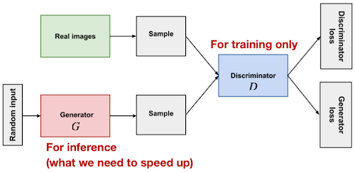

- **Discriminator** $D$ : fake image 판별

- **Generator** $G$ : Discriminator $D$ 에서 fake image를 최대한 판별하지 못하도록 샘플 생성

다음은 GAN의 목적 함수다.

$$ \underset{\mathrm{real \ sample} }{E_x[\log(D(x))]} + \underset{\mathrm{fake \ sample} }{E_z[\log(1-D(G(z)))]} $$

다음은 MNIST 학습에서 Generator가 생성한 샘플을 시각화한 그림이다. 무작위 초기화로 시작하여 digit을 생성하기까지 학습한다.

| Random initialization | Training |
| :---: | :---: |
| 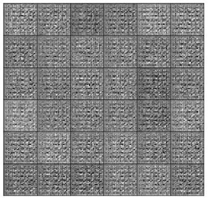 | 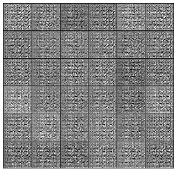 |

> GAN 성능 평가지표: IS(Inception Score) 혹은 FID(Frechat Inception Distance)을 주로 사용

---

### 19.5.1 Conditional vs Unconditional GANs

> [Polygon generation and video-to-video translation for time-series prediction 논문(2022)](https://www.researchgate.net/figure/A-simplified-schematic-of-a-unconditional-GAN-and-b-conditional-GAN-Both-unconditional_fig3_363818922)

> [Aditya Sharma: Conditional GAN (cGAN) in PyTorch and TensorFlow](https://learnopencv.com/conditional-gan-cgan-in-pytorch-and-tensorflow/)

**Unconditional GANs**은 random noise를 입력으로 이미지를 생성한다. 반면, **Conditional GANs**은 label을 추가로 전달받아 이미지를 생성한다.

> label: class label, segmentation map, strokes 등

| Type | Description | Example |
| :---: | :---: | :---: |
| **Unconditional GAN** | 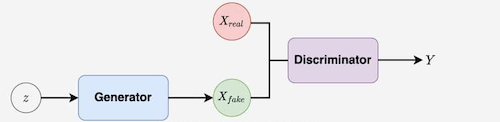 | 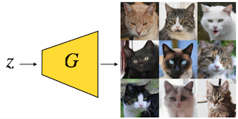 |
| **Conditional GAN** |  | 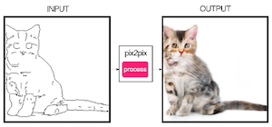 |

---

### 19.5.2 Difficulty: GANs are Computational-Intensive

하지만 GANs는 recognition 모델에 비해 연산에 더 많은 비용이 필요하다.

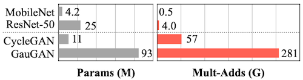

---

## 19.6 GAN Compression: Compressing Generators

> [GAN Compression: Efficient Architectures for Conditional GANs 논문(2020)](https://arxiv.org/abs/2003.08936)

**GAN Compression**은 NAS 및 지식 증류를 활용하여 cGAN Generator를 압축한 연구다.

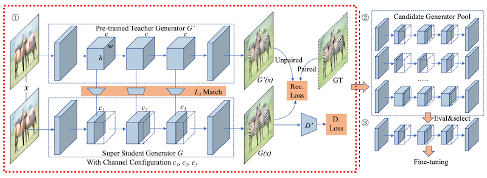

①: (NAS) Super Generator 학습

```math
\mathcal{L}(x) = \mathcal{L}_{cGAN}(x) + {\lambda}_{recon}\mathcal{L}_{recon}(x) + {\lambda}_{distill}\mathcal{L}_{distill}(x)
```

- **cGAN Loss**

$$ \mathcal{L}_{cGAN}(x) = \mathbb{E_{x, y}}[\log D(x, y)] + \mathbb{E_{x}}[\log(1-D(x, G(x)))] $$

- **Reconstruction Loss**
 
  이때 교사 모델의 출력을 함께 사용하면 성능에 도움이 된다. (unpaired to paired learning)

```math
\mathcal{L}_{recon} = \begin{cases} ||G(x)- y|| & \mathrm{paired} \ \mathrm{cGANs} \\ ||G(x) - G'(x) || & \mathrm{unpaired} \ \mathrm{cGANs} \end{cases}
```

- **Distillation Loss** (교사 모델: 사전학습 Generator)

  레이어마다 intermediate representation 증류 (이때 교사-학생 차원이 일치하도록 projection 포함)

```math
\mathcal{L}_{distill} = \sum^n_{k=1}{||G_k(x) - f_k({G'}_k(x))||}
```

②: Evolutionary Search(진화 탐색): 최적의 지연시간-정확도 trade-off 설정 탐색

③: fine-tuning

---

## 19.7 Anycost GANs: Dynamic Cost vs Quality

> [Anycost GANs for Interactive Image Synthesis and Editing 논문(2021)](https://arxiv.org/abs/2103.03243)

사용자에게 제공할 preview 생성 등의 목적으로, quality를 희생하더라도 지연시간을 최소화해야 하는 경우가 있다. (dynamic cost) 

**Anycost GANs** 논문에서는 이를 위한 동적 신경망(해상도 및 채널 수) 기반 GAN 모델을 제안하였다.

- **Dynamic Resolution**

  | StyleGAN2 | MSG-GAN | Anycost GANs |
  | :---: | :---: | :---: |
  | 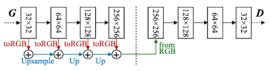 | 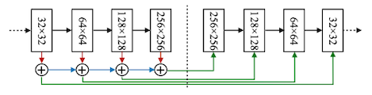 | 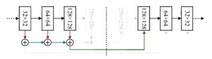 |
  | 최대 해상도 전달 (upsampling) | 모든 해상도 사용 | 학습 단계별로 다른 해상도를 샘플링하여, dynamic-res 지원 |

- **Dynamic Channels**

  - 적은 채널 수(x0.5)에서 성능 저하: 지식 증류(**distillation**)를 활용해 보완

  - 단일 Discriminator에 따른 성능 저하: Generator Architecture를 원-핫 인코딩하여 **conditioning**

  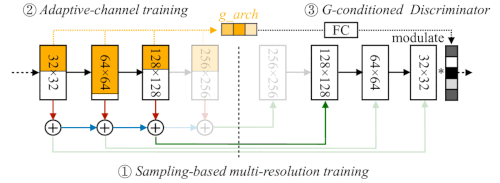

> 제약조건 내 최적 설정은 Evolutionary Search를 통해 탐색한다.

---

## 19.8 Data-Efficient GANs

> [Differentiable Augmentation for Data-Efficient GAN Training 논문(2020)](https://arxiv.org/abs/2006.10738)

적은 데이터로 GAN 모델을 학습할 경우, 주로 Discriminator에서 과적합이 발생하여 성능이 저하된다.

- 학습 데이터 10%만 사용(빨간색): Discriminator 검증 정확도 하락 (**overfitting**)

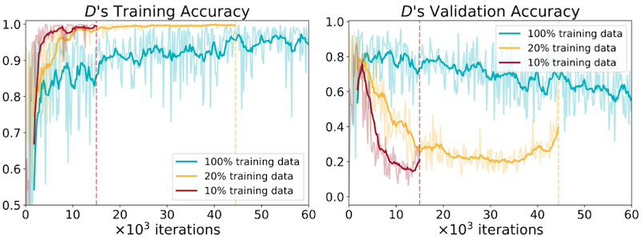

논문에서는 과적합을 완화할 효과적인 **data augmentation**으로 **Differentiable Augmentation**(DiffAugment)를 제안하였다.

- real $x$ , 가우시안 분포 기반 fake $G(z)$

- Discriminator, Generator 모두에게 reals, fakes 대상 augmentation $T$ 적용 (=역전파 가능)

| Update | Example |
| :---: | :---: |
| 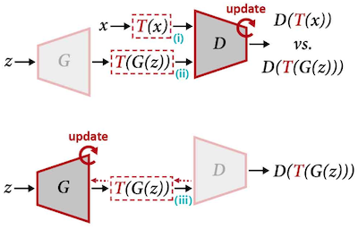 | 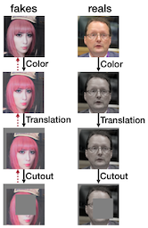 |

> **Notes**: 일반적인 데이터 증강 사용 시 문제
> 
> **(1)** Real Images만 증강: 생성된 결과 이미지에 동일한 artifacts가 반영되는 문제가 발생한다.
> 
> | Update | Example |
> | :---: | :---: |
> | 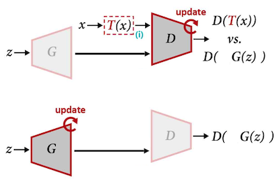 | 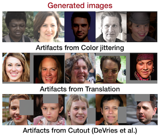 |
> 
> **(2)** Discriminator만 reals, fakes 증강: augmentation을 적용하지 않을 때 심한 성능 저하가 발생한다.
> 
> | Update | Example |
> | :---: | :---: |
> | 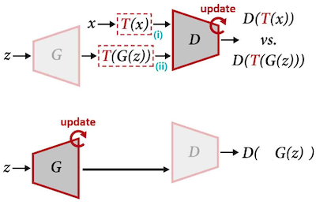 | 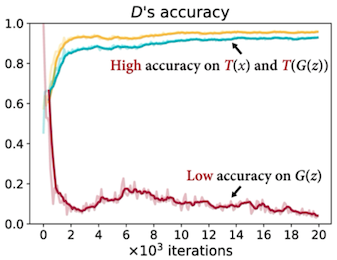 |

---