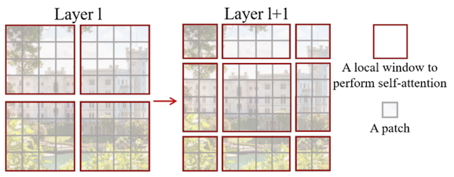
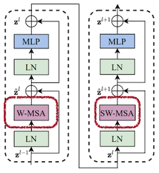
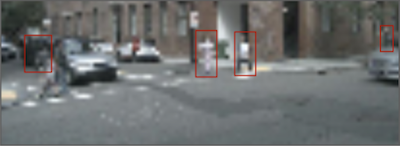
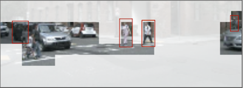
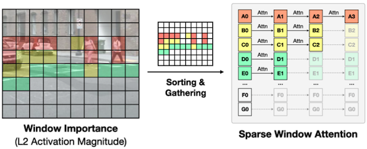

# 14 Vision Transformer

> [EfficientML.ai Lecture 14 - Vision Transformer (MIT 6.5940, Fall 2023, Zoom)](https://youtu.be/fcmOYHd57Dk)

---

## 14.1 Vision Transformer

> [An Image is Worth 16x16 Words: Transformers for Image Recognition at Scale 논문(2020)](https://arxiv.org/abs/2010.11929)

다음은 **Vision Transformer**(ViT)의 구조를 해부해 볼 것이다. 먼저 ViT는, NLP Transformer에서 마치 문장을 tokenize하여 사용하는 것처럼, 2D 이미지를 패치로 나눈 단위를 token으로 사용한다.

|| | |  |
| :---: | :---: | :---: | :---: |
||  | $\rightarrow$ |  |
|| Image size: 96x96 Patch size: 32x32 | | \#tokens: 3x3=9 Dim of each token: 3x32x32=3,072 |

이러한 토큰은 Linear Projection을 거쳐서 Encoder의 입력이 된다. 

- patch 단위의 linear projection은, 주로 convolution을 기반으로 구현한다.

  서로 다른 패치에 하나의 동일한 convolution을 적용한다. 
  
  > 현재 예시의 경우, "32x32 Conv, stride 32, padding 0, in_channel=3, output_channel = 768" conv 레이어를 사용한다.

|| | |
| :---: | :---: | :---: 
|| |  |
|| input dim = 3,072 output dim(hidden size of ViT) = 768 | \#Parameters: 3,072x768 = 2.36M |

---

### 14.1.1 Model Variants

ViT 모델은 다양한 변형이 존재할 수 있다. 대표적으로 앞서 논문에서는, 세 종류의 서로 다른 크기를 갖는 ViT와 패치 사이즈(2, 4, 8, 16, 32)의 조합으로 모델을 변형하였다.

> 가령 ViT-L/16은, ViT-Large 모델이며 16x16 패치를 사용한다.

---

### 14.1.2 Image Classification Results

다음은 학습 데이터 수에 따른 ImageNet 데이터셋의 검증 성능을, CNN과 ViT에서 비교한 결과이다.

- 많은 양의 학습 데이터가 있을 경우, ViT가 CNN보다 더 좋은 성능을 갖는다.

---

## 14.2 Efficient ViT & Acceleration Techniques

ViT는 high-resolution dense prediction task에 있어서, 연산량이 폭발적으로 증가하므로 사용하기 어렵다.

> Autonomous Driving, medical image segmentation 등, 고해상도 입력을 처리해야 하는 task는 다양하게 존재한다.

---

### 14.2.1 Swin Transformer: Window Attention

> [Swin Transformer: Hierarchical Vision Transformer using Shifted Windows 논문(2021)](https://arxiv.org/abs/2103.14030)

Swin Transformer 논문은, 기존의 attention 연산을 **local window** attention으로 근사하여 연산량을 줄였다.

- 각 window에 포함된 token 수는 동일하게 고정되므로, 연산 복잡도는 linear하게 증가한다.

- 이때, 점진적으로 feature map size가 줄어든다.

| Original Attention | Window Attention |
| :---: | :---: |
|  |  |
| 모든 토큰에 대해 attention 연산이 수행된다. |  local window 내부에 대해서만 attention 연산이 수행된다. (e.g., 7x7 fixed-size window) |

하지만, 이러한 attention은 서로 다른 window 사이의 정보를 캡처할 수 없기 때문에, shift 연산을 추가하여 이를 보완한다.

| Shifted Window Partition | Two Successive Block |
| :---: | :---: |
|  | 

> W: Window, WS: Shift Window

---

### 14.2.2 FlatFormer: Sparse Window Attention

> [FlatFormer: Flattened Window Attention for Efficient Point Cloud Transformer 논문(2023)](https://arxiv.org/abs/2301.08739)

다음과 같이 3D Point Cloud를 입력으로 하는 task의 경우, 입력은 99%에 가까운 수준의 sparsity를 갖는다. 

따라서, 이러한 sparsity를 활용하는 데 특화된 **Sparse Window Attention**가 제안되었다.

|| Equal-Window | Equal-Size |
| :---: | :---: | :---: |
| |  |  |
| (+) | spatial proximity | balanced computation workload |
| (-) | computational regularity | geometric locality |

실제 Jetson AGX Orin 보드에서 테스트했을 때, 다른 모델에 비해 훨씬 균형 있는 연산 처리를 보였다.

---

### 14.2.3 EfficientViT: Linear Attention

> [EfficientViT: Multi-Scale Linear Attention for High-Resolution Dense Prediction 논문(2022)](https://arxiv.org/abs/2205.14756)

EfficientViT에서는, softmax attention 대신, **linear attention**을 사용하여 연산량을 줄였다.

- non-linearity similarity function을, ReLU 기반의 linear similarity function으로 대체한다.

$$ \mathrm{Sim}(Q,K) = \exp\left({{QK^T} \over {\sqrt{d}}}\right) \rightarrow \mathrm{Sim}(Q,K) =  \mathrm{ReLU}(Q)\mathrm{ReLU}(K)^T $$

따라서, 다음과 같이 연산 비용을 $O(n)$ 으로 줄일 수 있다.

| Softmax Attention | | | Relu Linear Attention | |
| :---: | :---: | :---: | :---: | :---: |
|  | vs |  | $\longrightarrow$ **(ab)c = a(bc)** (associative property of Matmul) |  |
| Cost: $O(n^2)$ | | Cost: $O(n^2)$ | | Cost: $O(n)$ |

하지만, 이러한 linear attention은 softmax attention에 비해, sharp distribution을 갖지 않는다. 따라서, local information을 잘 캡처할 수 없는 단점이 생기고, 이는 성능 저하로 이어진다.

| Attention Feature Map | Accuracy Gap | 
| :---: | :---: |
|  |  |

---

#### 12.2.3.1 Multi-Scale Aggregation

따라서, local information을 강화하기 위해, depthwise convolution 기반의 branch를 추가했다. 다음은 이러한 구현을 기반으로 한 EfficientViT Module을 나타낸 그림이다.

| Aggregate multi-scale Q/K/V tokens | EfficientViT Module |
| :---: | :---: |
|  |  |

다음 그림은 EfficientViT Module으로 얻은 성능 향상 결과를 나타낸다.

> Segment Anything 데이터셋에 대한 실험 결과로, ViT-Huge가 초당 이미지 12개를 처리한 반면, EfficientViT-L0 모델은 초당 1,200개 이미지를 처리했다.

---

### 12.2.4 SparseViT

> [SparseViT: Revisiting Activation Sparsity for Efficient High-Resolution Vision Transformer 논문(2023)](https://arxiv.org/abs/2303.17605)

SparseViT는, sparse하고 high-res를 갖는 입력과, dense하고 low-res를 갖는 입력 중 어느 것이 더 효율적인지 질문을 던진다.

| Uniform Resizing | Activation Pruning |
| :---: | :---: |
|  |  |
| **Low** Resolution (0.5x) **Dense** Pixels (100%) | **High** Resolution (1x) **Sparse** Pixels (25%) |

다음은 SparseViT가 입력을 sparsify한 뒤, 효과적으로 sparsity를 가진 입력을 처리하는 모델을 학습하는 과정이다.

- Step 1: **Window Attention Pruning** (with Non-Uniform Sparsity)

  입력을 L2 magnitude를 기반으로 Importance를 계산한 뒤, top-k만을 남기는 방식으로 activation pruning하여, window attention을 적용한다.

  

- Step 2: **Sparsity-Aware Adaptation**

  (dense activation으로 사전 학습된) 모델이 pruning된 입력을 잘 처리할 수 있도록, 각 iteration에서 임의의 sparse layerwise activation을 입력으로 하여, 모델을 fine-tuning한다.

  

- Step 3: **Resource-Constrained Search**

  지연시간 제약 조건에서 진화 탐색 알고리즘을 통해, 가장 최적의 sparsity configuration을 찾는다.

  

---