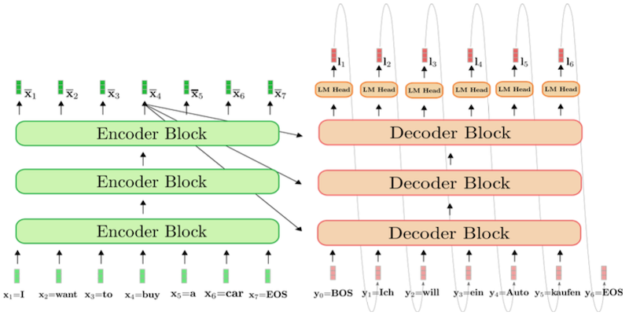
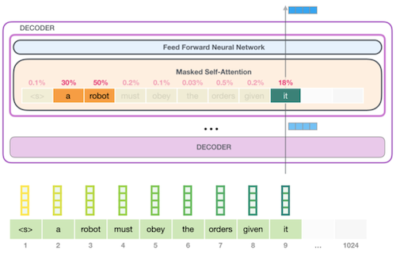
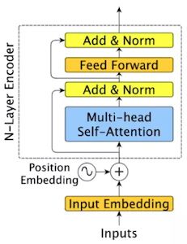
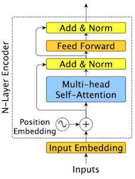
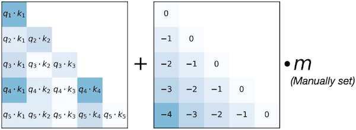
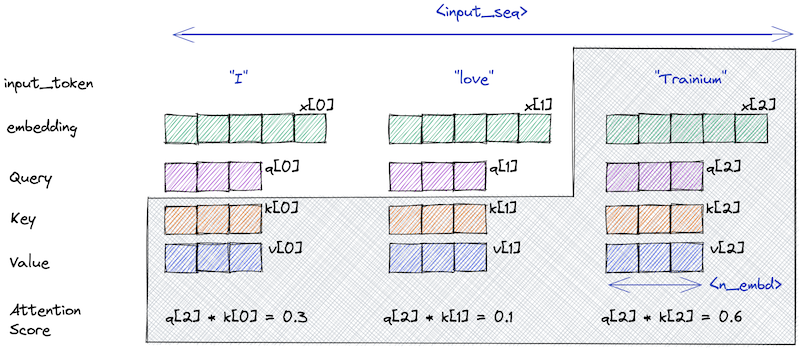
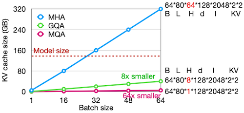
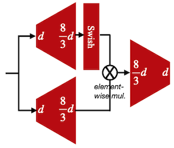

# 12 Transformer and LLM (Part I)

> [EfficientML.ai Lecture 12 - Transformer and LLM (Part I) (MIT 6.5940, Fall 2023, Zoom)](https://youtu.be/mR4u6ZaCYe4)

Transformer의 등장 이후, 이를 기반으로 한 다양한 설계가 제안되었다.

- Encoder-Decoder(T5), Encoder-only(BERT), Decoder-only(GPT)

- Absolute Positional Encoding $\rightarrow$ Relative Positional Encoding

- KV cache optimizations

  Multi-Head Attention(MHA) $\rightarrow$ Multi-Query Attention(MQA) $\rightarrow$ Grouped-Query Attention(GQA)

- FFN $\rightarrow$ GLU(Gated Linear Unit)

---

## 12.4 Types of Transformer-based Models

> original Transformer는 Encoder-Decoder 구조를 가지고 있다.

---

### 12.4.1 Encoder-Decoder: T5

> [Exploring the Limits of Transfer Learning with a Unified Text-to-Text Transformer 논문(2019)](https://arxiv.org/abs/1910.10683)

위 논문에서는 다양한 NLP task를 text-to-text 포맷(텍스트 입력-텍스트 출력)으로 통일한 프레임워크를 제안했다.

해당 논문의 **T5** 모델은 대표적인 Encoder-Decoder 아키텍처로, 다양한 NLP task에서 전이 학습에 기반해 최첨단 성능을 획득하였다.

- encoder에 **prompt**를 제공하면, decoder에서 answer 텍스트을 생성한다.

---

### 12.4.2 Encoder-only: BERT

> [BERT: Pre-training of Deep Bidirectional Transformers for Language Understanding 논문(2018)](https://arxiv.org/abs/1810.04805)

대표적인 Encoder-only 모델인 **BERT**는, 대규모 비지도 사전학습 단계에서 2개의 objective를 동시에 가진다.

| Objective | Description |
| --- | --- |
| **Masked Language Model**(MLM) | 입력 token에서 임의로 선택된 단어를 마스킹(15%)하고, 마스킹된 단어를 예측하는 task |
| **Next Sentence Prediction**(NSP) | 두 문장 A, B가 주어졌을 때, B가 A의 다음 문장인지 예측하는 task |

---

### 12.4.3 Decoder-only: GPT

> [Improving language understanding with unsupervised learning 논문(2018)](https://openai.com/research/language-unsupervised)

대표적인 Decoder-only 모델인 **GPT**는, 비지도 사전학습 단계의 objective로 다음 단어를 예측한다. (next word prediction)

- $\mathcal{U} = \lbrace u_1, \cdots, u_n \rbrace$ : unsupervised corpus of tokens

$$ L_1(\mathcal{U}) = \sum_{i} \log P (u_i | u_{i-k}, \cdots , u_{i-1}; \Theta) $$

다음은 GPT-2 학습에서 "a robot must obey the orders given it" 문장을 입력으로 주고, 다음 word를 예측한 예시다.

> Notes: fine-tuning은 supervised learning으로 진행된다. (참고로 GPT-3 이상으로 큰 모델에서는 fine-tuning 없이, zero-shot/few-shot만으로 downstream tasks에 적용할 수 있다.)

---

## 12.5 Absolute/Relative Positional Encoding

> [Self-Attention with Relative Position Representations 논문(2018)](https://arxiv.org/abs/1803.02155)

가령 Absolute Positional Encoding를 통해 모델을 4K length 데이터로 학습했다고 가정하자. 사전학습된 모델에 만약 6K의 입력을 전달한다면 제대로 동작하지 않는 문제가 발생한다.

이러한 Absolute PE의 단점을 보완하기 위해, **Relative** Positional Encoding 기법이 새롭게 제안되었다. 해당 기법에서는 attention score에 Q, K 사이의 상대적인 위치 정보를 반영한다. (Value에는 직접적인 영향을 미치지 않음)

| | Absolute PE | Relative PE |
| :---: | :---: | :---: |
| |  |  |
| Fusing | **input embeddings**(Q/K/V) + positional information | **attention score** + **relative** distance information |

따라서 relative PE으로 학습한 모델은, **학습에서 본 적 없는 sequence length**에 대해서도 generalization이 가능하다.

> train short, test long 같은 활용도 가능하다. (단, 언제나 가능하지는 않음)

---

### 12.5.1 ALiBi: Attention with Linear Biases

> [Train Short, Test Long: Attention with Linear Biases Enables Input Length Extrapolation 논문(2021)](https://arxiv.org/abs/2108.12409)

ALiBi 논문에서는 absolute index를 사용하지 않고, 오로지 relative distance만으로 positional encoding을 수행한다. (이를 통해 "train short, test long"을 가능하게 만든다.)

다음은 ALiBi 방법으로, attention matrix에서 offset(relative distance 정보)을 계산한 예시다.

---

### 12.5.2 RoPE: Rotary Positional Encoding

> [RoFormer: Enhanced Transformer with Rotary Position Embedding 논문(2021)](https://arxiv.org/abs/2104.09864)

위 논문에서는 2D rotation을 기반으로 하는 positional embedding을 제안하였다. (참고로 RoPE는 LLaMA 모델에서 사용된다.)

(1) 임베딩 차원 $d$ 를 $d/2$ 쌍으로 분리한다. (각 쌍은 2차원의 한 축을 담당)

(2) position $m$ 에 따라 rotation을 적용한다. (임베딩은 복소수 타입으로 변환된다.)

$$ \Theta = \lbrace {\theta}_i = {10000}^{-2(i-1)/d}, i \in [1, \cdots, d/2] \rbrace $$

> 10000: 모든 token을 구분할 만큼 충분히 큰 상수

이를 general form으로 표현하면 다음과 같다.

$$ f_{q,k}(x_m, m) = R_{\Theta, m}^d W_{q,k}x_m $$ 

$$ R_{\Theta, m}^d = \begin{bmatrix} \cos(m \theta_1) & -\sin(m \theta_1) & 0 & 0 & \cdots & 0 & 0 \\  \sin(m \theta_1) & \cos(m \theta_1) & 0 & 0 & \cdots & 0 & 0 \\ 0 & 0 & \cos(m \theta_2) & -\sin(m \theta_2) & \cdots & 0 & 0 \\ 0 & 0 & \sin(m \theta_2) & \cos(m \theta_2) & \cdots & 0 & 0 \\ \vdots & \vdots & \vdots & \vdots & \ddots & \vdots & \vdots \\ 0 & 0 & 0 & 0 & \cdots & \cos(m \theta_{d/2}) & -\sin(m \theta_{d/2}) \\ 0 & 0 & 0 & 0 & \cdots & \sin(m \theta_{d/2}) & \cos(m \theta_{d/2})\end{bmatrix} $$

---

## 12.5.3 Advantage of RoPE: Extending the Context Window

> [Extending Context Window of Large Language Models via Position Interpolation 논문(2023)](https://arxiv.org/abs/2306.15595)

대부분의 LLM은 제한된 context length 설정으로 학습된다. 예를 들어 LLaMA는 2k, LLaMA-2는 4k, GPT-4는 8k로 학습되었다. 

하지만 interpolating RoPE PE를 통해, 이러한 context length 제한을 극복할 수 있다. (논문에서는 LLaMA를 2k에서 32k로 확장)

> interpolation: 정수 인덱스에 0.5 인덱스를 추가하여, 1, 1.5, 2, 2.5, 3, ... 과 같이 확장하는 것을 의미한다.

주파수를 반으로 줄인 예시( ${\theta}_i/2$ )를 살펴보면, 기존에 대비해 동일한 범위에서 더 많은 성분을 갖고 4k position까지 표현하는 것을 확인할 수 있다.

| | | |
| --- | --- | --- |
| Conventional |  | $m \in [0, 2048 * 2), {\theta}_i' = {\theta}_i$ |
| Interpolating |  | $m \in [0, 2048 * 2), {\theta}_i' = {\theta}_i/2$ |

---

## 12.6 KV Cache Optimizations

> [The KV Cache: Memory Usage in Transformers](https://youtu.be/80bIUggRJf4)

decoding(GPT-style)의 attention 계산에서는, 대체로 이전의 모든 Key, Value를 저장해 두는 방식으로 수행된다. (**KV cache**)

다음은 세 개의 토큰을 입력으로 갖는 masked self-attention을 나타낸 예시다. masked self-attention에서 새로운 query token은 이전 token이 보여야 한다.

이때, 이전의 K, V 계산을 cache해 두는 것으로 동일한 계산을 반복할 필요가 없다.

> 오로지 현재의 query token만 유지하면 되지만, 대신 보라색으로 표시된 부분을 메모리에 항상 유지해야 한다.

그러나 이러한 KV cache는, 유지를 위해서 굉장히 많은 메모리를 필요로 하게 된다. ( $2 \mathrm{bytes}$ = FP16 )

- Llama-2-7B, KV cache size

$$ \underset{minibatch}{BS} * \underset{layers}{32} * \underset{heads}{32} * \underset{n_{emd}}{128} * \underset{length}{N} * \underset{K,V}{2} * {2}\mathrm{bytes} = 512\mathrm{KB} \times BS \times N $$

- Llama-2-13B, KV cache size

$$ \underset{minibatch}{BS} * \underset{layers}{40} * \underset{heads}{40} * \underset{n_{emd}}{128} * \underset{length}{N} * \underset{K,V}{2} * {2}\mathrm{bytes} = 800\mathrm{KB} \times BS \times N $$

- Llama-2-70B, KV cache size

$$ \underset{minibatch}{BS} * \underset{layers}{80} * \underset{heads}{64} * \underset{n_{emd}}{128} * \underset{length}{N} * \underset{K,V}{2} * {2}\mathrm{bytes} = 2.5\mathrm{MB} \times BS \times N $$

가령 Llama-2-70B(using MHA) 학습 설정을 $BS=16$ , $n_{seq} = 4096$ 으로 가정하면, 필요한 KV cache size는 160GB가 된다. (A100 GPU 두 대가 필요한 수준)

> Llama-2 paper 기준에서는 $BS=1$ $n_{seq} = 4096$ 으로 10GB의 메모리를 필요로 하였다.

다음 그래프에서는 batch size의 증가에 따라, KV cache size가 선형적으로 증가하는 것을 확인할 수 있다.

---

### 12.6.1 Multi-Query Attention (MQA)

> [Fast Transformer Decoding: One Write-Head is All You Need 논문(2019)](https://arxiv.org/abs/1911.02150)

> [GQA: Training Generalized Multi-Query Transformer Models from Multi-Head Checkpoints 논문(2023)](https://arxiv.org/abs/2305.13245)

위 논문에서는 KV cache size를 줄이기 위해, \#kv-heads 수를 최적화할 수 있는 방법을 제시하였다. 다음은 $N$ heads for query 조건에서 세 가지 설계를 비교한 도표이다.

| | Multi-head | Multi-query | Grouped-query |
| --- | :---: | :---: | :---: |
| |  |  |  |
| \#heads for K, V | $N$ | 1 | $G$  |

> 보편적으로 $G = N/8$ 로 설정하면, 정확도를 유지하면서 KV cache size를 줄일 수 있다.

- 세 가지 설계에서 KV cache size를 비교하면 다음과 같다.

  

- Accuracy

  다음은 Llama-2, 30B, 150B tokens 설정에서, 각 설계의 정확도를 비교한 도표다.

  

---

## 12.7 Gated Linear Units (GLU)

> [GLU Variants Improve Transformer 논문(2020)](https://arxiv.org/abs/2002.05202)

vanilla FFN을 GLU(Gate Linear Unit)로 변경하는 것으로도 성능을 향상시킬 수 있다. 3번의 matrix multiplication을 포함하며, activation function으로 swish를 사용한다.

$$ \mathrm{FFN_{SwiGLU}}(x, W, V, W_2) = (\mathrm{Swish_1}(xW) \otimes xV)W_2 $$

| FFN | SwiGLU |
| :---: | :---: |
|  |  |

> total computing cost를 유지하기 위해 $8/3d$ 차원으로 설정하였다.

---