# 14 Vision Transformer

> [EfficientML.ai Lecture 14 - Vision Transformer (MIT 6.5940, Fall 2023, Zoom)](https://youtu.be/fcmOYHd57Dk)

---

## 14.1 Vision Transformer

> [An Image is Worth 16x16 Words: Transformers for Image Recognition at Scale 논문(2020)](https://arxiv.org/abs/2010.11929)

**Vision Transformer**(ViT)는 2D image를 패치 단위로 나눈 token을 입력으로 사용하는 transformer이다.

| 2D Image | | Tokenization |  
| --- | :---: | --- | 
|  | $\rightarrow$ |  |
| size: 96x96 patch size: 32x32 | | \#tokens: 3x3=9 dim of each token: 3x32x32=3,072 |

다음은 ViT에서 이미지 입력을 분류하는 과정을 보여준다.

이때 linear projection에서 convolution을 주로 활용한다. (서로 다른 패치에 대해 하나의 동일한 convolution 적용)

> 현재 예시: "32x32 Filter, stride 32, padding 0, in_channel=3, output_channel = 768" convolution 레이어를 사용한다.

| | |
| --- | --- | 
| |  |
| input dim = 3,072 output dim(hidden size of ViT) = 768 | \#Parameters: 3,072x768 = 2.36M |

---

### 14.1.1 Model Variants

논문에서는 세 가지 크기의 모델을 제안하였다.

- Patch size: 2, 4, 8, 16, 32

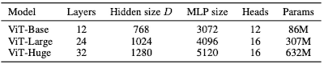

> ViT-L/16 = ViT-Large, 16x16 패치 사용

다음은 ResNet과 ImageNet 정확도를 비교한 도표다. 많은 데이터를 사전학습한 ViT 모델일수록 (ResNet 대비) 우수한 정확도를 달성하였다.

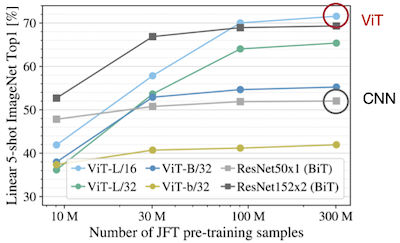

> ViT-b: ViT-Base에서 hidden dimension을 절반으로 줄인 모델

---

## 14.2 High-Resolution Dense Prediction

> **dense prediction**: 이미지 내 각 픽셀이 어느 클래스에 속하는지 예측

다음은 자율주행 task에서 저해상도(좌측), 고해상도(우측) 입력을 비교한 예시다.

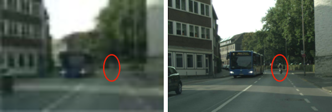

(고해상도 이미지에 비해) 저해상도 이미지는 작은 물체를 비롯한 디테일을 인식하기 어렵다.

---

### 14.2.1 Applications: Semantic Segmentation, Super-Resolution

다음은 high-resolution dense prediction의 대표적인 응용 예시다. 

| Medical Image Segmentation | Super-Resolution (SR) |
| :---: | :---: |
| 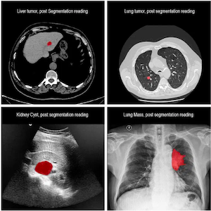 | 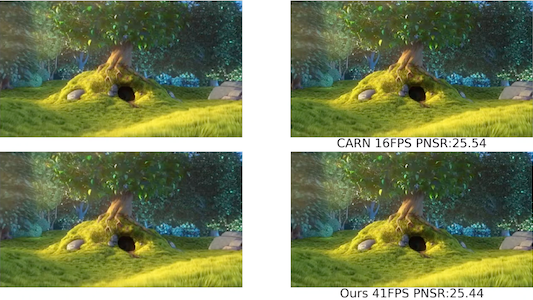 |

하지만, ViT는 고해상도에서 연산량이 폭발적으로 증가하는 문제를 갖는다.

- 해상도 증가 시, 연산량은 quadratic하게 증가한다.

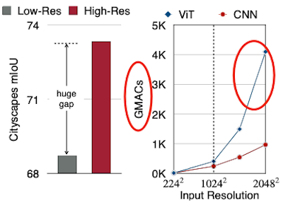

---

### 14.2.2 Applications: Segment Anything

> [Segment Anything 논문(2023)](https://arxiv.org/abs/2304.02643)

**Segment Anything**은 Meta에서 공개한 image segmentation 모델이다. (**task**, **model**, **dataset**)

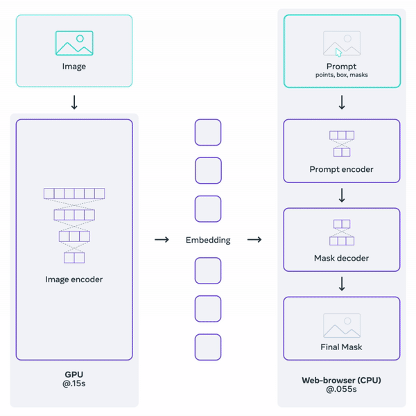

(zero-shot) image in-painting, object tracking, 3D generation 등 다양한 작업에서 우수한 성능을 달성하였다.

> *SA-1B* dataset: 11M개 high-res image, 1B개 이상의 segmentation mask로 구성

---

#### 14.2.2.1 Segment Anything Model (SAM)

**Segment Anything Model**은 크게 세 가지 요소로 구성된다.

**(1) image encoder**: 고해상도 입력에 최적화된 *MAE*(Masked Autoencoder) pre-trained ViT 활용

**(2) prompt encoder**: 두 종류의 prompt를 임베딩

- **sparse**(points, boxes, text)

- **dense**(mask): convolution 활용

**(3) mask decoder**: 이미지 및 프롬프트 임베딩을 입력으로, segmentation mask 예측

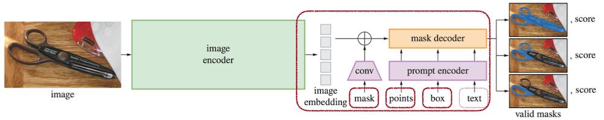

---

## 14.3 Efficient Attention

---

### 14.3.1 Swin Transformer: Window Attention

> [Swin Transformer: Hierarchical Vision Transformer using Shifted Windows 논문(2021)](https://arxiv.org/abs/2103.14030)

**Swin Transformer**은 local window 단위의 **window attention**을 설계하여 연산량을 최소화하였다. (연산 복잡도: linear하게 증가)

| Original Attention | Window Attention |
| :---: | :---: |
| 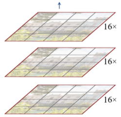 | 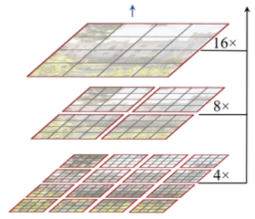 |
| all token 대상 연산 |  local window만 연산 |

> **Notes**: feature map 크기는 레이어를 거치며 점차 감소한다.
>
> 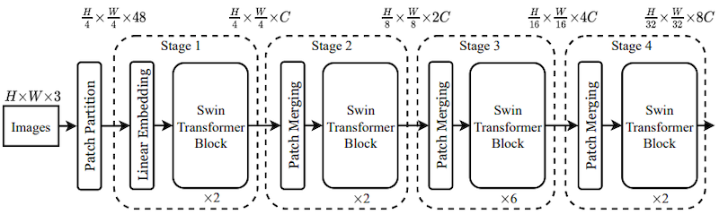

이때 window 간의 정보 교환을 위한 **shifted window** 블록을 포함한다. (예시: 2 pixel shift)

| Shifted Window Partition | Two Successive Block |
| :---: | :---: |
| 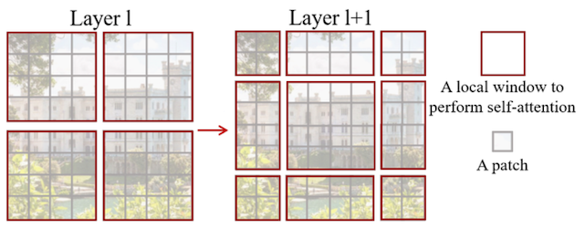 | 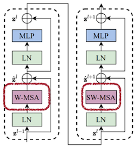

> *SW*: Shift Window, *MSA*: Multi-head Self-Attention

---

### 14.3.2 FlatFormer: Flattened Window Attention

> [FlatFormer: Flattened Window Attention for Efficient Point Cloud Transformer 논문(2023)](https://arxiv.org/abs/2301.08739)

3D Point Cloud 데이터는 일반적으로 99% 수준의 희소도를 가진다.

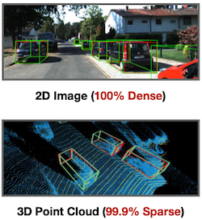

**FlatFormer**는 희소도를 활용한 가속을 위한 **Flattened Window Attention**(FWA) 설계를 제안하였다.

**(1)** padding이 필요한 동일한 윈도우(Equal-Window) 대신, 동일한 크기(**Equal-Size**)로 그룹

**(2)** 그룹별 self-attention(여러 axis로 수행) 및 shifted window attention 적용

|| Equal-Window | Equal-Size |
| :---: | :---: | :---: |
| | 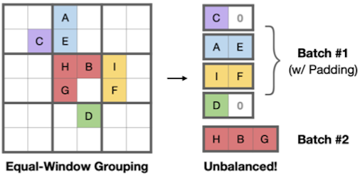 | 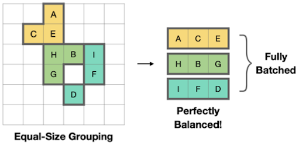 |
| (+) | spatial proximity | balanced computation workload |
| (-) | computational regularity | geometric locality |

다음은 Jetson AGX Orin 보드에서 획득한 벤치마크로, 타 모델 대비 우수한 FPS(Frames Per Second)를 달성하였다.

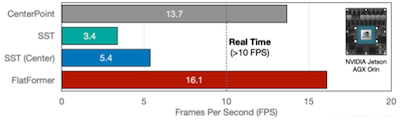

---

## 14.4 EfficientViT: Linear Attention

> [EfficientViT: Multi-Scale Linear Attention for High-Resolution Dense Prediction 논문(2022)](https://arxiv.org/abs/2205.14756)

**EfficientViT**은 ReLU 기반의 **linear attention**을 도입하여 similarity 계산을 단순화한다. (수식의 오른쪽)

$$ \mathrm{Sim}(Q,K) = \exp\left({ {QK^T} \over {\sqrt{d} } }\right) \rightarrow \mathrm{Sim}(Q,K) =  \mathrm{ReLU}(Q)\mathrm{ReLU}(K)^T $$

연산 비용을 $O(n)$ 으로 줄일 수 있다.

<table>
<tr>
<td align="center">Softmax Attention</td>
<td align="center"> </td>
<td align="center" colspan="3">Linear Attention</td>
</tr>
<tr>
<td>

 

</td>
<td>

vs

</td>
<td>

</td>
<td align="center">

$\longrightarrow$ **(ab)c = a(bc)** (associative property of Matmul)

</td>
<td>

</td>
</tr>
<tr>
<td align="center">

Cost: $O(n^2)$

</td>
<td align="center"> </td>
<td align="center">

Cost: $O(n^2)$

</td>
<td align="center"> </td>
<td align="center">

Cost: $O(n)$

</td>
</tr>
</table>

그러나, linear attention은 local information을 포착하기 어려운 문제를 가진다.

| Attention Feature Map | Accuracy Gap | 
| :---: | :---: |
|  |  |

---

### 14.4.1 EfficientViT Module: Multi-Scale Aggregation

따라서, 논문에서는 depthwise convolution(DWConv) 분기를 추가하는 설계로 local information을 강화하였다.

| Aggregate multi-scale Q/K/V tokens | EfficientViT Module |
| :---: | :---: |
| 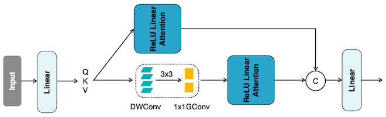 | 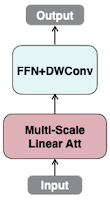 |

해당 설계로 정확도 손실을 회복할 뿐만 아니라, 기존 softmax attention보다 우수한 성능을 달성하였다.

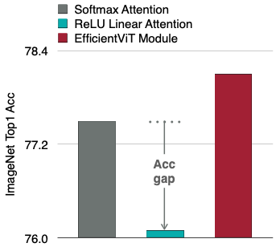

---

### 14.4.2 EfficientViT-SAM

> [EfficientViT-SAM: Accelerated Segment Anything Model Without Accuracy Loss 논문(2024)](https://arxiv.org/abs/2402.05008)

후속 논문에서는 Segment Anything Model(SAM)의 image encoder를 수정한 **EfficientViT-SAM** 설계를 제안하였다.

> prompt encoder, mask decoder: 그대로 유지

다음은 EfficientViT 및 EfficientViT-SAM 구조를 나타낸다.

- 전반부 `Conv block` / 후반부 2 stage에서 `EfficientViT Module` 사용

- 후반부 3 stage에서 fused feature 획득 (`upsampling`, `addition`)

| EfficientViT |
| :---: |
| 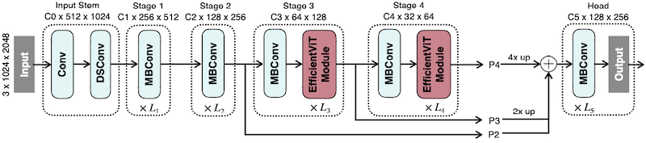 |
| **EfficientViT-SAM-XL** |
| 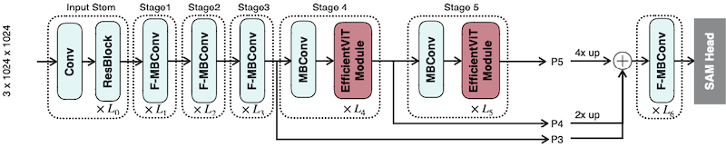 |

EfficientViT-SAM 학습은 2단계로 수행된다.

**(1)** **image encoder** 학습 (교사 모델: 기존 image encoder)

**(2)** **end-to-end** EfficientViT-SAM 학습 (dataset: SA-1B, 2 epochs)

---

### 14.4.3 EfficientViT-SAM: Results

다음은 세 가지 모드에서 EfficientViT-SAM가 획득한 결과다. (ViT-Huge: SAM-ViT-H)

- 기존 SAM과 비교하여 17-69배 가속을 달성하였다. (단일 NVIDIA A100 기준)

| Mode | Segmentation Results |
| --- | :---: |
| Point | 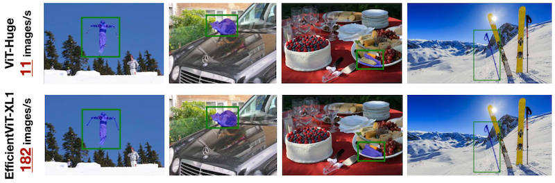 |
| Box | 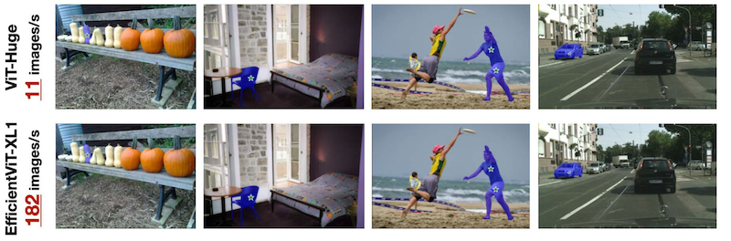 |
| Everything | 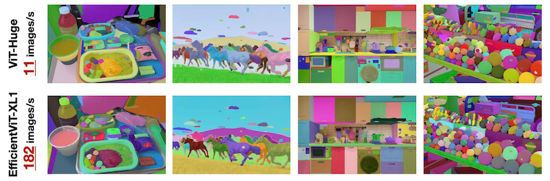 |

> 참고: YOLOv8, Grounding DINO를 활용한 Instance Segmentation에서도, SAM-ViT-H 대비 우수한 성능 달성

---

## 14.5 SparseViT: Sparse Attention

> [SparseViT: Revisiting Activation Sparsity for Efficient High-Resolution Vision Transformer 논문(2023)](https://arxiv.org/abs/2303.17605)

`sparse, high resolution` 입력과 `dense, low resolution` 입력 중 어느 쪽이 더 자원 효율적일까?

| Uniform Resizing | Activation Pruning |
| :---: | :---: |
| 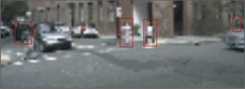 | 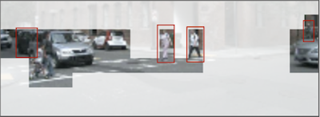 |
| **Low** Resolution (0.5x) **Dense** Pixels (100%) | **High** Resolution (1x) **Sparse** Pixels (25%) |

SparseViT는 `sparse, high resolution` 입력이 포함하는 풍부한 정보에 주목하고, 연산량을 줄이기 위한 activation pruning 기법을 제안하였다.

> Swin block(Swin Transformer)을 수정하여 사용한다.

- Step 1: **Window Attention Pruning** (with Non-Uniform Sparsity)

  input activation을 $L_2$ magnitude 기준으로 희소화한다. (top-k 보존 후 정렬, 이어서 window attention)

  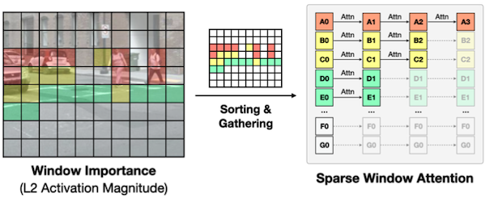

- Step 2: **Sparsity-Aware Adaptation**

  여러 iteration 동안 각 레이어를 임의의 희소도 비율로 미세조정한다. (레이어별 민감도 조사)

  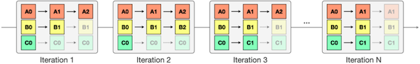

- Step 3: **Resource-Constrained Search**

  진화 알고리즘(Evolutionary Algorithm)으로, 지연시간 제약 조건에서 레이어별 최적 희소도 설정을 탐색한다.

  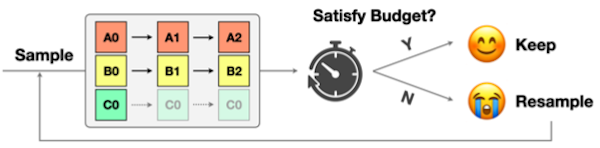

---
