# 14 Vision Transformer

> [EfficientML.ai Lecture 14 - Vision Transformer (MIT 6.5940, Fall 2023, Zoom)](https://youtu.be/fcmOYHd57Dk)

> [EfficientML.ai Lecture 16 - Vision Transformer (Zoom Recording) (MIT 6.5940, Fall 2024)](https://youtu.be/C_U19CeStV4)

---

## 14.6 Self-supervised Learning for ViT

> [Boosting Self-Supervised Learning via Knowledge Transfer 논문(2018)](https://arxiv.org/abs/1805.00385)

ViT 성능을 위해서는 충분히 많은 학습 데이터가 필요하다. 그러나, 이를 위한 데이터 라벨링에서 많은 비용이 소요된다.

따라서, 대량의 unlabeled 데이터를 학습한 뒤, labeled downstream으로 미세조정하는 **Self-supervised Learning**(SSL) 접근이 부상하였다.

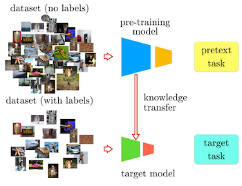

---

### 14.6.1 Contrastive Learning

> [Junnan Li: Prototypical Contrastive Learning: Pushing the Frontiers of Unsupervised Learning](https://www.salesforce.com/blog/prototypical-contrastive-learning-pushing-the-frontiers-of-unsupervised-learning/)

**contrastive learning**(대조 학습)은 **positive**, **negative** 샘플 간의 비교를 토대로 하는 학습이다.

- **positive**: 서로 가까워지도록 학습 (e.g., 동일한 샘플의 random view)

- **negative**: 서로 멀어지도록 학습 (e.g., 다른 샘플의 random view)

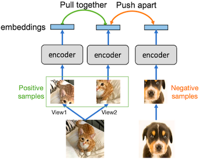

다음은 ViT 모델군을 대상으로 네 가지 데이터셋에서 transfer learning 정확도를 비교한 실험이다. 

- 대조 학습 기반에서, 세 가지 데이터셋 기준으로 ImageNet 지도 학습 성능을 능가하였다.

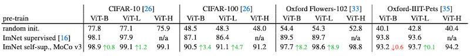

> MoCo v3: (논문에서 소개하는) 데이터 증강 및 대조 학습을 기반으로 한 학습 프레임워크

---

### 14.6.2 Multi-Modal Contrastive Learning

> [Learning Transferable Visual Models From Natural Language Supervision 논문(2021)](https://arxiv.org/abs/2103.00020)

**CLIP**(Contrastive Language-Image Pre-training)은 image-text 쌍을 사용하는 대조 학습이다.

- $N \times N$ (image $I$ , text $T$ ) 쌍 학습

- 실제 pair의 cosine similarity 최대화, 나머지 $N^2 - N$ 개 pair 대해서는 최소화

> 예를 들어 $N=3$ (텍스트 3개, 이미지 3개) 설정으로 학습한다면 참은 3개, 거짓은 6개 쌍이다.

| Training | Inference |
| :---: | :---: |
| 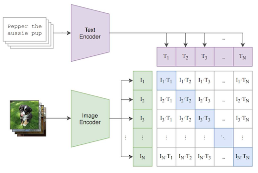 | 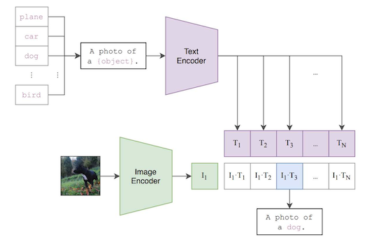 |

추론 시 입력 이미지와 가장 유사한 text label을 찾는다. 오른쪽 예시 그림의 경우 plane, car, dog, ..., bird 등의 텍스트 후보를 주면, 이미지와 가장 attention score가 높은 텍스트를 선택하게 된다.

이때 CLIP은 별도의 미세조정 없이, zero-shot 및 open-vocabulary 예측에서 우수한 성능을 보였다.

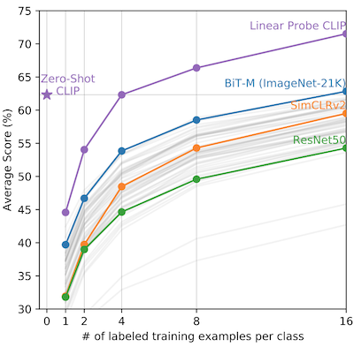

---

### 14.6.3 Masked Image Modeling

> [Masked Autoencoders Are Scalable Vision Learners 논문(2021)](https://arxiv.org/abs/2111.06377)

일부를 마스킹한 이미지에서 missing patch를 예측하는 학습도 제안되었다.  

다음과 같은 **Masked AutoEncoder**(MAE) 설계를 토대로, 보이는 패치에서 보이지 않는 패치를 예측할 수 있다.

- Heavy encoder: 오직 보이는 토큰(**unmasked patch**)만 처리 (masking ratio: 25%)

- Lite decoder: 모든 토큰 처리 (**사전학습에서만 사용**)

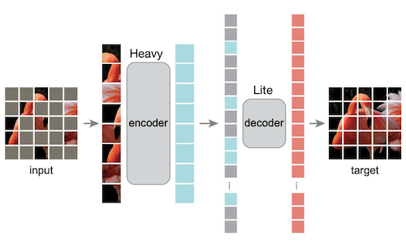

이는 BERT에서 소개한 **Masked Language Modeling**(MLM) 방법론과 유사하지만, 이미지 데이터는 언어 대비 상당히 높은 마스킹 비율(75%)에서도 우수한 정확도를 달성했다.

| Masked samples | Masking ratio |
| :---: | :---: |
| 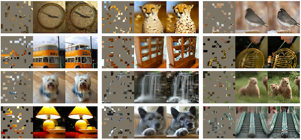 | 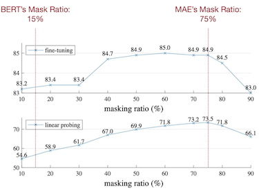 |

> 우측 그래프: fine-tuning(top), linear probing(bottom), y축: ImageNet-1K 정확도

---

## 14.7 Multi-Modal LLMs

> [The Dawn of LMMs: Preliminary Explorations with GPT-4V(ision) 논문(2023)](https://arxiv.org/abs/2309.17421)

다음은 GPT-4V 모델에서 이미지와 텍스트 입력을 함께 처리하는 예시다.

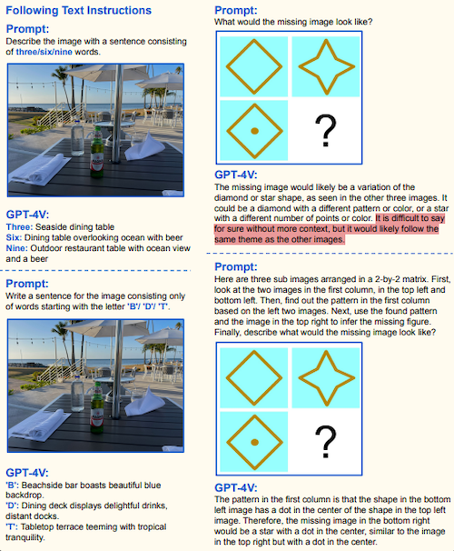

---

### 14.7.1 Flamingo: Cross-attention-based VLMs

> [Flamingo: a Visual Language Model for Few-Shot Learning 논문(2022)](https://arxiv.org/abs/2204.14198)

Flamingo는 사전학습 LLM과 Vision encoder 구조를 갖는 대표적인 초기 VLM 연구다.

- LLM 가중치 고정(frozen)하되, 아키텍처 내부에 cross-attention 모듈 삽입

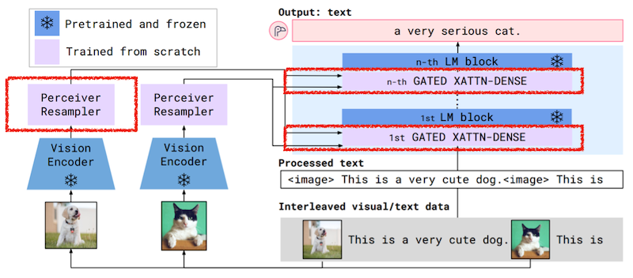

다음은 두 가지 주요 구성 요소다.

1. 입력 이미지(동영상)의 가변 해상도, 프레임 처리를 위한 **Perceiver Resampler**.

- (예시) 입력: 3개 video frame (flatten 시 총 27개 토큰)

> - visual tokens: `[27, dim]`
>
> - learned queries (Q): `[5, dim]`
>
> - KV: `[32, dim]`
>
> - Attention map: `[5, 32]`
>
> - output: `[5, dim]`

<table>
<tr>
<td>

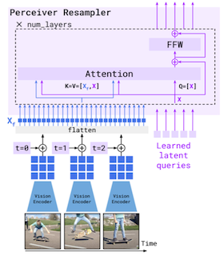

</td>
<td>

```python
def perceiver_sampler(
    x_f,              # visual features [T, S, d] (T: time, S: space)
    time_embeddings,  # time pos embeddings [T, 1, d]
    num_layers,       # number of perceiver layers
):
    # Add the time position embeddings and flatten.
    x_f = x_f + time_embeddings
    x_f = flatten(x_f)  # [T, S, d] -> [T*S, d]
    # Apply the Perceiver layers.
    for i in range(num_layers):
        # Attention
        x = x + attention_i(q=x, kv=concat(x_f, x))
        # Feed-forward
        x = x + ffw_i(x)
    return x
```

</td>
</tr>
</table>

2. tanh gating으로 이미지 정보를 선택적으로 합산하는 **Gated Cross-Attention Layer**.

<table>
<tr>
<td>

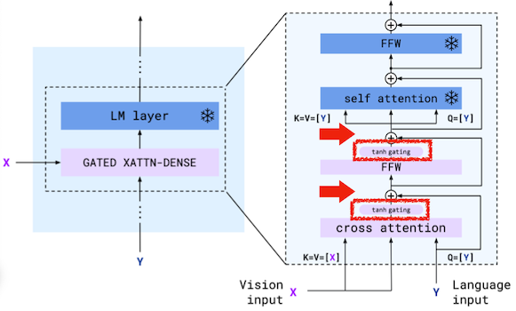

</td>
<td>

```python
def gated_xattn_dense(
    y,            # input language features
    x,            # input visual features
    alpha_xattn,  # xattn gating parameter (initialized to 0)
    alpha_dense,  # ffw gating parameter (initialized to 0)
):
    # 1. Gated Cross Attention
    y = y + tanh(alpha_xattn) * attention(q=y, kv=x)
    # 2. Gated FFN (dense)
    y = y + tanh(alpha_dense) * ffw(y)

    # Regular self-attention + FFW on language
    y = y + frozen_attention(q=y, kv=y)
    y = y + frozen_ffw(y)
    return y   # output visually informed language features
```

</td>
</tr>
</table>

---

### 14.7.2 PaLM-E: Visual Tokens as Input

> [PaLM-E: An Embodied Multimodal Language Model 논문(2023)](https://arxiv.org/abs/2303.03378)

> [Google Research Blog: PaLM-E: An embodied multimodal language model](https://research.google/blog/palm-e-an-embodied-multimodal-language-model/)

PaLM-E는 이미지 데이터(이외 센서 데이터 등)를 텍스트 임베딩 공간에 주입하는 방법으로, 이미지 토큰과 텍스트 토큰이 교차하는 멀티모달 문장을 처리한다. 

- 입력 예시: `Q: What happened between <img_1> and <img_2>?`

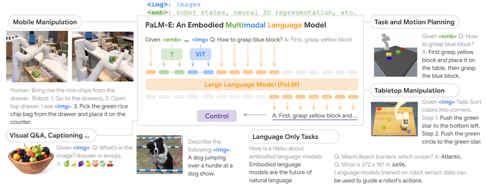

이를 통해 vision-language task 및 로봇 조작 task에서 우수한 멀티모달 능력을 달성하였다.

> 시연 예시 및 성능: [Google Research Blog: PaLM-E: An embodied multimodal language model](https://research.google/blog/palm-e-an-embodied-multimodal-language-model/) 참고


---

## 14.8 Autoregressive Image Generation with ViT

> [Gemini: a family of highly capable multimodal models 논문(2023)](https://arxiv.org/abs/2312.11805)

그렇다면, 이미지 토큰을 텍스트 토큰처럼 생성할 수 있을까? 2023년 Google Gemini 보고서에서는 **Autoregressive**(AR) 모델을 활용하여 이미지 생성이 가능하다고 밝혔다.

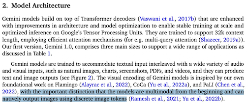

특히 AR 모델은 diffusion 모델보다 이미지를 신속하게 생성할 수 있다. 다음은 초당 이미지를 생성하는 throughput을 비교한 도표다.

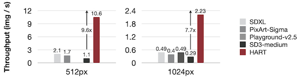

> AR 모델(HART) vs. diffusion 모델(SD-XL, PixArt-Σ, Playground-v2.5, SD3-medium)

> **Notes**: Diffusion 생성 예시
>
> 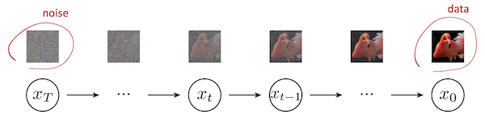

---

### 14.8.1 Formulations for AR Image Generation

> [Autoregressive Image Generation without Vector Quantization 논문(2024)](https://arxiv.org/abs/2406.11838)

다음은 AR 모델의 세 가지 기본적인 이미지 생성 방법이다.

- (a), (b): 한번에 한 출력 토큰 생성 $\rightarrow$ memory bound (매번 모든 가중치 필요)

- (c): 여러 출력 토큰을 동시 생성 (Masked Image Modeling/MAE 관련)

| | |
| :---: | :---: |
| 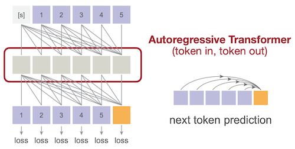 | 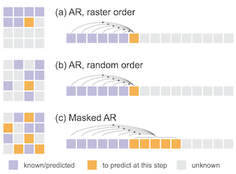 |

언어 토큰에서의 학습 방법을 사용하기 위해선, 이미지 데이터를 discrete image tokens으로 변환해야 한다.

> **Text**: 예를 들어, 영어 단어로 구성된 vocabulary가 있으며 단어는 discrete하다.

> vs. **Image**: 정해진 크기의 vocabulary가 없고, continuous한 image patch로 구성된다.

이를 위한 방법으로 **Vector Quantization**(VQ) encoder, decoder가 제안되었다. 

- 입력으로 연속적인 이미지 패치를 받아서, 출력으로 이산적인 codebook vector를 반환한다.


> **Notes**: scalar 단위의 **Deep Compression** 양자화와 달리, 벡터 단위로 매핑한다.
> 
> | Scalar quantization<br>(Deep Compression) | Vector quantization<br>(AR generation) |
> | :---: | :---: |
> | 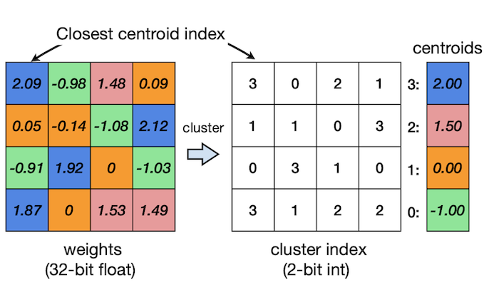 | 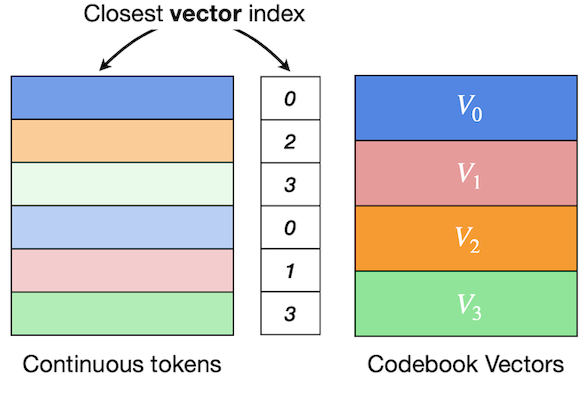 |

---

### 14.8.2 VAR: Faster AR Generation via Next Scale Prediction

> [Visual Autoregressive Modeling: Scalable Image Generation via Next-Scale Prediction 논문(2024)](https://arxiv.org/abs/2404.02905)

**VAR** 논문에서는 spatial locality를 고려한 **multi-scale token map** 설계를 제안하였다. 

- 먼저 전체 이미지를 하나의 토큰으로 통합하여 생성 (**저해상도**, 전체 구조)

- 점차 4x4, 5x5 등 토큰 수를 늘려가며 생성 (**고해상도**, 디테일)

| Stage 1: Training multi-scale VQVAE | Algorithm |
| :---: | :---: |
| 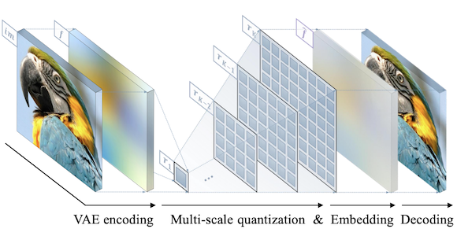 | 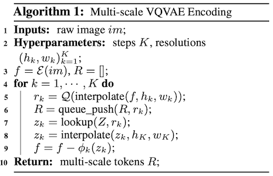 |

> $f$ : remaining residual ( 최고해상도 $h_K \times w_K$ ), $r_k$ : current residual ( step $k$ )

> 왼쪽 위부터 차근차근 생성하는 raster-scan 방식과 달리, 전체 이미지 구조부터 이해하고 디테일을 추가하는 방식에 해당

이러한 접근 방식에 따라 mask도 (일반적인 삼각형 모양이 아닌) 블록 모양을 가지게 된다.

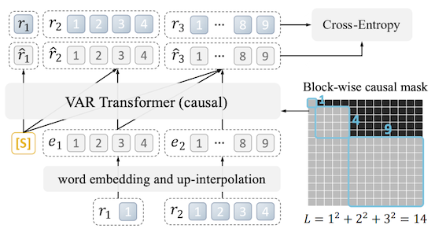

---

### 14.8.3 HART: Hybrid Image Tokenization
 
> [HART: Efficient Visual Generation with Hybrid Autoregressive Transformer 논문(2024)](https://arxiv.org/abs/2410.10812)

그러나, VQ 기반 이미지 토큰 이산화에서 품질 저하가 발생하게 된다.

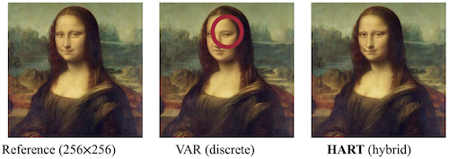

이를 해결하기 위해, **HART**는 discrete, continuous 토큰을 함께 사용하는 하이브리드 토크나이저를 제안하였다. 

먼저 연속 토큰과 이산 토큰을 다음과 같이 정의한다.

$$ \mathrm{continuous\ tokens} = \sum \mathrm{discrete\ tokens} + \mathrm{residual\ tokens} $$

- 학습 토큰: continuous 50% + discrete 50%

  - 연속 토큰일 경우: VQ Quantizer 우회 (빨간색 화살표)

  - 이산 토큰일 경우: **residual tokens**을 계산하여, 3700만 개 파라미터를 갖는 MLP로 모델링 (**residual diffusion**)

| | |
| :---: | :---: |
| **Training** | 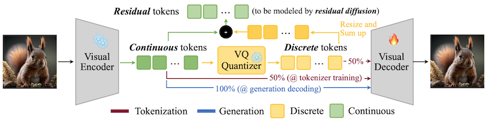 |
| **Inference** | 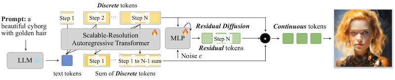 |

> **Notes**: HART diffusion loss 비교
> 
> | Original Diffusion Loss | HART |
> | :---: | :---: |
> | 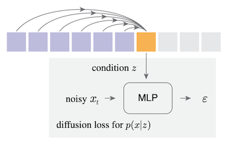 | 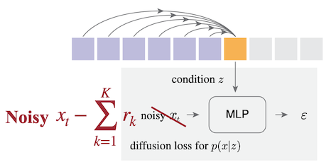 |

---