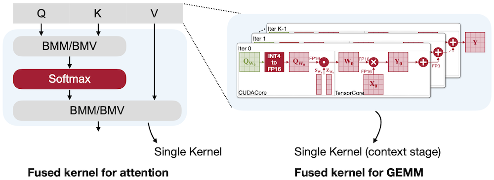
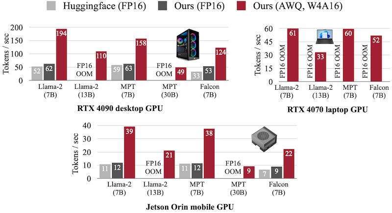
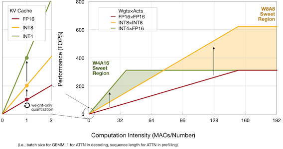
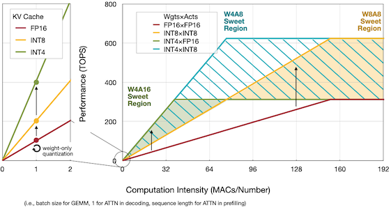
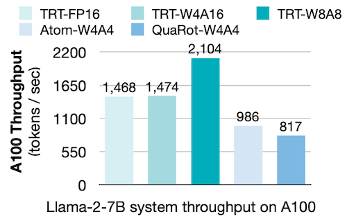
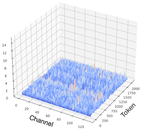
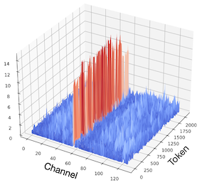
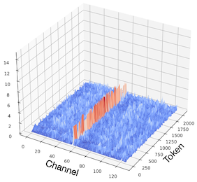

# 13 LLM Deployment Techniques

> [EfficientML.ai Lecture 13 - LLM Deployment Techniques (MIT 6.5940, Fall 2024)](https://youtu.be/sTz2tXG1T0c)

---

## 13.4 TinyChat: Mapping AWQ onto Edge Platforms

> [AWQ: Activation-aware Weight Quantization for LLM Compression and Acceleration 논문(2023)](https://arxiv.org/abs/2306.00978)

AWQ 논문에서는 W4A16 양자화 모델 추론에 최적화한 시스템 프레임워크 **TinyChat**을 제안하였다. 다음은 TinyChat이 강조하는 주요 특징이다.

- efficient, lightweight, Python-native

- multi-platform (cloud, desktop/laptop, edge GPUs, mobile CPUs)

---

### 13.4.1 Hardware-aware Weight Packing

> **Notes**: 메모리에서 값은 byte-aligned로 저장(`1 byte`=`8 bit`)되므로, 4 bit 가중치를 효율적으로 활용하기 위해선 별도의 시스템 설계가 필요하다.

다음은 (128-bit SIMD unit을 지원하는 ARM NEON 아키텍처를 고려한) TinyChat의 weight packing 과정을 나타낸 그림이다. (ARM NEON에서 1.2x speedup 달성)

(1) 순서를 재배치한 후 1 byte마다 가중치를 한 쌍씩 패킹한다. (**Offline**)

(2) 128-bit SIMD 레지스터에 32개 가중치를 적재한다. (**Runtime**)

$$ \mathrm{sequence} =  w_{0}, w_{16}, w_{1}, w_{17}, \cdots, w_{15}, w_{31} $$

(3) 32개 가중치를 unpacking한다. (**Runtime**, SIMD 명령어 3개로 구현)

$$ \mathrm{W_{low} } = \mathrm{P_{w} } \And \mathrm{Mask} \quad \mathrm{W_{high} } = (\mathrm{P_{w} } >> 4) \And \mathrm{Mask}  $$

$$ \mathrm{Mask} = 0000 \ 1111 \ 0000 \ 1111 \ \cdots \ 0000 \ 1111 \ (\mathrm{128} \ \mathrm{bit}) $$

> $2^{n}$ SIMD 레지스터일 때, 언패킹 이후 각 레지스터에서 $1/8 \times 2^{n}$ 개의 가중치를 담게 된다.

---

### 13.4.2 Kernel Fusion

TinyChat에서는 intermediate DRAM access와 kernel launch overhead를 줄이기 위해, 최적화 기법으로 **kernel fusion**을 도입하였다. 다음은 여러 operator를 단일 kernel로 결합한 예시이다.

- Layer Normalization: `multiplication`, `division`, `square root` 등을 단일 kernel로 결합

- Attention Layer: `QKV projection`을 단일 kernel로 결합하고, PE 계산을 on-the-fly로 수행 

---

### 13.4.3 TinyChat Benchmark

다음은 TinyChat(W4A16)과 Huggingface(FP16) 추론 성능을 비교한 벤치마크 결과이다. 해당 실험에서 TinyChat은 Huggingface 대비 최대 3.9x 속도를 달성하였다.

> desktop(RTX 4090), laptop(RTX 4070), mobile GPU(Jetson Orin)

추가로 TinyChat에서는 VLM 모델인 VILA 추론도 지원한다.

---

## 13.5 Inconsistency between Cloud and Edge

앞서 AWQ는 배치 사이즈가 작은 edge LLM inference 시나리오에서 가속에 성공했지만, 거대한 배치 사이즈의 cloud LLM inference 시나리오에서는 성능을 향상하지 못한다.

또한 살펴본 edge serving(`W4-A16-KV16`)과 달리, cloud serving에서는 보편적으로 `W8-A8-KV8` 양자화를 적용한다.

| | Weights | Activations | KV caches |
| --- | :---: | :---: | :---: |
| **Edge** | `4-bit` per-group | keeps `FP16` | keeps `FP16` |
| **Cloud** | `8-bit` per-channel | `8-bit` per-token | `8-bit` per-tensor |

다음은 배치 사이즈에 따른 computation intensity를 양자화 설정별로 비교한 그림이다.

| **Edge**(AWQ) | **Cloud**(SmoothQuant, QServe) |
| :---: | :---: |
|  |  |

> 빨간색: `FP16`, 주황색: `W8-A8-KV8`(SmoothQuant), 초록색: `W4-A16-KV16`(AWQ), 파란색: `W4-A8-KV4`(QServe)

---

### 13.5.1 Current Status of LLM Serving Systems

다음은 cloud serving을 위한 다양한 추론 엔진을, 여러 양자화 설정(Llama-2-7B 모델)에서 비교한 결과를 나타낸 그림이다.

`W8A8`보다 bit precision을 낮추더라도, kernel overhead에 의해 `W8A8`보다 낮은 성능만을 달성하였다.

> TRT: *TensorRT-LLM*

이때 `INT4` 양자화에서 발생하는 대표적인 dequantization overhead는 다음과 같다. (참고로 대부분의 `W4A4`에서는 성능을 고려해 per-group quantization을 사용한다.)

- `W4A16`: `FP16` **tensor core**로 수행하는 GEMM 연산

- `W4A4`: scaling factor(`FP16`)의 **partial sum**

---

### 13.5.2 Overhead in Quantized GEMM on GPUs

> *CUDACore* operation: `INT4` *TensorCore*의 50배 비용이 든다. (e.g., A100)

다음은 대표적인 Quantized GEMM 커널의 구현을 나타낸 그림이다. (구분: 빨간색(`FP16`), 주황색(`INT8`), 초록색(`INT4`))

- (a): main loop에서 오로지 *tensor core* operation만 수행한다. (= hardware efficient)

- (b), (c): main loop에서 partial sum, weight dequantization overhead를 갖는다.

**(a) TensorRT-LLM** (`W8A8`)

모든 dequantization operation은 가장 마지막에 수행된다.

**(b) TensorRT-LLM** (`W4A16`)

INT4 to FP16 dequantization이 input conversion 방식으로 매번 수행된다.

**(c) ATOM** (`W4A4`)

> **Notes**: `INT4` *TensorCore*는 `INT32` partial sum을 반환한다.

main loop에서 *CUDACore* operation이 차지하는 비중이 크며, GEMM에서 partial sum을 수행하기 위해 (input conversion 대비) 더 많은 레지스터와 연산을 필요로 한다.

---

## 13.6 QServe

> [QServe: W4A8KV4 Quantization and System Co-design for Efficient LLM Serving 논문(2024)](https://arxiv.org/abs/2405.04532)

QServe는 AWQ와 SmoothQuant의 장점을 동시에 취하기 위한 `W4-A8-KV4` 양자화 알고리즘 **QoQ**와, 이에 최적화된 시스템 설계를 함께 제안하였다.

**(d) QServe** (`W4A8`)

`INT4` 가중치를 `INT8`로 변환한 뒤, 모든 행렬 연산을 `INT8`로 수행한다. 이후 main loop를 벗어난 가장 마지막에 partial sum을 수행한다.

---

### 13.6.1 QoQ Algorithm: SmoothAttention

> QoQ(*Quattuor-Octo-Quattuor*): 4-8-4 in Latin

QServe는 4-bit KV 양자화에서 발생하는 정확도 하락을 방지할 수 있는 **SmoothAttention** 기법을 제안하였다.

- *Value*: 유의미한 outlier 패턴을 보이지 않는다.

- *Key*: 각 head마다 fixed outlier channel을 갖는 경향이 보인다.

| Layer 24 Values | Layer 24 Post-RoPE Keys (Original) | Layer 24 Post-RoPE Keys (SmoothAttention) |
| :---: | :---: | :---: |
|  |  |  |

따라서 **SmoothAttention**에서는, Key 행렬의 outlier를 smoothing하는 방식으로 성능 저하를 방지한다. (SmoothQuant와 유사)

$$ \mathbf{Z} = \mathbf{Q} \mathbf{\Lambda} \cdot ( \mathbf{K} \mathbf{ {\Lambda}^{-1} } )^{T} $$

> $\mathbf{\Lambda} = \mathrm{diag} (\lambda)$ , ${\lambda}_i = \max (| \mathbf{K_i} |)^{\alpha}$

---

### 13.6.2 Dequantization with Reg-Level Parallelism

QServe에서는 `UINT4`의 dequantization을 `UNIT4` $\Rightarrow$ `UINT8` $\Rightarrow$ `SINT8` 순서로 수행한다. (register-level parallelism 활용)

> `UNIT4` $\Rightarrow$ `UINT8`: TinyChat과 유사, `UINT8` $\Rightarrow$ `SINT8`: apply zeros, scales

하지만 이때, dequantization을 `subtract`-`multiply` 순서(zero point를 뺀 후, scale)로 구현할 경우, 다음과 같이 carry bits에 의한 overflow가 발생할 수 있다.

반면, `multiply`-`subtract` 순서로 구현하면 carry bits에 의한 overflow를 방지할 수 있다.

---

### 13.6.3 QServe Benchmark

다음은 WikiText2 perplexity를 기준으로 한 비교에서, QServe는 기존 시스템의 성능을 제치고 SOTA를 달성하였다. (`W4-A8-KV4`, 2048 sequence length)

또한, TensorRT-LLM(`W4A16`)과 비교한 실험에서도 2.4x에서 3.5x 빠른 속도를 달성하였다. (NVIDIA A100, L40S)

---