# 14 LLM Post-Training

> [EfficientML.ai Lecture 14 - LLM Post-Training (MIT 6.5940, Fall 2024)](https://youtu.be/OCdwWfVoQ-Q)

---

## 14.8 Prompt Engineering: In-Context Learning (ICL)

> [Finetuned Language Models Are Zero-Shot Learners 논문(2021)](https://arxiv.org/abs/2109.01652)

> [Emergent Abilities of Large Language Models 논문(2022)](https://arxiv.org/abs/2206.07682)

이전의 거대하지 않은 언어 모델의 경우, 다음과 같이 하나의 모델에서 단일 task를 수행하였다.

- Examples

  - En2FrBERT: 영어 텍스트를 프랑스어로 번역

  - SentimentBERT: 텍스트의 감정을 positve/negative로 분류

  - SummarizationBERT: 텍스트를 요약

그러나 모델이 거대해지면서, LLM은 **emergent abilities**, 즉 하나의 모델에서 다양한 task를 수행할 수 있는 능력을 갖게 되었다.

- Foundation Model $\rightarrow$ *Prompting* $\rightarrow$ Different tasks

---

### 14.8.1 Zero-Shot Prompting

**zero-shot prompting**은 하나의 foundation model에서, prompt를 통해 다양한 task를 수행하는 방법이다.

다음은 하나의 모델에서 6개 언어에 대해 번역을 수행한 예시다.

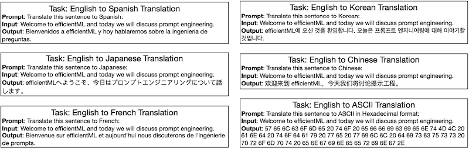

---

### 14.8.2 Few-Shot Prompting

**few-shot prompting**은 예시 일부를 제공하는 것으로, LLM에서 기존에 학습하지 않은 task를 수행할 수 있게 한다.

다음은 4개 예시를 제공 받은 뒤, "What a horrible show!" 텍스트를 Binary 포맷으로 분류하는 few-shot prompting 예시다.

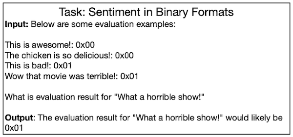

---

### 14.8.3 Few-Shot Prompting: Tricks and Tips

다음은 few-shot prompting을 위한 두 가지 대표적인 tip이다.

**(1)** **Input Example Distribution** 

예시는 각 클래스마다 균등하게 제공해야 한다.

| Correct | Incorrect |
| :---: | :---: |
| 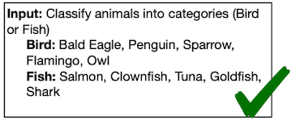 | 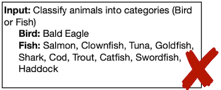 |

**(2)** **Format Consistency**

일관된 형식으로 예시를 제공해야 한다.

|| Example |
| :---: | :---: | 
| **Correct** |  |
| **Incorrect** | 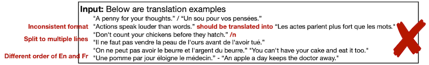 |

---

## 14.9 Prompt Engineering: Chain-of-Thought (CoT)

> [Chain-of-Thought Prompting Elicits Reasoning in Large Language Models 논문(2022)](https://arxiv.org/abs/2201.11903)

> [Large Language Models are Zero-Shot Reasoners 논문(2022)](https://arxiv.org/abs/2205.11916)

**Chain-of-Thought** 프롬프트는 중간 추론 단계(reasoning steps)를 두는 것으로, 모델이 복잡한 추론을 수행할 수 있도록 돕는 방법이다.

| Standard Prompt | Chain-of-Thought Prompt |
| :---: | :---: |
| 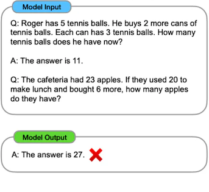 | 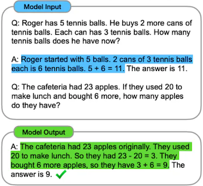 |

또한, 동일한 프롬프트에 "Let’s think step by step" 문장을 추가하는 것만으로, 모델이 zero-shot reasoning을 수행할 수 있게 되었다.

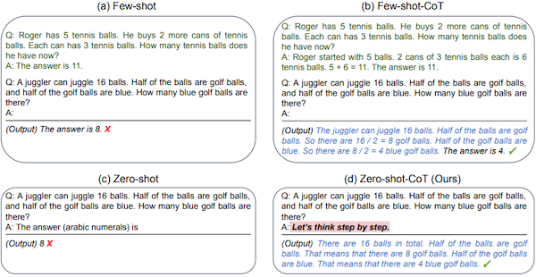

---

## 14.10 Prompt Engineering: Use Case

> [Prompt Engineering Guide](https://www.promptingguide.ai/)

---

### 14.10.1 Prompting ChatGPT

다음은 하나의 강의 내용을 요약하기 위해 ChatGPT에 프롬프트를 제공한 예시다.

- **zero-shot**

| Before | After |
| :---: | :---: |
| 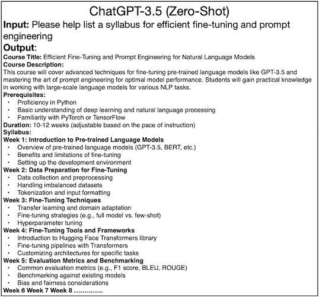 | 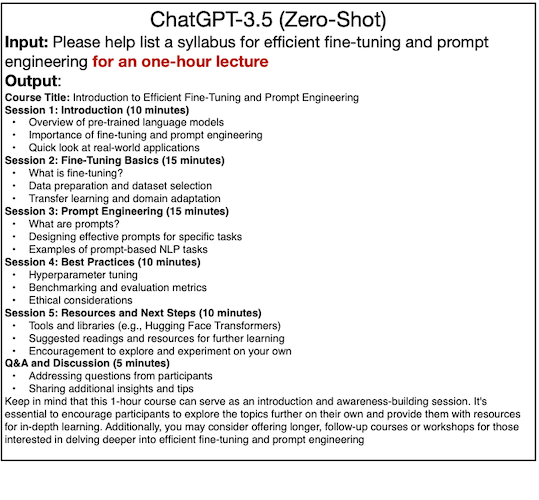 |

> Before: 마치 학기 강의 계획서를 요약한 것처럼 보이는 긴 구성

- **few-shot**

| Example | Output |
| :---: | :---: |
| 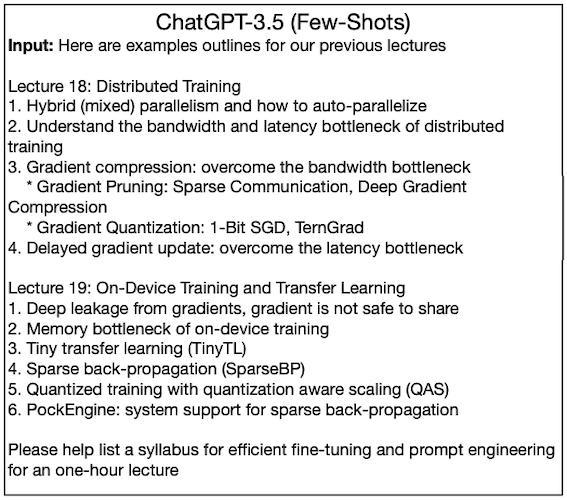 | 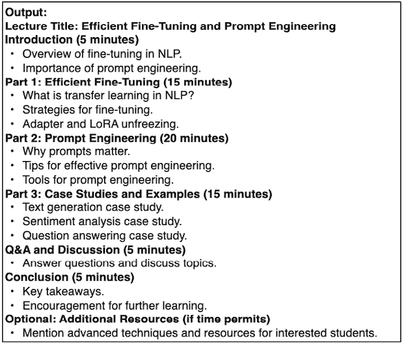 |

---

### 14.10.2 Prompting Diffusion Models

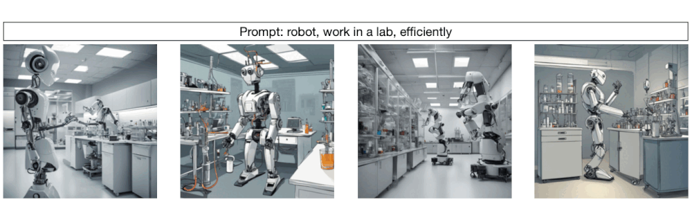

---

## 14.11 Prompt Engineering: Retrieval Augmented Generation (RAG)

> [Retrieval-Augmented Generation for Knowledge-Intensive NLP Tasks 논문(2020)](https://arxiv.org/abs/2005.11401)

> [Retrieval-based Language Models and Applications 논문(2023)](https://aclanthology.org/2023.acl-tutorials.6/)

**RAG**(Retrieval Augmented Generation)는 다음과 같은 LLM의 문제점을 해결하기 위한 방법이다.

| 모든 지식을 기억하는 것은 불가능하다. | 최신 지식이 부족하고 갱신이 어렵다. |
| :---: | :---: |
| 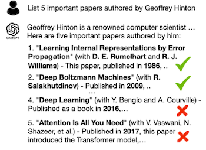 |  |

RAG는 LLM이 답변을 생성할 때 외부 데이터베이스를 검색한 뒤, 이를 바탕으로 답변을 생성하여 문제를 해결한다.

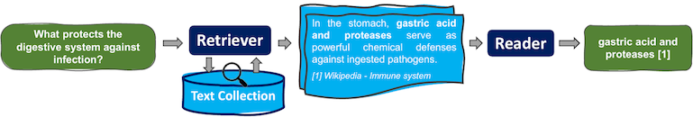

---

### 14.11.1 Retrieval Augmented Generation: Simple Pipeline

> [SuperAnnotate: What is retrieval augmented generation (RAG)](https://www.superannotate.com/blog/rag-explained)

다음은 간단한 RAG 파이프라인을 나타낸 그림이다.

| Element | Description |
| --- | --- |
| **Embedding models** | 문서를 벡터로 변환하는 모델(대량의 텍스트 관리에 용이) |
| **Retriever** | (검색 엔진) query와 관련 있는 여러 문서를 fetch |
| **Reranker** (optional) | 앞서 fetch한 문서의 순위를 평가 |
| **Language model** | 가장 관련 있는 문서를 바탕으로 답변 생성 |

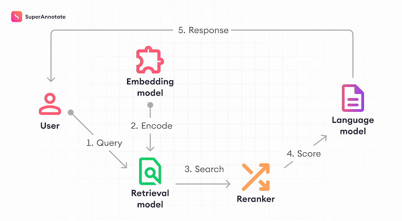

---