# 15 Long-Context LLM

> [EfficientML.ai Lecture 15 - Long-Context LLM (MIT 6.5940, Fall 2024, Zoom Recording)](https://youtu.be/D3NlVsFod8w)

LLM에서 long-context를 이해하도록 미세조정하려면, 굉장히 큰 학습 비용이 필요하다.

---

## 15.1 LongLoRA

> [LongLoRA: Efficient Fine-tuning of Long-Context Large Language Models 논문(2023)](https://arxiv.org/abs/2309.12307)

예를 들어 8192 context length로 LLM을 미세조정하려면, 2048 대비 self-attention 레이어에서 16배의 연산 비용이 필요하다.

LongLoRA 논문은 미세조정 시 sparse local attention( $S^2$ -Attn )를 채택하는 것으로 학습 비용을 최적화한다. (추론에서는 dense global attention 사용)

---

### 15.1.1 Shifted Sparse Attention

> long-context 모델의 병목은 attention 연산이다. (token length에 따라 quadratic하게 계산 복잡도가 상승하기 때문)

$S^2$ -Attn은 삼각형 영역의 특정 그룹만을 연산하는 sparse attention 기법이다. 

- head 절반은 Pattern 1, 나머지 절반은 Pattern 2를 따른다. (information flow가 그룹 간 교환되도록)

- Pattern 2 = group size 절반 만큼 Pattern 1 shift

둘을 이후 결합하는 것으로 information flow를 유지한다.

다음은 다양한 context length 조건에서 $S^2$ -Attn의 성능을 검증한 도표이다.

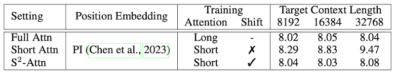

> Llama2 7B, RedPajama 데이터셋, perplexity: PG19 검증 데이터셋에서 측정

---

### 15.1.2 Finetuning Normalization and Embedding

기존 full fine-tuning LoRA와 성능 격차를 줄이기 위해서, **Input Embedding**, **Normalization** 두 레이어를 함께 미세조정한다.

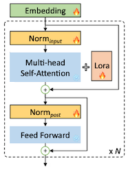

> 🔥: 미세조정 대상 레이어

Llama2 7B 기준으로 정규화 레이어 파라미터는 불과 0.004%를 차지한다. 그러나 Input Embedding과 함께 미세조정하는 것으로 full FT와의 격차를 크게 줄일 수 있다.

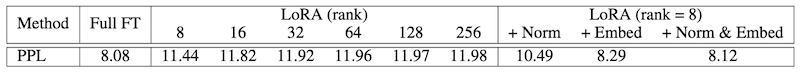

> Llama2 7B, RedPajama 데이터셋, 32758 target context length, perplexity: PG19 검증 데이터셋에서 측정

---

### 15.1.3 LongLoRA: Results

다음은 다양한 context length 설정에서 perplexity와 학습 시간을 측정한 결과다. perplexity는 기존 Full FT(파란색)과 유사한 성능을 획득하면서, 학습 시간은 최대 1.8x 단축하였다.

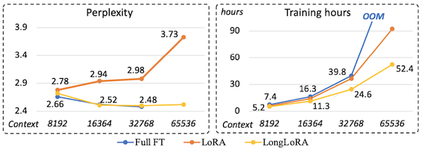

> Llama2-7B, Flash-Attention-2, proof-pile 테스트 데이터셋

또한, 32768 context length 설정으로 passkey retrieval task를 수행한 결과, LongLoRA가 기존 LoRA보다 우수한 성능을 보였다.

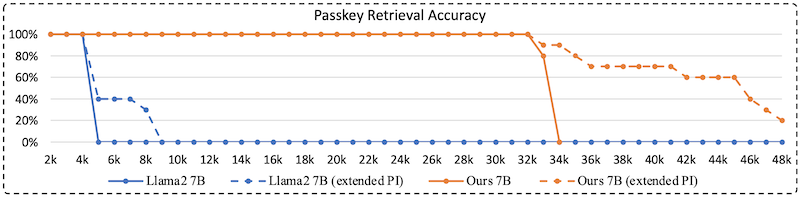

> extended PI: 추가 미세조정 없이 position interpolation으로 48k까지 확장한 설정

> **Notes**: **Passkey Retrieval Task**
>
> - 매우 긴 문서에 passkey를 삽입하고, 마지막에 해당 passkey를 질문한다.
>
> 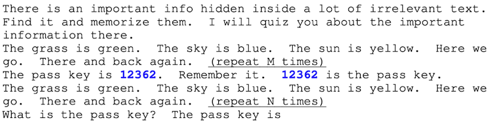

---

## 15.2 Evaluation of Long-Context LLMs

> 평가의 어려움: 모델이 유창하게 긴 응답을 생성한다고 해서, long-context를 잘 이해한다고 보장할 수 없다.

---

### 15.2.1 The Lost in the Middle Phenomenon

> [Lost in the Middle: How Language Models Use Long Contexts 논문(2023)](https://arxiv.org/abs/2307.03172)

위 논문에서는 long context를 이해하는 능력을 평가하기 위해, 문맥 내부에서 관련 정보를 식별해야 하는 두 가지 task에서 LLM의 성능을 측정하였다.

> multi-document question answering, key-value retrieval

질문과 관련된 정보가 문서의 시작과 끝에 위치하면 높은 정확도를 보이지만, 중간에 위치하면 낮은 정확도를 보이는 현상을 관찰하였다. (**Lost in the Middle**)

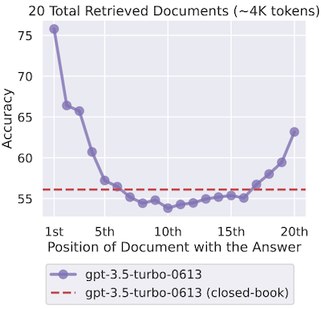

---

### 15.2.2 Needle In A Haystack Analysis

> [gkamradt github: Needle In A Haystack](https://github.com/gkamradt/LLMTest_NeedleInAHaystack)

**needle in a haystack**은 LLM이 long context에서 특정 정보를 얼마나 잘 찾는지 평가하기 위한 벤치마크이다. (in-context retrieval ability)

| Terminology | Description | Example |
| --- | --- | --- |
| **needle** | 삽입하는 특정 정보 | "eating a sandwich" |
| **haystack** | long context | "The best thing in San Francisco is eating a sandwich and sitting Dolores Park on a sunny day." |

> 질문: "What is the best thing to do in San Francisco?"

GPT-4 128K 대상 실험에서도, 약 25% depth부터는 정확도가 0%까지 떨어지는 측정 결과를 관찰할 수 있다. (긴 context length 설정일수록 두드러진다.)

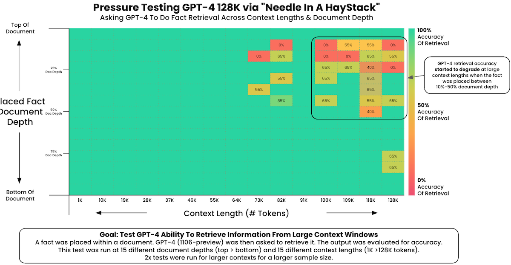

> x: context length, y: depth, 색상: retrieval 정확도

---

### 15.2.3 LongBench

> [LongBench: A Bilingual, Multitask Benchmark for Long Context Understanding 논문(2023)](https://arxiv.org/abs/2308.14508)

위 논문에서는 long-context를 이해하는 능력을 평가하기 위한 벤치마크로 **LongBench**를 소개하였다.

- 6개 task(e.g., QA, summarization), 21개 dataset 포함 (영어, 중국어 제공)

- 최대 13,000+ token 지원

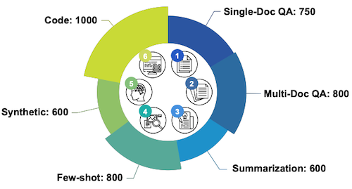

---

## 15.3 Challenges of Deploying Long-Context LLMs

---

### 15.3.1 Recap: KV Cache

long context를 다루는 LLM은 그만큼 큰 KV cache size를 필요로 한다.

- Llama-2-70B, KV cache size

$$ \underset{minibatch}{BS} * \underset{layers}{80} * \underset{heads}{64} * \underset{n_{emd} }{128} * \underset{length}{N} * \underset{K,V}{2} * {2}\mathrm{bytes} = 2.5\mathrm{MB} \times BS \times N $$

> bs=1, n_seq=512: 1.25GB

> bs=16, n_seq=4096: 160GB (= A100 x2)

배치 사이즈에 따라서는 모델 사이즈보다도 큰 KV cache가 필요할 수 있다.

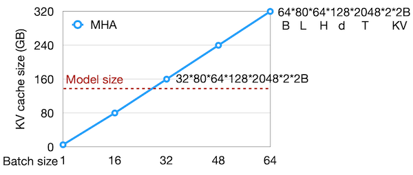

---

### 15.3.2 Extensive VRAM Memory Usage

> [Tom Aarsen github: Attention Sinks in Transformers for endless fluent generation](https://github.com/tomaarsen/attention_sinks)

다음은 3가지 attention 방식에서, 입력 길이에 따른 perplexity(실선)와 VRAM 사용량(점선)을 비교한 도표이다.
 (Llama2-7B 모델)

| Attention | VRAM | Perplexity |
| --- | --- | --- |
| **transformer**(초록색) | 선형 증가 | 사전학습 길이를 넘으면 성능 저하(4K~) |
| **windowed**(주황색) | 1024개 토큰 유지 | 첫 토큰이 window를 벗어나면(evicted) 성능 저하 |

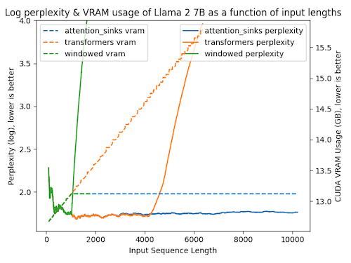

---

## 15.4 StreamingLLM

> [Efficient Streaming Language Models with Attention Sinks 논문(2023)](https://arxiv.org/abs/2309.17453)

streaming application 환경에서는 끊임없이 챗봇과 대화할 수 있어야 한다. 그러나, LLM의 decoding 과정에서는 굉장히 많은 메모리를 필요로 한다.

위 논문에서는 성능 저하를 방지하면서 OOM을 방지하는 해결책으로, StreamingLLM 프레임워크를 제안하였다.

---

### 15.4.1 The Limits of Window Attention

OOM을 방지하기 위한 방법으로, window attention처럼 local token만 캐싱하는 연산을 고려할 수 있다.

- (텍스트 길이 > 캐시 크기) 그러나 첫 토큰이 윈도우를 벗어나는 순간, 성능이 급격히 저하된다.

| Window Attention | Perplexity |
| :---: | :---: |
| 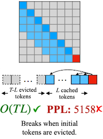 |  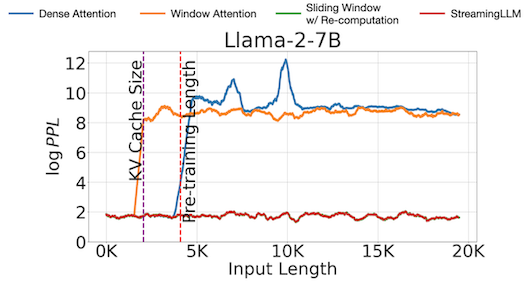 |

> 주황색: window attention, 파란색: dense attention

> | Dense | Window | Sliding Window w/ Re-computation | 
> | :---: | :---: | :---: |
> | 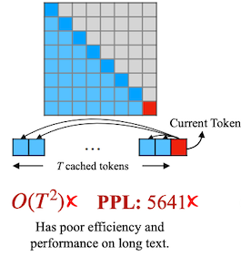 |  | 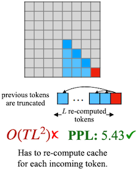 |
> | $O(T^2)$ ✘ | $O(TL)$ ✔ | $O(TL^2)$ ✘ |
> | **PPL**: 5641 ✘ | **PPL**: 5158 ✘ | **PPL**: 5.43 ✔ |

---

### 15.4.2 Attention Sink Phenomenon

또한, 논문에서는 첫 번째 토큰에 heavy attention이 집중되는 **attention sink** 현상을 관찰하였다.

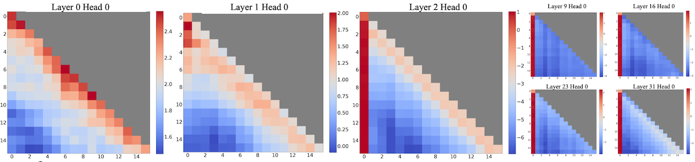

> Llama2-7B, 256 sentences(length 16)

참고로 이전 SpAtten 논문에서도 유사한 현상을 관찰하였는데, 당시에도 첫 번째 토큰만은 prune되지 않았다.

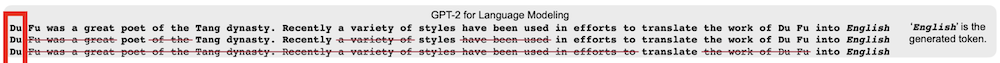

논문에서는 attention sink 현상의 원인으로 softmax를 지목한다. softmax는 총합이 1이 되어야 하는데, 이를 위해 첫 번째 토큰의 score가 과도하게 커지게 된다.

$$ \mathrm{Softmax} (x)_i = \frac{e^{x_i}}{e^{x_1} + \sum_{j=2}^{N}e^{x_j}}, \quad x_1 \gg x_j, j \in 2, \cdots, N $$

첫 번째 토큰은 이어지는 토큰에서 항상 관찰할 수 있으므로(autoregressive language modeling), 편향이 발생하는 지점이 된다.

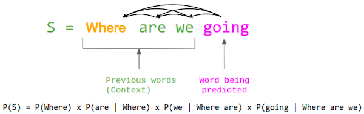

---

#### 15.4.2.1 Position vs. Semantics

그렇다면 첫 번째 토큰에 편향이 일어나는 이유는 단순 position 때문일까, 아니면 첫 번째 토큰이 갖는 semantics 때문일까?

다음은 Llama-2-13B 모델을 대상으로 한 실험으로, 토큰 앞에 `"\n"` 4개를 삽입하는 것으로 perplexity가 회복된 결과를 볼 수 있다.

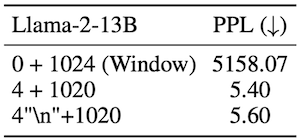

즉, 이러한 편향은 **position** 때문이다.

---

### 15.4.3 StreamingLLM Framework

이러한 관찰을 바탕으로, StreamingLLM에서는 KV cache에 항상 attention sink token(첫 번째 토큰)을 유지한다.

| Attention | KV Cache |
| :---: | :---: |
|  | 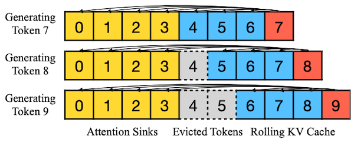 |

구현에서는 토큰의 텍스트 내 원래 위치가 아닌, 캐시 내 위치를 기준으로 relative distance와 positional information을 계산한다.

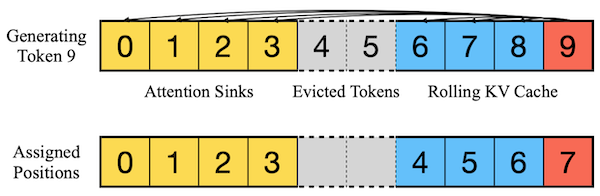

---

### 15.4.4 Streaming Performance

기존 3가지 attention 방식과 비교한 실험에서, StreamingLLM(빨간색)이 가장 우수한 perplexity를 달성하였다.

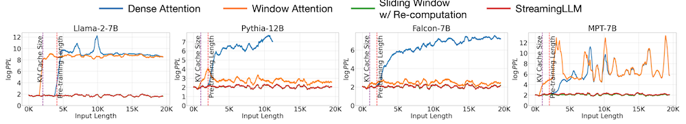

다음은 최대 4M 길이에 달하는 long-context에서의 성능을 비교한 결과다.

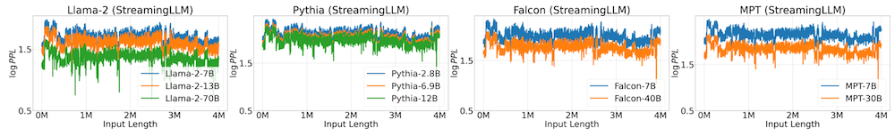

---

### 15.4.5 Efficiency

sliding window w. re-computation은 윈도우 내부에서 quadratic attention 계산이 필요하다. 이와 비교했을 때, StreamingLLM은 최대 22.2x 지연 시간을 단축할 수 있었다.

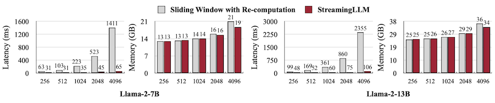

---

### 15.4.6 Ablation Study: \#Attention Sinks

추가로 논문에서는, 유지해야 하는 attention sink의 개수를 ablation study에서 검증하였다.

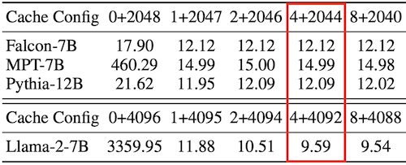

---

### 15.4.7 Pre-training with a Dedicated Attention Sink

반대로, 오직 하나의 attention sink 토큰만 필요하도록 LLM을 학습할 수도 있다. 논문에서는 모든 학습 샘플에서, 첫 번째 토큰으로 extra learning token을 삽입하는 방법을 제안하였다.

> **Notes**: sink token을 추가(주황색)해도 유사한 loss 곡선으로 수렴한다.
>
> 

실제로, 해당 토큰을 추가한 모델에서는하나의 attention sink만 유지해도 성능이 크게 저하되지 않았다.

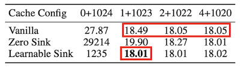

---