# 15 Long-Context LLM

> [EfficientML.ai Lecture 15 - Long-Context LLM (MIT 6.5940, Fall 2024, Zoom Recording)](https://youtu.be/D3NlVsFod8w)

긴 문서나 동영상 프레임을 이해하고 싶다고 하자. 하나의 224x224 크기 이미지를 256 token로 계산하면, 1시간 동영상 기준으로는 약 백만 개 토큰이라는 long context를 처리해야 한다.


컨텍스트 길이에 따라 메모리 사용량 및 지연시간이 극적으로 증가하므로, 이를 효율적으로 처리하는 것이 중요하다. 이때 일반적인 KV cache compression 기법으로는 LLM의 long context 성능을 저하시킬 수 있으므로, 보다 효율적인 접근법이 필요하다.

> 백만 개 토큰 처리 기준, 137GB KV cache 메모리(Llama-3-8B), 92 ms/token 지연시간(Llama-3-7B) 발생

---

## 15.5 DuoAttention: Retrieval and Streaming Heads

> [DuoAttention: Efficient Long-Context LLM Inference with Retrieval and Streaming Heads 논문(2024)](https://arxiv.org/abs/2410.10819)

**DuoAttention**은 long context 성능을 보존하면서 메모리 병목과 지연시간을 최적화하기 위해, 역할을 분할한 attention head 설계를 제안하였다.

- **Retrieval Heads**: earlier context에서 중요 토큰 포착 (w. full KV cache)

- **Streaming Heads**: 최근 토큰 및 attention sink 집중 (w. 최근 토큰으로 구성된 reduced KV cache)

| Heads | Caches |
| :---: | :---: |
| 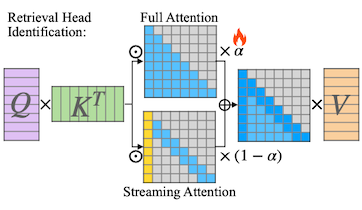 | 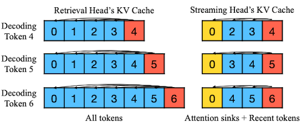 |

> 노란색 토큰: attention sink, $\alpha$ : gate value

다음은 두 head의 attention map 예시로, 각 head가 어디에 집중하는지 관찰할 수 있다.

| Retrieval Head | Streaming Head |
| :---: | :---: |
| 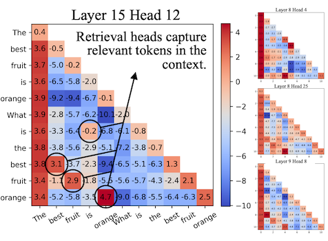 |  |

---

### 15.5.1 Identification of Retrieval Heads

DuoAttention은 LLM 가중치는 고정한 채, head를 구분하는 gate 파라미터 $\alpha$ 만을 학습한다. ( $\alpha$ 가 0에 가까울수록 streaming head 사용 ) 

- gate 값에 따라 두 head의 비중 조절

  - **full attention**: $M_{casual}$ 
  
  - **streaming attention**: $M_{streaming}$

$$\mathrm{attn_{i,j}} = \alpha_{i,j} \cdot \mathrm{full\ attn} + (1 - \alpha_{i,j}) \cdot \mathrm{streaming\ attn}$$

학습은 long-context passkey retrieval task로 이루어지며, passkey 추론 결과를 바탕으로 증류 손실을 계산한다.

- **손실 함수**: full attention만 사용하는 모델에서의 증류 항 + $\alpha$ 를 작은 값으로 유도하는 L1 정규화 항

$$ \mathcal{L_{distill}} = \frac{1}{N} \sum_{i=1}^N \sum_{j=T-l+1}^T (H_{full}^{(i)}[j] - H_{mixed}^{(i)}[j])^2 , \quad \mathcal{L_{reg}} = \sum_{i=1}^{L} \sum_{j=1}^{H} |a_{i,j} | $$

$$ \mathcal{L} = \mathcal{L_{distill}} + \lambda \mathcal{L_{reg}} $$

| Training Sample | Optimized Gate Value<br>(red:1, blue:0) |
| :---: | :---: |
| 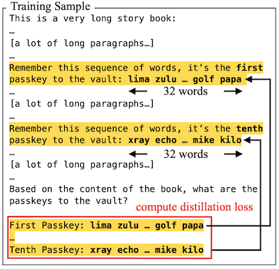|  |

> e.g., Llama2-7B: 약 1천 개 $\alpha$ 만 학습 (32개 레이어 x 32개 MHA) $\rightarrow$ 8 A100 GPUs 기준 몇 시간 내 학습

---

### 15.5.2 DuoAttention: Deployment

streaming head는 고정된 크기(constant)의 KV cache만을 사용하므로, chunked pre-filling에서 메모리 사용량 및 지연시간을 크게 줄일 수 있다.

| Decoding | Chunked Pre-Filling |
| :---: | :---: |
|  | 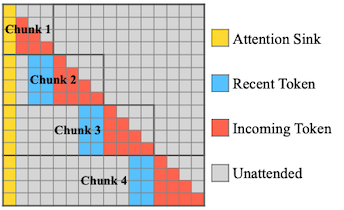 |

- 시간 복잡도: $O(L^2) \rightarrow O(LK)$

- 메모리 복잡도: $O(L) \rightarrow O(K)$

>  $L$ : sequence length, $K$ : chunk size

---

### 15.5.3 DuoAttention: Results

(생략)

---

## 15.6 Quest: Query-Aware Sparsity

> [Quest: Query-Aware Sparsity for Efficient Long-Context LLM Inference 논문(2024)](https://arxiv.org/abs/2406.10774)

KV cache 크기를 압축하는 기존 방법은, (지금은 중요하지 않지만) 나중에 중요한 역할을 하는 token을 제거하여 복구할 수 없는 정보 손실을 유발할 수 있었다.

| Dense Attention | Query-Agnostic Sparsity<br>(StreamingLLM, H2O, etc.) | Query-Aware Sparsity<br>(Quest) |
| :---: | :---: | :---: |
| 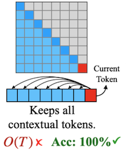 | 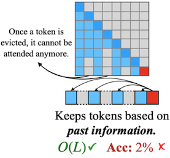 | 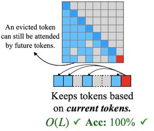 |

> **Notes**: 예를 들어, 토큰 ‘B'는 (A is B 정답인 만큼) current query 'is'(마지막 'is')에서 중요하다. 그러나 이전까지는 어떠한 다른 쿼리에서도 중요하게 계산되지 않는다.
> 
> - 관찰: 중요도(criticality) 판단은 query vector $Q$ 에 굉장히 dependent하게 이루어진다.
> 
> 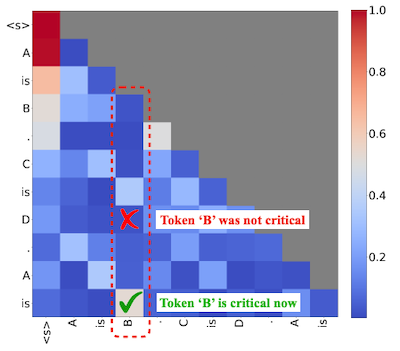

---

### 15.6.1 Query-Aware Sparsity

Quest는 앞선 관찰을 토대로 KV cache page 중요도를 동적으로 계산하는 방법을 제안하였다. 

1. Key 페이지에서 채널별 **max, min** 값( $M_i$ , $m_i$ )만을 메타데이터화 (Reduced Keys)

```c
for i = 1 to dim do
   M_i = max(M_i, k_i)
   m_i = min(m_i, k_i)
end for
```

2. **Current query** $q$ 와 $M_i$ , $m_i$ 으로 채널별 **upper bound** 계산

    > attention weight의 upper bound를 중요도로 사용한다.

```c
Initialize score = 0
for i = 1 to dim do
  score += MAX(q_i * max, q_i * min)
end for
```

3. 중요도 점수에 따라 **Top-k page**만 선택하여 sparse attention 수행

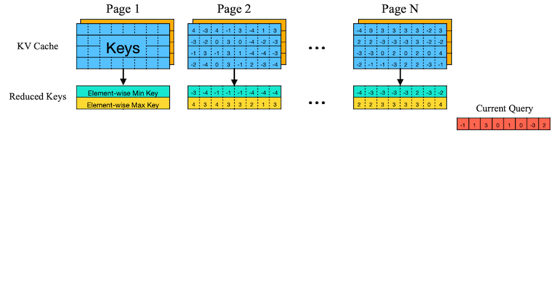

> 파란색, 주황색: 각각 K page, V page

> 예시의 page dim=4이나, 실제로는 16이나 64 차원을 갖는다.

---

### 15.6.2 Quest: Results

(생략)

---

## 15.7 Beyond Transformers: Mamba

> [Mamba: Linear-Time Sequence Modeling with Selective State Spaces 논문(2023)](https://arxiv.org/abs/2312.00752)

> [Maarten Grootendorst: A Visual Guide to Mamba and State Space Models](https://newsletter.maartengrootendorst.com/p/a-visual-guide-to-mamba-and-state)

다음과 같은 관점으로 LLM의 두 가지 중요한 연산을 해석할 수 있다.

- token 간 **communication** = Attention $\rightarrow$ Mamba's SSM 

- 단일 token 내 **computation** = MLPs

**Mamba**는 attention 기반의 communication을 Selective **State Space Models**(SSMs) 구조로 대체한다.

> long sequences 대상으로 linear time processing 달성

| Transformer Block | Mamba Block |
| :---: | :---: |
| 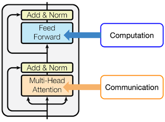 | 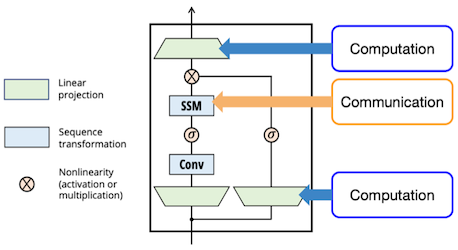 |

---

### 15.7.1 Background: State-Space Models (SSMs)

SSM은 hidden state(입력 시퀀스에 대한 current knowledge), 입력 정보 $x_t$ , 출력 $y_t$ 간의 관계를 모델링한다.

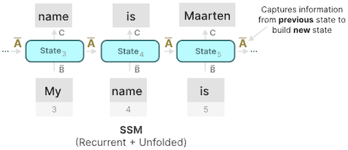

$$ h_t = \bar{A} h_{t-1} + \bar{B} x_t $$

$$ y_t = Ch_t $$

| Matrix | Role | Description |
| --- | --- | --- |
| $A$ | state transition을 제어 | How should I forget or update the state over time? |
| $B$ | 입력을 hidden state로 매핑 | What part of the new input should I remember? |
| $C$ | state를 출력으로 매핑 | How can I use the state for a good prediction? |

학습의 최적화는 **Linear Recurrence**가 **Global Convolution**와 수학적으로 동등하다는 사실을 이용한다.

$$\bar{K} = (C\bar{B}, C\bar{A}\bar{B}, \cdots, C\bar{A}^{k}\bar{B}, \cdots)$$

> **Step 0**: $\bar{B}x_0$
>
> **Step 1**: $\bar{A}h_0 + \bar{B}x_1 = \bar{A} \bar{B}x_0 + \bar{B}x_1$
>
> **Step 2**: $\bar{A}h_1 + \bar{B}x_2 = \bar{A} ( \bar{A} \bar{B}x_0 + \bar{B}x_1 ) + \bar{B}x_2 = \bar{A}^2 \bar{B}x_0 + \bar{A}\bar{B}x_1 + \bar{B}x_2$

---

### 15.7.2 Selective State-Space Model

그러나, SSM에서 행렬 $A, B, C$ 는 모든 입력에 동일(static)하므로, <U>불필요한 부분을 제외하고 선택적으로 집중하는 능력이 떨어진다</U>.

Mamba는 이러한 SSM 모델의 한계를 극복하기 위해 **selective mechanism**을 결합하였다.

- $\triangle_t$ : 현재 입력 $x_t$ 에 집중할지 무시할지 결정 (step size)

- SSM 파라미터 $(\triangle, B, C)$ : **input dependent** (time-varying)

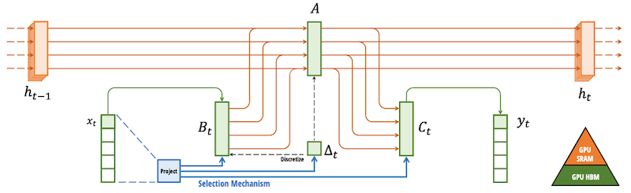

> $\triangle_t$ : 아래 RNN gating과 유사하게 동작하며, $x_t$ 에 대한 linear projection으로 계산되므로 input dependent하다.
>
> - $\triangle_t$ 가 클수록 현재 입력 $x_t$ 에 집중 (이전 상태를 잊어버림)
>
> $$ h_t = (1 - g_t) h_{t-1} + g_t x_t $$

다음 예시는 step size에 따라 focus가 변화한 모습을 보여준다.

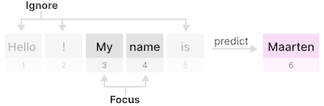

---

### 15.7.3 Fast Training using Parallel Scan

time-varying한 설계 방식의 문제는, 기존처럼 global convolution의 가속화 기법을 적용할 수 없게 만든다. 논문에서는 이를 **Parallel Scan Algorithm**을 활용하여 해결한다.

> **Notes**: 배열의 'prefix sum' 계산하는 알고리즘과 유사 
>
> 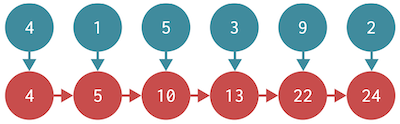

다음 예시는 hidden state $h_0, h_1, h_2, h_3$ 를 병렬로 계산하는 과정으로 이해할 수 있다.

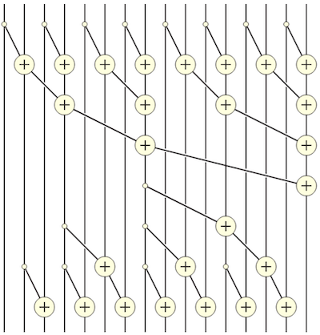

---

### 15.7.4 Hybrid Models: Jamba

> [Jamba: A Hybrid Transformer-Mamba Language Model 논문(2024)](https://arxiv.org/abs/2403.19887)

**Jamba**는 Mixture of Experts(MoE) 모듈을 포함해, Mamba와 Transformer 블록을 결합한 하이브리드 모델이다.

| 단일 Jamba Block | Different Types of Layers |
| :---: | :---: |
| 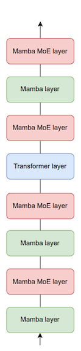 | 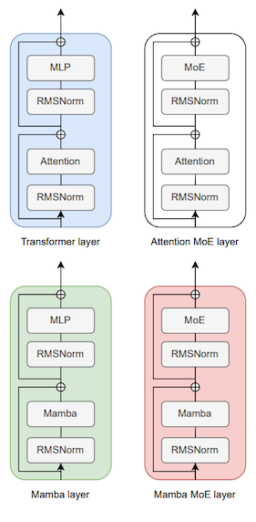 |

---