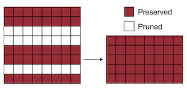
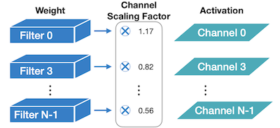

# Lecture 03 - Pruning and Sparsity (Part 1)

> [Lecture 03 - Pruning and Sparsity (Part I) | MIT 6.S965](https://youtu.be/sZzc6tAtTrM)

> [Network Pruning의 개념](https://do-my-best.tistory.com/entry/Network-pruning#----%--pruning%--%EB%B-%A-%EC%-B%-D%---%--Structured%--Pruning)

지금의 AI model size는 너무나 크다. 무엇보다도 memory는 computation보다 더 expensive하다.

data movement가 많아지면 memory reference가 더 생길 수밖에 없다. 결국 더 많은 energy를 필요로 하게 되는 셈이다. 그렇다면 이런 cost를 줄일 수 있는 방법은 없을까?

> 간단하게 model size를 줄이기, activition size 줄이기, workload 줄이기(data를 충분히 빠르게 compute resources에 공급하여 CPU와 GPU의 compute time 낭비를 방지), 더 나은 compiler를 사용하기, 더 나은 scheduling, locality를 늘리기, cache에 더 많은 data를 넣기 등을 떠올릴 수 있다. 

DNN이 갖는 over-parameterization으로 생기는 model inference(추론) 시 높은 cost와 memory footprint를 해결하기 위한 방법으로 pruning을 사용할 수 있다.

> 사실 pruning 자체는 1990년 이미 제시된 기법으로, 1993년에 이미 pruning 이후 남은 weight들을 fine-tuning하는 방법을 제시했다.

> 본 정리는 algorithm 관점에서 data movement를 줄이는 데 초점을 맞춘다.

---

## 3.1 Pruning

인간의 두뇌에서 성장기를 거치면서 synapses per neuron 숫자가 감소하듯이, model에서도 synapses와 neurons을 줄이는 방법이다.

그런데 neuron을 줄이기 위해서는 어떤 neuron이 중요한지, 그렇지 않은지를 인식할 필요가 있을 것이다. 다음은 pruning을 표현한 그림이다.

> 이미 training이 완료된 model에서 weight의 중요도를 파악해서 제거하는 과정이므로, 다른 절차 없이 pretrained model만 가지고 있으면 얼마든지 pruning을 수행해 볼 수 있다.(게다가 fine-tuning도 굉장히 빠른 시간으로 수행할 수 있다.)

- train connectivity: 굉장히 큰 over-parameterized target network를 train한다.

- prune connections: 특정 기준에 따라 각 weight(unit)의 importance를 산정한 다음 중요하지 않은 weight를 pruning한다.

- train weights: pruning 이후 얻은 accuracy lost를 fine tuning 과정으로 복구한다.

> 하지만 pruning의 문제점을 지적하는 논문에서는 pruning을 진행해서 얻은 model을 fine-tuning하기보다는, 그 남겨진 <U>구조</U>을 바탕으로 random initialization을 진행하는 것이 더 바람직하다고 주장한다. pruning 후 남은 weight들이 optimal(최적)한 결과값이 아닐 수 있다는 것이다.

> 다시 말해 pruning을 weight의 importance를 찾아가는 도구보다는, 효과적인 network structure를 찾는 과정으로 바라보는 시각이다. 예를 들어 convolution layer에서 filter를 잘라내는 pruning을, filter 수에 따른 최적의 network을 탐색하는 시각으로 볼 수 있다.

다음은 AlexNet에 pruning을 적용했을 때 accuracy loss를 나타낸 표다.

- 보라색 선: 80%의 parameter를 pruning했을 때 accuracy가 4% 이상 감소했다.(50% 정도까지는 크게 차이가 없다.) 본래 정규 분포를 이루던 data는 다음과 같이 변한다.

    

- 초록색 선: pruning을 거치고 남은 weights(20%)를 가지고 다시 train한다.(fine-tuning) re-train 이후 남은 data 분포는 다음과 같이 smooth하게 변한다.

    

- 빨간색 선: 이 과정를 다시 iterative하게 적용하면서, 거의 accuracy를 잃지 않고 약 90%까지 pruning이 가능하다.

다음은 이런 pruning을 거친 여러 neural network의 변화를 나타낸 표다.

| Neural Network | pruning 이전 parameters | pruning 이후 parameters | 감소치 | MACs 감소치 |
| :---: | :---: | :---: | :---: | :---: |
| AlexNet | 61M | 6.7M | 9배 | 3배 |
| VCG-16 | 138M | 10.3M | 12배 | 5배 |
| GoogleNet | 7M | 2.0M | 3.5배 | 5배 |
| ResNet50 | 26M | 7.47M | 3.4배 | 6.3배 |
| SqueezeNet | 1M | 0.38M | 3.2배 | 3.5배 |

> AlexNet, VCG-16은 fully-connected라서 특히 pruning으로 감소하는 parameter가 많다. 하지만 다른 model들은 이미 어느 정도 compressed된 model이다.

> SqueezeNet 수준으로 작은 model에서는 quantization과 같은 방법이 efficiency를 높이는 좋은 수단으로 쓰일 수 있다.

MAC과 parameter의 변화가 비례하지 않는 이유는, convolution 연산상에서는 여러 항이 존재하며 각자가 미치는 영향이 model마다 다르기 때문이다.

재밌는 점은 NeuralTalk LSTM에서 pruning은 image caption quality를 감소시키지 않고, 오히려 더 간결한 표현으로 특징을 더 잘 설명하기도 한다.

물론 너무 적극적으로 pruning을 하면서 accuracy를 손상시켜서는 안 된다. 따라서 얼마나 pruning을 적용할 것인지를 잘 결정해야 한다.(분석+경험적인 도출)

> 현재는 hardware에서 sparsity를 지원하고 있다. 특정 조건 하에 dense matrix를 sparse matrix로 바꿔서 연산을 수행하여 speedup을 얻는다.

참고로 pruning 실험을 검증하고 비교할 때, **training budget**을 고려할 수 있다. training budget이란 pruning 후 도출된 model을 처음부터 새로 training시킬 때 어느 정도의 epoch를 적용할지를 의미한다. 원래의 큰 model과 같은 epoch로 학습시킨다면, 작은 model에서는 그보다 더 적은 계산이 이루어질 것이므로 공정하지 않은 비교가 될 수 있다.

따라서 model의 FLOPs를 파악하여 계산량을 일치시킨 뒤(작은 model의 epoch를 추가) 진행할 수 있다. 이 방법을 **Scratch-B**라고 한다. 반대로 큰 model과 작은 model을 같은 epoch로 학습시키는 것은 **Scratch-E**라고 지칭한다.

> 하지만 FLOPs만이 아닌 model의 특성도 고려해서 결정해야 한다. 예를 들어 ImageNet에서 큰 model과 작은 model 사이의 FLOPs 차이가 2배가 넘는다고 해도, epoch를 2배보다 늘리는 건 실질적으로 별 도움이 안된다.(그렇다고 해서 full convergence를 시도하는 건 별로 좋은 방법이 아니다.)

---

## 3.1.2 formulate pruning

일반적으로 neural network의 train은 SGD(Stochastic Gradient Descent)을 이용해 loss function를 최소화한다.

$$ \underset{W}{\argmin}{L(\mathbf{x}; W)} $$

- $\mathbf{x}$ : input

- $W$ : original weights

- $W_{p}$ : pruned weights

그런데 pruning에서는 parameter의 개수를 제한한다. (0이 아닌) parameters 개수가 threshold보다 작아야 함을 수식으로 나타내면 다음과 같다.

$$ {||W_{p}||}_{0} < N $$

- ${||W_{p}||}_{0}$ 은 $W_{p}$ 의 nonzero인 값을 계산하며, $N$ 은 target nonzero(threshold)를 의미한다.

---

## 3.2 pruning granularity

현대 computation에서 GPU는 pixel 개별이 아닌 pixel chunk 단위로 효율적으로 계산한다. 마찬가지로 pruning 과정에서 weight들을 개별로 쪼개지 않고(그림의 상단), chunk와 같이 특정한 pattern으로 만든다면(그림의 하단) 더 효율적인 연산이 가능하다.

예를 들어 8x8 형태의 2D weights matrix가 있다고 하자.

pruning은 크게 unstructured/structured 두 가지 방식으로 적용할 수 있다.

> 혹은 미리 layer마다 pruning할 비율을 정하는 predefined(사실상 structured)나, training 과정에서 탐색하는 automatic으로 분류할 수도 있다.

1. **unstructured pruning**

- weight element 단위로 no pattern으로 pruning한다.

- weight 개별로 prune 여부를 결정할 수 있기 때문에, flexible하고 compression ratio가 높다.

- 하지만 특성상 GPU로 accelerate하기에는 어렵다. matrix가 너무 불규칙하기 때문이다.(weight들의 position도 올바르게 저장해야 되기 때문에 overhead가 발생한다.)

    > 물론 해당 sparse matrix에 특화된 hardware(FPGA 등)를 설계한 뒤 acceleration을 수행하면 좋은 결과를 얻을 수 있다.

    > sparse matrix를 효율적으로 계산하도록 조정하지 않으면 추론에서 이득을 얻을 수 없다.(일반적인 라이브러리에서는 추가 조정이 꼭 필요하다.)

    > 대체로 작은 model에서는 structured와 비슷한 accuracy를 가질 수 있지만, 큰 model에 적용하면 structured pruning보다 안 좋은 accuracy를 보인다.

2. **structured pruning**

- entire row를 pruning하는 less flexible한 방법이다.

- 예제에서는 특수한 설계 없이 간단하게 small한 5x8 matrix로 바꿀 수 있다. 다시 말해 쉽게 accelerate가 가능하다.(일반 라이브러리에서도 별다른 조정 없이 speedup 결과를 얻을 수 있다.)

---

## 3.3 pruning at different granularities

convolutional layer의 예시를 보자. convolution layer의 weights는 4개의 dimension을 갖는다.

- $c_{i}$ : input channels (or channels)

- $c_{o}$ : output channels (or filters)

- $k_{h}$ : kernel size height

- $k_{w}$ : kernel size width

4개의 dimension이므로 따라서 더 많은 pruning granularity 가 존재한다. 아래 예시는 $c_{o} = 3, c_{i} = 2, k_{h} = 3, k_{w} = 3$ 에서의 weight matrix다.

그렇다면 위와 같은 다양한 pruning에서 어떤 방법이 제일 효과적일까?

- 극단적인 압축률을 목표로 하는 경우 fine-grained pruning(unstructured)을 선택하고, 이에 specialized hardware를 사용하면 최적의 결과를 얻을 수 있다.

- CPU에서의 acceleration을 원한다면 channel-level이 제일 적합하다.

---

### 3.3.1 pattern-based pruning

다음은 Ampere GPU 이상이면 지원하는 **pattern-based pruning**: N:M sparsity 예시다. N:M sparsity란 M개의 element당 element N개가 prune되는 것을 의미한다.

- 2:4 sparsity case(50% sparsity)

accuracy는 거의 유지하면서 거의 ~2x speedup 성능을 지닌다.

---

### 3.3.2 channel pruning

**channel pruning**은 영향이 적은 channel들을 자르는 방법이다. CPU 관점에서 봤을 때 제일 작업 부하가 적다. channel 수를 줄이는 것으로 direct하게 speedup을 구현할 수 있지만 compression ratio는 낮은 편이다.

예를 들어 ThiNet(2017)에서는 'pruning된 후 channel의 output element( $\hat{x}$ )들의 합'이 '원래 channel의 output element( $\hat{y}$ )들의 합'과 차이가 적은 channel을 중요하지 않다고 판단하고 잘라낸다.

$$ \mathrm{argmin}_{S} \sum_{i=1}^{m}{({\hat{y}_{i}} - \sum_{j \in S}{\hat{x}_{i,j}})^2} $$

$$ s.t. \quad |S| = C \times r, \quad S \subset \lbrace 1,2,...,C \rbrace $$

> s.t. 란 such that, '이러한 조건을 만족하는'이라는 뜻이다.

참고로 이 방법이 모든 channel size를 일정하게 줄이는 uniform shrink보다 더 효율적이다.

---

## 3.4 pruning criterion

그렇다면 어떻게 synapse/neuron의 importance를 알 수 있을까?

---

## 3.4.1 magnitude-based pruning

다음 예시를 보자.

$$ f(\cdot) = ReLU(\cdot), W = [10, -8, 0.1] $$

$$ \rightarrow y = ReLU(10 x_{0} - 8 x_{1} + 0.1 x_{2}) $$

간단한 판단 기준으로 절댓값의 크기(**L1-norm**)를 사용할 수 있다.

$$ Importance = |W| $$

magnitude-based pruning에서는 단순히 절댓값(L1-norm)이 큰 weight가 더 important하다. 위 예시를 예로 들면 weight가 제일 작은 $x_{2}$ 가 바로 prune할 대상이 된다.

각 element별로 이 기준을 적용한다면 다음과 같이 pruning할 수 있다.

혹은 row 전체를 기준으로 적용할 수도 있다. 이 경우 importance는 다음과 같다.

$$ Importance = \sum_{i \in S}{|w_{i}|} $$

row 전체에 L1 norm 대신 L2 norm을 적용할 수도 있다.

$$ Importance = \sqrt{\sum_{i \in S}{{|w_{i}|}^{2}}} $$

그렇다면 training 중에서 neural network가 더 sparse하게 만들 수는 없을까? channel output에 곱해지는 scaling factor을 기준으로 삼아서 filter pruning을 적용할 수도 있다.

다음의 L1-norm based filter pruning 예시를 보자. 

- 각 filter에 속한 weight의 절댓값의 합을 구한다.

    > 따라서 scaling factor는 batch normalization과 연관이 깊다.

여기서 작은 scaling factor를 갖는 channel을 pruning할 수 있다.(절댓값이 작은 filter가 덜 중요하다는 가정)

---

### 3.4.2 second-order-based pruning

다른 접근 방법으로 prunung synapses의 loss function을 기준으로 삼을 수 있다.

- Taylor series로 근사하면 수식은 다음과 같다,

  $$ \delta L = L(x; W) - L(x; W_{p} = W - \delta W) $$

  $$ = \sum_{i}{g_{i}{\delta}w_{i}} + {1 \over 2}\sum_{i}{h_{ii}{\delta}{w_{i}^{2}}}+ {1 \over 2}{\sum_{i \neq j}{h_{ij}{\delta}w_{i}{\delta}w_{j}}}+O({||{\delta}W||}^{3}) $$

  - first order derivative $g_{i} = {{\partial}L \over {{\partial}w_{i}}}$

  - second order derivative $h_{i,j} = {{\partial}^{2}L \over {{\partial}w_{i}{\partial}w_{j}}}$

우선 third order derivative항은 매우 작다고 가정해서 제거할 수 있다.(달리 말하면 objective function $L$ 은 거의 **quadratic**(2차 방정식)에 가깝다.)

또한 neural network traning은 기본적으로 수렴한다. first-order term $g_{i}$ 은 0에 가깝게 수렴하므로 무시할 수 있다.

cross terms에서는 서로 다른 parameter가 independent하다. 따라서 이 term도 무시할 수 있다.

따라서 이들을 제거하고 나서 남는 항은 다음과 같다.

$$ {\delta}{L_{i}} = L(x;W) - L(x; W_{p}|w_{i}=0) \approx {1 \over 2}{h_{ii}{\delta}{w_{i}}^{2}} $$

이제 다음 importance score를 이용해서 어떤 weight를 pruning해야 할지 결정할 수 있다.

$$ {importance}_{w_{i}} = |{\delta}L_{i}| = {1 \over 2}{h_{ii}{w_{i}}^{2}} $$

- 이때 $h_{ii}$ 는 non-negative하다.

그런데 **Hessian matrix**(헤세 행렬. 이계도함수를 행렬로 표현한 것)은 계산이 힘들기 때문에 overhead가 발생하게 된다.

---
