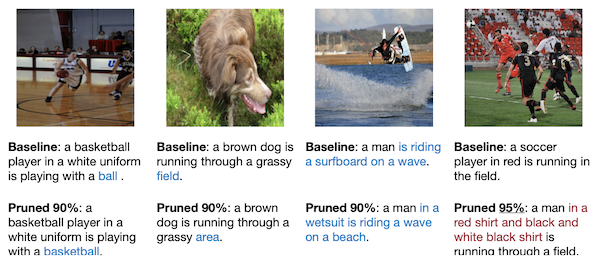
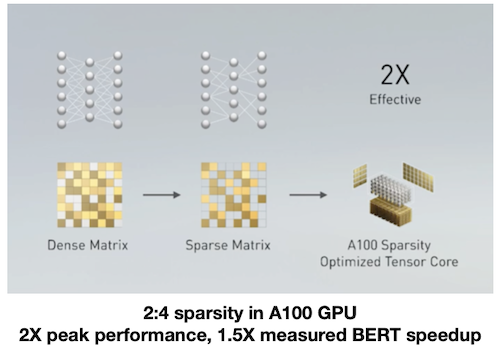
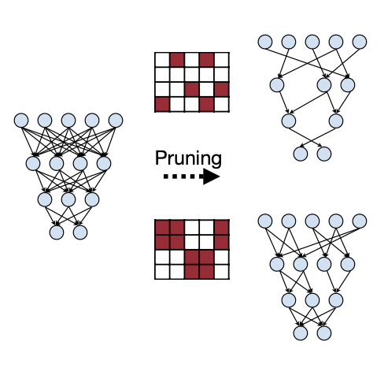
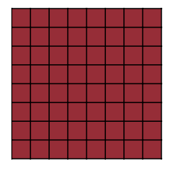
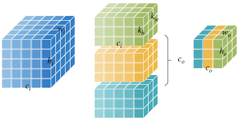
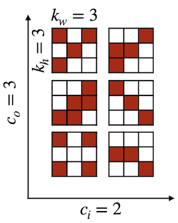
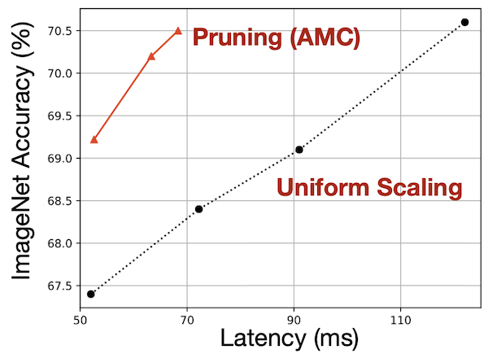
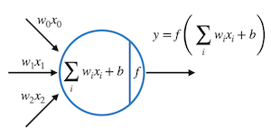

# Lecture 03 - Pruning and Sparsity (Part 1)

> [Lecture 03 - Pruning and Sparsity (Part I) | MIT 6.S965](https://youtu.be/sZzc6tAtTrM)

지금의 AI model size는 너무나 크다. 무엇보다도 memory는 computation보다 더 expensive하다.

data movement가 많아지면 memory reference가 더 생길 수밖에 없다. 결국 더 많은 energy를 필요로 하게 되는 셈이다. 그렇다면 어떻게 이런 cost를 줄일 수 있을까?

> 간단하게 model size를 줄이기, activition size 줄이기, workload 줄이기(data를 충분히 빠르게 compute resources에 공급하여 CPU와 GPU의 compute time 낭비를 방지), 더 나은 compiler를 사용하기, 더 나은 scheduling, locality를 늘리기, cache에 더 많은 data를 넣기 등이 있다. 

> 이 강의는 algorithm 관점에서 data movement 자체를 줄이는 데 초점을 맞춘다.

---

## 3.1 Pruning

인간의 두뇌에서 성장기를 거치면서 synapses per neuron 숫자가 감소하듯이, model에서도 synapses와 neurons을 줄이는 방법이다.

따라서 어떤 neuron이 중요한지, 그렇지 않은지를 인식할 필요가 있으며, 다음이 이를 나타내는 model이다.

다음은 AlexNet에 pruning을 적용했을 때 accuracy loss를 나타낸 표다.

- 보라색 선: 80%의 parameter를 pruning했을 때 accuracy가 4% 이상 감소했다.(50% 정도까지는 크게 차이가 없다.) 본래 정규 분포를 이루던 data는 다음과 같이 변한다.

    

- 초록색 선: pruning을 거치고 남은 weights(20%)를 가지고 다시 train한다. re-train 이후 남은 data 분포는 다음과 같이 smooth하게 변한다.

    

- 빨간색 선: 이 과정를 다시 반복하면서(iterative) 거의 accuracy를 잃지 않고 약 90%까지 pruning이 가능하다.

다음은 이런 pruning을 거친 여러 neural network의 변화를 나타낸 표다.

| Neural Network | pruning 이전 parameters | pruning 이후 parameters | 감소치 | MACs 감소치 |
| :---: | :---: | :---: | :---: | :---: |
| AlexNet | 61M | 6.7M | 9배 | 3배 |
| VCG-16 | 138M | 10.3M | 12배 | 5배 |
| GoogleNet | 7M | 2.0M | 3.5배 | 5배 |
| ResNet50 | 26M | 7.47M | 3.4배 | 6.3배 |
| SqueezeNet | 1M | 0.38M | 3.2배 | 3.5배 |

> AlexNet, VCG-16은 fully-connected라서 특히 pruning으로 감소하는 parameter가 많다. 하지만 다른 model들은 이미 어느 정도 compressed된 model이다.

> SqueezeNet 수준으로 작은 model에서는 quantization과 같은 방법이 efficiency를 높이는 좋은 수단으로 쓰일 수 있다.

MAC과 parameter의 변화가 비례하지 않는 이유는, convolution 연산상에서는 여러 항이 존재하며 각자가 미치는 영향이 model마다 다르기 때문이다.

재밌는 점은 NeuralTalk LSTM에서 pruning은 image caption quality를 감소시키지 않고, 오히려 더 간결한 표현으로 특징을 더 잘 설명하기도 한다.

물론 너무 적극적으로 pruning을 하면서 accuracy를 손상시켜서는 안 된다. 따라서 얼마나 pruning을 적용할 것인지를 잘 결정해야 한다.(분석+경험적인 도출)

> 현재는 hardware에서 sparsity를 지원하고 있다. 특정 조건 하에 dense matrix를 sparse matrix로 바꿔서 연산을 수행하여 speedup을 얻는다.

---

## 3.1.2 formulate pruning

일반적으로 neural network의 train은 SGD(Stochastic Gradient Descent)을 이용해 loss function를 최소화한다.

$$ \underset{W}{\argmin}{L(\mathbf{x}; W)} $$

- $\mathbf{x}$ : input

- $W$ : original weights

- $W_{p}$ : pruned weights

그런데 pruning에서는 parameter의 개수를 제한한다. (0이 아닌) parameters 개수가 threshold보다 작아야 함을 수식으로 나타내면 다음과 같다.

$$ {||W_{p}||}_{0} < N $$

- ${||W_{p}||}_{0}$ 은 $W_{p}$ 의 nonzero인 값을 계산하며, $N$ 은 target nonzero(threshold)를 의미한다.

---

## 3.2 pruning granularity

현대 computation에서 GPU는 pixel 개별이 아닌 pixel chunk 단위로 효율적으로 계산한다. 마찬가지로 pruning 과정에서 weight들을 개별로 쪼개지 않고(그림의 상단), chunk와 같이 특정한 pattern으로 만든다면(그림의 하단) 더 효율적인 연산이 가능하다.

예를 들어 8x8 형태의 2D weights matrix가 있다고 하자.

이를 다음과 같이 pruning하면 어떨까? (pruned된 곳은 흰색으로 표시된다.)

- no pattern인, unstructured pruning

- 따라서 굉장히 flexible하게 pruning할 수 있지만, GPU로 accelerate하기에는 어렵다. 이 matrix를 저장하기에는 너무 불규칙하기 때문이다.(weight들을 저장함과 동시에 weight들의 position도 올바르게 저장해야 되기 때문)(따라서 overhead가 발생)

    > 물론 sparse matrix에 맞춰서 hardware를 설계한 뒤 acceleration을 수행할 수도 있다.

- entire row를 pruning하는 less flexible한 방법(structured)

- 예제라면 특수한 설계 없이 간단하게 small한 5x8 matrix로 바꿀 수 있다. 다시 말해 쉽게 accelerate가 가능하다.

---

## 3.3 pruning at different granularities

convolutional layer의 예시를 보자. convolution layer의 weights는 4개의 dimension을 갖는다.

- $c_{i}$ : input channels (or channels)

- $c_{o}$ : output channels (or filters)

- $k_{h}$ : kernel size height

- $k_{w}$ : kernel size width

4개의 dimenstion이므로 따라서 더 많은 pruning granularity 선택이 가능하다. 아래와 같이 pruning은 다양한 방법으로 시도할 수 있다.

그렇다면 위와 같은 다양한 pruning에서 어떤 방법이 제일 효과적일까?

- 극단적인 압축률을 목표로 하는 경우 fine-grained pruning을 선택하고, 이에 알맞는 spetialized hardware를 사용할 수 있다.

- CPU에서의 acceleration을 원한다면 channel-level이 제일 적합하다.

---

### 3.3.1 pattern-based pruning

다음은 Ampere GPU 이상이면 지원하는 pattern-based pruning: N:M sparsity 예시다. N:M sparsity란 M개의 element당 element N개가 prun되는 것을 의미한다.

- 2:4 sparsity case(50% sparsity)

accuracy는 거의 유지하면서 거의 ~2x speedup 성능을 지닌다.

---

### 3.3.2 channel pruning

channel pruning은 기본적으로 channel 전체를 pruning하게 된다.(예를 들어 256개의 output channel이 있었지만, pruning을 거치면 200개만 남는 식이다.) CPU 관점에서 봤을 때 제일 작업 부하가 적은 방식이다.

channel 수를 줄이는 것으로 direct하게 speedup을 구현할 수 있지만, compression ratio는 낮은 편이다.

참고로 이 방법이 모든 channel size를 일정하게 줄이는 uniform shrink보다 더 효율적이다.

---

## 3.4 pruning criterion

그렇다면 synapses/neurons를 prune해야 할까? less important한 parameter를 제거해야 할 것이다.

---

## 3.4.1 magnitude-based pruning

다음 예시를 보자.

$$ f(\cdot) = ReLU(\cdot), W = [10, -8, 0.1] $$

$$ \rightarrow y = ReLU(10 x_{0} - 8 x_{1} + 0.1 x_{2}) $$

여기서 어떻게 importance를 판단할까? 간단한 판단 기준으로 절댓값의 크기를 사용할 수 있다.

$$ Importance = |W| $$

magnitude-based pruning에서는 단순히 절댓값(L1-norm)이 큰 weight가 더 important하다. 위 예시를 예로 들면 weight가 제일 작은 $x_{2}$ 가 바로 prune할 대상이 된다.

각 element별로 이 기준을 적용한다면 다음과 같이 pruning할 수 있다.

혹은 row 전체를 기준으로 적용할 수도 있다. 이 경우 importance는 다음과 같다.

$$ Importance = \sum_{i \in S}{|w_{i}|} $$

row 전체에 L1 norm 대신 L2 norm을 적용할 수도 있다.

$$ Importance = \sqrt{\sum_{i \in S}{{|w_{i}|}^{2}}} $$

그렇다면 training 중에서 neural network가 더 sparse하게 만들 수는 없을까? channel output에 곱해지는 scaling factor을 기준으로 삼아서 filter pruning을 적용할 수도 있다.

다음 예시를 보자. 

- scale factor는 trainable parameter이다.

> scaling factor는 batch normalization과 연관이 깊다.

여기서 작은 scaling factor를 갖는 channel을 pruning할 수 있다.

---

## pruning ratio

얼마나 pruning해야 model size와 accuracy의 균형점을 찾을 수 있을까?

---

## fine-tune/train pruned neural network

