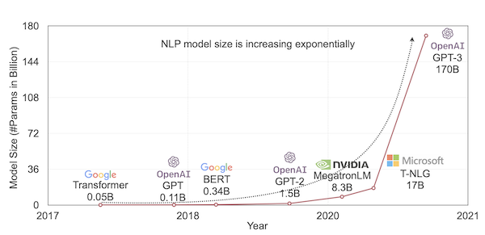
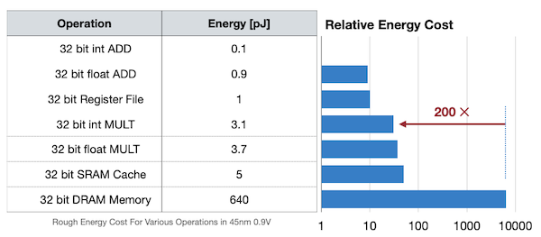
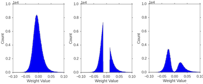
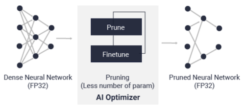
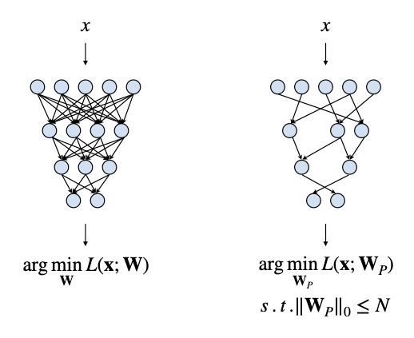
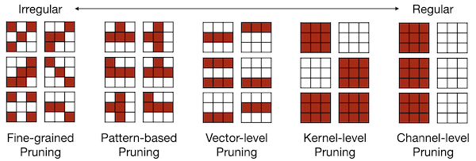
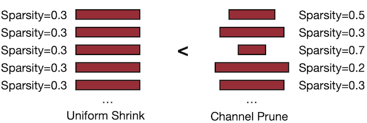
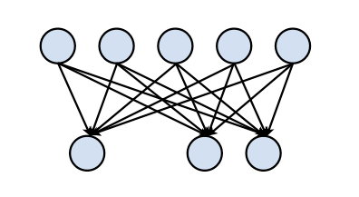
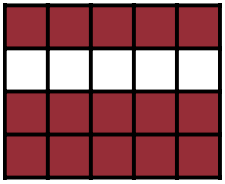
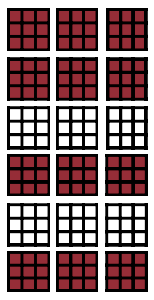

# Lecture 03 - Pruning and Sparsity (Part 1)

> [Lecture 03 - Pruning and Sparsity (Part I) | MIT 6.S965](https://youtu.be/sZzc6tAtTrM)

> [Network Pruning의 개념](https://do-my-best.tistory.com/entry/Network-pruning#----%--pruning%--%EB%B-%A-%EC%-B%-D%---%--Structured%--Pruning)



지금의 AI model size는 너무나 크다. 무엇보다도 메모리 비용은 연산 비용과 비교했을 때 더 expensive하다.



또한 data movement가 많으면 많을수록 memory reference도 필요하고, 결국 더 많은 energy를 필요로 한다. 그렇다면 이런 cost를 어떻게 줄일 수 있을까?

- model/activation size 줄이기

- workload 줄이기(data를 빠르게 compute resources에 공급)

- compiler/scheduler 개선하기

- locality를 활용하기

- cache에 더 많은 data를 보관하기

그중에서도 DNN이 갖는 over-parameterization으로 인한, 추론 시의 high cost와 memory footprint를 해결하기 위한 방법으로 **pruning**(가지치기)을 살펴볼 것이다.

> pruning 자체는 1990년 제시된 기법이다. 1993년에는 pruning 이후 weight를 fine-tuning하는 방법을 제시했다.

---

## 3.1 Pruning

> 인간의 두뇌에서 성장기를 거치면서 synapses per neuron 숫자가 감소하는 것과 비슷하게, model에서도 synapses와 neurons을 줄여주는 방법이다.

그런데 pruning을 이용해 neuron을 줄이기 위해서는 어떤 neuron이 중요한지 그렇지 않은지를 인식할 필요가 있다. 반대로 말하면 pretrained model에서 weight의 중요도만 알고 있다면 얼마든지 pruning을 적용할 수 있다.(+fine-tuning)


- Train Connectivity

    over-parameterized target network를 학습한다.

- Prune Connections

    특정 기준에 따라 weight(unit)의 중요도를 산정한 다음, 중요하지 않은 weight를 **pruning**한다.

- Train Weights

    pruning 이후 accuracy lost는 **fine-tuning**으로 보완한다.

하지만 일부 논문에서는 pruning 후 fine-tuning보다, 남겨진 <U>구조</U>을 바탕으로 random initialization을 진행하는 것이 더 바람직하다고 주장한다. pruning 후 남은 weight들이 optimal하지 않을 수 있다고 지적한다.

> 이 관점에서는 pruning을 네트워크 구조를 효과적으로 탐색하는 도구로 바라본다.

---

### 3.1.1 Pruning and Fine-tuning

다음은 AlexNet에 pruning을 적용했을 때의 accuracy loss를 나타낸 표다.


- Pruning(보라색 선)

    - 50%까지는 accuracy loss가 적다.

    - 80%부터 4% 이상의 accuracy loss가 발생한다.
    
    본래 정규 분포를 이루던 weight 분포는 pruning 후 다음과 같이 변한다.

    

- Pruning+Fine-tuning(초록색 선)

    - 남은 20% weights를 가지고 fine-tuning한다.
    
    fine-tuning 후 남은 weight 분포는 다음과 같이 smooth하게 바뀐다.

    

- Iterative Pruning and Fine-tuning(빨간색 선): 

    위 과정를 반복하여 적용 시, 매우 적은 accuracy lost를 유지하며 weight를 약 90%까지 pruning할 수 있다.

---

### 3.1.2 Neural Network Pruning

다음은 여러 network에 pruning을 적용하고 난 뒤의 결과를 나타낸 표다.

| Neural Network | pruning 전<br/>\#Parameters | pruning 후<br/>\#Parameters | Reduction | MACs<br/>Reduction |
| :---: | :---: | :---: | :---: | :---: |
| AlexNet | 61M | 6.7M | 9배 | 3배 |
| VGG-16 | 138M | 10.3M | 12배 | 5배 |
| GoogleNet | 7M | 2.0M | 3.5배 | 5배 |
| ResNet50 | 26M | 7.47M | 3.4배 | 6.3배 |
| SqueezeNet | 1M | 0.38M | 3.2배 | 3.5배 |

AlexNet, VGG-16과 다르게, compressed model에서는 큰 효과를 보지 못했다. 이런 경우 **quantization**(양자화)와 같은 수단이 더 효과적일 수 있다.

> MACs와 \#Parameters 감소 비율이 비례하지 않는 이유: lec02 정리 참조

특이하게도 NeuralTalk LSTM 같은 모델에서는, pruning이 image caption quality를 감소시키지 않고 오히려 더 간결한 표현으로 특징을 더 잘 설명하기도 한다.


> 물론 너무 적극적으로 pruning을 하여 accuracy를 손상시켜서는 안 된다. 얼마나 pruning을 적용할 것인지를 잘 분석하여 결정해야 한다.

---

### 3.1.3 Pruning in the Industry

- NVIDIA: hardware 수준에서 sparsity matrix을 이용한 가속을 지원하고 있다.

  특정 조건을 만족하면 dense matrix를 sparse matrix로 바꿔서 연산을 가속할 수 있다.(speedup)

    - **2:4 sparsity**: 4개의 parameter로 이루어진 그룹에서 paramter 2개가 0이면 가능하다.

        

- Xilinx: pruning을 통해 정확도 감소를 최소화하면서 model complexity를 5배\~50배까지 줄이는 AI Optimizer를 지원한다.

    

---

### 3.1.4 Training Budget

> [Rethinking the Value of Network Pruning 논문](https://arxiv.org/abs/1810.05270)

위 논문에서는 기존의 pruning 방식에서 크게 두 가지 문제점을 지적한다.

- over-parameterized target network를 학습시키는 과정 자체가 꼭 필요하지 않다.

- 큰 모델을 pruning 후 남은 weight는 작은 모델에서도 optimal하다는 보장은 없다.

따라서 pruning 후 얻은 weight보다도 모델의 구조 자체가 더 유의미하다고 주장한다. 따라서 논문에서는 pruning을 통해 모델을 구한 뒤 from scratch로 학습시킨다.

> 단, **ImageNet**과 같은 <U>큰 데이터셋</U>에서는 모델을 from scratch로 학습시키면 오래 걸릴 뿐더러, <U>fine-tuning보다 저조한 성능을 보이므로</U>에 주의해야 한다.

그런데 이때 scratch로 학습한 이후 기존의 큰 모델과 비교하기 위해서는 **training budget**을 고려해야 한다. 크게 두 가지 방식을 고려할 수 있다. 

- **Scratch-E**

    큰 모델을 학습했을 때와 같은 epoch을 학습시킨다.

- **Scratch-B**

    Scratch-E 방식으로 학습할 경우, 작은 모델에서 한 epoch에 더 적은 연산이 수행된다.(FLOPs) 따라서 연산량을 맞춘 뒤 학습을 진행한다. 

---

## 3.2 formulate pruning



loss function을 **SGD**(Stochastic Gradient Descent)을 이용해 최소화하는 일반적인 학습 과정은 다음과 같은 수식으로 나타낼 수 있다.

$$ \underset{W}{\mathrm{argmin}}{L(\mathbf{x}; W)} $$

- $\mathbf{x}$ : input

- $L$ : objective function

- $W$ : original weights

그런데 여기서 pruning은 \#parameters를 threshold를 두어 제한한다. 정확히는 0이 아닌 \#parameters가 threshold보다 적어야 한다.

$$ \underset{W_p}{\mathrm{argmin}}{L(\mathbf{x}; W_p)} $$

$$ s.t. {||W_{p}||}_{0} \le N $$

> s.t.: subject to

- $W_{p}$ : pruned weights

- ${||W_{p}||}_{0}$ : $W_{p}$ 의 L0 norm

    엄밀히는 norm이 아니며, 벡터에서 0이 아닌 원소의 개수를 의미한다.(\#nonzeros)

- $N$ : threshold

---

## 3.3 pruning granularity


현대 computation에서 GPU는 pixel 개별이 아닌 pixel chunk 단위로 효율적으로 계산한다. 마찬가지로 pruning 과정에서 weight들을 개별로 쪼개지 않고(그림의 상단), chunk와 같이 특정한 pattern으로 만든다면(그림의 하단) 더 효율적인 연산이 가능하다.

예를 들어 8x8 형태의 2D weights matrix가 있다고 하자.


pruning은 크게 unstructured/structured 두 가지 방식으로 적용할 수 있다.

> 미리 layer마다 pruning할 비율을 정하는 predefined(사실상 structured)나, training 과정에서 탐색하는 automatic으로 분류할 수도 있다.

1. **unstructured pruning**


- weight element 단위로 no pattern으로 pruning한다.

- weight 개별로 prune 여부를 결정할 수 있기 때문에, flexible하고 compression ratio가 높다.

- 하지만 특성상 GPU로 accelerate하기에는 어렵다. matrix가 너무 불규칙하기 때문이다.(weight들의 position도 올바르게 저장해야 되기 때문에 overhead가 발생한다.)

    > sparse matrix를 효율적으로 계산하도록 조정하지 않으면 추론에서 이득을 얻을 수 없다.(일반적인 라이브러리에서는 추가적인 조정이 꼭 필요하다.)

    > 물론 해당 sparse matrix에 특화된 hardware(FPGA 등)를 설계한 뒤 acceleration을 수행하면 좋은 결과를 얻을 수 있다.

    > 대체로 작은 model에서는 structured와 비슷한 accuracy를 가질 수 있지만, 대체로 큰 model에서는 structured pruning보다 accuracy가 떨어지는 경향이 있다.

2. **structured pruning**


- entire row를 pruning하는 less flexible한 방법이다.

- 예제 그림에서는 8x8 matrix를 특수한 설계 없이 간단히 5x8 matrix로 바꿨다. 이처럼 쉽게 accelerate가 가능하다.

---

## 3.4 pruning at different granularities

아래 convolutional layer의 예시 그림을 보자. filter의 weights는 다음과 같이 4개의 dimension을 가지고 있다.


- $c_{i}$ : input channels (or channels)

- $c_{o}$ : output channels (or filters)

- $k_{h}$ : kernel size height

- $k_{w}$ : kernel size width

4개의 dimension이므로 더 많은 pruning granularity가 존재한다. 아래 그림은 $c_{o} = 3, c_{i} = 2, k_{h} = 3, k_{w} = 3$ 에서의 weight matrix다.




그렇다면 이런 다양한 pruning에서 어떤 방법이 제일 효과적일까?

- 극단적인 압축률을 목표로 하는 경우 fine-grained pruning(unstructured)을 선택하고, 이에 specialized hardware를 사용하면 최적의 결과를 얻을 수 있다.

- CPU에서의 acceleration을 원한다면 channel-level이 제일 적합하다.

- pattern-based pruning

    다음은 Ampere GPU 이상이면 지원하는 **pattern-based pruning**: N:M sparsity 예시다. N:M sparsity란 M개의 element당 element N개가 prune되는 것을 의미한다.

    - 2:4 sparsity case(50% sparsity)

    

    accuracy는 거의 유지하면서 거의 ~2x speedup 성능을 지닌다.

- channel pruning

    **channel pruning**은 importance가 작은 channel들을 자르는 방법이다. CPU 관점에서 봤을 때 제일 작업 부하가 적다. 이렇게 channel 수를 줄이는 것으로 direct하게 speedup을 구현할 수 있지만, 대신 compression ratio는 낮은 편이다.

    

    ThiNet(2017)에서는 'pruning된 후 channel의 output element( $\hat{x}$ )들의 합'이 '원래 channel의 output element( $\hat{y}$ )들의 합'과 차이가 적은 channel을 중요하지 않다고 판단하고 잘라낸다.

```math
\underset{S}{\mathrm{argmin}} \sum_{i=1}^{m}{({\hat{y}_{i}} - \sum_{j \in S}{\hat{x}_{i,j}})^2}
```

$$ s.t. \quad |S| = C \times r, \quad S \subset \lbrace 1,2,...,C \rbrace $$

참고로 channel pruning이 모든 channel size를 일정하게 줄이는 uniform shrink보다 더 효율적이다.




---

## 3.5 pruning criterion

그렇다면 어떻게 synapse/neuron의 importance를 알 수 있을까?

---

## 3.5.1 magnitude-based pruning

다음 예시를 보자.


$$ f(\cdot) = ReLU(\cdot), W = [10, -8, 0.1] $$

$$ \rightarrow y = ReLU(10 x_{0} - 8 x_{1} + 0.1 x_{2}) $$

간단한 판단 기준으로 절댓값의 크기(**L1-norm**)를 사용할 수 있다.

$$ Importance = |W| $$

magnitude-based pruning에서는 단순히 절댓값(L1-norm)이 큰 weight가 더 important하다. 위 예시를 예로 들면 weight가 제일 작은 $x_{2}$ 가 바로 prune할 대상이 된다.

각 element별로 이 기준을 적용한다면 다음과 같이 pruning할 수 있다.


혹은 row 전체를 기준으로 적용할 수도 있다. 이 경우 importance는 다음과 같다.

$$ Importance = \sum_{i \in S}{|w_{i}|} $$


row 전체에 L1 norm 대신 L2 norm을 적용할 수도 있다.

$$ Importance = \sqrt{\sum_{i \in S}{{|w_{i}|}^{2}}} $$


그렇다면 training 중에서 neural network가 더 sparse하게 만들 수는 없을까? channel output에 곱해지는 scaling factor을 기준으로 삼아서 filter pruning을 적용할 수도 있다.

다음의 L1-norm based filter pruning 예시를 보자. 


- 각 filter에 속한 weight들의 절댓값의 합(L1-norm)을 구한다.

    > scaling factor는 batch normalization과 연관이 깊다.

여기서 작은 scaling factor를 갖는 channel을 pruning할 수 있다.(절댓값이 작은 filter가 덜 중요하다는 가정이다.)


---

### 3.5.2 second-order-based pruning

다른 접근 방법으로 pruning synapses의 loss function을 기준으로 삼을 수 있다.

- loss function에 Taylor series 근사를 적용하면 수식은 다음과 같다,

$$ \delta L = L(x; W) - L(x; W_{p} = W - \delta W) $$

$$ = \sum_{i}{g_{i}{\delta}w_{i}} + {1 \over 2}\sum_{i}{h_{ii}{\delta}{w_{i}^{2}}}+ {1 \over 2}{\sum_{i \neq j}{h_{ij}{\delta}w_{i}{\delta}w_{j}}}+O({||{\delta}W||}^{3}) $$

- first order derivative $g_{i} = {{\partial}L \over {{\partial}w_{i}}}$

- second order derivative $h_{i,j} = {{\partial}^{2}L \over {{\partial}w_{i}{\partial}w_{j}}}$

우선 third order derivative항( $O({||{\delta}W||}^{3})$ )은 매우 작다고 가정하고 제거할 수 있다.(objective function $L$ 은 거의 **quadratic**(2차 방정식)에 가깝다.)

또한 neural network traning은 기본적으로 수렴한다. first-order term $g_{i}$ 은 0에 가깝게 수렴하므로 무시할 수 있다.

cross terms( $h_{ij}{\delta}w_{i}{\delta}w_{j}$ )에서는 parameter들은 서로 independent하다. 이 term도 무시할 수 있다.

따라서 이들을 제거하고 나서 남는 항은 다음과 같다.

$$ {\delta}{L_{i}} = L(x;W) - L(x; W_{p}|w_{i}=0) \approx {1 \over 2}{h_{ii}{\delta}{w_{i}}^{2}} $$

이제 다음 importance score를 이용해서 어떤 weight를 pruning해야 할지 결정할 수 있다.

```math
{importance}_{w_{i}} = |{\delta}L_{i}| = {1 \over 2}{h_{ii}{w_{i}}^{2}}
```

- 이때 $h_{ii}$ 는 non-negative하다.

하지만 **Hessian matrix**(헤세 행렬. 이계도함수를 행렬로 표현한 것)은 계산이 복잡하기 때문에 overhead가 발생하게 된다.

---

### 3.5.3 selection of neurons to prune

- neuron pruning in linear layer

    어떤 neuron이 중요한지 확인하기 위한 좋은 수단으로 magnitude-based pruning을 사용할 수 있다. 다음은 linear layer에서 한 neuron을 pruning한 모습이다.

    

    pruning된 neuron과 연관된 모든 connection이 사라지므로, weight matrix에서 row 하나가 아예 사라지게 된다.

    

- channel pruning in convolution layer

    다은은 convolution layer에서의 channel pruning을 적용한 그림이다. 

    

    output의 channel을 pruning한다는 것은, 그 이전 단계에서 해당 output channel을 구성한 filter를 자르는 것과 동일하다.

    

    그림처럼 3x3 filter가 row 단위로 사라지게 된 모습을 확인할 수 있다.

---

### 3.5.4 percentage-of-zero-based pruning

다음 예시를 보자. ReLU activation을 거쳐 나온 output activations이다.


- ReLU activation을 거치기 때문에 0을 갖는 값들이 생긴다.

- 2개의 batch(2개의 서로 다른 image)

- 각 image는 4x4 resolution에 3 channel을 갖는다.

이제 각 image에서 어떤 channel을 pruning할지 결정해야 한다. 그런데 batch dimension이 있기 때문에, 한 batch에 적용되는 prune pattern이 다른 batch에도 적용되므로 batch 양쪽을 다 고려해서 선택해야 한다.

기본적으로는 **Average Percentage of Zeros**(APoZ), 즉 channel에 있는 0의 비율을 기준으로 판단한다.

- 두 batch의 channel 0: 4x4 resolution 2개에, 0이 총 5+6개 존재한다.

$$ {{5+6} \over {2 \cdot 4 \cdot 4}} = {11 \over 32} $$

- 두 batch의 channel 1: 4x4 resolution 2개에, 0이 총 5+7개 존재한다.

$$ {{5+7} \over {2 \cdot 4 \cdot 4}} = {12 \over 32} $$

- 두 batch의 channel 2: 4x4 resolution 2개에, 0이 총 6+8개 존재한다.

$$ {{6+8} \over {2 \cdot 4 \cdot 4}} = {14 \over 32} $$

channel 2가 제일 0의 비율이 많다. 이 channel을 pruning할 수 있다.

---

### 3.5.5 regression-based pruning

loss function을 고려하는 대신 regression을 기반으로 한 heuristic한 방법으로, 'original output'과 'pruning한 output'의 차이가 제일 적은 channel을 pruning한다.

다음과 같이 original output $Z$ 와 pruning을 거친 $\hat{Z}$ 가 있다.


$$ Z = XW^{T} = \sum_{c=0}^{c_{i}-1}{X_{c}{W_{c}}^{T}} $$


regression-based pruning의 목표는 다음과 같이 수식으로 나타낼 수 있다.

```math
{\mathrm{arg}}\underset{W, {\beta}}{\mathrm{min}}{||Z-\hat{Z}||}^{2}_{F} = || Z - \sum_{c=0}^{c_{i}-1}{||{{\beta}_{c}X_{c}{W_{c}}^{T}}||}^{2}_{F}
```

```math
s.t. \quad {||\beta||}_{0} \le N_{c}
```

- $\beta$ : length가 $c_i$ 인 coefficient vector. $\beta = 0$ 이라면 channel이 prune된다.

- $N_{c}$ : nonzero channel 수

---