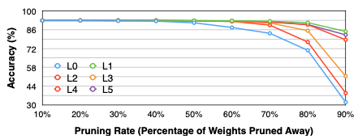
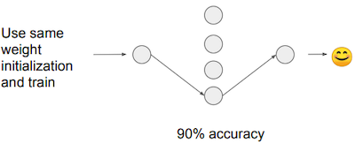
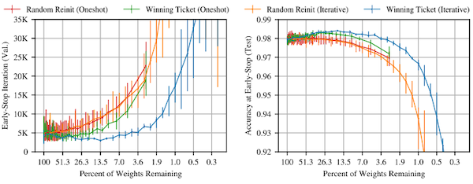
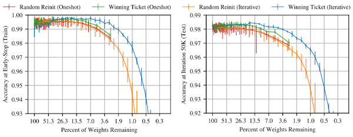

# Lecture 04 - Pruning and Sparsity (Part II)

> [Lecture 04 - Pruning and Sparsity (Part II) | MIT 6.S965](https://youtu.be/1njtOcYNAmg)

> [EfficientML.ai Lecture 4 - Pruning and Sparsity (Part II) (MIT 6.5940, Fall 2023, Zoom recording)](https://youtu.be/sDJymyfAOKY?si=uXQDRHl50SIk-37Y)

---

## 4.1 Pruning Ratio

> [AMC: AutoML for Model Compression and Acceleration on Mobile Devices 논문(2018)](https://arxiv.org/abs/1802.03494)

최적의 **pruning ratio**는 다양한 특성을 고려하여 도출된다. 다음은 CIFAR-10 데이터셋으로 학습한 VGG-11 모델의 6개 레이어를 대상으로, pruning에 얼마나 민감한지 비교한 실험이다.(sensitivity analysis)



- $L_i$ : $i$ 번째 레이어

- pruning ratio $r \in \lbrace 0, 0.1, 0.2, ..., 0.9  \rbrace$ 

- 정확도 감소 ${\triangle} {Acc}_{r}^{i}$ 가 제일 큰 레이어: $L0$ 

  해당 레이어가 제일 pruning에 민감함을 알 수 있다. 

단, 이렇게 얻은 pruning ratio는 optimal하지는 않은데, 레이어의 세부적인 특징이나 interection을 고려하지 않았기 때문이다.

> 예를 들어 레이어 크기가 작다면, pruning ratio를 크게 설정해도 정확도 감소가 작을 수밖에 없다.

---

## 4.2 Finding Pruning Ratio: Learn to Prune

따라서, 최적의 pruning ratio를 찾고자 하는 다양한 방법이 제시되었다.

---

### 4.2.1 Reinforcement Learning based Pruning: AMC

> [AMC: AutoML for Model Compression and Acceleration on Mobile Devices 논문(2018)](https://arxiv.org/abs/1802.03494)

**AMC**(AutoML for Model Compression) 논문에서는, pruning ratio를 **Reinforcement Learning**(강화 학습) 기반으로 획득한다.


- DDPG(Deep Deterministic Policy Gradient) agent

  - action $a_i$ : sparsity ratio

  - 레이어 $t$ 의 embedding state $s_t$ 를 입력으로, action $a_t$ 를 출력한다.

```math
s_t = [N, C, H, W, i, ...]
```

- Reward = -Error(error rate)

  - 제약조건(latency, FLOPs, model size 등)에 따라 패널티를 부여할 수 있다.

    > 예: Reward = -Error \* log(FLOP)

  - 제약조건을 만족하지 않는 경우, $-\infty$ 를 사용한다.

```math
R = \begin{cases} -Error, & if \ satisfies \ constraints \\ -\infty , & if \ not \end{cases}
```

---

#### 4.2.1.1 AMC: Results

다음 그림은 ImageNet 데이터셋으로 학습한 ResNet-50 대상에서 획득한 레이어별 sparsity ratio이다. (pruning policy) 


> y축: density(\#non-zero weights/ \#total weights)

> density가 작다 = \#non-zero weight가 적다 = 높은 sparsity ratio

- **peaks**

  대체로 1x1 convolution으로 pruning에 민감하다.

- **crests**
  
  대체로 3x3 convolution으로, 더 aggressive하게 pruning할 수 있다.

MobileNet 대상으로 한 실험에서는, (Galaxy S7 Edge에서 추론했을 때) 25%의 pruning ratio로 1.7x speedup을 획득했다.


> convolution 연산 항에 입력 채널과 출력 채널이 포함되어 있다. 두 항이 모두 3/4로 줄어드는 효과이므로, quadratic speedup을 획득한 것이다.

---

### 4.2.2 Rule based Pruning: NetAdapt

> [NetAdapt: Platform-Aware Neural Network Adaptation for Mobile Applications 논문(2018)](https://arxiv.org/abs/1804.03230)

**NetAdapt**에서는 feedback loop 기반으로, global 제약 조건(예: latency)을 만족할 때의 레이어별 최적 pruning ratio를 찾는다.

> 다음 설명에서 제약 조건은 latency로 가정한다. 

| | |
| :---: | :---: |
|  |  |

- 1 iteration: 하나의 레이어를 대상으로, 제약조건 latency가 reduction $\triangle R$ 만큼 줄어들 때까지 pruning한다.

  > 따라서 \#models = \#iterations이다.

  - reduction $\triangle R$ : 수동으로 정의한다.

  - latency: LUT 기반 예측을 통해 측정한다.

전 과정이 끝나면, 가장 큰 정확도를 갖는 pruned layer를 선택한 뒤, short-term(10k iterations) fine-tuning 후 정확도를 측정한다.

---

### 4.2.3 Regularization based Pruning: Network Slimming

> [Learning Efficient Convolutional Networks through Network Slimming 논문(2017)](https://arxiv.org/abs/1708.06519): channel scaling factors에 smooth-L1 regularization 적용

> [Learning both Weights and Connections for Efficient Neural Networks 논문(2015)](https://arxiv.org/abs/1506.02626): weights에 L2 regularization 적용 후 magnitude-based fine-grained pruning

loss function에 **regularization** 항을 추가하여, weight sparsity를 늘릴 수 있다. 

- 주로 가중치와 mask를 함께 학습하며, 다음 문제를 해결한다.

$$ \min_{w,m} \mathcal{L}(w, m) $$

- 주로 가중치(또는 채널, 필터)에 scaling factor $\gamma$ 를 도입하여, sparsity regularization과 공동으로 학습하는 방식으로 구현한다. (예: Network Sliming 논문)

$$ \mathcal{L} = {{1} \over {N}}\sum_{i=1}^{N} l(y_{i}, f(x_i; w, \gamma)) + \lambda \sum_{{\gamma}_i \in \gamma} \mathcal{R}(r_i) $$

참고로 가장 대표적인 regularization 방법인 **L1 Regularization**와 **L2 Regularization**은 다음과 같다.

- L1 Regularization

    - $L$: data loss

    - $\lambda$: regularization strength

```math
L' = L(x; W) + \lambda |W|
```

- L2 Regularization

```math
L' = L(x; W) + \lambda ||W||^2
```

---

### 4.2.4 Meta-Learning based Pruning: MetaPruning

> [MetaPruning: Meta Learning for Automatic Neural Network Channel Pruning 논문(2019)](https://arxiv.org/abs/1903.10258)

MetaPruning 논문에서는 meta network인 PruningNet을 학습하여, pruned network의 가중치를 에측한다. 이를 기반으로 evolutionary search을 이용하여, 제약조건(FLOP, latency 등)을 만족하면서 정확도가 높은 pruned network를 찾는다.

| Training | Searching |
| :---: | :---: |
|  | 


$$ w = \mathrm{PruningNet}(v_1, v_2, \cdots, v_L) $$

> $v_i$ : i번째 레이어의 채널 수

- 입력: network encoding vector $(v_1, v_2, \cdots, v_L)$

- 출력: pruned network의 가중치 $w$

---

## 4.3 Lottery Ticket Hypothesis

> [The Lottery Ticket Hypothesis: Finding Sparse, Trainable Neural Networks 논문(2019)](https://arxiv.org/abs/1803.03635)

> [THE LOTTERY TICKET HYPOTHESIS: FINDING SPARSE, TRAINABLE NEURAL NETWORKS slide](https://ndey96.github.io/deep-learning-paper-club/slides/Lottery%20Ticket%20Hypothesis%20slides.pdf)

> 학습 전에 쓸 모델을, 학습 후에 찾는다는 아이러니함이 있지만, pruning에서 굉장히 중요한 논문에 해당된다.

**Lottery Ticket Hypothesis**(LTH)는, sparse neural network를 from scratch( $W_{t=0}$ )부터 다시 학습하면 정확도가 어떻게 될까라는 의문에 답하는 논문이다.


- pruned architecture + from scratch training (random initialized)

  다시 학습하면, 전보다 더 낮은 정확도를 얻을 가능성이 크다.

  

- **Winning Ticket**

  하지만 (찾기는 어려워도) 기존 dense model보다 적은 패러미터를 가지면서, 더 적은 학습만으로도, 동일한 성능 혹은 이를 능가하는 성능의 sub-network가 존재할 수 있다.

  

---

### 4.3.1 Finding Winning Ticket

Winning Ticket을 찾는 방법으로는, tickets을 많이 사는 전략(overparameterized model 훈련)이 유효하다.

- tickets을 많이 구매

  = overparameterized model

- Winning the Lottery

  = overparameterized model을 high accuracy로 학습

- **Winning Ticket**

  = 탐색을 통해 찾아낸, high accuracy를 갖는 pruned sub-network

---

### 4.3.2 Iterative Magnitude Pruning

winning ticket은 **Iterative Magnitude Pruning** 방법으로 찾아낼 수 있다.

1. dense model training $\rightarrow$ pruning $\rightarrow$ random initialization

    동일한 sparsity pattern(**sparsity mask**)을 갖지만, 다른 weight를 갖는 모델이 되도록 무작위로 초기화한다.

    

2. training $\rightarrow$ pruning

    

3. random initialization

    2번을 통해 얻은 모델을, spasity mask를 바탕으로 무작위 가중치 모델로 초기화

    

4. 2번과 3번 과정을 반복하며 winning ticket를 탐색한다.

단, 이러한 Iterative Magnitude Pruning 방법은, 수렴할 때까지 계속 학습해야 하므로 굉장히 비효율적이다.

---

### 4.3.3 One-Shot Pruning vs Iterative Pruning

one-shot pruning 방법보다, 여러 차례 과정을 반복하는 **Iterative Pruning**이 효과적이다.


다음은 LTH 논문에서 one-shot pruning과 iterative pruning를 비교한 결과다.



- iterative pruning(파란색)이 정확도를 보존하면서 가중치를 더 많이 제거할 수 있다.



- iterative pruning(파란색)이 더 나은 일반화 성능을 보인다.

---

## 4.4 Scaling Limitation

> [Stabilizing the Lottery Ticket Hypothesis 논문(2019)](https://arxiv.org/abs/1903.01611)

> [One ticket to win them all: generalizing lottery ticket initializations across datasets and optimizers 논문(2019)](https://arxiv.org/abs/1906.02773)

하지만 MNIST, CIFAR-10과 같이 작은 데이터셋과 달리, ImageNet과 같이 거대한 데이터셋에서는 from scratch부터 학습해서는 정확도가 복구되지 않는다. 

대신 $k$ iteration만큼 이미 훈련한 뒤의 가중치( $W_{t=k}$ )를 사용하면, fine-tuning을 통해 sub-networks 정확도를 회복할 수 있다.


---

## 4.5 Pruning at Initialization(PaI)

보다 훈련 비용을 낮추기 위해, 훈련 전에 먼저 winning ticket을 찾는 **Pruning at Initialization**(PaI) 방법이 제안되었다.

- Pruning after Training(PaT)

  

- Pruning at Initialization(PaI)

  **학습 전에** pruning한 뒤, 학습을 수행한다.

  

> 대체로 PaI는 PaT에 비해 성능이 떨어지기 때문에, 효율적인 훈련(예: 훈련 속도)을 위한 목적으로 주로 사용한다.

---

### 4.5.1 SNIP: Connection Sensitivity

> [SNIP: Single-shot Network Pruning based on Connection Sensitivity 논문(2018)](https://arxiv.org/abs/1810.02340)

훈련 전에 pruning을 적용하기 위해서, SNIP 논문에서는 **connection sensitivity**를 측정한다.

- $c_j \in \lbrace 0, 1 \rbrace$ : connection mask

  - active: $c_j = 1$ 
  
  - pruned: $c_j = 0$

가중치와 무관하게, 오직 connection의 변화에 따른 손실을 측정하기 위해, 다음과 같이 순차적으로 loss function을 변형한다.

> Variance Scaling을 통해 초기화된 가중치와, 훈련 데이터셋에서 샘플링한 하나의 minibatch를 사용한다.

1. connectivity를 loss fuction에 반영한다.

    - $\mathcal{D}$ : training dataset

    - $\odot$ : Hadamard product

$$ \min_{c,w} L(c \odot w; \mathcal{D}) = \min_{c,w} {{1} \over {n}} \sum_{i=1}^n l(c \odot w ; (x_i, y_i)) $$

$$ \mathrm{s.t.} \quad ||c||_0 \le \kappa$$

2. connection $j$ 에서 active/pruned loss의 차이를 계산한다.

    - $j \in \lbrace 1 \cdots m \rbrace$

    - $e_j$ : $j$ 번째를 제외하고, 모두 0의 값을 갖는 vector

$$ \triangle L_j (w; \mathcal{D}) = L(1 \odot w; \mathcal{D}) - L((1 - e_j) \odot w; \mathcal{D}) $$

3. binary $c_j$ 는 미분 불가능하므로, 다음과 같이 식을 근사한다.

    - $\delta$ : multiplicative perturbation

$$ \triangle L_j (w; \mathcal{D}) \approx g_j (w; \mathcal{D}) = {{\partial L(c \odot w; \mathcal{D})} \over {\partial c_j}}|_{c=1} $$

$$ = \lim_{\delta \rightarrow 0}{{L(c \odot w; \mathcal{D}) - L((c - \delta e_j) \odot w; \mathcal{D})} \over {\delta}}|_{c=1} $$

최종적으로 connection sensitivity는 다음과 같이 정의한다.

$$ s_j = {{|g_{j}(w;\mathcal{D})|} \over {{\sum_{k=1}^m} |g_k(w;\mathcal{D})|}} $$

> 모든 연결의 sensitivity 계산이 끝나면, top- $\kappa$ 개의 연결만을 남기고 pruning한다.

---
