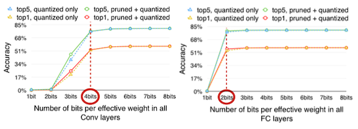
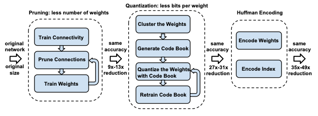
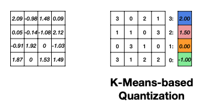
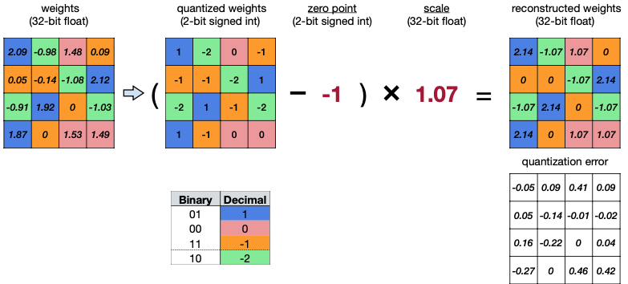
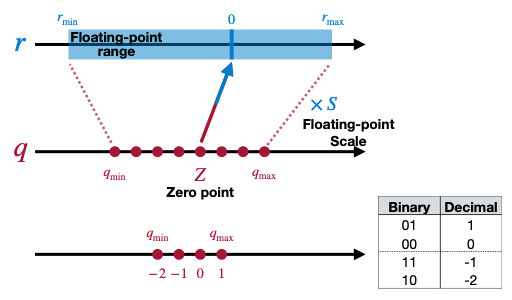
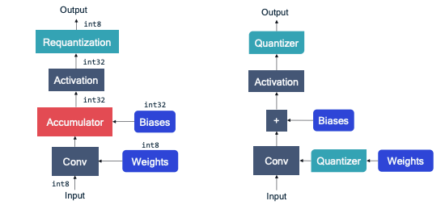

# Lecture 05 - Quantization (Part I)

> [Lecture 05 - Quantization (Part I) | MIT 6.S965](https://youtu.be/91stHPsxwig)

> [A White Paper on Neural Network Quantization](https://arxiv.org/abs/2106.08295)

> [tinyML Talks: A Practical Guide to Neural Network Quantization](https://youtu.be/KASuxB3XoYQ)

> [quantization 정리](https://gaussian37.github.io/dl-concept-quantization/)

---

## 5.1 Numeric Data Types

---

### 5.1.1 Integer

우선 **integer**(정수)를 8bit로 표현한 세 가지 예시를 살펴보자. 


- 첫 번째: unsigned integer

  range: $[0, 2^{n} - 1]$

- 두 번째: (signed integer) Sign-Magnitude

  range: $[-2^{n-1} - 1, 2^{n-1} - 1]$

   > 00000000과 10000000은 모두 0을 표현한다.

- 세 번째: (signed integer) 2-bit complement Representation

  range: $[-2^{n-1}, 2^{n-1} - 1]$

   > 00000000은 0, 10000000은 $-2^{n-1}$ 을 표현한다.

---

### 5.1.2 fixed-point number

소수(**decimal**)를 표현하는 방식은 두 가지가 있다.

- **fixed-point number**(고정 소수점 연산)

- **floating-point number**(부동 소수점 연산)

아래는 8bit fixed-point number를 나타낸 그림이다.


- 맨 앞 1bit는 sign bit로 사용한다.

- 3bits로 integer(정수)를 표현한다.

- 4bits로 fraction(소수)을 표현한다.

> 두 번째와 세 번째 연산의 차이: 소수점( $2^{-4}$ ) 의 위치를 나중에 곱하였다.

위와 같은 예시를 `fixed<w,b>`로 표현할 수 있다. `w`가 총 bit width, `b`가 fraction bit width이다.

> 32bit 예시: 1bit sign bit, 15bit integer, 16bit fraction

---

### 5.1.3 floating-point number

다음은 32bit **floating-point** number의 예시다.(가장 보편적인 **IEEE 754** 방법)


$$ (-1)^{sign} \times (1 + \mathrm{Fraction}) \times 2^{\mathrm{Exponent} - 1} $$

- sign: 부호를 나타내는 1bit

- **exponent**: 지수를 나타내는 8bit

- fraction(mantissa): 가수를 나타내는 23bit

> 32bit(4byte)는 single precision(단정도), 64bit(8byte)는 double precision(배정도)이다.

### <span style='background-color: #393E46; color: #F7F7F7'>&nbsp;&nbsp;&nbsp;📝 예제 1: IEEE 754 표준에 따라 숫자 표현하기 &nbsp;&nbsp;&nbsp;</span>

숫자 -314.625를 IEEE 754 표준에 따라 표현하라.

### <span style='background-color: #C2B2B2; color: #F7F7F7'>&nbsp;&nbsp;&nbsp;🔍 풀이&nbsp;&nbsp;&nbsp;</span>

1. 음수이므로 **sign bit**는 1이다.

2. **fraction**

    -314.625의 절댓값 $314.625$ 를 2진수로 변환하면 ${100111010.101}_{(2)}$ 가 된다.

    - 소수점을 옮겨서 일의 자리 수, 소수점 형태로 만든다. 
    
    - 소수점 부분만을 fraction 23bit 부분에 맨 앞부터 채운다.

      > 남는 자리는  0으로 채운다.

$$ 1.00111010101 \times 2^{8} $$

3. **exponent**

    bias를 계산해야 한다. (bias = $2^{k-1}$ )
    
    - $k$ : exponent 부분의 bit 수를 나타낸다. 
    
    $$2^{8-1} = 127$$

    8 + 127 = 135를 2진수로 변환하면 ${10000111}_{(2)}$ 이 된다.

    - 변환한 2진수를 8bit exponent 부분에 채워준다.

결과는 다음과 같다.

| sign bit | exponent | fraction |
| :---: | :---: | :---: | 
| 1 | 10000111 | 00111010101000000000000 | 

---

### 5.1.4 floating-point number comparison

다양한 floating-point number 표현법을 비교해보자. 특히 neural network에서는 <U>fraction보다도 exponent에 더 민감</U>하기 떄문에, exponent 정보를 최대한 보존하는 표현법이 등장했다.

- underflow, overflow, NaN을 더 잘 처리하기 위해서는, exponent을 최대한 보존하여 정확도를 유지해야 한다.

- 더 작은 bit를 사용하면서 memory, latency는 줄이고, accuracy는 최대한 보존하는 것이 목표.


- **Half Precision**(FP16)

    exponent 5 bit, fraction은 10 bit

- Brain Float(BF16)

    IEEE FP32와 비교했을 때, exponent 7bit로 줄였지만 fraction은 8bit로 유지했다. 

- TensorFloat(TF32)
    
    exponent 10bit, fraction 8bit이다. 
    
    > FP16과 동일한 exponent(10bit), FP32와 동일한 fraction(8bit)를 지원한다.

    > BERT 모델에서 TF32 V100을 이용한 학습이, FP32 A100을 이용한 학습에 비해 6배 speedup을 달성했다.

---

## 5.2 Quantization


continuous 혹은 large set of values 특성을 가진 연속적인 입력을 discrete set으로 변환하는 것을 **quantization**(양자화)라고 지칭한다.


다음은 quantization을 통해 얻을 수 있는 몇 가지 이점이다.

- memory usage

- power consumption

- latency

- silicon area

neural network에 quantization을 적용하기 전/후의 weight 분포 차이를 살펴보자. continuous space가 discrete space로 매핑된다.


> fine-tuning을 적용하면 여기서 조금 더 변화가 생긴다.

---

### 5.2.1 Matrix operations with quantized weights

우선 $WX + b$ 꼴의 행렬 연산이 어떻게 컴퓨터에서 진행되는지 살펴보자.

```math
W = \begin{bmatrix} 0.97 & 0.64 & 0.74 & 1.00 \\ 0.58 & 0.84 & 0.84 & 0.81 \\ 0.00 & 0.18 & 0.90 & 0.28 \\ 0.57 & 0.96 & 0.80 & 0.81 \end{bmatrix} \quad X = \begin{bmatrix} 0.41 & 0.25 & 0.73 & 0.66 \\ 0.00 & 0.41 & 0.41 & 0.57 \\ 0.42 & 0.24 & 0.71 & 1.00 \\ 0.39 & 0.82 & 0.17 & 0.35 \end{bmatrix} \quad b = \begin{bmatrix} 0.1 \\ 0.2 \\ 0.3 \\ 0.4 \end{bmatrix}
```

아래 그림은 MAC 연산을 수행하는 array를 표현한 예시다.


$$ A_{i} = \sum_{j}{C_{i,j}} + b_i $$

$$ A_{i} = W_i \cdot \mathrm{x_1} + W_i \cdot \mathrm{x_2} + W_i \cdot \mathrm{x_3} + W_i \cdot \mathrm{x_4} $$

1. $C_{i,j}$ 자리에 먼저 행렬 $W$ 값을 load한다.

2. 한 사이클마다 행렬 $X$ 에서 다음 input value를 가져온다.

```math
\begin{bmatrix} 0.41 \\ 0.00 \\ 0.42 \\ 0.39 \end{bmatrix}
```

3. 연산 후 행렬 $X$ 의 다음 열을 가져와서 순차적으로 계산한다.

그런데 이 과정에 **weight, bias quantization**을 추가하면 어떻게 될까?

1. floating-point tensor 대신 **scaling factor** $s_{X}$ 가 곱해진 형태의 integer tensor 를 사용한다.

```math
X_{fp32} \approx s_{X}X_{int} = \hat{X}
```

```math
\hat{X} = {{1} \over {255}} \begin{bmatrix} 105 & 64 & 186 & 168 \\ 0 & 105 & 105 & 145 \\ 107 & 61 & 181 & 255 \\ 99 & 209 & 43 & 89 \end{bmatrix}
```

- $\hat{X}$ : scaled quantized tensor

- **최소값 0→0**, **최대값 1.00→255**, `uint8` 타입으로 매핑되었다.

2. weight tensor도 scaling factor $s_{W}$ 를 곱한 integer tensor를 사용한다.

```math
W = \begin{bmatrix} 0.97 & 0.64 & 0.74 & 1.00 \\ 0.58 & 0.84 & 0.84 & 0.81 \\ 0.00 & 0.18 & 0.90 & 0.28 \\ 0.57 & 0.96 & 0.80 & 0.81 \end{bmatrix} \approx {{1} \over {255}}\begin{bmatrix} 247 & 163 & 189 & 255 \\ 148 & 214 & 214 & 207 \\ 0 & 46 & 229 & 71 \\ 145 & 245 & 204 & 207 \end{bmatrix} = s_{W}W_{uint8}
```

3. bias tensor는 `int32` 타입으로 매핑된다.

```math
\hat{b} = {{1} \over {255^2}}\begin{bmatrix} 650 \\ 1300 \\ 1951 \\ 650 \end{bmatrix} 
```

-  **overflow**를 피하기 위해서는 이처럼 <U>더 큰 bit width를 사용</U>해야 한다.

- $\hat{W}, \hat{X}$ 가 가지고 있는 ${{1} \over {255}}$ 가 서로 곱해지면 ${{1} \over {255^2}}$ 가 되므로, quantized bias $\hat{b}$ 는 scaling factor로 ${{1} \over {255^2}}$ 를 사용한다.

이제 실제 연산 과정을 보자. 우선 $\hat{W}, \hat{X}$ 에서 scaling factor를 제외한 값을 행렬 연산 한 뒤에, 결과값에 ${{1} \over {255^2}}$ 를 곱해서 scale을 다시 맞춰준다.


하지만 이렇게 얻은 `int32` activation 값을 이보다 더 낮은 정밀도인 `int8`로 바꾸고 싶다. 이것이 **activation quantization**이며, 다음과 같이 결과값 $\hat{Out}$ 을 `uint8`로 양자화할 수 있다.

```math
\hat{Out} = {{1} \over {136671 \cdot 255}} \begin{bmatrix} 134 & 185 & 206 & 255 \\ 111 & 167 & 186 & 242 \\ 60 & 65 & 96 & 134 \\ 109 & 172 & 187 & 244 \end{bmatrix}
```

- 최대값 136671이 scaling factor에 쓰인 점에 주목하자.

---

### 5.2.2 Symmetric vs Asymmetric Quantization


> 위 예시의 데이터 분포에서는 symmetric signed quantization이 더 정밀하게 데이터를 표현할 수 있다.

- **symmetric quantization** : zero point가 0인 경우

    `signed int`: zero point가 0에 정확히 매핑된다.

    `unsigned int`: ReLU와 같이 unsigned 출력이 나오는 경우 유리하다.

- **asymmetric quantization** : zero point가 0이 아닌 경우

    - FP32 데이터 분포가 대칭적이지 않으면, asymmetric이 더 정밀하게 표현할 수 있다.

    - 표현력은 뛰어나지만 computation overhead가 발생한다.

    - 계산속도가 더 빠른 `unsigned int`를 사용하는 편이 유리하다.

---

### 5.2.3 Uniform vs Non-uniform Quantization

quantization의 step size를 uniform(균일)하게 정하거나, non-uniform하게 정하는가에 따라서도 표현력이 달라진다.


- **uniform quantization**: (a)

    - 표현력은 non-uniform보다 떨어지지만 구현이 더 쉽다.

- **non-uniform quantization**: (b)

    - 분포에 따라 step size가 결정된다. 
    
    - 예시) **logarithmic quantization**: (c) 
    
      same storage에서 더 넓은 범위의 값의 표현이 가능하다.

$$ Q(x) = Sign(x)2^{round(\log_{2}|x|)} $$

---

## 5.3 Efficient Weights Quantization

그렇다면 quantization bits는 어느 정도가 효율적일까? CNN의 main operation에 해당되는 convolution(MAC), Fully-Connected(FC) layer를 quantization했을 때 정확도를 나타낸 도표를 살펴보자.



- Conv layer: 4bits 이상

- FC layer: 2bits 이상

참고로 대표적인 CNN 모델에서 Conv, FC layer이 갖는 비중은 다음과 같다.


---

### 5.3.1 Huffman Coding

> [Huffman coding 정리](https://velog.io/@junhok82/%ED%97%88%ED%94%84%EB%A7%8C-%EC%BD%94%EB%94%A9Huffman-coding)

> Unix의 파일 압축, JPEG, MP3 압축에서 주로 사용된다.

추가로 **Huffman Coding** 알고리즘을 적용하면 memory usage를 더 줄일 수 있다.

- 자주 나오는 weights: bit 수를 적게 사용해서 표현한다.

- 드문 weights: bit 수를 더 사용해서 표현한다.

대표적으로 [Deep Compression 논문](https://arxiv.org/pdf/1510.00149.pdf)에서는 'Pruning + K-Means-based quantization + Huffman Coding'을 적용하여 LeNet-5 모델에서 약 39배 Compression ratio를 달성했다.



### <span style='background-color: #393E46; color: #F7F7F7'>&nbsp;&nbsp;&nbsp;📝 예제 2: Huffman Coding &nbsp;&nbsp;&nbsp;</span>

A, B, C 알파벳을 Huffman Coding을 이용해 압축하여 표현하라.

### <span style='background-color: #C2B2B2; color: #F7F7F7'>&nbsp;&nbsp;&nbsp;🔍 풀이&nbsp;&nbsp;&nbsp;</span>

순전히 ASCII code로 표현하려고 한다면 8bits x 3으로 24bits를 사용해야 한다. 하지만 Huffman coding을 이용해 가변 길이의 code로 만들 것이다.

우선 a, b, c를 다음과 같이 압축하여 정의했다고 하자.

| a | b | c |
| :---: | :---: | :---: |
| 01 | 101 | 010 |

- a와 c의 접두어 부분이 겹친다.(`01`)

위처럼 시작 부분이 겹치는 경우 **prefix code**(접두어 코드) 방식으로 가변 코드를 만들 수 없다. 반면 아래 예시를 보자.

| a | b | c |
| :---: | :---: | :---: |
| 01 | 10 | 111 |

- 겹치는 접두어가 없다.

이 경우 `01 10 111` 총 7bits로 압축할 수 있다.

여기서 숫자를 결정짓는 것은 '문자의 빈도 수'이다. 

- 빈도 수가 높은 문자일수록 짧은 길이의 code를 부여한다.

- 빈도 수가 낮은 문자일수록 긴 길이의 code를 부여한다.

---

## 5.4 Neural Network Quantization

ImageNet dataset으로 훈련한 AlexNet에서 pruning+quantization, pruning, quantization 방법별 'accuracy와 compression ratio'를 비교해 보자.


- 가로: Compression Ratio, 세로: Accuracy loss

- 두 방법을 동시에 적용했을 때 accuracy의 보존율이 높다.

이제 neural network 도메인에서 다양한 quantization 방법을 살펴보자. 아래와 같은 floating-point number로 구성된 matrix를 quantization한다고 가정하자.


- 저장: Floating-Point Weights

- 연산: Floating-Point Arithmetic

---

### 5.4.1 K-Means-based Quantization

> [Deep Compression: Compressing Deep Neural Networks with Pruning, Trained Quantization and Huffman Coding 논문(2015)](https://arxiv.org/abs/1510.00149)

**K-Means-based weight quantization**이란 여러 <U>bucket을 갖는 codebook</U>(**centroids**, 무게중심)을 만들어서 quantization하는 방식이다.

> clustering 기법 자체를 non-uniform quantization의 일종으로 볼 수 있다.(quantization level 수 = cluster 수)

> 예를 들어 Computer Graphics에서는, 65536개의 스펙트럼으로 이루어진 원래 색상을 256개의 bucket을 갖는 codebook을 만들어서 quantization을 수행한다.



- 저장: **Integer** Weights, Floating-Point Codebook

- 연산: Floating-Point Arithmetic

> 예제에서 codebook의 cluster index는 0~3까지 있으므로 2bit로 표현된다.

### <span style='background-color: #393E46; color: #F7F7F7'>&nbsp;&nbsp;&nbsp;📝 예제 2: K-Means-based Quantization의 메모리 사용량 &nbsp;&nbsp;&nbsp;</span>

K-Means-based Quantization 이전/이후 필요한 memory를 계산하라.

### <span style='background-color: #C2B2B2; color: #F7F7F7'>&nbsp;&nbsp;&nbsp;🔍 풀이&nbsp;&nbsp;&nbsp;</span>

- before

    32bits floating point type 4x4 행렬의 weight를 저장한다.
    
    $32 \times (4 \times 4) = 512$
    
    따라서 총 512bits = 64bytes이다.

- after

    행렬 내 값은 2bit cluster index를 갖는다.

    $2 \times (4 \times 4) = 32$
    
    따라서 행렬은 32 bits = 4 bytes를 갖는다.

    또한 codebook은 32bit floating point로 1x4 행렬을 갖는다.

    $32 \times (1 \times 4) = 128$

    따라서 codebook은 128bits = 16bytes를 갖는다.

    그러므로 quantization 이후 필요한 메모리 사용량은 20byte이다.
    
양자화 전후를 비교했을 때, 64/20=3.2로 약 3.2배 메모리 사용량이 감소했다.

> 예시보다 weight가 많은 행렬에서 더 큰 효과를 볼 수 있다.(약 32/N배 감소한다.)

---

#### 5.4.1.1 K-Means-based Quantization Error

위 양자화 예시에서 weight를 다시 reconstruct한 뒤, 기존과 비교하여 error를 계산해 보자.


이처럼 quantization 시 필연적으로 error가 발생하게 된다. 하지만 추가로 centroids(codebook)을 fine-tuning하는 방식으로 error를 줄일 수 있다.


---

#### 5.4.1.2 K-Means-based Quantization Limitations

그러나 K-Means-based weight quantization은 다음과 같은 단점을 갖는다.

1. 실제 추론 상황에서는 다시 floating point를 사용한다.

   다시 말해 runtime inference에서 weight는 lookup table을 바탕으로 decompressed된다.(예시에서는 2bit integer가 다시 32bit floating point로 decompressed됐다.)

    - 따라서 <U>오직 storage cost만 줄일 수 있다</U>는 한계를 지닌다.

2. codebook을 reconstruction하기 위한 time complexity, computation이 크다.

3. cluster에 있는 weight가 memory상에서 연속적이지 않기 떄문에, memory access에서 긴 지연이 발생하게 된다.

4. activation은 입력에 따라 다양하게 변하기 때문에, actiavation quantization에 clustering-based approach는 적합하지 않다.

---

### 5.4.2 Linear Quantization

이번에는 **Linear Quantization** 방법을 살펴보자. 마찬가지로 linear quantization도 codebook을 사용해서 quantized weights를 만들어낸다.

하지만 이때 **centroids**가 linear하다는 특징을 갖는다.(일정한 step size를 갖는다.)


예시 weight 행렬에 linear quantization을 적용하는 과정을 살펴보자.



> zero point, scale 계산법은 뒤에서 살필 것이다.

우선 위 그림의 나열 순서대로 수식을 표현하면 다음과 같다.

> FP weight, quantized weight, zero point, scale

$$ r = (q - Z) \times S $$

- $r$ : (floating-point) real number

- $q$ : (**integer**) quantized number

- $Z$ : (**integer**) **zero point**

  real number $r=0$ 에 정확히 mapping될 수 있도록 조절하는 역할이다. **offset**으로도 지칭한다.

- $S$ : (floating-point) **scaling factor**

이때 quantization하는 범위가 음의 정수를 포함하는가에 따라서 `unsigned int`, `signed int`를 사용할 수 있다. ReLU와 같이 음수 값을 제거하는 activation function을 사용하는 경우 주로 `unsigned int`를 사용한다.

---

#### 5.4.2.1 zero point, scaling factor

이제 real number를 quantized number에 mapping하면서, quantization parameter인 zero point, scaling factor을 계산해 보자.

수식은 기본적으로 최대, 최소 실수값을 가지고 계산한다.

> 주로 outlier(이상치)를 제거(**clipping**)한 범위의 최대, 최소값을 사용한다.



$$ r_{max} = S(q_{max} - Z) $$

$$ r_{min} = S(q_{min} - Z) $$

위 식을 정리하면 scaling factor에 대한 식을 얻을 수 있다.

$$ S = {{r_{max} - r_{min}} \over {q_{max} - q_{min}}} $$

### <span style='background-color: #393E46; color: #F7F7F7'>&nbsp;&nbsp;&nbsp;📝 예제 3: linear quantization &nbsp;&nbsp;&nbsp;</span>

예시 weight matrix에서 zero point, scaling factor 값을 구하여라.


### <span style='background-color: #C2B2B2; color: #F7F7F7'>&nbsp;&nbsp;&nbsp;🔍 풀이&nbsp;&nbsp;&nbsp;</span>

우선 weight 행렬에서 FP 최대값은 2.12, FP 최소값은 -1.08이다. 또한 integer은 각각 1과 -2에 대응된다. 이를 식에 대입하면 다음과 같이 scaling factor를 구할 수 있다.

$$ S = {{2.12 - (-1.08)} \over {1 - (-2)}} = 1.07 $$

$S$ 를 구했으므로 앞서 $r_{min}$ 혹은 $r_{max}$ 값에 대입하는 것으로 $Z$ 를 구할 수 있다. 

> 이때 $Z$ 가 정수가 되도록 round 연산을 적용해야 한다.

$$ Z = \mathrm{round}{\left( q_{min} - {{r_{min}} \over S} \right)} $$

값을 대입하면 다음과 같다.

$$ Z = \mathrm{round}{\left( -2 - {{-1.08} \over {1.07}} \right)} = 1 $$

따라서 zero point는 1이다.

---

### 5.4.2 Sources of quantization error

이러한 양자화 과정에서 quantization error를 증가시키는 주범을 찾아보자.


- round: 정수 **반올림**

- clip: 정해둔 **범위 사이로 값을 매핑**(=CLAMP)

    예를 들어 `int8`이면 -128\~127 혹은 0\~255 사이로 값을 매핑한다.

그림에서 주목할 점은 다음과 같다.

- fp domain에서 <U>매우 가까운 두 값</U>은, 동일한 integer domain의 grid로 축소된다.

- $q_{max}$ 이후 fp32 <U>outlier</U>는, 모두 integer $2^{b} - 1$ 값으로 매핑된다.

양자화 값을 다시 복원해 보자.


- quantization error는 round, clip error의 합이다.

하지만 위 예시처럼 항상 clip error가 round error보다 큰 것은 아니다. 예를 들어 다음과 같이 $q_{max}$ 값을 늘렸다면 round error가 더 커지게 된다. 이러한 **trade-off** 관계를 고려하여 quantization range를 정해야 하는 것이다.


---

## 5.5 Linear Quantized Fully-Connected Layer

이러한 linear quantization을 행렬 연산 관점에서 실수를 정수로 매핑하는 **affine mapping**(아핀변환)으로 볼 수 있다.

$$ r = S(q - Z) $$

> affine mapping은 간단히 말해 linear transform(선형 변환) 후 translation(이동)을 수행하는 변환이다. translation이 있기 때문에 non-linear transform이다. 

fully-connected layer에서 linear quantization을 적용하면 아래와 같이 수식이 바뀌게 된다.(bias $b$ 는 무시한다.)

$$ Y = WX + b $$

$$ \downarrow $$

$$ S_{Y}(q_{Y} - Z_{Y}) =  S_{W}(q_{W} - Z_{W}) \cdot S_{X}(q_{X} - Z_{X}) + S_b(q_b - Z_b) $$

$$ \downarrow Z_w = 0 $$

$$ S_{Y}(q_{Y} - Z_{Y}) =  S_{W}S_{X}(q_{W}q_{X} - Z_{X}q_{W})  + S_b(q_b - Z_b) $$

$$ \downarrow Z_b = 0, \, S_b = S_W S_X $$

$$ S_{Y}(q_{Y} - Z_{Y}) =  S_{W}S_{X}(q_{W}q_{X} - Z_{X}q_{W}+ q_b) $$

- bias, weight의 zero point를 모두 0으로 두어 단순화(symmetric)

- scaling factor는 weight, bias 동일( $S_b = S_W S_X$ )

이를 $q_{Y}$ 에 관한 식으로 정리하면 다음과 같다.


$$ q_{Y} = {{S_{W}S_{X}} \over {S_{Y}}}(q_{W}q_{X} + q_b - Z_{W}q_{X}) + Z_{Y} $$

- precompute항

    아래 precompute항을 $q_{bias}$ 로 치환할 수 있다.

$$ q_b - Z_X q_W $$

precompute항을 치환 시 식은 다음과 같이 표현된다.

$$ q_{Y} = {{S_{W}S_{X}} \over {S_{Y}}}(q_{W}q_{X} + q_{bias}) + Z_{Y} $$

항별로 연산이 어떻게 진행되는지 보자.

- Rescale to N-bit int

$${S_{W}S_{X}} \over {S_{Y}}$$

-  N-bit Integer multiplication. 32-bit Integer Addition

$$q_{W}q_{X} + q_{bias}$$

- N-bit Integer addition

$$Z_{Y}$$

> Note: $q_b$ , $q_{bias}$ 모두 32 bits이다.

---

## 5.6 Linear Quantized Convolution Layer

$$ Y = \mathrm{Conv} (W, X) + b $$

$$ \downarrow $$

$$ q_{Y} = {{S_{W}S_{X}} \over {S_{Y}}}(\mathrm{Conv}(q_{W}, q_{X}) + q_{bias}) + Z_{Y} $$

- Rescale to N-bit int

$${S_{W}S_{X}} \over {S_{Y}}$$

-  N-bit Integer multiplication. 32-bit Integer Addition

$$\mathrm{Conv}(q_{W}q_{X}) + q_{bias}$$

- N-bit Integer addition

$$Z_{Y}$$

> Note: $q_b$ , $q_{bias}$ 모두 32 bits이다.

이러한 on-device fixed-point inference 계산은 다음과 같은 과정을 따라 진행된다.


---

## 5.7 Simulated Quantization

하지만 fixed-point operation을 미리 general purpose hardware(예: CPU, GPU)로 시뮬레이션할 수 있다면 다양한 quantization scheme을 실험해 볼 수 있다.

> GPU 가속을 이용해 다양한 조건의 양자화를 검증할 수 있다.

이러한 시뮬레이션이 가능하게끔 딥러닝 프레임워크에서 quantization operations(**quantizer**)를 제공하고 있다.



- 좌측: fixed-point operations을 이용한 quantized on-device inference

- 우측: floating-point operations을 이용한 **simulated quantization**

---