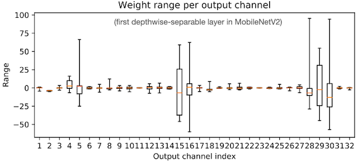
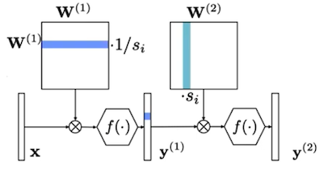
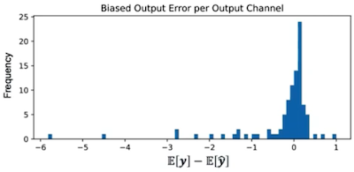
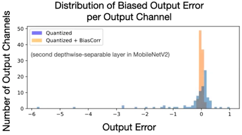
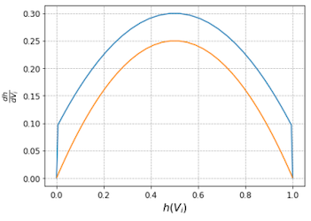
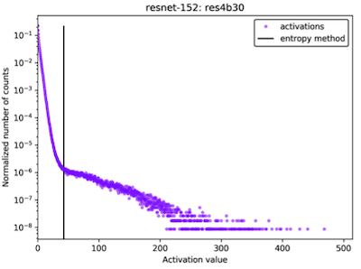
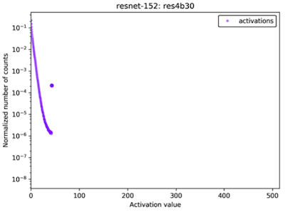
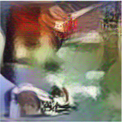

# Lecture 06 - Quantization (Part II)

> [Lecture 06 - Quantization (Part II) | MIT 6.S965](https://youtu.be/3nqUFSSJYKQ)

> [EfficientML.ai Lecture 6 - Quantization (Part II) (MIT 6.6940, Fall 2023, Zoom recording)](https://youtu.be/n72ndSimkB8?si=xU98arzumiap6buV)

> [A Survey of Quantization Methods for Efficient Neural Network Inference 논문(2021)](https://arxiv.org/abs/2103.13630)

> [A Comprehensive Survey on Model Quantization for Deep Neural Networks 논문(2022)](https://arxiv.org/abs/2205.07877)

다음은 대표적인 **Post-Training Quantization**(PTQ) 파이프라인을 나타낸 그림이다.


---

## 6.1 Quantization Granularity

다음은 하나의 tensor에서 quantization fuction이 적용되는 범위를, 세 가지 대표적인 quantization granularity별로 나타낸 그림이다.

| Per-Tensor<br/>(Layer-wise) | Per-Channel<br/>(Channel-wise) | Per-Vector<br/>(Group-wise) |
| :---: | :---: | :---: |
|  |  |  |  

오른쪽에 위치한 방법일수록 다음과 같은 특징을 갖는다.

- (+) 보다 fine-grained quantization으로, 더 높은 정확도를 달성할 수 있다.

  > 특히 작은 모델, 혹은 low bit-width quantization에서 정확도 보존에 유리하다.

- (-) computational overhead가 크다.

  > 예를 들어 per-tensor quantization은 각 레이어마다 모든 weight tensor가 하나의 scaling factor $S$ 를 공유하지만, per-vector quantization은 모든 vector 단위마다 scaling factor를 갖는다.

- (-) 하드웨어에서 지원하지 않거나, 최적화가 어렵다.

---

### 6.1.1 Per-Tensor vs Per-Channel Quantization

> [Data-Free Quantization through Weight Equalization and Bias Correction 논문(2019)](https://arxiv.org/abs/1906.04721)

MobileNetV2 모델의 weight를 대상으로 PTQ를 적용하고 싶다고 하자. 다음은 MobileNetV2의 첫 번째 depthwise-separable 레이어의, 출력 채널별 weight range를 나타낸 그래프다.



- 채널별 weight range가 다양하다.

다음은 symmetric linear quantization에서, 두 가지 granularity(per-tensor, per-channel) 기준의 양자화 출력을 비교한 것이다.

> weight distribusion과 quantization resolution를 나타낸 그림이다.

| | Per-Tensor | Per-Channel |
| :---: | :---: | :---: |
|  |  |  |
| Fliter scaling factor | single scale $S$ | $S_1, \cdots S_C$  |
| quantization resolution | bad | good |
| outlier | sensitive | robust |

---

## 6.2 Weight Equalization: Cross-Layer Equalization

> [Data-Free Quantization through Weight Equalization and Bias Correction 논문(2019)](https://arxiv.org/abs/1906.04721)

반면, 채널마다의 가중치 값의 범위를 비슷하게 정규화하는 방식으로, quantization error를 줄일 수 있다. (**Cross-Layer Equalization**) CLE는 이웃하는 두 레이어를 동시에 scaling하는 방식으로 최적화를 수행한다.



다음은 CLE를 적용했을 때, layer 1과 layer 2 사이에서 가중치 값의 변화를 나타낸 예시다.

| CLE example |
| :---: |
|  |
| $\downarrow$ |
|  |

두 개 레이어 층을 통과한 출력을 수식으로 표현하면 다음과 같다.

- $f$ : activation function
  
  $$y = f(W^{(2)} f(W^{(1)}x + b^{(1)})+b^{(2)})$$

위 수식에서 트릭을 통해, layer 1과 layer 2의 가중치에 scaling matrix를 추가할 수 있다.

- $S$ : scaling factor를 갖는 diagonal matrix

$$= f(W^{(2)} S \hat{f}(S^{-1}W^{(1)}x + S^{-1}b^{(1)})+b^{(2)})$$

이때 $S$ 와 $S^{-1}$ 를 병합하고, 추가로 양자화 시 scaling factor까지 병합할 수 있다.(scaling equivariance)

> ReLU는 scale-equivalent한 연산이다. $\mathrm{ReLU}(sx) = s \cdot \mathrm{ReLU}(x)$

$$ \quad = f({\widehat{W}}^{(2)} \hat{f}({\widehat{W}}^{(1)} x + {\widehat{b}}^{(1)})+b^{(2)}) $$

$a. \quad {\widehat{W}}^{(2)} = W^{(2)}S$

$b. \quad {\widehat{W}}^{(1)} = S^{(-1)}W^{(1)}$

$c. \quad {\widehat{b}}^{(1)} = S^{(-1)}b^{(1)}S$

---

### 6.2.1 Finding the Scaling Factor for CLE

논문에서는 각 channel $i$ 별 최적의 scaling factor를 다음과 같은 수식을 통해 찾는다.

- ${\hat{r_i}}$ : 가중치 행렬 내 채널 $i$ 의 quantization range

- ${\hat{R}}$ : 가중치 행렬의 total range

$$ s_i = {{1} \over {r_{i}^{(2)}}}\sqrt{r_{i}^{(1)}r_{i}^{(2)}} $$

다음은 MobileNetV2 대상으로 CLE의 적용 전, 후 채널별 가중치 값의 범위를 비교한 그림이다.

| Before CLE | | After CLE |
| :---: | :---: | :---: |
|  | $\rightarrow$ |  |

---

## 6.3 Biased Error

> [Data-Free Quantization through Weight Equalization and Bias Correction 논문(2019)](https://arxiv.org/abs/1906.04721)

> calibration data가 없고 모델이 **Batch Normalization**을 쓰는 경우, 유용하게 사용할 수 있다.

가중치 양자화로 발생하는 error ( $\epsilon = Q(W) - W$ ) 는, 출력 분포를 연달아 shifting시키면서 성능의 저하를 유발할 수 있다. 이를 **biased error**라고 지칭한다.

$$ \mathbb{E}[y] - \mathbb{E}[\widehat{y}] =  \mathbb{E}[W\mathrm{x}] -  \mathbb{E}[\widehat{W}\mathrm{x}] = W \mathbb{E}[\mathrm{x}] - \widehat{W} \mathbb{E}[\mathrm{x}] = \triangle W \mathbb{E}[\mathrm{x}] $$

> error가 입력 $\mathrm{x}$ 에 dependent하기 때문에, 기대값을 기반으로 bias를 보정한다.

다음은 이러한 biased error의 빈도(출력 채널 단위)를 나타낸 그림이다.



---

### 6.3.1 Bias Correction

**bias correction**는 calibration set 없이, (1) batch norm 파라미터와 (2) Gaussian pre-activation에 기반한 방법으로 bias를 보정하는 방법이다.

$$ \mathbb{E}[\mathrm{x}] = \mathbb{E}[ReLU({\mathrm{x}}^{pre})] $$

$$ = \gamma \mathcal{N} \left( {{- \beta} \over {\gamma}} \right) + \beta \left[ 1 - \Phi \left( {{- \beta} \over {\gamma}} \right) \right] $$


아래 그림은 MobileNetV2 모델에서, bias correction 전/후 biased output error의 분포를 비교한 그림이다.

 |

---

### 6.3.2 AdaRound: Learning to Round

> [Up or Down? Adaptive Rounding for Post-Training Quantization 논문(2020)](https://arxiv.org/abs/2004.10568)

양자화의 반올림으로 생기는 round error를 최소화하기 위해, 위 논문에서는 학습 가능한 파라미터에 기반한 **Adaptive Rounding**(AdaRound)라는 방법을 제안했다.

| AdaRound | rounding-to-nearest vs AdaRound |
| :---: | :---: |
|  |  | 

최적의 rounding 정책을 획득하기 위해, (1) 기존 가중치와 (2) $\triangle w = \delta$ (perturbation)을 추가한 soft-quantized weight와의 차이(L2 loss)를 최소화한다.

$$ \underset{V}{{\mathrm{arg}}{min}} || W\mathrm{x} - \tilde{W}\mathrm{x}||^{2}_{F} + \underset{regularizer}{\lambda f_{reg}(V)} $$

- $\tilde{W}$  : soft-quantized weight

  round down + learned value([0,1])과 같은 구조이다.

$$ \tilde{W} = s \cdot clip \left( \lfloor {W \over s} \rfloor + h(v) \ , n \ , p \right) $$

- rectified sigmoid function

  | | |
  | :---: | :---: |
  |  |  |

$$ h(V) = clip(\sigma (V)(\zeta - \gamma ) + \gamma , 0, 1) $$

- regularization term: $h(v)$ 가 0~1 사이 값을 갖도록 유도한다.

$$ f_{reg}(V) = \sum_{i,j} 1 - |2h (V_{i,j}) - 1|^{\beta} $$

---

## 6.4 Calibration: Finding Clipping Range

양자화 대상의 clipping range를 정하는 과정을 **calibration**이라고 한다. 이때, 양자화 정책에 따라 clipping range $[\alpha , \beta]$ 의 성질이 다르다.

| Symmetric | Asymmetric |
| :---: | :---: |
|  |  | 
| $\alpha = -\beta$ | $\alpha \neq -\beta$ |

---

## 6.5 Linear Activation Quantization

추론 시 동적으로 바뀌는 activation을 대상으로 한 다양한 양자화 방법이 제시되었다.

---

### 6.5.1 Collect Statistics: Exponential Moving Averages (EMA)

> [Quantization and Training of Neural Networks for Efficient Integer-Arithmetic-Only Inference 논문(2018)](https://arxiv.org/abs/1712.05877)

모델 훈련 중 max와 min 값의 exponential moving average(EMA)를 수집하고, 양자화 시 이를 활용하여 clipping range를 결정한다.

```math
{\hat{r}}^{(t)}_{max, min} = \alpha \cdot {r}^{(t)}_{max, min} + (1-\alpha) \cdot {\hat{r}}^{(t-1)}_{max, min}
```

> 이때, 수천 회 training step에 걸쳐서 평탄해지도록, EMA의 smoothing parameter( $\alpha$ ) 로 1에 가까운 값을 사용한다.

> 단, activation range가 급격하게 변하는 훈련 초기(5만 ~ 200만 step)에는, computational overhead를 고려하여 EMA를 적용하지 않는다.

---

### 6.5.2 Minimize the Mean Square Error (MSE)

> [Post training 4-bit quantization of convolutional networks for rapid-deployment 논문(2018)](https://arxiv.org/abs/1810.05723)

위 논문에서는 몇 가지 트릭을 통해 양자화 전후 MSE(**mean-square-error**)를 최소화하는 clipping range를 찾는다. 다음과 같이 $[-\alpha , \alpha]$ 범위를 $2^M$ 개 영역으로 나누는 uniform quantization을 수행했다고 하자. 


- quantization step: $\triangle = {{2\alpha} / {2^M}}$

- 값은 midpoint 영역으로 반올림된다고 가정한다.

  > $i \in [0, 2^M - 1]$ 개 bin에서, 값은 $[-\alpha + i \cdot \triangle, \alpha + (i+1) \cdot \triangle]$ 내 midpoint에 위치한다.

위와 같은 설정에서 MSE는 다음과 같이 정의할 수 있다. ( $f$ : density function )

$$ \underset{{|r|}_{max}}{\min} \ \mathbb{E}[{(X - Q(X))}^{2}] $$

$$ =	\int_{-\infty}^{-\alpha} f(x) \cdot (x+\alpha)^2 dx + \sum_{i=0}^{2^M -1} \int_{-\alpha + i\triangle}^{-\alpha + (i+1) \triangle} f(x) \cdot (x- q_i)^2 dx + \int_{\alpha}^{\infty} f(x) \cdot (x+\alpha)^2 dx $$

- 첫 번째, 세 번째 항: clip error(clipping noise)에 해당된다. 

  > 0을 중심으로 한 symmetrical distribution일 경우, 두 항은 동일하다. (e.g., Gaussian $N(0, {\sigma}^2)$ , Laplace $(0, b)$ ) 

- 두 번째 항: rounding error(quantization noise)로, **expected mean-square-error**이다.

여기서 (1) density function $f$ 를 piecewise linear function으로 근사하고, (2) symmetric distribution을 가정하면, 미분을 통해 최적의 clipping 값을 획득할 수 있다. 다음은 $f$ 가 Laplace 분포일 때 최적의 $\alpha$ 를 찾는 수식이다.

$$ {{\partial \mathbb{E}[{(X - Q(X))}^{2}]} \over {\partial \alpha}} = {{2 \alpha} \over {3 \cdot 2^{2M}}} - 2be^{- \alpha / b} = 0 $$

---

### 6.5.3 Minimize Loss of Information

> [Integer Quantization for Deep Learning Inference: Principles and Empirical Evaluation 논문(2020)](https://arxiv.org/abs/2004.09602)

> [NVIDIA: 8-bit Inference with TensorRT](https://on-demand.gputechconf.com/gtc/2017/presentation/s7310-8-bit-inference-with-tensorrt.pdf)

양자화 전,후 activation distribution(**entropy**) 분포의 차이를, **KL divergence**를 기반으로 최소화하여 양자화 오차를 줄일 수 있다.

```math
D_{KL}(P||Q) = {\sum}_{i}^{N}P(x_{i})\log{{P(x_{i})} \over {Q(x_{i})}}
```

다음은 ResNet 대상 실험에서 clipping 전/후 activation이 갖는 값의 빈도를 비교한 그림이다.

| Before Clipping | After Clipping |
| :---: | :---: |
|  |  |

---

## 6.6 Data Free Quantization

> [ZeroQ: A Novel Zero Shot Quantization Framework 논문(2020)](https://arxiv.org/abs/2001.00281)

calibration을 위한 데이터셋이 없을 경우, batch normalization 파라미터를 기반으로 distilled data를 생성하여 양자화를 수행할 수 있다. (**Zero-Shot Quantization**)

> (naive approach) $N(0, 1)$ 를 따르는 무작위 입력을 사용할 경우, 양자화 성능을 높이기 어렵다.

> 8-V100 시스템에서 32개 distilled data를 만드는 시간은 3초 수준으로, computational overhead도 적다.


| Gaussian data | Distilled data |
| :---: | :---: |
|  |   |

이러한 distilled data는 다음과 같은 최적화 문제를 통해 생성할 수 있다.

```math
\min_{x^r} \sum_{i=0}^{L} ||\tilde{\mu}_i^r - {\mu}_{i}||_{2}^{2} + || \tilde{\sigma}_{i}^{r} - \tilde{\sigma}_{i} ||_{2}^{2}
```

- $x^{r}$ : distilled input data

- $i$ : layer(0~L)

- ${\mu}_i, {\sigma}_i$ : BN 레이어에 저장된 평균, 표준편차

- $\tilde{\mu}_i^r, \tilde{\sigma}_{i}^{r}$ : distilled input data의 평균, 표준편차

---
