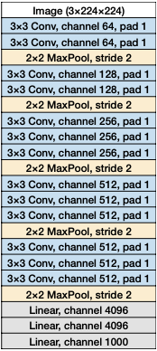
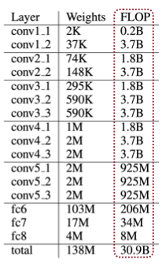
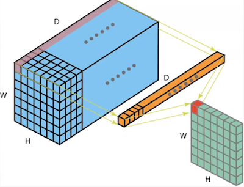
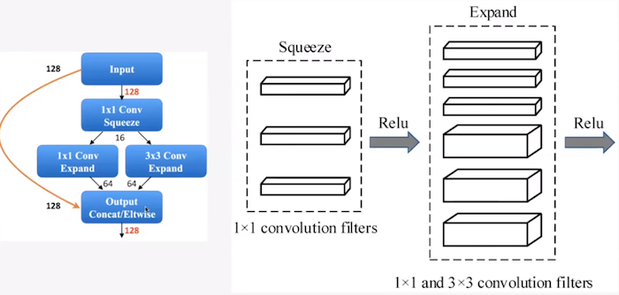
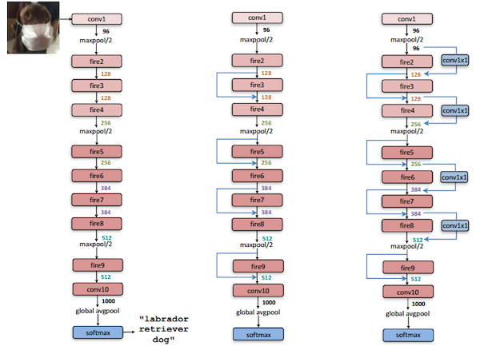
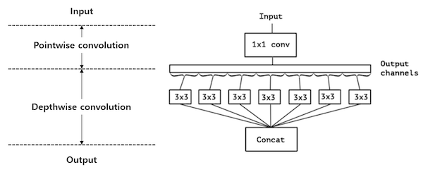
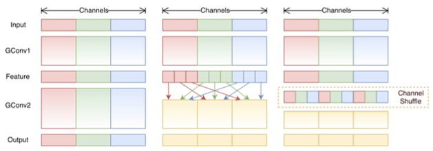
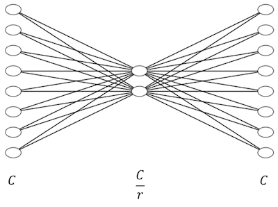

# 7 Neural Architecture Search (Part I)

> [Lecture 07 - Neural Architecture Search (Part I) | MIT 6.S965](https://www.youtube.com/watch?v=NQj5TkqX48Q)

> [AutoML 기술 동향](https://ettrends.etri.re.kr/ettrends/178/0905178004/34-4_32-42.pdf2)

AutoML(자동기계학습)에서는 다음과 같은 process를 자동화하는 데 중점을 두고 있다.

- **feature engineering**

    data와 관련 있는 domain knowledge를 이용하여 feature를 만드는 과정이다.

    > ML model을 위한 data table의 column을 생성하거나 선택하는 작업을 의미한다.

- **HPO**(Hyper-Parameter Optimization)

    

    model training이 고정된 hyperparameter 상에서 model parameter를 학습하는 것과 달리, HPO는 **meta-optimization**으로 hyperparameter 자체를 학습한다.

    > hyperparameter로는 learning rate, lr scheduling 방법, loss function, epoch, weight initialization 방법, normalization 방법, layer depth 등이 해당된다.
    
    > 그런데 hyperparameter를 변경할 경우, model weight를 초기화하고 처음부터 다시 훈련을 수행해야 한다. 따라서 이를 방지하기 위한 Hyperband 등의 방식이 제안됐다.

- **NAS**(Neural Architecture Search)

    target data와 task를 가지고, 가장 efficient하게 training될 수 있는 neural network를 탐색 대상으로 삼는다.

    - Evolutionary Algorithms(진화 알고리즘) 기반 탐색(AmeobaNet 등)
    
    - Reinforcement Learning(강화 학습) 기반 탐색(NASNet 등)

    - Gradient Descent 기반 탐색

---

## 7.1 Basic Concepts

neural network architecture는 보통 input stem, head, 그리고 여러 stage들로 구성되어 있다.

- input stem: 보통 receptive field를 크게 갖기 위해 large kernel을 사용한다. high **resolution**( pixel의 개수. $224 \times 224$ )을 갖는다.

  - channel 수가 3개로 매우 적기 때문에, 비교적 계산이 많이 필요하지는 않다.

  - resolution을 ( $56 \times 56$ )으로 downsampling한다.

- stage: 위 그림에서 4개가 존재하며, 각 stage 내부에서는 resolution이 동일하다.

- head: detection head, segmentation head 등 task 목적에 따라 위치하게 된다.

보통 각 stage의 first block에서 resolution을 줄이는 **feature map downsampling**이 적용된다.(stride convolution이나 pooling으로 구현)

그림의 stage 내부를 자세히 보면 input과 output dimension이 동일하므로 **residual/skip connection**을 적용해 준 부분을 확인할 수 있다. 

> 더 낮은 error rate를 얻기 위해 capacity를 늘리고 싶지만, layer 수가 늘어난다고 해서 error가 감소하지는 않고 실제로는 증가하기도 한다. 따라서 residual/skip connection으로 optimization이 가능하다.

다음은 여러 manually-design된 neural network의 예시다.

---

## 7.2 manually-designed neural network

---

### 7.2.1 AlexNet, VGGNet

- **AlexNet**(2012)

    

    AlexNet은 image가 3개의 적은 channel( $3 \times 224 \times 224$ )을 가지므로, 시작 stage에서 큰 kernel을 도입했다.( $11 \times 11$ (channel 96) , 그 다음은 $5 \times 5$ (channel 256) )

- **VGGNet**(2014)

    

    여러 개의 kernel을 쌓는 편이 큰 kernel을 하나 사용하는 것보다 더 효율적이지 않을까?라는 가정에서 시작한다.(즉, "parameter 수가 적은 network가 더 유용하다"는 가정이다.)

    VGGNet은 오직 $3 \times 3$ convolution을 사용한다. 이를 한 stage에서 두 번 사용하는 것이( $3 \times 3 + 3 \times 3 = 18$ parameters ),  $5 \times 5$ (=25 parameters) 를 한 번 적용하는 것보다 computational cost가 적게 들면서도 더 나은 성능을 보였다.

    > 하지만 layer, kernel call, activation load/store 수가 늘어나므로 memory efficiency는 더 나빠지게 된다. 

    

    또한 $(3 \times 3)$ convolution이 bottleneck을 유발하는 지점이 된다.

---

### 7.2.2 SqueezeNet

> [SqueezeNet 논문](https://arxiv.org/pdf/1602.07360)

**SqueezeNet**(2016)은 $3 \times 3$ convolution을 **fire module**이라는 연산으로 교체해서 수행한다. 

또한 head 지점에서 **global average pooling**(1차원 vector로 변경)을 적용해서 head 부분의 cost를 줄인다.

우선 SqueezeNet의 fire module은 'layer 하나당 3x3 filter 연산에 필요한 parameter의 양'을 줄이고자 하는 시도다. 

필요한 parameter 개수를 잠시 계산해 보자. input image (150, 150, 3)에 (3, 3) filter 32개(=output channel 수)를 적용하면 필요한 parameter 갯수는 다음과 같다.

- $3 \times 3$ (filter size) $\times 3$ (input channel) $\times 32$ (filter 개수)

> bias가 있을 때는 이 식에 bias 개수를 단순히 더하면 된다.

SqueezeNet은 다음과 같은 방법으로 parameter 수를 줄인다.

1. 3x3 filter(9개 parameter) 대신 
**1x1 filter**(1개 parameter)를 사용해서 parameter 수를 9배 줄인다. 

  

2. input channel 수를 **squeeze**하여 parameter 수를 줄인다.

   > 마찬가지로 1x1 filter convolution으로 channel 수를 줄일 수 있다. [1x1 convolution이란?](https://euneestella.github.io/research/2021-10-14-why-we-use-1x1-convolution-at-deep-learning/): resolution은 변하지 않고, channel의 수만 더 적은 크기로 조절된다.(feature map의 차원이 $1 \times 1$ filter의 개수로 축소된다.), 반대로 $1 \times 1$ convolution을 이용해 feature map 차원을 늘릴 수도 있다. 이를 **pointwise convolution**이라고 지칭한다.

3. 초반부는 큰 activation map을 갖도록 network를 구성해서 최대한 압축에 의한 정보 손실을 막고, **후반부에 가서 집중적으로 downsampling**을 수행한다.

> 이렇게 parameter 수를 줄이면 (1) distributed training이 더 용이해지고 (2) overhead가 줄어서 학습도 빨라지며, (3) embedded system에서 수행할 수준으로 작은 model로 만들 수 있다.

fire module은 **squeeze**, **expand** 두 가지 단계로 진행된다. 아래 128개 channel을 갖는 input이 있을 때 fire module을 거치는 과정을 표현한 예시를 보며 파악해 보자.

1. **squeeze**: (128개 channel을 가진 input이) 1x1 filter에 의해 16개 channel을 갖게 squeeze된다.

2. **expand**: squeeze된 16개 channel을 갖는 input에 각각 1x1 filter와 3x3 filter 연산을 수행한다.

    - 1x1 filter: 64개 channel을 갖는 output을 만든다.

    - 3x3 filter: 64개 channel을 갖는 output을 만든다.

    - 1x1 filter와 3x3 filter의 output을 **concatenate**하면 총 128개 channel을 갖는 output이 생긴다.

위 예시는 input의 channel 수와 output의 channel 수가 동일하지만 fire module마다 이 비율을 조절할 수 있다. 이제 fire module들로 구성된 3가지 SqueezeNet 구조를 살펴보자.

- 왼쪽: 기본 구조

- 가운데: 기본 구조 + simple bypass

- 오른쪽: 기본 구조: complex bypass

> bypass는 아래 7.2.3절(ResNet)에서 소개할 개념으로 skip connection으로 불리는 방법이다. bypass를 이용하면 fire module이 갖는 bottleneck 문제를 일정 부분 해결할 수 있다.

bypass를 적용하기 위해서는 중요한 조건이 있다. 바로 **input channel 수와 output channel 수가 동일**해야 한다는 점이다. 가운데 구조는 이런 조건에 맞춰서 가능한 구간만 skip connection을 적용한 것이며, 오른쪽은 conv 1x1로 channel 수를 맞춰서 bypass를 적용해준 것이다.

하지만 실험을 수행한 결과를 보면, 가운데 simple bypass가 더 model size도 작은데 accuracy가 더 높은 수치를 기록했다. 따라서 적절한 수준으로 bypass를 적용하는 것이 중요하다.

---

### 7.2.3 ResNet50: bottleneck block

ResNet에서 소개된 개념으로, **bypass layer**를 적용하는 개선으로 연산량을 줄일 수 있다.

다음은 **Residual Block**에서 연산량을 줄인 **bottleneck block**의 구조를 나타낸 그림이다.

1. $1 \times 1$ convolution을 사용해서 channel 수를 4배 줄인다.(이 다음 batch normalization과 ReLU를 거친다.)

2. channel 개수가 줄어든 feature map에 $3 \times 3$ convolution을 적용한다.(이 다음 batch normalization과 ReLU를 거친다.)

3. $1 \times 1$ convolution을 사용해서 chennel 수를 다시 4배 늘려서 맞춰 준다.

> 총 8.5배 연산이 줄어든다. input을 $x$ 라고 하고 1~3 과정을 거친 output을 $F(x)$ 로 표현한다.

4. input과 output의 channel 수가 같으므로, $F(x) + x$ 를 수행하여 shortcut을 구현한다.

> shortcut을 만드는 이유는 다음과 같다. 예를 들어 정사각형 발판 위에 서커스 코끼리가 서 있는 image가 있다고 하면, 정사각형 발판에 해당되는 input은 낮은 수준의 non-linearity로 해결할 수 있다. 

> 따라서 이러한 shortcut은 복잡도가 다른 요소들이 서로 다른 경로를 통해 학습되며, 적절한 non-linearity를 선택할 수 있게 된다.(정사각형 발판은 코끼리보다 더 많은 층을 뛰어넘는 짧은 경로로 진행될 것이다.) 이런 방식을 **residual learning**(잔차 학습)이라고 지칭한다.

---

### 7.2.4 ResNeXt: grouped convolution

ResNeXt(2017)에서는 $3 \times 3$ convolution을 $3 \times 3$ **grouped convolution**으로 대체한다. 차원을 줄이고 **cardinality**를 늘려서 효율을 높인 것이다.

> hyperparameter로 쓰인 cardinality는 convolution을 몇 개의 그룹으로 분할했는지 나타낸다. 수학에서 쓰이는 cardinality는 두 개체간의 관계(일대일, 일대다, 다대다)를 나타낸다.

다음은 결과는 동일하지만 과정은 다른 세 가지 방식의 grouped convolution을 나타낸 그림이다.(cardinality = 32)

- 왼쪽 이미지

  - $3 \times 3$ convolution을, 32 path의 4차원 $3 \times 3$ convolution으로 수행한다.

- 중간 이미지

  - $3 \times 3$ convolution보다 먼저 128차원의 $1 \times 1$ convolution을, 32 path의 4차원 $1 \times 1$ convolution으로 수행한 뒤 **concatenate**(연결)한다.

- 오른쪽 이미지

  - 더 나아가서 expand 과정도 group별로 나눠서 수행한 뒤 32 path를 모두 합산한다.

이 중에서는 맨 왼쪽 방식이 parallel cost가 더 적기 때문에 hardware-friendly하다.

> 사실 중간이 제일 먼저 제안된 ResNeXt block이다. 왼쪽이 그 다음 등장했으며 구현이 가장 간단하면서도 효율적인 구조이다.(GPU와 관련이 깊다.)

> 이런 복잡한 computational graph을 자동으로 mapping할 수 있는 방법들이 여럿 제시됐다.

---

### 7.2.5 MobileNet: depthwise-separable block

> [depthwise-separable convolution](https://velog.io/@woojinn8/LightWeight-Deep-Learning-5.-MobileNet), [MobileNet](https://velog.io/@woojinn8/LightWeight-Deep-Learning-6.-MobileNet-2-MobileNet%EC%9D%98-%EA%B5%AC%EC%A1%B0-%EB%B0%8F-%EC%84%B1%EB%8A%A5)

MobileNet(2017)은 특정 조건을 만족하는 group convolution에 적용할 수 있는 **depthwise-separable convolution**을 제안한다. 

> depthwise-separable convolution은 Xception이란 논문에서 먼저 제안된 방식이다. 하지만 Xception이 이를 이용해 accuracy를 개선하려고 했다면, MobileNet은 model의 경량화를 위해서 사용했다.

depthwise-seperable convolution은 channel을 분리하여, channel information과 spatial information을 각각 별개의 단계에서 연산을 수행한다.

- 우선 channel을 모두 분리한다. 따라서  channel 수만큼 group이 생기는 group convolution의 형태가 된다.

- 그 다음 각 group에서 convolution을 수행한다.(spatial information을 capture한다.)

- 그 다음 이를 다시 연결한 뒤 $1 \times 1$ convolution을 이용해서 channel 사이의 information을 병합한다.

---

### 7.2.6 MobileNetV2: inverted bottleneck block

하지만 이런 depthwise convolution은 기존의 convolution보다 낮은 capacity를 가지게 된다. MobileNetV2(2018)는 input에 $1 \times 1$ convolution을 적용해서 input의 channel 수를 늘린 뒤, 연산 과정을 수행하도록 만들어서  compensate한다.

> 특히 ReLU를 activation으로 사용하기 때문에 필연적으로 information의 손실이 발생할 수밖에 없다. (ReLU는 기본적으로 음수에서는 0을 반환하지만, 양수에서는 자기 자신을 반환하는 linear transform으로 볼 수 있었다.)

> 더 낮은 차원의 subspace로 mapping하면서 가지는 information을 **maniford**라고 지칭한다.

channel 수를 늘리면 어느 한 channel에서 소실된 information이 있더라도, 다른 channel에서 그 information을 가지고 있을 수 있다.

또한 skip connection으로 **inverted residual block**을 제안한다. 기존 residual block이 'wide $\rightarrow$ narrow $\rightarrow$ wide'와 같은 구조였지만, inverted residual block은 반대로 'narrow $\rightarrow$ wide $\rightarrow$ narrow'와 같은 형태를 가지게 된다.

> 연산량 면에서 residual block보다 더 적기 때문에, memory efficiency면에서 더 효율이 좋다.

> inverted residual block을 'bottleneck residual block'이라고도 한다.

참고로 ReLU가 아닌 ReLU6를 activation function으로 사용한다.

---

### 7.2.7 ShuffleNet: 1x1 group convolution & channel shuffle

하지만 group마다 convolution이 적용되는 탓에, 서로 다른 group에 있는 channel이 feature information을 공유하지 못했다. 

ShuffleNet(2017)은 **channel shuffle** 기법을 제안하며 이 부분을 추가로 compensate한다.

---

### 7.2.8 SENet: Squeeze-and-Excitation block

> [Squeeze-and-Excitation Networks 논문](https://arxiv.org/pdf/1709.01507.pdf)

SENet(2017)은 ILSVRC 2017에서 우승한 model로 **Squeeze-and-Excitation**(**SE**) block을 사용한다. 

SE block의 목적은 여러 channel을 가진 feature map에서 <U>각 channel의 정보가 얼마나 중요한지를 판단</U>하는 것이다. 

- 3차원 feature map에서 spatial 부분을 $1 \times 1$ 로 압축(depth인 channel 개수는 유지). 압축은 global average pooling 연산을 이용한 1차원 벡터화.(Squeeze. **압축**)

- 1차원 벡터를 normalize한 값을 가중치처럼 사용.(Excitation. **재조정**)

이런 특징 때문에 SE block은 다른 CNN model(VGG, ResNet 등)의 어디든 부착할 수 있다. 아래가 바로 SE block을 나타낸 그림이다.

- $F_{sq}(\cdot)$ : Squeeze 연산.(global average pooling)

$$ z = F_{sq}(u_{c}) = {{1} \over {H \times W}} {\sum_{i=1}^{H}}{\sum_{j=1}^{W}}{u_{c}(i, j)} $$

> $u_{c}$ 는 channel $c$번째에 있는 feature map( $H \times W$ )이다.

- $F_{ex}(\cdot)$ : Excitation 연산.(normalize). squeeze로 만들어진 1차원 벡터 $z$ 를 normalize하는데, FC1 - ReLU - FC2 - Sigmoid 순서로 진행된다. 결과는 가중치 벡터 $s$ 가 된다.

$$ s = F_{ex}(z, W) = {\sigma}(W_{2} {\delta}(W_{1} z)) $$

- $z$ : 앞서 squeeze해서 만들어진 1차원 벡터

- $W_{1}, W_{2}$ : Fully-connected layer의 weight matrix. reduction ratio $r$ 을 둬서 노드 수를 조절한다. $W_{1} \in \mathbb{R}^{{C \over r} \times C}$ , $W_{2} \in \mathbb{R}^{C \times {C \over r}}$

  - 위 식에서 $\mathbb{R}$ 을 보면 알겠지만, $C$ 차원 벡터 input $z$ 는 $W_{1}$ 과 만나 $C \over r$ 차원 벡터가 된다.(activation으로 ReLU 적용)
  
  - 그리고 이 $C \over r$ 차원 벡터는 $W_{2}$ 와 만나 $C$ 차원 벡터로 변환된다. 이를 sigmoid 연산을 통해 0과 1 사이의 값으로 normalize한다.

> $\delta$ : ReLU 연산, $\sigma$ : Sigmoid 연산

> reduction ratio $r$ 은 총 연산량에 추가되는 parameter 수(계산 복잡도)에 영향을 미친다. $r$ 을 바꿔가며 model마다 최적의 값을 찾는 과정이 필요하다.

이렇게 구한 가중치 벡터 $s$ 를 원래 feature map $u$ 에 곱해준다.

$$ F_{scale}(u_{c}, s_{c}) = s_{c} \cdot u_{c} $$

SE block을 추가해도 parameter 수가 크게 늘어나지는 않는다. 따라서 적은 연산량 증가로도 performance 향상을 기대할 수 있는 방법론이 바로 SE block이다.

---

### 7.2.9 accuracy-efficiency trade-off on ImageNet

다음은 ImageNet에서 여러 model이 갖는 MACs(efficiency)와 accuracy를 나타낸 도표다.

> 하지만 ImageNet에서의 benchmark만 믿어서는 안 된다. 실제 downstream(산업)에서 활용하고자 할 때는 이런 benchmark와 일치하는 결과를 보여준다는 보장은 없다.

---