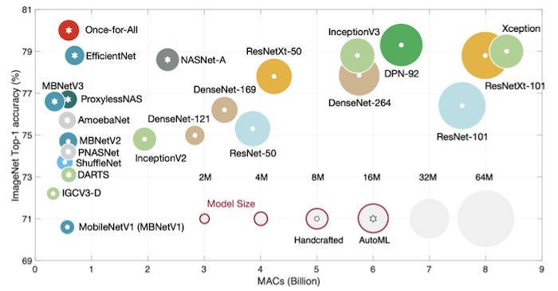
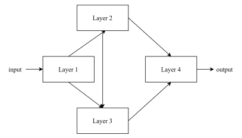
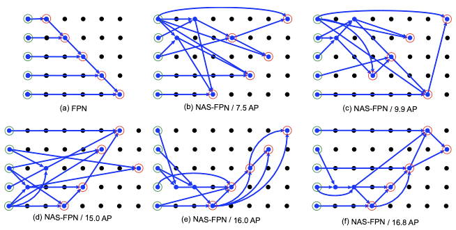
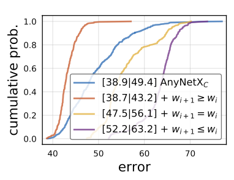
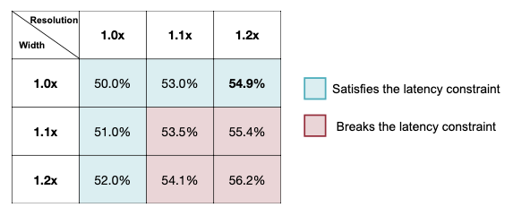
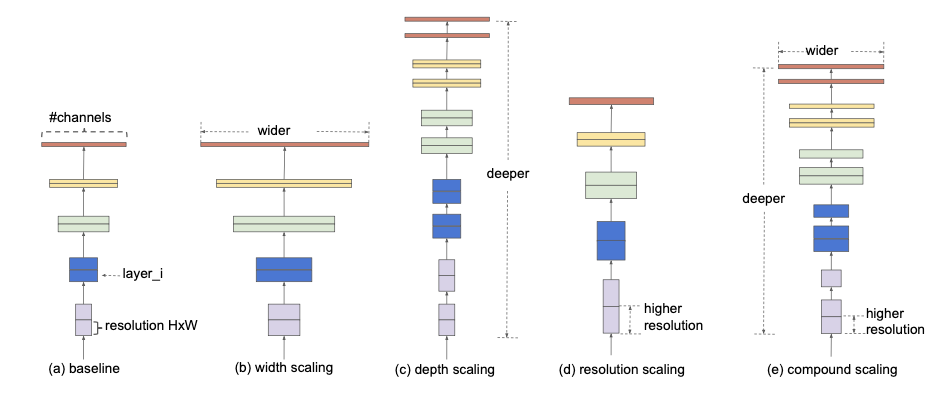
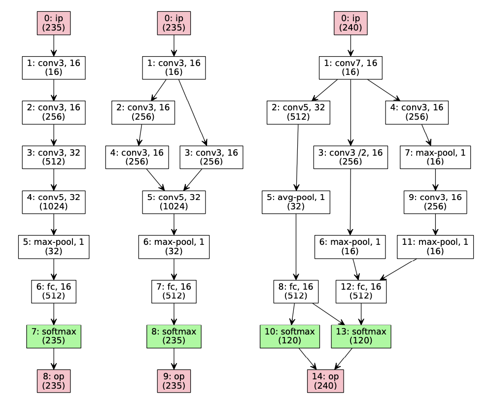
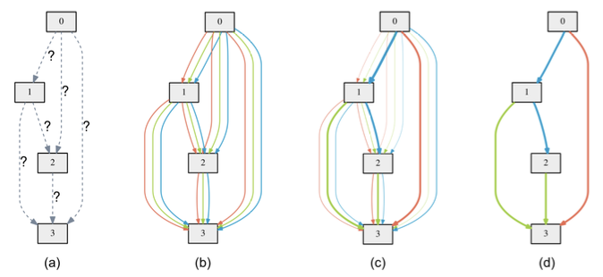
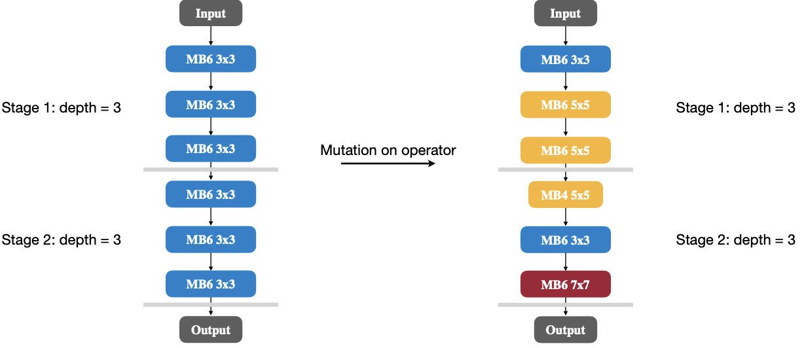

# 7 Neural Architecture Search (Part I)

> [Exploring the Implementation of Network Architecture Search(NAS) for TinyML Application](http://essay.utwente.nl/89778/1/nieuwenhuis_MA_EEMCS.pdf)

다음은 7.2절에서 살핀 benchmark에 AutoML로 찾아낸 neural architecture를 추가한 것이다. AutoML로 찾아낸 neural architecture가 훨씬 적은 연산량으로도, manually-designed model보다 더 높은 accuracy를 가지는 것을 확인할 수 있다. 

---

## 7.3 illustration of NAS

NAS(Neural Architecture Search)의 목표는 search space(탐색 공간)에서 최적의 neural network architecture를 찾는 것이다.

- **Search Space**(탐색 공간): 가능한 neural network architecture를 정의한다. 

  > 적절한 domain 지식을 접목하여, search space의 크기를 줄이고 search를 단순화시킬 수 있다.

- **Search Strategy**(탐색 전략): 말 그대로 search space를 어떻게 search할지를 결정한다. 

  > 이때 최적이 아닌 구조로 조기 수렴하는 사태는 피해야 하므로, 고전적인 exploration-exploitation(탐험-활용) tradeoff가 적용된다.

- **Performance Estimation Strategy**(성과 평가 전략): performance를 estimate(추정)하는 과정을 뜻한다. 

  - 가장 간단한 방법은 data를 이용하여 표준 training과 validation을 수행하는 것이지만, 이는 search cost와 hardware efficiency 측면에서 굉장히 손해를 보게 된다.

---

### 7.3.1 RNN controller

NAS의 바탕이 된 "Neural Architecture Search with Reinforcement Learning”(2017) 논문에서는, 새로운 neural architecture를 (gradient 기반으로) 찾아내는 방법을 제시했다.

그 방법은 다음과 같은 통찰에서 시작했다. 'neural network의 structure와 connectivity를 가변 길이의 configuration string으로 다룰 수 있으니까, 이를 training에 이용할 수 있지 않을까'란 발상이었다. 예를 들어 다음과 같이 한 layer의 구조를 문자열로 나타낼 수 있다.

- ["Filter Width: 5", "Filter Height: 3", "Num Filters: 24"]

그리고 이 data에 가변 길이의 input 및 string의 처리로 적합한 RNN(**controller**)을 적용하여, configuration string을 generate하도록 만든다. 다시 말해 <U>controller가 architecture의 hyperparameter를 계속해서 생성</U>하게 된다. 

- $i$ 번째 layer $L_{i}$ 는 layer $i-1$ 에서 input을 받고, 또 layer $L_{i}$ 의 output은 layer $L_{i+1}$ 의 input으로 사용된다.

- (CNN) filter의 height/width, stride의 height/width, filter 개수와 같은 hyperparameter를 output으로 반환한다.

> search space는 (1) 최대 layer 수 n개, (2) 모든 계층이 실행할 수 있는 operation 유형(pooling, convolution, depthwise separable convolution 등), (3) 연산과 관련된 hyperparameter(filter 수, kernel size, stride 등)을 search한다.

> 이때 (3)번의 hyperparameter들은 (2)번 유형에 따라 결정된다는 점에 주의하자.

이렇게 generate된 hyperparameter를 바탕으로 만들어진 새 model(**child network**)을 training하고, 여기에 validation data set을 적용해서 accuracy를 얻는다. 

이때 이전 architecture의 평균 accuracy를 이용해서 reinforcement learning을 수행한다.(7.7.3절 참조)

하지만 이렇게 새 child network를 만든 뒤, training을 거쳐 accuracy를 측정하는 과정은 시간이 너무 소요된다. 따라서 논문에서는 distributed training(분산 학습)을 이용해서 training을 진행한다.

> 기존 방법에서 더 나아가서 최신 연구에서는 multi-branch network를 구축할 수 있는 skip connection과 같은 설계 요소도 NAS에서 고려하여 search한다.

> 이 경우 layer $i$ 의 input은, 이전 layer output을 조합한 function $g_{i}(L_{i-1}^{out},...,L_{0}^{out})$ 으로 표현된다.

---

## 7.4 Search Space

NAS 알고리즘은 기본적으로 '구성 가능한 network 종류'를 정의하면서 시작한다. 그리고 **search space**에서 constraint를 만족하는 특정 type의 network를 탐색해 나가기 시작한다.

search space는 **network를 만들기 위한 elements**를 모아둔 집합이다. 보통 어떠한 application에 적합한 network를 만들 수 있는 elements들로 구성된다.

- 여러 종류의 layer(convolution layer, fully connected layer, pooling layer 등)가 있을 수 있다. 

- neuron 수, kernel size, activation 유형 등 <U>각 layer가 어떤 특징을 가질지 정의하는 parameter</U>들을 포함하기도 한다.

> search space를 탐색하는 조합의 수를 제한해서 search에 드는 시간을 줄어들도록 구현할 수도 있다.

search space를 구성하는 방법도 다양한 방식이 있다. 우선 가장 직관적인 **chain-structured search space**가 있다.

- 서로 다른 layer 사이에 단 하나의 연결만 존재한다.

- **layer 수**, **type**이나 구성을 변경시키면서 search를 진행한다.

좀 더 복잡한 search space를 구성하는 방법으로는 **cell-structured search space**가 있다. 대표적으로 **ResNet**이 해당된다.

- chain-structured search space와 다르게, <U>layer 수는 늘릴 수 없고</U> **type**만 바꿀 수 있다.

- 일반적으로 특정 network architecture를 정해 놓고, cell끼리는 해당 architecture의 연결 방식을 그대로 따라간다.

마지막으로 muitiple branch를 포함하는 하나의 대규모 신경망을 포함하는 search space가 있다. 바로 이것이 **supernetwork**(supernet)이다.

- 모든 subnet의 high-level architecture는 동일하다.(예를 들면 MobileNetV3을 기반으로 탐색하는 등)

- 차이는 layer의 content에 있다. 

  - 예를 들어 특정 위치의 어느 layer는 항상 convolution layer인데, subnet끼리는 kernel size나 filter 수가 다를 수 있다. 

- supernet이 search space의 모든 layer configuration과 connection을 포함하기 떄문에, one-shot performance estimation으로 사용할 수 있다.

- 따라서 supernet 자체는 하나의 **overparameterized weight-sharing network**로, 여기서 내부의 subnet architecture를 선택해서 simultenous하게 training하게 된다.

  > 실제로 subnet을 추출할 때는, supernet에서 weight를 직접 복사하는 방식으로 진행한다.

---

### 7.4.1 cell-level search space

search space 탐색의 비효율적인 면을 개선하기 위해 **cell-level search space**이 제안되었다. RNN controller과 reinforcement learning을 이용해서 효율적인 reduction cell과 normal cell을 찾아낸다.

- normal cell: stride = 1. 즉, input의 resolution을 보존하는 cell이다.

- reduction cell: stride > 1. 즉, input의 resolution이 감소하는 cell이다.(receptive field는 증가한다.)

이처럼 전체 구조가 아닌 cell 단위로 탐색을 하기 때문에 search space의 크기가 크게 줄어든다.

RNN controller는 총 다섯 단계를 거쳐서 candidate cell를 generate한다.

1. 첫 번째 hidden state를 generate한다.

2. 두 번째 hidden state를 generate한다.

3. 첫 번째 hidden state의 operation(예를 들면 convolution/pooling/identity)을 고른다.

4. 두 번째 hidden state의 operation을 고른다.

5. hidden state를 합칠 방법을 고른다.(add, concatenate 등)

이해를 돕기 위해 문제를 하나 풀어보자. 다음 조건에서는 search space의 크기(design space의 유형 수)는 총 몇 개가 될까? architecture의 layer는 총 B개로 구성되어 있다고 하자.

- 2개의 input 유형

- M개의 input을 transform할 operation

- N개의 hidden state를 결합할 operation

정답은 $(2 \times 2 \times M \times M \times N)^{B} = 4^{B}M^{2B}N^{B}$ 이다.

때문에 NAS는 **search cost**와 **hardware efficiency** 관점에서 이보다 더 효율적으로 수행할 수 있는 방법이 필요해졌다.

- feedback을 위해 너무 많은 neural network가 필요하다.

- 많은 branch의 dependency를 유지해야 하므로, 쉽게 memory를 free시킬 수 없다.

> 또한 **meta-architecture**(메타 구조)를 선택해서 NAS를 수행하기 때문에, cell search의 복잡성이 대부분 meta-architecture에 의해 설명되지 않도록 새로운 설계 방법이 필요했다.

> 최선의 방법은 meta-architecture 역시 NAS가 스스로 최적화할 수 있게 설계하는 것이다. 

---

### 7.4.2 network-level search space

**network-level search space**에서는 자주 쓰이는 pattern을 고정하고, 오직 각 stage에서 쌓는 block 개수(depth)를 search한다.

예를 들어 image segmantation model에서 resolution의 downsampling, upsampling strategy를 다음과 같이 나타낼 수 있다.

또한 image 내 다양한 resolution을 가진 물체를 인식하는 model인 FPN(Feature Pyramid Networks for Object Detection)에 NAS를 적용한 예시를 살펴보자.

> AP: average precision(평균 정밀도)

결과를 보면 사람이 design한 strategy와 상당히 다른 것을 볼 수 있다. 하지만 높은 accuracy와 irregularity 사이에서 균형을 맞춰야 한다. irregularity topology는 hardware상으로 구현하기 어려우며, 또한 parallize하기도 어렵기 때문이다.

---

## 7.5 Design the Search Space

더 효율적인 search space를 선택하기 위해, 예를 들어 ResNet에서는 cumulative error distribution을 지표로 사용할 수 있다. 아래가 ResNet의 cumulative error distribution가 그려진 도표이다.

- 파란색 곡선에 해당되는 search space: 38.9%의 model이 49.4%가 넘는 error를 가졌다.

- 주황색 곡선에 해당되는 search space: 38.7%의 model이 43.2%가 넘는 error를 가졌다.

  > 이 둘 중에서는 주황색 곡선의 design space가 더 낫다. 

하지만 이처럼 cumulative error distribution을 측정하려면 굉장히 긴 시간동안 training을 거쳐야 한다. 또한 memory나 storage 제약을 갖는 장치에서는 수행할 수 없는 방법과 다름없다. computation은 저렴하지만 memory는 비싸다는 기본 원칙을 상기하자.

따라서 hardware 제약이 있는 기기에서 NAS를 수행할 수 있도록, TinyNAS에서는 다음과 같은 과정을 거친다.

1. Automated search space optimization

2. Resource-constrained model specialization

또한 동일한 memory 제약에서는 <U>FLOPs가 클수록 큰 model capacity를 가지며, 이는 곧 높은 accuracy로 이어진다는 heuristic</U>을 이용해서,model training으로 많은 resource를 낭비하는 것을 방지한다. 

- 동일한 memory constraint에서는 FLOPs가 많을수록 높은 accuracy를 갖는 경향이 있다. 

- 따라서 FLOPs가 클수록 좋은 design space이다.(그림의 주황색 실선)

---

## 7.6 Search Strategy

---

### 7.6.1 Grid Search

가장 간단한 방법으로 **grid search**가 있다. 간단한 예시로 다음과 같이 Width나 Resolution에서 몇 가지 point를 지정한다.(width 3개, resolution 3개로 총 9개의 조합이 나온 예다.)

- latency constraint를 만족하면 파란색, 만족하지 못하면 빨간색.

하지만 이런 간단한 예시와는 다르게 실제 응용에서는 선택지와 dimension이 훨씬 커지게 된다. 범위를 넓게, step을 작게 설정할수록 최적해를 찾을 가능성은 커지지만 시간이 오래 걸리게 된다.

> 대체로 넓은 범위와 큰 step으로 설정한 뒤, 범위를 좁히는 방식을 사용한다.

---

#### 7.6.1.1 EfficientNet

> [EfficientNet 논문](https://arxiv.org/pdf/1905.11946.pdf)

이런 방법을 사용하는 model로 **EfficientNet**가 있다. 살펴보기 앞서 model에서 **depth**, **width**, **resolution**이 각각 어떤 역할을 하는지 알아보자. 다음은 ResNet에서 이 세 가지 요인을 조절했을 때 ImageNet dataset의 accuracy를 기록한 도표다.

- **depth**( $d$ )

  - $d$ 가 커질수록 model capacity가 커진다.(더 complex한 feature를 가질 수 있다.)

  - $d$ 가 커질수록 model의 parameter 수가 많아진다. 따라서 memory footprint(메모리 사용량)가 커지는 단점이 있다.

  - $d$ 가 커질수록 model의 FLOPs가 많아지며 accuracy도 늘어나지만, model의 latency도 커진다.

  - training 과정에서 vanishing gradient 문제를 겪을 가능성이 크다.(skip connection이나 batch normalization 등의 방법으로 방지)

- **width**( $w$ )

  > width scaling은 주로 small size model에서 사용한다. 넓기만 하고 얕은 network로는 high level feature를 얻기 힘들기 때문이다.

  - wider network가 더 fine-grained feature를 가지며 training이 용이하다.

- **resolution**( $r$ )

  - high resolution input image를 사용할수록 더 fine-grained feature를 얻을 수 있다.

  > 예를 들어 224x224, 299x299를 사용한 예전 model과 달리, 480x480 resolution을 사용한 GPipe model이 SOTA accuracy를 얻은 적 있다. 하지만 너무 큰 resolution은 반대로 accuracy gain이 줄어들 수 있다.

EfficientNet은 depth, width, resolution가 일정 값 이상이 되면 accuracy가 빠르게 saturate된다는 사실을 바탕으로, 이들을 함께 고려하는 **compound scaling** 방법을 제안한다. 

EfficientNet은 각 layer가 수행하는 연산(F)를 고정하고, width, depth, resolution만을 변수로 search space를 탐색한다.

$$ depth = d = {\alpha}^{\phi} $$

$$ width = w = {\beta}^{\phi} $$

$$ resolution = r = {\gamma}^{\phi} $$

- $\phi$ : compound scaling parameter

$$ \underset{d,w,r}{\max} \quad Accuracy(N(d,w,r)) $$

---

### 7.6.2 random search

Grid Search의 문제를 개선한 방법으로 **random search**가 제안되었다. random search는 정해진 범위 내에서 말 그대로 임의로 선택하며 수행하며, grid search보다 상대적으로 더 빠르고 효율적이다.

> random search는 차원이 적을 때 최선의 parameter search strategy일 가능성이 크다. 

grid search보다 더 효율적인 이유는 직관적으로도 이해할 수 있다. 종종 일부 parameter는 다른 parameter보다 performance에 큰 영향을 미친다. 가령 model이 hyperparameter 1에 매우 민감하고, hyperparameter 2에는 민감하지 않다고 하자.

grid search는 {hyperparameter 1 3개} * {hyperparameter 2 3개}를 시도한다. 반면 random search의 경우에는 hyperparameter 1 9개의 다른 값(혹은 hyperparameter 2 9개의 다른 값)을 시도할 수 있다. 따라서 더 나은 결과를 얻을 수 있다.

또한 Single-Path-One-Shot(SPOS)에서는 random search가 다른 advance된 방법들(예를 들면 evolutionary architecture search)보다 좋은 baseline을 제공할 수 있다.

> SPOS란 말 그대로 single path와 one-shot 접근법을 사용하는 NAS이다. 

> one-shot NAS는 모든 candidate architecture를 포함하며 weight를 공유하는 **supernet**에서 search space를 탐색한다. 덕분에 resource가 덜 필요하다는 비용 절감적 장점을 지닌다. 하지만 각 architecture를 개별적으로 train하고 evaluate하는 기존 NAS보다는 performance가 낮다.

---
 
### 7.6.3 reinforcement learning

> [Introduction to Neural Architecture Search (Reinforcement Learning approach)](https://smartlabai.medium.com/introduction-to-neural-architecture-search-reinforcement-learning-approach-55604772f173)

- controller(RNN)이 Sample architecture(**child network**)를 생성한다.

- 문자열로 나온 이 child network를 training하면, validation set에 대한 **accuracy**를 얻을 수 있다.

- accuracy를 바탕으로 controller의 policy를 update한다.

> RNN controller는 token의 list 형태로 child CNN description의 hyperparameter들을 생성해 준다. filter의 개수, 그 filter의 height, width, stride의 height나 layer당 width 등이 포함된다. 그리고 이 description이 **softmax classifier**를 거친 뒤, child CNN이 built 및 train된다.(따라서 sample architecture는 각자 probability p를 갖는다.)

> 이 train된 model을 validation하여 얻은 accuracy( $\theta$ )를 바탕으로 controller를 update한다. 다음 번 reward가 더 높은 행동(architecture)를 선택하게 하도록 reward $R$ 로 accuracy를 사용한다.

$$ J({\theta}_{c}) = E_{P(a_{1:T};{\theta}_{c})}[R] $$

- a : **action**. controller가 child network의 hyperparameter를 하나 예측하는 과정을 action이라고 지칭한다. 즉, 여러 action을 거쳐 하나의 child network architecture가 생성되는 것이다.

  - $a_{1}:T$ : child network를 생성하기 위해 거친 action들의 list를 의미한다. 

하지만 RNN controller로 얻는 <U>accuracy는 **non-differentiable**</U>하기 때문에, 다음과 같은 policy gradient method를 이용한다.

$$ {\nabla}_{{\theta}_{c}}J({\theta}_{c}) = \sum_{t=1}^{T}{E_{P(a_{1:T};{\theta}_{c})}[{\nabla}_{{\theta}_{c}} {\log}P({\alpha}_{t}|{\alpha}_{(t-1):1};{\theta}_{c})R]} $$

> 실제로는 이를 더 approximate하고 baseline을 추가한 식을 사용한다. baseline은 이전 architecture들의 평균 accuracy를 이용해서 결정한다.

> [Policy Gradient Algorithms](https://talkingaboutme.tistory.com/entry/RL-Policy-Gradient-Algorithms)

---

#### 7.6.3.1 ProxylessNAS

> Proxy는 Differentiable NAS가 굉장히 큰 GPU cost(GPU hours, memory)를 필요로 해서, 이를 줄이기 위해 proxy라는 작은 단위의 task들로 나누어서 수행하면서 생긴 개념이다.

**ProxylessNAS**에서는 architecture parameter들을 path가 activated되었는지 여부에 따라 0과 1로 이루어진 binary vector로 표현한다. 이렇게 하여 architecture를 생성하는 과정이 더 간단해지고, 더 빠르게 수렴할 수 있다.

어떻게 이런 표현이 가능한지 살펴보자. neural network $\mathcal{N}$ 이 n개의 edge를 갖는다면 다음과 같이 표현할 수 있다.

$$ \mathcal{N}(e, \cdots e_{n}) $$

- $e$ : 일방향 그래프인 **DAG**(Directed Acyclic Graph)에서 edge를 나타낸다. 

edge가 갖는 operation의 집합인 $O$ 은 다음과 같이 표현할 수 있다. 

- $O = \lbrace {o}_{i} \rbrace$ : $N$ 개의 가능한 operation의 집합이다. operation의 예로는 convolution, pooling, fully-connected 등이 있다. 

그런데 각 edge마다 primitive operation을 설정하는 방법이 아니라, 모든 architecture을 포함하는 over-parameterized network를 생성한다.

따라서 over-parameterized network는 각 edge마다 $N$ 개의 가능한 operation을 가져야 한다. 이를 다음과 같이 mixed operation function $m_{O}$ 를 반영해서 표현할 수 있다.

$$ \mathcal{N}(e = {m_{O}^{1}}, \cdots, e_{n} = {m_{O}^{n}}) $$

- One-Shot에서 $m_{O}$ 는 input $x$ 가 주어졌을 때 $o_{i}(x)$ 들의 총합이다.

- DARTS에서 $m_{O}$ 는 input $x$ 가 주어졌을 때 $o_{i}(x)$ 들의 weighted sum(softmax)이다.

$$ m_{O}^{One-Shot}(x) = {\sum}_{i=1}^{N}{o_{i}(x)} $$

$$ m_{O}^{DARTS}(x) = {\sum}_{i=1}^{N}{p_{i}o_{i}(x)} = {\sum}_{i=1}^{N}{{\exp({\alpha}_{i})} \over {\sum_{j}{\exp({\alpha}_{j})}}}{o_{i}(x)} $$

> $\lbrace{\alpha}_{i}\rbrace$ : N개의 real-valued architecture parameters

하지만 이처럼 모든 operation output 값을 반영하면서 training하는 것은 memory usage를 굉장히 잡아먹게 돈다. 따라서 ProxylessNAS에서는 **path binarization** 방법을 도입해서 memory 문제를 해결한다.

- **binarized path**

위 그림처럼 ProxylessNAS는 **Binary Gate** $g$ 를 도입하여 path를 나타낸다. 

이 binary gates를 도입한 mixed operation은 다음과 같다.

따라서 runtime에 path 하나만 유지하면 되기 때문에 memory usage를 대폭 줄일 수 있다. training은 weight parameter과 architecture parameter를 나눠서 따로 진행된다.

1. 우선 weight parameter를 training한다.

    - architecture parameter(path 선택확률)을 freeze시키고, sampling을 바탕으로 active된 path의 weight를 update한다.

    - sampling은 binary gate의 probability( $p_1, \cdots, p_{N}$ )를 바탕으로 stochastical하게 수행된다.

2. 그 다음 architecture parameter를 training한다.

    - weight parameter를 freeze시키고, architecture parameter를 update한다.

    - 낮은 확률의 path들을 pruning하며 최종 path를 찾아낸다.

> ProxylessNAS 역시 7.7.3절의 미분 가능한 근사식을 사용해서 update를 수행한다.

---

### 7.6.4 Bayesian optimization

> [3Blue1Brown youtube: Bayes theorem](https://youtu.be/HZGCoVF3YvM)

Bayes' theorem을 상기해 보자. 어떤 사건이 서로 배반(mutally exclusive events)인 event 둘에 의해 일어난다고 할 때, 이것이 두 원인 중 하나일 확률을 구하는 정리다.(사후 확률)

$$ P(B|A) = {{P(A|B)P(B)} \over {P(A)}} $$

다시 말해 기존 사건들의 확률(사전 확률)을 바탕으로, 어떤 사건이 일어났을 때의 확률(사후 확률)을 계산할 수 있다는 것이다.
 
NAS에서 **Bayesian optimization**을 적용하면, exploitation과 exploration 중 어떤 것을 수행할지 제안을 받을 수 있다.

> [exploration(탐색)과 exploitation(활용)](https://github.com/erectbranch/Neural_Networks_and_Deep_Learning/tree/master/ch09)

- exploration이 우선적일 때: a to c

- exploitation이 우선일 때: a to b

> 현재 널리 쓰이지 않는다. 더 널리 쓰이는 건 아래 gradient-based search이다.

---

### 7.6.5 gradient-based search

> [DARTS](https://arxiv.org/pdf/1806.09055.pdf)

대표적인 예시가 바로 DARTS(Differentiable Architecture Search)이다. ProxylessNAS(7.7.3.1절)에서 잠시 봤던 것처럼, **DARTS**는 (weighted sum 기반) mixed operation function $m_{O}$ 을 사용해서 미분 가능한 근사식으로 gradient descent를 적용한다. 이렇게 각 connection마다 어떤 operation이 최적의 operation에 해당되는지 파악한다.

아래는 learnable block마다 architecture parameter와, loss function에 latency penalty term을 추가한 것을 나타낸 그림이다.

- $F$ : latency prediction model

각 block $i$ 마다 latency의 평균은 다음과 같이 나타낼 수 있다.

$$ \mathbb{E}[\mathrm{latency}_i] = \sum_{j}{p_{j}}^{i} \times F(o_{j}^{i}) $$

- ${p_{j}}^{i}$ : opreation의 probability

- $F(o_{j}^{i})$ : operation $o_{j}^{i}$ 의 latency prediction model

그 다음 모든 learnable block들의 latency 합산을 구한 뒤 이를 loss function에 추가하면 latency penalty term을 구현할 수 있다.

$$ \mathbb{E}[\mathrm{latency}] = \sum_{i}{\mathbb{E}[\mathrm{latency}_i]} $$

$$ Loss = {Loss}_{CE} + {\lambda}_{1}{||w||}_{2}^{2} + {\lambda}_{2}\mathbb{E}[\mathrm{latency}] $$

- CE: Cross Entropy를 의미한다.

따라서 accuracy만이 아니라 latency까지 고려하는 NAS를 구현할 수 있다.

---

### 7.6.6 Evolutionary search

**Evolutionary search**는 주어진 network를 바탕으로 이를 **mutate**하는 방식이다. depth나 layer, channel 수 등을 바꿔가며 이들을 cross-over한다.

다음 그림은 depth를 mutation한 경우이다.

> MB는 MobileNet의 inverted bottleneck convolution layer을 의미한다. MB3은 expansion ratio가 3, MB6은 expansion ratio가 6인 것을 의미한다.

- stage 1의 depth가 3에서 2로 mutate되었다.

- stage 2의 depth가 3에서 4로 mutate되었다.

다음은 operator를 mutation한 경우이다. 3x3 convolution을 5x5 convolution으로 바꾸는 등의 mutation이 일어난다.

> CNN이 발전하면서 parameter 수가 더 많은 더 큰 kernel을 사용한 것처럼, mutation에서 더 큰 kernel을 쓰도록 mutation이 일어났다.

> 또한 GPU의 parallelism 관점에서 더 효율적이다.

다음은 cross-over가 일어난 child network를 나타낸 그림이다. 두 parent에서 random하게 operator를 선택해서 child network에 적용한다.

---