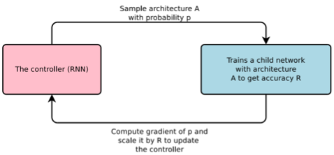
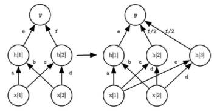
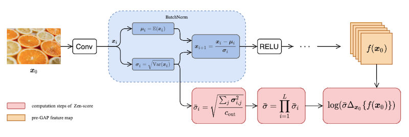
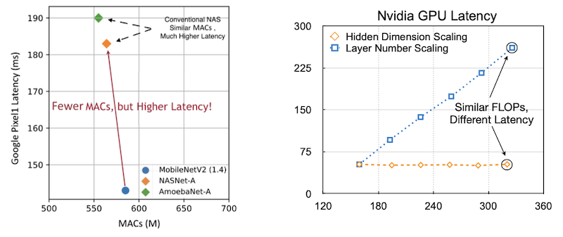
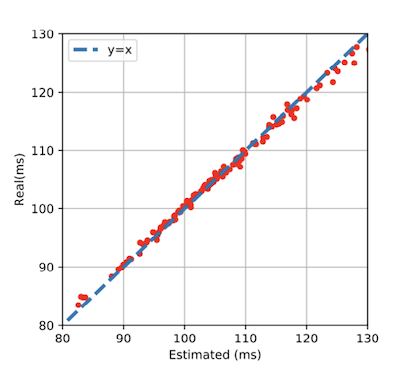
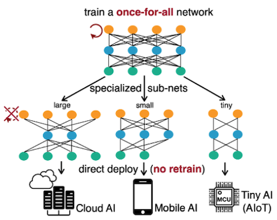

# 8 Neural Architecture Search (Part II)

> [Lecture 08 - Neural Architecture Search (Part II) | MIT 6.S965](https://www.youtube.com/watch?v=PFitZnPIKoc)

> [Exploring the Implementation of Network Architecture Search(NAS) for TinyML Application](http://essay.utwente.nl/89778/1/nieuwenhuis_MA_EEMCS.pdf)

---

## 8.1 Performancd Estimation in NAS

model architecture가 갖는 성능을 평가하는 방법을 생각해 보자. 우선 RNN controller를 쓰는 NAS는 다음과 같은 구조였다.



- probability $p$ 를 바탕으로 한 구조를 from scratch부터 학습시킨다.

- validation accuracy를 얻어서 controller를 update한다.

하지만 이러한 방법은 training cost가 너무 많이 든다.

---

### 8.1.1 Weight Inheritance

> [Net2Net: Accelerating Learning via Knowledge Transfer 논문(2015)](https://arxiv.org/abs/1511.05641)

> [Efficient Architecture Search by Network Transformation 논문(2017)](https://arxiv.org/abs/1707.04873)

모든 네트워크를 from scratch부터 학습시키기보다, weight를 상속하는 방법을 생각해 볼 수 있다. 작은 network를 weight inheritance를 사용하여 효율적으로 더 큰 네트워크를 구성한 Net2Net 논문이 대표적이다.

> 논문에서는 작은 모델을 teacher, teacher을 바탕으로 새롭게 만든 더 큰 모델을 student라고 부른다.

- Net2Wider

  layer $i$ 의 hidden units $h[1], h[2]$ 에서 weights $c, d$ 를 복사하여 $h[3]$ unit을 추가한 예시다.

  - 복사할 unit은 random하게 선택된다.

  - 늘어난 unit 수만큼, $i+1$ 로 이어지는 연결에서는 넓어진 만큼 weight를 나눠서, 결과가 동일하도록 compensate한다.

    예제의 경우 $f/2$ 가 이에 해당된다.

  

- Net2Deeper

  identity mapping initization을 사용하여 capacity가 더 큰 네트워크를 만든다.

  

---

### 8.1.2 HyperNetwork: Weight Generator

> [SMASH: One-Shot Model Architecture Search through HyperNetworks 논문(2017)](https://arxiv.org/abs/1708.05344)

> [Graph HyperNetworks for Neural Architecture Search 논문(2018)](https://arxiv.org/abs/1810.05749)

SMASH 논문에서는 sampled model architecture가 가질 weight를 만드는 네트워크로 **hypernetwork**를 제시했다.(weight generator)

그렇다면 어떻게 weight를 만들어 낼 수 있을까? 우선 search space $\mathbb{R_c}$ 가 있다고 하자.

- 우선 HyperNet를 weights $H$ 로 initialize한다.

- loop를 수행한다.

  training Error $E_t = f_c(W, x_i) = f_c(H(c), x_i)$ 를 구한 뒤 $H$ 를 update한다.

  - input minibatch: $x_i$
  
  - random architecture $c$ 

    해당 architecture가 가지는 weight는 $W = H(c)$ 이다.

- update한 $H$ 를 validation한다.

  validation set $E_v = f_c(H(c), x_v)$ 를 구한다.

  - random sample: $c$

---

### 8.1.3 Weight Sharing

> [Efficient Neural Architecture Search via Parameter Sharing 논문(2018)](https://arxiv.org/abs/1802.03268)

널리 쓰이는 다른 대표적인 방법으로는 **weight sharing**이 있다.


- 모든 graph를 포함하는 **super-network**를 학습한다.

- super-network에서 sub-graph를 추출하여 network architecture를 만든다.

- **sub-network**를 학습한다.

---

## 8.2 Performance Estimation Heuristics

하지만 몇 가지 방법은 network architecture training 없이, 오로지 구조를 관찰하여 performance estimation을 수행한다.

---

### 8.2.1 Zen-NAS

> [Zen-NAS: A Zero-Shot NAS for High-Performance Deep Image Recognition 논문(2021)](https://arxiv.org/abs/2102.01063)

> [Gaussian complexity](https://www.stat.cmu.edu/~siva/teaching/709/lec2.pdf)

Zen-NAS 논문에서는 **Zen-Score**라는 cost proxy를 도입하여 performance estimation을 수행한다. 오로지 random Gaussian input을 사용해 무작위로 초기화된 newtork에서, 몇 번의 forward inference를 수행하면 Zen-Score를 구할 수 있다.

- heuristic: 성능이 좋은 모델이라면 **input perturbation에 sensitive**할 것이다.

  다시 말해 다른 입력들을 줬을 때 표준편차가 더 큰 모델을 찾으면 된다.

이러한 방식을 논문에서는 **Zero-Shot NAS**라고 부르며, Zen-NAS에서는 Batch Normalization으로 인해 발생할 수 있는 문제까지 고려한다. 다음은 Zen-Score를 구하는 과정을 나타낸 그림이다.

> 평균 $\mu$ , 분산 ${\sigma}^2$ 를 갖는 Gaussian distribution을 $\mathcal{N}(\mu, \sigma)$ 로 표현한다.



- $x_0$ : 입력 이미지 mini-batch 1개

- $x_i$ : $i$ 번째 레이어의 output feature map

- ${\sigma}_i$ : BN layer의 mini-batch deviation

- ${\triangle}_{x_0}\lbrace f(x_0) \rbrace$ : Global Average Pooling(GAP)을 거치기 전 feature map $f(x_0)$ 의 미분값(perturbation)

순차적으로 Zen-Score를 계산하는 방법을 살펴보자.

1. network $F(\cdot)$ 의 모든 residual links를 제거한다.

2. 모든 neurons(activations)이 $\mathcal{N}(0,1)$ 분포를 갖도록 weight를 초기화한다.

3. $\mathcal{N}(0,1)$ 에서 input $x$ 과 $\epsilon$ 을 sampling한다.

4. feature map perturbation $\triangle$ 을 계산한다.

$$ \triangle \overset{\triangle}{=} \mathbb{E_{x, \epsilon}} || f(x) - f(x+\alpha \epsilon)||_{F} $$

- $f: \mathbb{R^{m_0}} \rightarrow \mathbb{R^{m_L}}$

  $L$ 개 레이어(function)을 의미한다.( $m_0$ : input dimension, $m_L$ : output dimension)

- $\alpha = 0.01$

- $\mathbb{E}$ : network expressivity(**Gaussian complexity**)

5. BN layer의 compensation term을 계산한다.

    output channels $m$ 개를 갖는 $i$ 번째 BN layer에서, 각 채널이 갖는 분산의 평균을 제곱근한 값을 계산한다.

```math
\bar{{\sigma}_{i}} = \sqrt{{\sum}_{j}{\sigma}^2_{i,j}/m}
```

- ${\sigma}_{i,j}$ : $i$ 번째 BN layer의 $j$ 번째 output channel의 standard deviation.

6. Zen score를 계산한다.

$$ \mathrm{Zen}(F) \overset{\triangle}{=} \log(\triangle) + \sum_{i}\log(\bar{{\sigma}_{i}}) $$

---

### 8.2.2 GradSign

> [GradSign: Model Performance Inference with Theoretical Insights 논문(2021)](https://arxiv.org/abs/2110.08616)

GradSign 논문에서는 다음과 같은 heuristic을 사용한다.

- heuristic: 다른 input sample을 줬을 때 각각의 local minima point의 distance가 작아야(**denser**) 성능이 좋은 모델이다.

  

  - 좌측보다 우측이 denser sample-wise local optima를 갖는다. 즉, 우측이 더 성능이 좋은 모델이다.

  - 다시 말해 그림의 빨간 영역을 최소화하여 최적의 구조를 찾을 수 있다.

---

## 8.3 Hardware-Aware NAS

다양한 hardware architecture에 알맞는 network architecture를 매번 검색한다면 엄청난 GPU cost가 발생할 것이다. 이러한 비용을 아끼기 위해 전통적으로는 **proxy tasks**를 utilize하는 방향으로 연구가 진행되었다.

다음은 몇 가지 예시이다.

- CIFAR-10에서 잘 동작하는 모델을 ImageNet에서도 잘 동작한다고 가정한다.

  단점: 실제로는 capacity, complexity가 달라서 잘 동작하지 않는 경우가 많다.

- training epoch을 덜 진행한다.

  단점: 일부 구조는 적은 epoch만으로도 빠르게 수렴한다.

- latency 대신 \#Flops, \#Parameters를 바탕으로 성능을 예측한다.

  단점: \#Flops가 적은 모델이라도 더 느릴 수 있다.

- small architecture space를 사용한다.

---

### 8.3.1 ProxylessNAS

> [ProxylessNAS: Direct Neural Architecture Search on Target Task and Hardware 논문(2018)](https://arxiv.org/abs/1812.00332)

ProxylessNAS 논문은 proxy를 사용하지 않고 hardware에 알맞는 network architecture를 찾는다.


- 모든 candidate paths를 갖는 over-parameterized network를 구성한다.

- 학습은 over-parameterized network의 sigle training process로 구성된다.

  만약 좋지 않은 path라면 해당 path를 **pruning**하면서 진행된다.

- architecture parameters를 binarize한 뒤, binary gate를 이용하여 오직 한 가지 path만 activate한다.

  따라서 memory footprint가 작다.(O(N) $\rightarrow$ O(1))

그렇다면 latency는 어떻게 profile할까?

---

### 8.3.1.1 MACs is not a good metric for latency

우선 MACs와 Flops는 latency를 위한 proxy로 적합하지 않다.



- 왼쪽: MACs(x)-latency(y)

    MobileNetV2(파란색), NASNet-A(주황색), AmoebaNet-A(녹색)은 비슷한 수준의 MACs를 가지고 있지만, latency는 약 140ms, 180ms, 190ms로 차이가 크다.

- 오른쪽: FLOPs(x, M)-latency(y, ms)

    FLOPs는 비슷해도, 모델을 어떻게 scaling했는가에 따라 latency 차이가 크다.

    - 파란색: \#layers를 줄였다.

    - 주황색: hidden dimension을 줄였다.

또한 hardware에 따라서도 scaling 방법 차이에 따라 latency 변화가 다르다.


- Raspberry Pi(ARM CPU): hidden dim이 늘어나면 동시에 latency가 늘어난다.

- GPU: hidden dim을 늘려도 GPU의 large parallelism 덕분에 크게 영향을 받지 않는다.

---

### 8.3.1.2 layer-wise latency profiling

따라서 ProxylessNAS에서는 **latency predictor**(지연시간 예측기)를 도입하여 latency를 예측한다.


이때 latency predictor도 **Lookup Table**을 구성하는 단위에 따라서 layer-wise, network-wise로 나뉘는데, ProxylessNAS, Once-For-All에서는 layer-wise latency profiling을 사용한다.


LUT 예시를 한 번 살펴보자.


- 첫 번째 줄 Key

    - 입력 차원 (112x112x24), 출력 차원 (112x112x24)

    - bottleneck layer의 출력 채널 24

    - kernel: 3x3

    - stride: 1

    - skip connection 사용(1), SE block 사용 X(0), h-swish 사용 X(0)

      h-swish를 사용하지 않는 경우 ReLU를 사용한다.

다음은 LUT를 사용한 latency predictor가 얼마나 latency를 예측하는지를 시각화한 그래프다.



---

### 8.3.2 HAT: network-wise latency profiling

> [HAT: Hardware-Aware Transformers for Efficient Natural Language Processing 논문](https://arxiv.org/pdf/2005.14187.pdf)

반면 HAT 논문에서는 network 단위로 latency profiling을 수행한다.


- [SubTransformer architecture, measured latency]

마찬가지로 시각화한 그래프를 보면 유효한 방법인 것을 알 수 있다.


---

### 8.3.3 Once-for-All NAS

> [Once-for-All: Train One Network and Specialize it for Efficient Deployment 논문(2019)](https://arxiv.org/pdf/1908.09791.pdf)

> [ONCE-FOR-ALL github](https://github.com/mit-han-lab/once-for-all)

Once-for-All 논문에서는 **supernet**을 단 한 번 학습하면, 제약조건에 따라 다양한 subnet을 추출할 수 있는 방법을 제시한다.



하지만 이러한 supernet training은 굉장히 큰 GPU cost를 필요로 한다. OFA에서는 **Progressive Shrinking**(PS)라는 접근법으로, 더 효율적으로 supernet training을 진행한다.

---

#### 8.3.3.1 Progressive Shrinking

Progressive Shrinking은 다음과 같은 단계로 진행된다.


- Elastic **Resolution**

  다양한 해상도 범위에서 제일 큰 구조를 학습한다.

- Elastic **Kernel Size**

  제일 큰 kernel size(7x7)가 아닌 5x5, 3x3 kernel size를 사용하는 구조를 학습한다.

  

- Elastic **depth**

  block에서 제일 많은 \#layers(4개)가 아닌 3개, 2개 레이어를 갖는 구조를 학습한다.

  


- Elastic **width**

  channel 중요도를 계산한 뒤, 중요하지 않은 channel을 pruning한다.

  

---
