# 11 MCUNet: Tiny Neural Network Design for Microcontrollers

> [Lecture 11 - MCUNet: Tiny Neural Network Design for Microcontrollers | MIT 6.S965](https://www.youtube.com/watch?v=Hi4I0ZtPsbY)

TinyML이란 mobile AI를 넘어서 **MCU**(microcontroller unit)에서 DNN을 구현하려는 시도다.


> MCU란 microprocessor와 I/O module을 하나의 chip으로 만들고 정해진 기능을 수행하는 computer를 의미한다. 즉, core와 program 가능한 I/O를 가지고 있다. 

> NOR flash memory, EPROM(Erasable PROM), 그리고 OTP ROM 등의 memory를 가지고 있다. 또한 기계어 code가 실행되기 위한 변수나 data 저장을 위해 적은 용량의 SRAM을 가진다.

하지만 SRAM과 flash memory가 매우 제한적이다. Mobile AI와 비교해도 activation memory는 13,000배나 더 작은 용량을 가진다. 따라서 mobile이 대상인 on-device AI에서는 latency와 energy 제약에 중점을 뒀다면(mobile에서 memory는 GB 단위를 사용할 수 있었다.), Tiny AI에서는 memory 제약을 더 고려해야 한다.

---

## 11.1 running CNNs on microcontrollers

CNN에서는 convolution과 activation 과정을 거쳤다.


- input activation, output activation: 계속해서 값이 달라지므로, read/write가 가능한 memory에 넣어야 한다. 따라서 SRAM에서 관리한다.

- kernel: weight들은 static하다. inference lifecycle동안 동일한 값을 갖는다. 따라서 ROM이나 (block 단위로만 재기록할 수 있는) flash memory에서 관리한다.

아래는 microcontroller의 스펙 예시다.

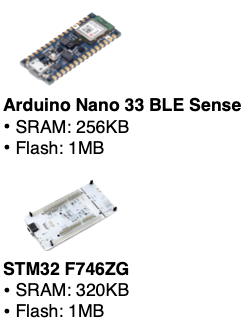

memory usage를 다시금 정리하면 다음과 같다.

- **flash** usage(1MB): static한 data가 저장된다. = **model size**

- **SRAM** usage(320kB): layer마다 dynamic하고 different한 data가 저장된다. = **input activation + output activation**

  - 정확히는 SRAM의 peak로 고려해야 한다. 왜냐하면 layer $i$ 는 layer $i+1$ 를 구하면 더 이상 쓸모가 없기 때문이다.

  > training이라면 backpropagation이 필요하겠지만, 현재 목적은 trained model으로 inference하는 것이기 때문에 feedforward하게 진행된다.

  - 또한 weight들은 partially하게 fetch되므로, partial weight의 size를 고려해야 한다.

> 일반적인 컴퓨터와 다르게 MCU에서는 큰 memory 용량을 가진 DRAM이 없고 paging도 없으므로 직접 memory를 관리해 주어야 한다.

---

## 11.2 peak SRAM usages

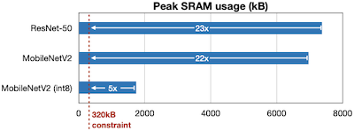

neural network에서의 bottleneck이 SRAM의 peak와 깊게 연관되어 있다는 사실을 상기하자. 위 그림을 보면 MobileNetV2에 int8 quantization을 적용하더라도, microcontroller의 SRAM 제약보다 더 많은 용량이 필요한 것을 볼 수 있다.

MobileNetV2에서는 ResNet-18과 비교했을 때 약 4.6배의 model size 경량화(parameter의 수가 그만큼 줄어들었다.)를 이뤄냈다. 

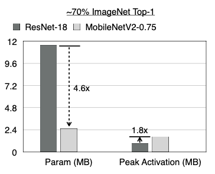

> INT8로 계산했을 때의 지표다.

하지만 그림 우측의 peak activation을 보면, peak activation의 크기가 오히려 ResNet-18보다 더 큰 것을 볼 수 있다. 이 말은 largest layer의 activation size가 오히려 더 커졌다는 의미이다. 

이런 결과가 발생하는 이유는 MobileNetV2가 inverted bottleneck block 구조를 갖기 때문이다. parameter(weight)의 수는 줄일 수 있었지만, activation의 수는 늘어났기 때문이다.

곧 살펴볼 MCUNet은 model size를 줄이는 것에서 더 나아가 activation size도 줄인 model이다.

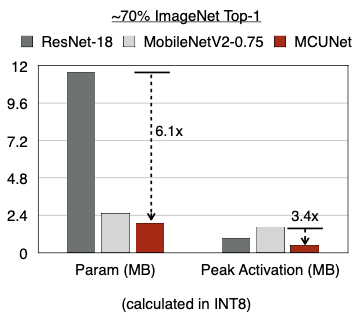

---

## 11.3 MCUNet: System-Algorithm Co-design

MCUNet은 neural architecture design(NAS)을 수행하는 TinyNAS와, inference를 수행하는 TinyEngine가 상호보완하는 구조다. 

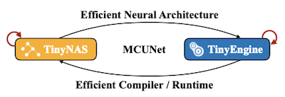

TinyNAS는 말 그대로 tiny한 neural architecture search를 진행해서 TinyEngine에 제공한다. 그리고 TinyEngine은 efficient compiler와 runtime 역할을 수행하여 정보를 제공한다.

NAS 개념을 다시 살펴보면, architecture search를 수행하려면 entire forest를 search하기 보다는, 좀 더 narrow하며 올바른 search space를 찾아야 했다.

> searched model의 performance는 search space의 quality에 크게 좌우되었다.

즉, TinyNAS 해결해야 하는 첫 번째 문제는, 제약에 맞는 올바른 search space를 찾는 것이다. 

1. 먼저 mobile search space를 재사용해보는 방안을 생각해 볼 수 있다.(예를 들면 MnasNet space) 

   - 하지만 이 방법은 사용할 수 없다. 어느 mobile search space의 smallest sub-network도 microcontroller hardware 제약을 만족하지 못한다.(mobile AI가 GB 단위 memory 사용이 가능했던 점을 기억하자.)

2. mobile이 안 된다면 다음은 IoT device에 맞춰 search space를 (smart하게) 고르는 방법이 있다.

   - 예를 들어 MobileNet-alike search space를 scale할 수 있다.(다른 **resolution** $R$ 과 **width multiplier** $W$ 를 사용한다.)

   > [lec07 정리](https://github.com/erectbranch/TinyML_and_Efficient_DLC/tree/master/lec07/summary01), [Witdh Multiplier, Resolution Multiplier](https://sotudy.tistory.com/15)

   > 기존에는 $R$ = 224, $W$ = 1.0으로 설정했을 때, 스마트폰 환경에서 좋은 성능을 보였다.

   > 게다가 microcontroller도 기종에 따라 제각각 다른 memory 제약을 가지므로, 이러한 제약 사항에 따라서 다른 $R$ , $W$ 값을 가질 것이다.

---

### 11.3.1 TinyNAS: Two-Stage NAS for Tiny Memory Constraint

TinyNAS는 다음과 같은 과정을 거친다.


- Optimized Search Space 단계에서 resolution $R$ 과, Width Multiplier $W$ 값을 조절한다.

- Neural Architecture Search 단계에서 kernel size, expansion ratio, stage당 block의 개수 등을 추가로 search한다.

---

#### 11.3.1.1 Automated search space optimization

그렇다면 어떻게 automated search space optimization을 수행하는지 살펴보자. 다음은 다른 $W$ 와 $R$ 값에 따라, 어느 정도의 FLOPs가 필요한지를 나타낸 도표다.

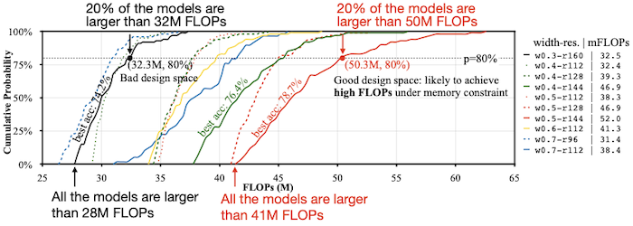

- 빨간색 실선(w=0.5, r=144): 좋은 accuracy를 갖는다. 모든 model이 최소 41M FLOPs가 필요하다.(search space 중 20%는 50M FLOPs 이상 필요하다.)

- 검은색 실선(w=0.3, r=160): 모든 model이 최소 28M FLOPs가 필요하다.(search space 중 20%가 32M FLOPs 이상 필요하다.)

도표를 보면 FLOPs가 클수록 model capacity가 커져서, 그만큼 높은 accuracy를 얻을 수 있는 것을 볼 수 있다. 하지만 FLOPs가 클수록 latency도 커지게 된다. 이는 즉, memory가 부족할수록 computation을 늘리는 방법을 이용해서 accuracy를 늘릴 수 있다는 사실을 나타낸다.

> computation은 저렴하고 memory는 비싸다는 기본적인 원칙을 기억하자.

이러한 발상을 바탕으로 서로 다른 SRAM과 flash size에 따른 width multiplier, resolution의 best configuration을 살펴보자. 

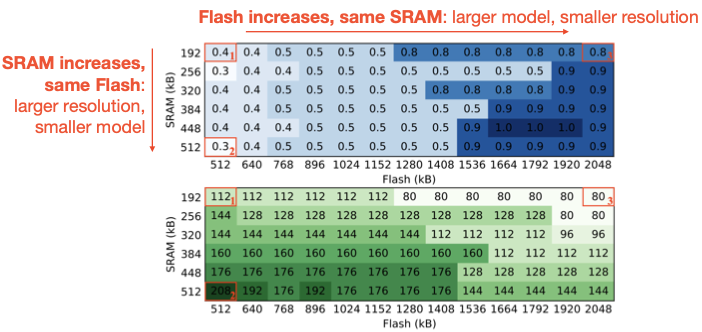

- 가로 축은 Flash의 용량(kB), 세로 축은 SRAM(kB)을 나타낸다.

  - 우측으로 갈수록 Flash memory는 512kB에서 2048kB(2MB)까지 커진다.

  - 하단으로 갈수록 SRAM은 192kB에서 512kB까지 커진다.

- 상단은 Width Multiplier, 하단은 Resolution Multiplier을 나타낸다.

  - Witdh Multiplier: **flash memory에 의해 좌우**된다. flash memory가 클수록 더 큰 model(더 많은 kernel channel)을 사용할 수 있기 때문이다.

  > 하지만 channel 수가 크다면, 마찬가지로 큰 SRAM도 필요하게 된다.(하단 첫번째 줄을 보면 SRAM size는 동일한데 flash만 늘어나면 resolution이 감소하는 것을 확인할 수 있다.)

  - Resolution Multiplier: **SRAM에 의해 좌우**된다. SRAM이 커질수록 더 큰 resolution(input activation)을 사용할 수 있기 때문이다.

  > 반면 SRAM만 늘리고 flash는 그대로라면, flash에 저장된 weight들도 그대로일 것이다. 따라서 width multiplier는 바꾸면 안 된다.

---

#### 11.3.1.2 Resource-constrained model specialization

search space를 design했다면 그 다음은 NAS를 수행할 수 있다. Once-for-All NAS 방법을 수행해 보자.

 

먼저 가능한 모든 search space를 포함하는 super network을 train해야 한다.

- random sampling 혹은 progressive shrinking algorithm(큰 sub-networks부터 작은 sub-networks 순서)을 이용하여 sub-networks를 점진적으로 train한다.

- 그 다음 weight를 share하는 multiple sub-network들을 fine-tuning한다.

  > child network(small sub-network)는 large sub-network와 weight를 share하기 때문에 더 효율적으로 수행할 수 있다.

MobileNetV2(human design model)와 TinyNAS(automatic design model)를 비교하면, TinyNAS design network가 각 block마다 더 균일한 peak memory를 갖는 것을 확인할 수 있다. 아래 그림을 보자.


- MobileNetV2는 inbalanced memory usage distribution을 갖는다. peak memory는 거의 처음 5block에서 사용되고, 그 다음으로 진행될수록 굉장히 적은 memory usage를 보인다.(약 8배 감소)

그리고 아래 MCUNet의 latency, accuracy 그래프와 peak SRAM 그래프를 살펴봐도 더 나은 성능을 보이는 것을 알 수 있다.


> VWW(Visual Wake Words) dataset을 이용한 지표

- MCUNet이 3배 더 빠른 latency에 더 높은 accuracy를 갖는다.

- SRAM은 약 4배 더 적게 사용한다.

> 하지만 (high resolution을 갖는) ImageNet-level image classification에서는 62.0%(256kB/1MB) ~ 70.7%(512kB/2MB) accuracy를 갖는다.

> MCUNetV2는 larger input resolution을 가능하게 하는 **patch-based inference**를 도입해서, 32kB SRAM 조건에서 71.8% accuracy를 갖는다.

---

## 11.4 MCUNetV2

---
### 11.4.1 Patch-based Inference

이처럼 SRAM usage는 dynamic하기 때문에 제약 조건에 맞추기 위해서는 peak SRAM usage를 고려해야 했다. 

MCUNetV2에서는 inbalanced memory usage distribution을 줄이기 위해서 **patch-based inference**를 적용한다. 이 개념을 알기 위해서는 우선 CNN에서 inbalanced memory distribution이 발생하는 지점을 보자.

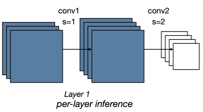

- Layer1의 convolution을 수행하기 위해서는, 위 그림처럼 input activation과 output activation을 memory에 유지해야 한다.

- 그 다음 layer2의 convolution을 수행할 때는, layer1의 input activation은 더 이상 유지할 필요가 없고, layer2의 input activation(layer 1의 output activation)과 output activation(그림의 흰색 사각형들)을 memory에 유지해야 한다.

즉, 위 그림의 layer 1과 같이 input, output activation의 size가 큰 layer 구간이 inbalanced memory distribution을 형성하게 된다.(peak SRAM usage를 기록하게 된다.) 

이러한 inbalanced memory distribution을  다음과 같이 patch-based inference를 적용해서 해결할 수 있다.

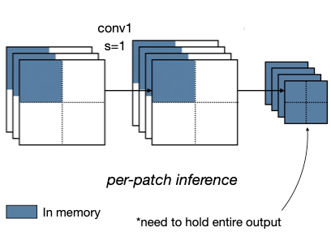

- layer를 2x2 chunk로 나눠서 convolution을 수행했다.

  > 이는 예시일 뿐으로 3x3로 나눌 수도 있다. 이 경우 memory usage는 더 적어지게 된다.

다음은 patch-based inference를 적용한 MobileNetV2의 SRAM usage를 나타낸 도표다.


- 점선이 patch-based 이전의 memory usage를 나타낸다.

다음은 다른 model에 patch-based inference를 수행했을 때의 peak SRAM memory usage를 나타낸다.

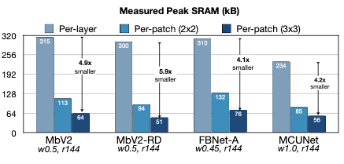

- MbV2: MobileNetV2, MbV2-RD: redistributed MobileNetV2, FBNet, MCUNet.

  - redistributed MobileNetV2는 per-patch inference stage에서는 reduced receptive field를 가지는 대신, per-layer stage에서는 increased receptive field를 가지게 구조를 바꾼 model이다.

> 사실 이러한 patch-based inference를 deep learning inference framework로 구현하는 데 제약이 있다.(TFLite Micro, TinyEngine, microTVM 등) 이들은 layer-by-layer execution을 사용하기 때문이다.

> 다시 말해 각 convolution layer의 연산에서 framework는, SRAM에 input, output activation만큼을 buffer에 allocate한 뒤, layer의 모든 computation이 끝나고 난 뒤에야 input buffer를 release한다.

> 이런 방식은 im2col, tiling 등의 optimization을 적용하기는 쉽지만, SRAM의 memory usage distribution 문제를 해결하기에는 방해가 된다.

---

### 11.4.2 Network Redistribution

하지만 이러한 patch-based inference는 receptive field에 영향을 미치게 된다. 다음은 2x2 patch를 사용했을 때, 각 patch의 receptive field를 나타낸 그림이다.


- receptive field가 overlap된 영역을 확인할 수 있다.

즉, patch-based inference는 repeated computation(overlap된 receptive field)로 인해 overhead가 발생하게 된다.

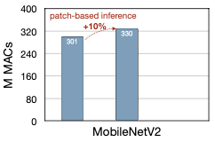

위 그림은 MobileNetV2에서 patch-based inference를 수행했을 때 늘어난 연산량을 나타낸 도표다. 실제로 10%의 연산량(MACs) 증가를 확인할 수 있다.

따라서 MCUNetV2는 receptive field를 **redistribution**(재분배)하여, patch-based inference를 적용하기 전의 total receptive field와 동일하게 만든다.(즉, 동일한 performance를 가지게 된다.)


---

### 11.4.3 Joint Automated Search for Optimization

또한 MCUNetV2에서는 jointly하게 neural network architecture와 inference scheduling을 공동으로 optimization한다.


> \#는 개수를 의미한다. 예를 들어 \#layers는 layer의 개수를 뜻한다.

---

### 11.4.4 benchmark

다음은 VWW dataset에서 4가지 model을 적용했을 때의 benchmark를 나타낸 도표이다. 

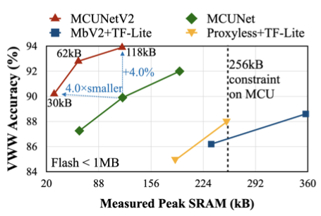

- 가로 축은 peak SRAM usage(kB), 세로 축은 accuracy(%)를 나타낸다.

- MCUNetV2는 오직 30kB의 peak SRAM usage로도 90%의 accuracy를 보였다.(기존 MCUNet에 비해 peak SRAM usage가 4배 감소)

---

### 11.4.5 MCUNetV2 architecture

다음은 VWW dataset에서 inference를 수행하는 MCUNetV2의 architecture를 나타낸 그림이다.


> kernel size마다 서로 다른 색으로 표시되어 있다. 옅어질수록 size가 작은 kernel이다. 표기는 MB{expansion ratio}_{kernel size}x{kernel size}를 의미한다.

- per-patch stage: 작은 kernel size를 갖는다. 이는 (receptive field의) spatial overlapping을 막기 위한 설계이다.(불필요한 computation 방지)

- middle stage(per-layer stage에서 앞 layer 다섯 개): expansion ratio가 비교적 작다. 이는 peak memory usage를 줄이기 위한 설계이다.

  - 이때까지만 해도 꽤 큰 resolution을 갖는다.( $160 \times 160 \rightarrow 10 \times 10$ )

- later stage(middle stage 이후 layer 3개): resolution이 꽤 작아졌기 때문에, 더 큰 expansion ratio를 사용한다.(inverted bottleneck block) 


  - 이 정도의 resolution( $5 \times 5$ )이라면, 더 큰 expansion으로도 peak memory usage에 영향을 미치지 않을 수 있다.

VWW dataset처럼 큰 resolution( $160 \times 160$ )을 갖는 data도 좋은 결과를 낼 수 있는 셈이다.

---

## 11.5 RNNPool

> [RNNPool youtube presentation](https://youtu.be/C36iQSGr_DM)

**RNNPool**은 peak memory usage를 줄이기 위해, large activation maps를 갖는(즉, RAM usage가 큰) CNN layer 일부를 RNN으로 대체하는 방안이다. 

> stride convolution이나 pooling 등으로 구현한 기존 feature map downsampling을, (memory usage를 줄일 수 있는) RNNPoolLayer이라는 새로운 pooling operator로 대체한다.

아래는 DenseNet121 architecture에서 downsampling을 RNNPool로 대체한 architecture를 나타낸 그림이다.


- bottleneck을 유발하는 많은 resolution activation을 거칠 필요 없이, shortcut(RNNPoolLayer)으로 resolution을 $112 \times 112 \rightarrow 28 \times 28$ 까지 줄일 수 있다.

하지만 resolution을 잃으면서 일부 accuracy loss는 발생하게 된다.(tradeoff) 다음은 기존의 MCUNetV2과 RNNPool을 적용한 model의 object detection을 비교한 그림이다.

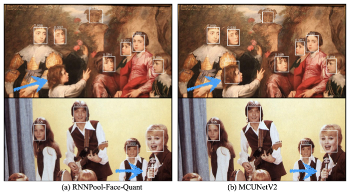

- RNNPoollayer를 적용한 좌측이 miss prediction이 더 많다.

---

## 11.6 MicroNets

> [MicroNets 논문(2020)](https://proceedings.mlsys.org/paper/2021/file/a3c65c2974270fd093ee8a9bf8ae7d0b-Paper.pdf), [MicroNets github](https://github.com/ARM-software/ML-zoo). MicroNet 논문과 MicroNets 논문의 혼동 주의.

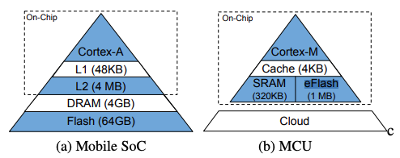

**MicroNets**는 neural network의 hardware cost 측정에 기여한 논문이다.(performance 측정에서 hardware dependency를 고려해서 파악하기는 쉽지 않다.) peak memory는 간단히 SRAM과 Flash usage를 측정해서 얻을 수 있지만 다른 metric들은 그렇지 않다.

> peak memory usage는 hardware independent하기 때문이다.

다음은 latency와 energy consumption이 'M'odel 'Op'eration Count(**MOPs**)와 linear한 관계를 갖는 것을 나타내는 측정 그래프이다.

> 모두 동일한 supernet에서 sampling하여 측정한 결과이다.

- latency

    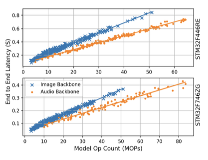
    
    - MOPs와 latency가 서로 linear relationship을 가진다.

- energy consumption

    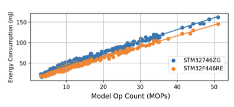

    - 마찬가지로 MOPs와 energy consumption이 linear relationship을 가진다.

---

## 11.7 ARM MCU resources

> [Exploring the Implementation of Network Architecture Search(NAS) for TinyML Application 2.4절](http://essay.utwente.nl/89778/1/nieuwenhuis_MA_EEMCS.pdf)

다양한 microcontroller architecture가 존재하지만, 가장 유명한 architecture는 ARM의 32-bit RISC architecture이다.

> STMicroelectronics와 같은 제조업체가 라이센스를 구매해서, Cortex-M series를 생산한 뒤 memory 및 I/O peripherals를 추가해서 판매한다.

> architecture마다 clock speed가 몇 십~몇 백 MHz까지 다양하다.

초기 ARM 32bit MCU core로는 Cortex-M3만 있었지만 현재는 다양한 라인업이 존재한다.


- M0(+): 저전력 코어. pipeline stage과 ISA extension이 적다.

- M3, M4: 유사하지만, M4 core는 **FPU** 및 **DSP**/**SIMD** instruction이 포함되어 있어서 더 큰 성능을 지닌다.

- M7: 가장 높은 성능을 가진 core이지만, 반대로 power efficiency가 떨어진다.(가격 면에서도 더 비싸다는 단점이 있다.)

지원하는 data type은 8bit(bytes), 16bit(halfwords), 32bit(words)이다. instruction 역시 이러한 data type을 지원하지만, words보다 작은 type에서는 0으로 채워넣어서 사용하게 된다. 

---

### 11.7.1 Parallelisation

MCU에서는 ISA의 instruction level에서 **parallelisation**을 지원한다. **SIMD**(Single Instruction Multiple Data) instruction은 32bit word를 8bit byte로 나누어서, 8개의 byte에 동일한 연산을 수행한다.

따라서 지원하는 최소 data type이 bytes인 경우, 최대 가능한 parallelisation level은 4가 된다.

---

### 11.7.2 Inference libraries

PyTorch로 생성한 neural network는 입출력 사이의 연결들로 구성된 graph로 표현된다. 이 graph는 weights 정보와 함께 저장되지만, 단순히 graph 정보와 weights만으로는 platform(MCU 보드)에 deploy(배포)할 수 없다.

이유는 graph data마다 memory에 위치한 <U>weights들을 묶어서 scheduling</U>해줘야 하기 때문이다. 이러한 역할을 수행하는 것이 **Inference library**이며, 대표적으로 TensorFlow Lite for Microcontrollers(TFLM)가 있다.

ARM MCU에서는 다음과 같이 inference가 진행된다.

- TFLM이 neural network의 scheduling을 수행한다.

- 여러 layer의 실제 실행은, lower abstration level의 library인 **CMSIS**(Common Microcontroller Software Interface Standard)에서 처리한다.

예를 들어 ARM CMSIS library는, convolution layer를 **im2col** transformation과 **GEMM**(Generic Matrix Multiplication) algorithm의 조합으로 처리한다.

> im2col은 쉽게 말해 다차원의 data를 **matrix로 변환**하여, matrix multiplication으로 처리하는 algorithm이다.

1. im2col은 input image를 intermediate matrix로 변환시킨다.


- filter size만큼 원본 data를 나눈 뒤, data를 matrix로 변환한다.

  > 예를 들어 input image (7,7,3)이 있고 filter size(5,5,3)이라면, convolution은 총 9번의 sliding window 연산으로 진행된다. 이 경우 input image에서 (5,5,3)만큼을 떼어내서 (1,5x5x3) 크기의 행렬을 총 9개 만들게 된다.

  > 즉, data 손실 없이 3차원 input data가 2차원 matrix로 변환이 되는 것이다.(물론 그만큼의 overhead가 발생한다.)

2. intermediate matrix와 filter matrix를 GEMM algorithm을 통해 곱한다.

> [GEMM이란?](https://jjeamin.github.io/darknet_book/part3_src/gemm.html)


이때 SIMD instruction과 결합하면 matrix multiplication 일부를 parallel하게 수행할 수 있다.

```c
// 두개의 입력 행렬을 곱해서 출력을 얻는 GEMM algorithm
// M: filter 개수, N: output feature map의 크기, K: filter 크기, ALPHA: scale factor
// A: filter(lda: pointer), B: input feature maps(ldb: pointer), C: output feature maps(ldc: pointer)
void gemm_nn(int M, int N, int K, float ALPHA,
        float *A, int lda,
        float *B, int ldb,
        float *C, int ldc)
{
    int i,j,k;
    #pragma omp parallel for
    for(i = 0; i < M; ++i){
        for(k = 0; k < K; ++k){
            register float A_PART = ALPHA*A[i*lda+k];
            for(j = 0; j < N; ++j){
                C[i*ldc+j] += A_PART*B[k*ldb+j];
            }
        }
    }
}
```

---